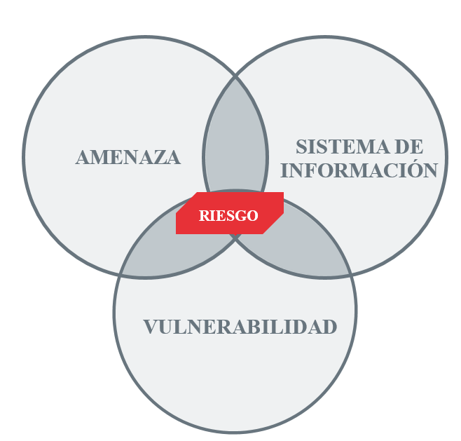
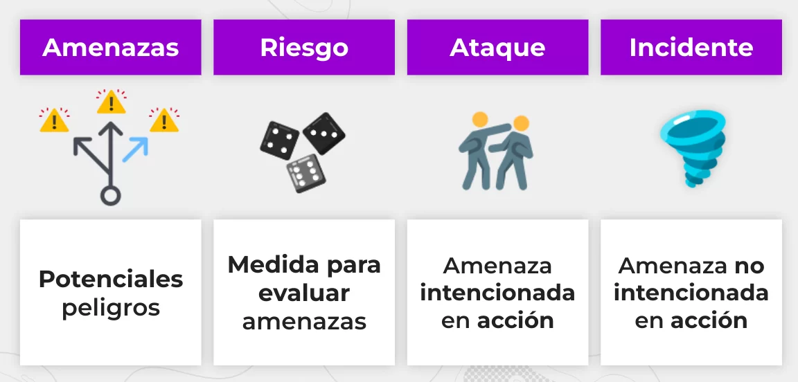
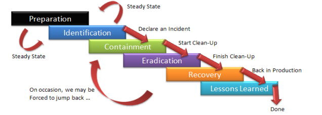

# 🛡️ Introducción Respuesta a Incidentes (IR)

## 1. Contexto general: Vivimos en una superficie de ataque global

Vivimos en una sociedad digital donde cada dispositivo conectado es una puerta potencial para un atacante. Las organizaciones no solo tienen que **defender su perímetro**, sino también prepararse para cuando esa defensa falle. Y **va a fallar**.

La pregunta no es *“¿seremos atacados?”*, sino *“¿cómo responderemos cuando ocurra?”*.

!!!quote "💬 **Frase para la reflexión:**"
     “Los ataques cibernéticos no son eventos aislados. Son inevitables. Lo que distingue a una organización resiliente es su capacidad de respuesta.” 

       + Adaptado de Bruce Schneier


## ⚠️ 2. ¿Qué es un incidente de seguridad?

{: style="height:300px;width:300px"}

Un **incidente** no es simplemente una amenaza o una vulnerabilidad. Es la **materialización del riesgo**:  
> “Un evento adverso real o inminente que pone en peligro la seguridad de los sistemas de información.”

{: style="height:200px;width:400px"}

### Tipos de incidentes

Los incidentes de seguridad se clasifican según su naturaleza, impacto y método de ejecución. Estos son los principales tipos:

1. Incidentes por Malware
      - **Ejemplos**: Ransomware, spyware, troyanos, gusanos
      - **Impacto**: Pérdida de datos, cifrado de sistemas
      - **Caso reciente**: Ataque de BlackCat/ALPHV a Change Healthcare (2024)

2. Ataques de Phishing
      - **Variantes**: Spear phishing, smishing, [BEC](https://www.cloudflare.com/es-es/learning/email-security/business-email-compromise-bec/)
      - **Objetivo**: Robo de credenciales
      - **Táctica común**: Correos falsos de instituciones

3. Brechas de Datos
      - **Causas**: Vulnerabilidades o errores humanos
      - **Consecuencia**: Exposición de información sensible
      - **Ejemplo 2024**: Filtración de 73M registros de AT&T

4. [Ataques DoS/DDoS](https://www.stackscale.com/es/blog/ataques-ddos/)
      - **Tipos**:
        - Volumétricos (UDP flood)
        - Aplicación (HTTP flood)
      - **Efecto**: Inaccesibilidad de servicios

5. Explotación de Vulnerabilidades
      - **High-risk**: Zero-days
      - **Ejemplo crítico**: Log4Shell (CVE-2021-44228)

6. Amenazas Internas
      - **Tipos**:
        - Intencionadas (empleados maliciosos)
        - Negligentes (errores humanos)

7. Ataques a Cadena de Suministro
      - **Modus operandi**: Comprometer software legítimo
      - **Ejemplo**: Ataque a Snowflake (2024)

8. Secuestro de Cuentas
      - **Métodos**:
        - Credential stuffing
        - SIM swapping

9. Ataques IoT/OT
      - **Riesgo**: Infraestructuras críticas
      - **Ejemplo**: Botnets como Mirai

10. Fraudes Cibernéticos
    - **Comunes**:
        - BEC (Business Email Compromise)
        - Cryptojacking

## Clasificación por Gravedad

| Nivel    | Ejemplo                          |
|----------|----------------------------------|
| Crítico  | Ransomware en hospital           |
| Alto     | Filtración datos masiva          |
| Medio    | Phishing a empleados             |
| Bajo     | Escaneo de puertos bloqueado     |


### Ejemplos reales sólo en España en 2025:
  + Enero 2025: Ataque de phishing a universitarios en Baleares
  + Enero 2025: Brecha de datos en la Guardia Civil y las Fuerzas Armadas
  + Enero 2025: Telefónica sufre un ciberataque en su sistema de ticketing
  + Febrero 2025: Filtración de datos personales en DKV
  + Marzo 2025: Quedan expuestos datos de clientes de El Corte Inglés
  + Marzo 2025: Ataque prorruso a webs de diputaciones y ayuntamientos en España
  + Abril 2025: robo de los datos de las federaciones de autónomos ATA
  + Abril 2025: La compañía Aigües de Mataró sufre un ciberataque
  + Abril 2025: Ransomware dirigido al Ayuntamiento de Badajoz

Más detallado [aquí](https://www.channelpartner.es/seguridad/principales-ciberataques-en-espana-en-2025/)


## 🧩 3. ¿Por qué necesitamos una respuesta estructurada?

!!!quote "💬 **Frase para la reflexión:**"
     “Security is not a product, but a process.” 
     — Bruce Schneier

Afirmar que la seguridad es un proceso es una forma muy concisa de transmitir la idea de que la seguridad no puede lograrse simplemente comprando y desplegando productos o herramientas de seguridad. Por el contrario, la verdadera seguridad requiere esfuerzos continuos y exhaustivos que comprenden una amplia gama de actividades y prácticas. La seguridad es un proceso dinámico y polifacético que requiere un esfuerzo coordinado y continuo. Se trata de crear un sistema resistente que debe adaptarse a los nuevos retos y amenazas a lo largo del tiempo. 

Una buena defensa no siempre puede evitar un ataque. Pero una mala respuesta **puede empeorarlo**. Un ejemplo frecuente es reiniciar un equipo infectado sin preservar evidencias, lo cual impide análisis forense posterior.

Por eso, la **respuesta a incidentes** (IR) es un **proceso formal** y metódico que busca:

- Minimizar impacto
- Restaurar operaciones
- Preservar evidencias
- Aprender del incidente

## 🏛️ 4. Fundamentos normativos y frameworks

### 📚 Normativas y estándares:
- **NIST SP 800-61 rev.2**: Guía de manejo de incidentes (marco de referencia más usado)
- **ISO/IEC 27035**: Estándar internacional para gestión de incidentes
- **ENS (España)**: Exige capacidades de IR a sistemas de información públicos
- **NIS2 (Europa)**: La NIS2 (Network and Information Security Directive 2) es una normativa de la Unión Europea que refuerza y reemplaza a la directiva original NIS (2016), ampliando sus exigencias en materia de ciberseguridad para sectores críticos y operadores esenciales.

### 🔐 Ciberseguridad en capas:
La respuesta a incidentes se sitúa en la **última línea de defensa**, justo después de que todas las otras capas han fallado.


## 🧠 5. Ciclo de Vida de la Respuesta a Incidentes

Inspirado en NIST, el proceso se divide en fases interdependientes



> 📌 **Nota:** Algunas organizaciones añaden una fase 0 (“Preparación estratégica”) y una 6 (“Automatización y mejora continua”).

### 🧰 1. Preparación

La **fase de preparación** es la **primera y más crítica etapa** del ciclo de vida de la respuesta a incidentes. Su objetivo es garantizar que la organización esté lista **antes de que ocurra un incidente**, minimizando su impacto y acelerando la recuperación.

Según NIST, una preparación sólida **marca la diferencia entre el caos y la contención eficaz**.


### 🎯 Objetivos de esta fase

- Establecer un **plan formal y claro** de actuación ante incidentes.
- Definir roles, responsabilidades y flujos de comunicación.
- Entrenar al personal y fortalecer la infraestructura de seguridad.
- Asegurar que existan herramientas, documentación y procesos actualizados.


### 🗂️ Componentes clave de la preparación

#### ✅ 1.1 Plan de Respuesta a Incidentes (IRP)
- Documento estratégico y operativo que define **qué hacer, quién lo hace y cómo** ante distintos tipos de incidentes.
- Debe incluir procedimientos, taxonomía, criterios de severidad, matrices de escalado y canales de comunicación.
- Debe actualizarse al menos **una vez al año** o tras incidentes críticos.

#### 👥 1.2 Creación del CSIRT / IRT
- Un **Computer Security Incident Response Team** o **equipo de respuesta** puede ser interno, mixto o subcontratado.
- Composición multidisciplinar: ciberseguridad, legal, TI, RRHH, comunicación.
- Debe tener autoridad, herramientas y líneas de comunicación directa con la dirección.

#### 📜 1.3 Políticas, normas y procedimientos
- Política de gestión de incidentes (quién reporta, tiempos de notificación, etc.).
- Políticas relacionadas: uso aceptable, control de accesos, clasificación de la información.
- Procedimientos operativos normalizados (SOP): recuperación de sistemas, aislamiento de red, backup seguro.

#### 🖥️ 1.4 Inventario y clasificación de activos
- Listado actualizado de **sistemas críticos, redes, datos sensibles y proveedores clave**.
- Identificación de sistemas que requieren **protección reforzada** (según ENS, RGPD, etc.).

#### 📞 1.5 Canales de comunicación establecidos
- Definición de contactos internos (SOC, IT, CISO, legales) y externos (CERT/CC, proveedores, policía).
- [Protocolos de comunicación en caso de contingencia](https://www.xataka.com/servicios/que-nos-quedaramos-movil-durante-apagon-fue-terrible-que-le-pasara-al-gobierno-mucho-preocupante) (email alternativo, móviles, canales encriptados).

#### 🧪 1.6 Formación y simulacros
- Formación continua del personal técnico y no técnico.
- **Ejercicios tipo Tabletop**: simulación en sala para discutir respuestas.
- **Red Team / Blue Team**: ejercicios ofensivos y defensivos realistas para poner a prueba planes.
- Lecciones aprendidas de cada simulacro → mejoras en IRP y formación.


### 🛠️ Buenas prácticas

- Disponer de herramientas EDR, SIEM o ticketing ya preconfiguradas.
- Establecer métricas para evaluar la preparación (MTTD, MTTR).

      ⏱️ Tipos de Tiempos que se Miden en Respuesta a Incidentes (IR)

      ### ⏱️ Tipos de Tiempos que se Miden en Respuesta a Incidentes (IR)

| Tiempo                      | Definición                                                                 | Importancia                                                                 |
|-----------------------------|---------------------------------------------------------------------------|------------------------------------------------------------------------------|
| **MTTD** (Mean Time to Detect)     | Tiempo medio desde que ocurre un incidente hasta que se detecta.         | Evalúa la eficacia de las herramientas de detección y monitorización.       |
| **MTTI** (Mean Time to Identify)   | Tiempo medio desde la detección hasta confirmar que es un incidente.     | Refleja la capacidad de análisis y clasificación del equipo.                |
| **MTTR** (Mean Time to Respond)    | Tiempo medio desde la identificación hasta iniciar la respuesta.         | Mide la agilidad de reacción del CSIRT.                                     |
| **MTTC** (Mean Time to Contain)    | Tiempo medio desde la detección hasta contener completamente el incidente.| Indica rapidez para controlar la amenaza.                                   |
| **MTTE** (Mean Time to Eradicate)  | Tiempo medio para eliminar la causa raíz (malware, acceso, vulnerabilidad).| Evalúa eficiencia en limpieza y erradicación.                               |
| **MTTR** (Mean Time to Recover)    | Tiempo medio para restaurar el sistema a su estado operativo normal.      | Refleja la resiliencia y capacidad de recuperación.                         |
| **TTR** (Time to Report)           | Tiempo desde la detección hasta la notificación oficial del incidente.    | Clave para cumplimiento legal (RGPD, ENS, NIS2, etc.).                      |
| **Time to Learn**                  | Tiempo desde la resolución hasta la incorporación de mejoras.             | Mide madurez organizativa y aprendizaje post-incidente.                     |


- Alinear la preparación con normativas como el **ENS**, la **NIS2**, y **ISO 27035**.
- Hacer **pruebas cruzadas** con otras funciones: continuidad del negocio, protección de datos, etc.


### 📌 Resultado esperado

Una organización preparada:

  - Tiene **procedimientos documentados y conocidos** por todos los actores.
  - Puede **responder de forma ordenada, rápida y efectiva**.
  - Reduce riesgos legales, reputacionales y económicos ante cualquier incidente.

### 🔎 2. Detección y análisis

La **fase de detección y análisis** es el punto en el que una organización **reconoce una posible amenaza** y comienza a investigarla. Esta etapa es **crítica para reducir el tiempo de respuesta** y evitar que el incidente escale.

> Una buena detección solo es posible si la fase de preparación se ha ejecutado correctamente.

---

### 🧭 Objetivos de la fase

- Identificar actividades anómalas o maliciosas en tiempo y forma.
- Correlacionar eventos para determinar si constituyen un incidente.
- Clasificar el incidente, evaluando su **gravedad e impacto**.
- Activar el plan de respuesta correspondiente.

---

### 🧰 Herramientas clave para la detección

| Herramienta / Tecnología | Función principal                                 |
|--------------------------|--------------------------------------------------|
| **SIEM** (Security Information and Event Management) | Recolecta, centraliza y correlaciona logs de múltiples fuentes. |
| **IDS/IPS** (Intrusion Detection/Prevention Systems) | Detecta y/o bloquea tráfico malicioso en la red. |
| **EDR/XDR** (Endpoint/Extended Detection and Response) | Supervisa y responde a amenazas en endpoints (PCs, servidores, etc.). |
| **Logs y auditoría** | Registro detallado de eventos en sistemas, aplicaciones y redes. |
| **Herramientas de threat intelligence** | Enriquecen alertas con datos sobre actores y campañas conocidas. |


### 🔄 Proceso típico de análisis

1. **Recolección de alertas o indicadores**
      - Las alertas pueden provenir de sensores automáticos (SIEM, EDR), usuarios finales, proveedores, etc.

2. **Correlación y contextualización**
      - El analista revisa patrones y relaciones entre eventos: ¿se trata de una secuencia aleatoria o una amenaza organizada?

3. **Verificación**
      - No toda alerta es un incidente. Muchas son falsos positivos. Hay que confirmar:  
        - ¿Es un incidente real?
        - ¿Qué sistemas están afectados?
        - ¿Cuál es el vector de ataque?

4. **Clasificación mediante taxonomía**
      - Se asigna una categoría y subcategoría al incidente según su naturaleza (malware, fuga de datos, DDoS…).
      - También se determina su **nivel de criticidad** (bajo, medio, alto, crítico).
      - Esto permite seleccionar el **playbook** adecuado para la respuesta.

5. **Registro del incidente**
      - Se documenta en una base de datos o herramienta de ticketing, incluyendo:
        - Hora de detección
        - Fuente
        - Clasificación
        - Responsable asignado
        - Acciones iniciales tomadas

---

### 📊 Criterios de severidad (ejemplo)

| Nivel | Descripción                                 | Ejemplo                              |
|-------|---------------------------------------------|--------------------------------------|
| Bajo  | No afecta sistemas críticos, impacto menor  | Usuario abre phishing pero no clickea |
| Medio | Afecta a usuarios individuales o servicios secundarios | Malware aislado en un PC         |
| Alto  | Afecta sistemas clave o datos sensibles     | Exfiltración de datos con impacto legal |
| Crítico | Amenaza para toda la organización         | Ransomware en múltiples servidores clave |

---

### 🧱 Rol de la taxonomía de incidentes

Durante esta fase se utiliza una **taxonomía estructurada** para clasificar el incidente correctamente.  
Esto facilita:

- Escalar correctamente el incidente.
- Activar el procedimiento (playbook) adecuado.
- Obtener estadísticas y reportes consistentes.
- Cumplir con requisitos regulatorios (ENS, NIS2, ISO 27035…).

> 📌 *Más adelante profundizaremos en la taxonomía de incidentes.*

---

### ⚠️ Ejemplo real

> 🔔 Un EDR detecta la ejecución de un script PowerShell cifrado en un servidor interno.

📌 Proceso:

  - El evento llega al SIEM y se correlaciona con una conexión sospechosa saliente.
  - Se identifica como posible malware con comportamiento de exfiltración.
  - El analista lo clasifica como:
    - Categoría: **Malware**
    - Subcategoría: **Downloader + Exfiltración**
    - Severidad: **Alta**
  - Se activa el playbook de contención de malware y se notifica a la dirección.

---

### 🧠 Conclusión

Una detección eficaz requiere:

  - **Visibilidad completa del entorno**
  - **Herramientas adecuadas de monitoreo**
  - Analistas capacitados y documentación clara
  - Coordinación con la fase de preparación

Una mala detección puede convertir un incidente leve en una **crisis mayor**.

## 🛑 3. Fase de Contención

Una vez confirmado el incidente, la prioridad es **limitar su alcance y daño** lo antes posible. Esta fase consiste en **detener la propagación**, evitar la pérdida de información y **proteger los activos críticos**.

### 🎯 Objetivos
- Minimizar el impacto del incidente.
- Proteger sistemas no afectados.
- Ganar tiempo para investigar y planificar la recuperación.


### ⚙️ Tipos de contención

#### 📍 Contención a corto plazo
- **Acción inmediata** para aislar o desconectar sistemas afectados.
  - Ejemplos:
    - Quitar de la red el equipo comprometido.
    - Bloquear direcciones IP sospechosas en el firewall.
    - Cerrar sesiones activas del atacante.

#### 🧩 Contención a largo plazo
- Acciones que preparan el sistema para **una recuperación segura**.
  - Ejemplos:
    - Aplicación de parches de seguridad.
    - Cambio de credenciales comprometidas.
    - Reconfiguración de servicios expuestos.

> ⚠️ ¡Ojo! Actuar demasiado rápido sin análisis puede destruir evidencias forenses.

### 🧠 Requiere:
- Decisiones rápidas pero **estratégicas y justificadas**.
- Coordinación entre CSIRT, legal y TI.
- Consideración del impacto operacional y reputacional.

## 🧹 4. Fase de Erradicación y Recuperación

Con el incidente contenido, es hora de **eliminar cualquier rastro de la amenaza** y restaurar los sistemas afectados de forma segura.

### 🔍 Erradicación
- **Eliminar el malware**, herramientas del atacante, cuentas no autorizadas o backdoors.
- **Buscar persistencia**: el atacante podría haber instalado mecanismos para volver a entrar.
- Comprobar los **registros y hashes** para validar que no quedan trazas.

### 🧪 Verificación
- Escaneo de sistemas con antivirus/EDR actualizados.
- Análisis de logs y tráfico de red post-incidente.
- Validación de integridad (checksums, firmas digitales…).


### ♻️ Recuperación
- Restaurar servicios desde **backups verificados**.
- Aplicar **actualizaciones y configuraciones reforzadas**.
- **Reincorporar** los sistemas a la red solo cuando estén validados.
- Realizar **pruebas funcionales y de seguridad**.


### ✅ Objetivo final
Volver a la normalidad **con garantías de que la amenaza ha sido eliminada** y no puede repetirse por el mismo vector.


## 📋 5. Fase de Lecciones Aprendidas

Una vez resuelto el incidente, es fundamental **reflexionar sobre lo ocurrido** para mejorar las capacidades futuras.

> Esta fase a menudo se olvida… ¡pero es la que convierte el error en mejora continua!


### 🧠 Actividades clave

#### 🧾 5.1 Análisis post-mortem (retrospectiva)

  - ¿Qué sucedió exactamente?
  - ¿Cómo se detectó y respondió?
  - ¿Qué funcionó y qué no?
  - ¿Qué se podría haber hecho mejor?

#### 📈 5.2 Mejora de controles y procesos

  - Actualizar políticas y procedimientos.
  - Ajustar configuraciones de seguridad (firewall, roles, alertas…).
  - Invertir en herramientas o formación si se identificaron carencias.

#### 🪪 5.3 Documentación formal

  - Redacción de informes internos y ejecutivos.
  - Registro en sistemas de ticketing o bases de datos de incidentes.
  - Informe a autoridades si es obligatorio (ej. AEPD, CCN-CERT).

#### 📚 5.4 Actualización del plan IRP y formación

  - Modificación del Plan de Respuesta a Incidentes.
  - Inclusión del incidente como **caso de estudio** para futuras formaciones.


### 📌 Resultado esperado

Una organización resiliente:

  - Aprende de cada incidente.
  - Mejora continuamente su postura de ciberseguridad.
  - Reduce el riesgo de que un incidente similar vuelva a ocurrir.


### 👨‍💻 6. Roles del Equipo de Respuesta a Incidentes (CSIRT)

Un equipo efectivo de respuesta a incidentes está compuesto por perfiles técnicos y estratégicos que colaboran de forma coordinada. Cada rol tiene funciones bien definidas para asegurar una respuesta eficiente y controlada.

| Rol                            | Funciones Principales                                                                 |
|--------------------------------|----------------------------------------------------------------------------------------|
| **SOC Analyst (Nivel 1/2/3)**  | - Monitorización continua de alertas.<br> - Triaje inicial de incidentes.<br> - Contención básica. |
| **Incident Responder**         | - Investigación en profundidad.<br> - Análisis forense básico.<br> - Coordinación técnica. |
| **Forensic Analyst**           | - Análisis de memoria, discos, logs.<br> - Preservación de evidencias.<br> - Apoyo en procesos legales. |
| **Threat Hunter**              | - Detección proactiva de amenazas.<br> - Análisis de TTPs (MITRE ATT&CK).<br> - Mejora de alertado. |
| **CSIRT Manager**              | - Liderazgo del equipo.<br> - Comunicación con stakeholders.<br> - Priorización de incidentes. |
| **Malware Analyst**            | - Reversing de malware.<br> - Análisis estático y dinámico.<br> - Creación de firmas (YARA, Snort). |
| **Threat Intelligence Analyst**| - Recolección de inteligencia de amenazas.<br> - Enlace con fuentes externas.<br> - Informes y enriquecimiento de alertas. |
| **Communications Officer**     | - Gestión de la comunicación interna y externa.<br> - Comunicación de crisis.<br> - Informes a reguladores o clientes. |
| **Legal/Compliance Advisor**   | - Cumplimiento normativo (ENS, NIS2, RGPD).<br> - Gestión legal de notificaciones y brechas. |
| **IT/Network Specialist**      | - Aplicación de contramedidas técnicas.<br> - Hardening y reconfiguración de red.<br> - Coordinación con sistemas. |


## 🔧 7. Herramientas Clave para Respuesta a Incidentes

| Categoría        | Herramientas Comunes                                |
|------------------|------------------------------------------------------|
| **SIEM**         | Splunk, Wazuh, IBM QRadar                            |
| **EDR/XDR**      | CrowdStrike, SentinelOne, Microsoft Defender         |
| **Análisis Forense** | Autopsy, FTK Imager, Volatility                     |
| **Sandboxing**   | Cuckoo Sandbox, Any.Run                              |
| **Threat Intel** | MISP, VirusTotal, Intel 471                          |
| **SOAR**         | TheHive + Cortex, Shuffle, Splunk SOAR, IBM Resilient |


## 🧠 8. Cultura de Seguridad y Detección Temprana

Una respuesta efectiva comienza **mucho antes** de la detección del incidente. La cultura organizativa es clave para prevenir y responder eficazmente.

### 📌 Principios fundamentales:
- **Formación continua** de usuarios y técnicos.
- El **usuario final puede ser el primer sensor** de amenazas.
- Fomentar una cultura de **reporte sin miedo ni represalias**.
- Integrar la ciberseguridad en todos los niveles de la organización.


## 📘 9. ¿Qué es un Playbook de Respuesta a Incidentes?

Un **playbook** es un procedimiento detallado, estructurado y reutilizable que define **qué hacer paso a paso ante un tipo específico de incidente**. Sirve como guía para actuar con rapidez, coherencia y eficacia.

### 🧭 ¿Por qué usar playbooks?

- Estandarizan la respuesta.
- Aumentan la agilidad del equipo.
- Facilitan el entrenamiento y la transferencia de conocimiento.
- Sirven de base para la automatización con SOAR.


## 🧩 10. Componentes Típicos de un Playbook

| Componente                | Descripción                                                                            |
|---------------------------|----------------------------------------------------------------------------------------|
| **Nombre del incidente**  | Tipo de incidente tratado (phishing, ransomware, fuga de datos…).                     |
| **Objetivo**              | Qué se espera lograr con la respuesta.                                                 |
| **Indicadores (IoCs)**    | Señales observables del incidente (hashes, IPs, dominios...).                         |
| **Fases de respuesta**    | Qué hacer en cada etapa (detección, contención, erradicación…).                       |
| **Roles asignados**       | Quién debe realizar cada tarea.                                                       |
| **Checklists operativas** | Acciones concretas: comandos, análisis, aislamiento, herramientas a utilizar.         |
| **Notificaciones**        | A quién avisar: CISO, DPO, RRHH, usuarios afectados, autoridades, etc.                |
| **Referencias legales**   | Obligaciones de notificación según ENS, RGPD, NIS2, etc.                              |
| **Lecciones aprendidas**  | Cambios a realizar tras el incidente o ensayo.                                        |


## 🛠️ 12. Ejemplo Breve: Playbook de Phishing

```yaml
Nombre: Phishing por correo
Objetivo: Evitar propagación, identificar afectados, contener amenaza.
Fase 1: Confirmación → Revisar encabezado, verificar URLs, analizar adjunto.
Fase 2: Contención → Bloquear URL/IP en proxy/firewall, revocar accesos comprometidos.
Fase 3: Erradicación → Eliminar email de bandejas, forzar cambio de contraseñas.
Fase 4: Notificación → CISO, RRHH, usuarios afectados.
Fase 5: Mejora → Revisar filtros de correo, reforzar formación.
```

## 13. 🔁 13. Relación con SOAR y Automatización

Una vez definidos, los playbooks pueden automatizarse mediante herramientas SOAR (Security Orchestration, Automation and Response).

Estas plataformas integran sistemas, ejecutan tareas automáticamente y permiten a los analistas centrarse en la toma de decisiones críticas.

### 🛠️ Plataformas SOAR populares:

+ TheHive + Cortex: Open-source, modular, muy usado en Europa.

+ Splunk SOAR: Integrado con Splunk SIEM.

+ IBM Resilient: Potente y enfocado en entornos regulados.

### 📌 Acciones típicas automatizables:

  + Cuarentena de un equipo desde EDR.

  + Envío automático de alertas por correo o Slack.

  + Búsqueda de IoCs en múltiples fuentes.

  + Registro del incidente en el sistema de ticketing.

  + La automatización bien aplicada reduce el tiempo de respuesta y el desgaste del equipo.


## 💼 14. Taxonomía de incidentes

La taxonomía de incidentes es un sistema de clasificación que permite categorizar los incidentes de seguridad en sistemas según su origen, impacto, técnicas utilizadas y vectores de ataque. Su objetivo es estandarizar el lenguaje en la respuesta a incidentes (IR) y facilitar el análisis forense, la contención y la remediación.

A continuación, se presenta una taxonomía técnica centrada en sistemas, basada en marcos como MITRE ATT&CK, CWE (Common Weakness Enumeration) y NIST SP 800-61.

### 1. ¿Por qué Usar una Taxonomía?
- **Estandarización:** Lenguaje común para describir incidentes
- **Priorización:** Determinar criticidad (ej: ransomware > escaneo de puertos)
- **Mejora continua:** Generación de métricas para análisis

### 2. Taxonomía Basada en Sistemas

#### A. Por Tipo de Ataque
| Categoría           | Ejemplos Técnicos                     | Indicadores Clave (IOCs)               |
|---------------------|--------------------------------------|----------------------------------------|
| Malware             | Ransomware, rootkits, backdoors      | Hashes de archivos, conexiones C2      |
| Explotación de SW   | Vulnerabilidades (Log4j, ProxyShell) | Logs de errores, ejecución de payloads |
| Credential Theft    | Pass-the-Hash, Kerberoasting         | Eventos 4625 (Windows)                 |

#### B. Por Impacto en Sistemas
| Nivel    | Definición                          | Ejemplo                          |
|----------|------------------------------------|----------------------------------|
| Crítico  | Compromete toda la infraestructura | Ransomware en servidores         |
| Alto     | Afecta múltiples sistemas          | Dominio AD comprometido          |

#### C. Por Vector de Inicialización
| Vector   | Descripción                  | Ejemplo en Sistemas           |
|----------|-----------------------------|-------------------------------|
| Remoto   | Ataque desde red externa     | Explotación de VPN            |
| Local    | Ejecución desde dentro       | USB infectado                 |

### 3. Taxonomías de Referencia

#### A. MITRE ATT&CK
- **Táctica:** Persistence → **Técnica:** Scheduled Task
- Ejemplo: `schtasks /create`

#### B. CWE (Common Weakness Enumeration)
- **CWE-89:** SQL Injection → Ataque a bases de datos

#### C. NIST SP 800-61
- Categorías: DoS, Unauthorized Access

### 4. Aplicación Práctica en IR

#### Paso 1: Clasificar el Incidente

- **Tipo:** Malware (Ransomware)
- **Impacto:** Crítico
- **Vector:** Remoto (RDP expuesto)

#### Paso 2: Respuesta Técnica

  + **Contención:** Bloquear IPs maliciosas

  + **Erradicación:** Eliminar tareas programadas (T1053.005 ATT&CK)

#### Paso 3: Reporte Estructurado

##### Reporte de Incidente
- **ID:** INC-2023-001
- **Taxonomía:** Malware → Ransomware (Ryuk)
- **Técnicas MITRE:** T1486 (Data Encrypted for Impact)

### 5. Herramientas para Automatización

  + MISP: Compartir IOCs

  + Splunk ES: Correlación con ATT&CK

  + TheHive: Gestión de casos

Así pues, a modo de recapitulación, la taxonomía permite:

+ ✔ Priorizar acciones técnicas

+ ✔ Comunicación efectiva entre equipos

+ ✔ Integración con marcos como ATT&CK

## 📌 Conclusión

Responder a incidentes no es solo cuestión de tecnología, sino de **personas, procesos y estrategia**. Enseñar a responder correctamente es tan importante como enseñar a prevenir.

> “La preparación es la mejor defensa, y la respuesta, la verdadera prueba de madurez en ciberseguridad.”


## Referencias

[Don’t Make These Incident Response Planning Mistakes](https://terrycutler.com/dont-make-these-incident-response-planning-mistakes/)