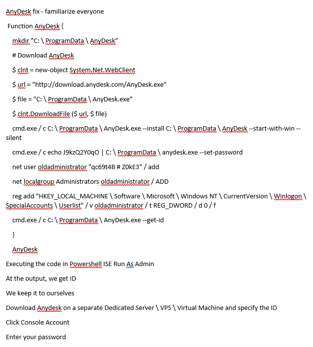
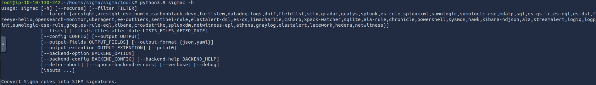

# Reglas Sigma y su relación con Incident Response/Incident Management

Las **reglas Sigma** son un estándar abierto para la definición de reglas de detección de amenazas en formato YAML/JSON, independiente de la plataforma de SIEM (Security Information and Event Management) o herramienta de análisis de logs. Estas reglas permiten describir patrones de comportamiento sospechosos o maliciosos en los registros de eventos, facilitando la detección de posibles incidentes de seguridad.

[Según su propia definición](https://github.com/SigmaHQ/sigma):

!!!quote "Cita"
    Sigma es un formato de firma genérico y abierto que permite describir de forma sencilla eventos de logs relevantes. El formato de reglas es muy flexible, fácil de escribir y aplicable a cualquier tipo de archivo de registro.

    El objetivo principal de este proyecto es proporcionar una forma estructurada en la que los investigadores o analistas puedan describir los métodos de detección que han desarrollado y hacerlos compartibles con otros.

    Sigma es para los archivos de registro lo que Snort es para el tráfico de red y YARA para los archivos.


## Características principales de Sigma

1. **Independencia de plataforma**: Las reglas pueden ser convertidas a formatos nativos de diferentes SIEMs (como Splunk, Elasticsearch, QRadar, etc.) mediante herramientas como **Sigma Converter**.
2. **Sintaxis estandarizada**: Usan un esquema basado en YAML/JSON para definir condiciones de búsqueda en logs.
3. **Comunidad colaborativa**: Existe un repositorio público ([SigmaHQ](https://github.com/SigmaHQ/sigma)) con reglas predefinidas para detectar TTPs (Tácticas, Técnicas y Procedimientos) de frameworks como MITRE ATT&CK.

## Casos de uso de Sigma

Sigma se desarrolló con la mente puesta en los siguientes usos:

+ Para que los métodos de detección y las firmas se puedan compartir junto con los IOC y las reglas de Yara.
+ Para escribir búsquedas SIEM que eviten la dependencia de un proveedor.
+ Para compartir firmas con comunidades de inteligencia de amenazas.
+ Escribir reglas de detección personalizadas para comportamientos maliciosos basados en condiciones específicas.


## Relación con Incident Response (IR) y Incident Management (IM)

Las reglas Sigma mejoran la capacidad de respuesta ante incidentes de varias formas:

### 1. **Detección temprana de amenazas**
   - Permiten identificar indicadores de compromiso (IOCs) y comportamientos anómalos (IOAs) en logs.
   - Ejemplo: Detección de ejecución de PowerShell malicioso, movimiento lateral, exfiltración de datos.

### 2. **Automatización de alertas**
   - Al integrarse con un SIEM, generan alertas que pueden disparar flujos de IR (como notificaciones a equipos SOC o automatización con SOAR).

### 3. **Consistencia en la respuesta**
   - Al estandarizar las reglas, se reduce la dependencia de soluciones propietarias y se facilita la colaboración entre equipos.

### 4. **Integración con MITRE ATT&CK**
   - Muchas reglas Sigma están mapeadas a técnicas de ATT&CK, lo que ayuda en la clasificación y priorización de incidentes.

### 5. **Mejora en la investigación forense**
   - Proporcionan búsquedas predefinidas para analizar logs durante la contención y erradicación de un incidente.

---

## Ejemplo de una regla Sigma (YAML)

```yaml
title: Suspicious PowerShell Execution
description: Detects suspicious PowerShell command lines often used in attacks
status: experimental
author: Florian Roth
logsource:
    product: windows
    service: powershell
detection:
    selection:
        CommandLine|contains:
            - 'Invoke-Expression'
            - 'IEX'
            - 'DownloadString'
    condition: selection
falsepositives:
    - Legitimate PowerShell scripts using these commands
level: high
tags:
    - attack.execution
    - attack.t1059.001  # MITRE ATT&CK: Command-Line Interface - PowerShell
```

Beneficios para Incident Management

+ **Estandarización**: Facilita la documentación y el sharing de reglas entre organizaciones.

+ **Escalabilidad**: Permite adaptar detecciones a múltiples entornos sin reescribir reglas.

+ **Respuesta más rápida**: Reduce el tiempo de detección (MTTD) y respuesta (MTTR).

En resumen, las reglas Sigma son una herramienta clave para mejorar la detección proactiva y la eficiencia en la gestión de incidentes, alineándose con mejores prácticas de ciberseguridad.

# Sintaxis de las reglas Sigma


Como se mencionaba antes, las reglas Sigma están escritas en YAML Ain't Markup Language (YAML), un lenguaje de serialización de datos legible por humanos y útil para la gestión de datos. A menudo se utiliza como formato para archivos de configuración, pero sus capacidades de serialización de objetos lo convierten en un sustituto de lenguajes como JSON.

Los factores comunes a tener en cuenta sobre los archivos YAML son:

+ YAML distingue entre mayúsculas y minúsculas
+ Los archivos deben tener la extensión .yml
+ Se utilizan espacios para la sangría y no tabuladores
+ Los comentarios se especifician con el carácter #
+ Los pares clave-valor se indican con dos puntos :
+ Los elementos de arrays se indican con el carácter -


Plantilla de sintaxis de Sigma


Siguiendo con la forma de uso de YAML para reglas Sigma, la sintaxis define varios campos obligatorios y opcionales que van en cada regla. Esto se puede resaltar utilizando la imagen:


Utilicemos [un ejemplo de regla](https://github.com/SigmaHQ/sigma/blob/master/rules/windows/wmi_event/sysmon_wmi_event_subscription.yml) de Suscripción a Eventos [WMI](https://pandorafms.com/blog/es/que-es-wmi/) para definir los diferentes elementos de la sintaxis. 

```yaml
title: #Title of your rule
id: #Universally Unique Identifier (UUID) Generate one from https://www.uuidgenerator.net
status: #stage of your rule testing 
description: #Details about the detection intensions of the rule.
author: #Who wrote the rule.
date: #When was the rule written.
modified: #When was it updated
logsource:
  category: #Classification of the log data for detection
  product: #Source of the log data
detection:
  selection:
    FieldName1: Value #Search identifiers for the detection
    FieldName2: Value
  condition: selection #Action to be taken.
fields: #List of associated fields that are important for the detection

falsepositives: #Any possible false positives that could trigger the rule.

level: medium #Severity level of the detection rule.
tags: #Associated TTPs from MITRE ATT&CK
  - attack.credential_access #MITRE Tactic
  - attack.t1110 #MITRE Technique
```

1. **Title:** Nombra la regla en función de lo que se supone que debe detectar. Debe ser corto y claro.

2. **ID:** Identificador único global utilizado principalmente por los desarrolladores de Sigma para mantener el orden de identificación de las reglas enviadas al repositorio público, se encuentra en formato UUID. 

    También puede añadir referencias a ID de reglas relacionadas utilizando el atributo related, lo que facilita la formación de relaciones entre detecciones. Estas relaciones serían de los siguientes tipos

       + Derived: Describirá que la regla ha surgido de otra regla, que puede estar aún activa.
       + Obsolete: Indicará que la regla listada ya no se utiliza.
       + Merged: Indica que la regla combina reglas vinculadas.
       + Renamed: Indica que la regla se identificaba anteriormente con un ID diferente, pero que ahora se ha modificado debido a cambios en los esquemas de nomenclatura o para evitar colisiones. 
       + Similar: Este atributo señala reglas correspondientes, por ejemplo, indica el mismo contenido de detección aplicado a diferentes fuentes de logs.


3. **Status:** Describe la fase en la que se encuentra la madurez de la regla mientras está en uso. Hay cinco estados declarados que se pueden utilizar:

      + Stable: La regla puede utilizarse en entornos de producción y dashboards.
      + Test: Se están haciendo pruebas a la regla y podría requerir un ajuste fino.
      + Experimental: La regla es muy genérica y se está probando. Podría dar lugar a resultados falsos, ser ruidosa e/o identificar eventos interesantes.
      + Deprecated: La regla ha sido sustituida y ya no produciría resultados precisos. El campo *«related»* se utiliza para crear asociaciones entre la regla actual y una que ha sido obsoleta.
      + Unsupported: La regla no es utilizable en su estado actual (registro de correlación único, campos ad-hoc).
  
4. **Description:** Proporciona más contexto sobre la regla y su propósito previsto. Se ha de ser lo más verborreico posible sobre la actividad maliciosa que se pretende detectar.

    ```yaml title="WMI_Event_Suscription.yml"
    title: WMI Event Subscription
    id: 0f06a3a5-6a09-413f-8743-e6cf35561297
    status: test
    description: Detects creation of WMI event subscription persistence method.
    ```

5. **Logsource:** Describe los datos de logs que se utilizarán para la detección. Consta de otros atributos opcionales:

    
    + Product: Selecciona todas los logs de un producto concreto. Algunos ejemplos son Windows, Apache.
    + Category: El campo category describe el tipo de datos o eventos, sin importar el sistema operativo o la tecnología específica. Sirve para abstraer la fuente de log a un nivel más general, permitiendo portabilidad entre diferentes plataformas. (p.ej.: `process_creation`o `file_access`)
    + Service: Selecciona sólo un subconjunto de los logs del producto seleccionado (Sysmon, Security, SSH, etc.)
    + Definition: En lugar de definir directamente product, service o category en cada regla, puedes referenciar una definición externa preestablecida, como si fuese una plantilla. Esto es especialmente útil en organizaciones grandes o en repositorios compartidos.

        Ejemplo de uso:

        Supón que tienes una definición común de logs de Sysmon que quieres usar en muchas reglas:

        🔸 Archivo de definición (`logsource-definitions.yml` o similar):

        ```yaml
        sysmon_process_creation:
          product: windows
          service: sysmon
          category: process_creation
        ```

        🔸 Regla Sigma que usa esa definición:

        ```yaml
        title: Suspicious Command Line
        logsource:
          definition: sysmon_process_creation
        detection:
        ```


        ```yaml title="WMI_Event_Suscription.yml"
        logsource:
        product: windows    
        category: wmi_event 
        ```

6. **Detection:** Un campo obligatorio en la regla de detección describe los parámetros de la actividad maliciosa para la que necesitamos una alerta. Los parámetros se dividen en dos partes principales: los identificadores de búsqueda - los campos y valores que la detección debe buscar - y la expresión de la condición - que establece la acción a tomar en la detección, como la selección o el filtrado. Lo veremos más adelante.
   
    Esta regla tiene un modificador de detección que busca registros con uno de los Windows Event IDs 19, 20 o 21. La condición informa al motor de detección para que busque y seleccione los registros identificados.

    ```yaml title="WMI_Event_Suscription.yml"
        detection:
          selection:
              EventID:  # This shows the search identifier value
              - 19    # This shows the search's list value
              - 20
              - 21
          condition: selection
    ```

7. **FalsePositives:** Una lista de falsos positivos conocidos que pueden ocurrir, basados en los datos de los logs
8. **Level:** Severidad de la actividad detectada: Informational --> Low --> Medium --> High --> Critical
9.  **Tags:** Añaden información que puede usarse para categorizar la regla. Pueden incluir valores de CVE y TTP del framework MITRE ATT&CK. Los desarrolladores de Sigma tiene una [lista](https://github.com/SigmaHQ/sigma-specification/blob/main/appendix/sigma-tags-appendix.md) de tags predefinidos.

    ```yaml title="WMI_Event_Suscription.yml"
    falsepositives:
        - Exclude legitimate (vetted) use of WMI event subscription in your network

    level: medium

    tags:
    - attack.persistence # Points to the MITRE tactic.
    - attack.t1546.003   # Points to the MITRE technique.    
    ```

## Identificadores de búsqueda y expresiones condicionales

Como ya se ha mencionado, la sección de detection de la regla describe lo que se pretende buscar dentro de los datos de registro y cómo se van a evaluar la selección y los filtros. La definición de los identificadores de búsqueda puede comprender dos estructuras de datos -listas y mapas- que dictan el orden en que se procesará la detección.

Cuando los identificadores se proporcionan mediante listas, se presentarán mediante cadenas enlazadas con una operación lógica *«OR»*. Principalmente, se enumerarán utilizando guiones (-). 

Por ejemplo, a continuación, podemos ver un extracto de la regla Netcat Powershell Version donde la detección se escribe para que coincida en el campo `HostApplication` que contiene *“powercat”* o *“powercat.ps1”* como valor.

```yaml title="Posh_PC_Powercat.yml"
detection:
  selection:
    HostApplication|contains:
         - 'powercat'
         - 'powercat.ps1'
  condition: selection     
```

Por otro lado, los mapas comprenden pares clave/valor en los que la clave coincide con un campo de los datos del registro, mientras que el valor presentado es una cadena o un valor numérico que debe buscarse en el registro. Los mapas siguen una operación lógica *«AND»*.

Como ejemplo, podemos ver la regla de registro Clear Linux donde el término de `selection` forma el mapa, y la regla intenta buscar en `Image|endswith` cualquiera de los valores listados, y `CommandLine` contiene cualquiera de los valores listados. Este ejemplo muestra cómo los mapas y las listas pueden usarse juntos cuando se desarrollan detecciones. Debe tenerse en cuenta que `endswith` y `contains` son modificadores de valor, y que se utilizan dos listas para los valores de búsqueda, donde uno de cada grupo tiene que coincidir para que la regla inicie una alerta.

```yaml title="Process_Creation_Lnx_Clear_Logs.yml"
detection:
  selection:
    Image|endswith:
         - '/rm' # covers /rmdir as well
         - '/shred'
    CommandLine|contains:
         - '/var/log'
         - '/var/spool/mail'
  condition: selection
```

Ya que hemos mencionado el modificador de valor, vale la pena señalar que se añaden después del nombre del campo con un carácter de tubería `|`, y hay dos tipos de modificadores de valor:

+ **Modificadores de transformación**: Se aplican directamente al nombre del campo e indican cómo debe compararse ese campo con el valor. Incluyen:

      + contains: El valor coincidiría en cualquier parte del campo.
      + all: Cambia la operación OR de las listas por una operación AND. Esto significa que las condiciones de búsqueda tienen que coincidir con todos los valores de la lista.
      + base64: Busca valores codificados con Base64.
      + endswith: Con este modificador, se espera que el valor esté al final del campo. Por ejemplo, esto es representativo de `*\cmd.exe`
      + startswith: Este modificador coincidirá con el valor al principio del campo. Por ejemplo, `power*`.


+ **Modificadores de tipo**: Transforman el valor o el campo antes de la comparación. También se añaden con |, y pueden combinarse con los de tipo (p.ej.: lower, upper, cidr). Actualmente, el único modificador de tipo utilizable es `re`, que es compatible con las consultas de Elasticsearch para manejar el valor como una expresión regular.

    Para las condition, esto se basa en los nombres establecidos para las detection, tal como selection y filter, y determinará la especificación de la regla basada en una expresión seleccionada. Algunas de las expresiones admitidas son

    + AND/OR lógico
    + 1/todos de búsqueda-identificador
    + 1/todos
    + not

Un ejemplo de estos valores condicionales puede verse en el siguiente extracto de la regla Copia remota de archivos, donde la detección busca cualquier de estas herramientas: `scp`, `rsync` o `sftp` y con cualquier de estos filtros `@`o `:`.

```yaml title="Remote_File_Copy.yml"
detection:
  tools:
         - 'scp'
         - 'rsync'
         - 'sftp'
  filter:
         - '@'
         - ':'
  condition: tools and filter
```
Esto podría detectar comandos que usen SCP, RSYNC o SFTP y que contengan caracteres típicos en rutas o direcciones remotas, como user@host: que es común en SCP o RSYNC.

Ejemplo de línea de comando detectada:

```console
scp user@remotehost:/path/to/file /local/dir
```

Otro ejemplo para mostrar una combinación de las expresiones condicionales se puede ver en el siguiente extracto de la regla Run Once Persistence Registry Event, donde la detección trata de buscar valores en el mapa que empiecen y terminen con varios valores del registro, a la vez que filtra las entradas de Google Chrome y Microsoft Edge que levantarían alertas de falsos positivos.

```yaml title="Registry_Event_RunOnce_Persistence.yml"
detection:
  selection:
    TargetObject|startswith: 'HKLM\SOFTWARE\Microsoft\Active Setup\Installed Components'
    TargetObject|endswith: '\StubPath'
  filter_chrome:
    Details|startswith: '"C:\Program Files\Google\Chrome\Application\'
    Details|endswith: '\Installer\chrmstp.exe" --configure-user-settings --verbose-logging --system-level'
  filter_edge:
    Details|startswith:
    - '"C:\Program Files (x86)\Microsoft\Edge\Application\'
    - '"C:\Program Files\Microsoft\Edge\Application\'
    Details|endswith: '\Installer\setup.exe" --configure-user-settings --verbose-logging --system-level --msedge 
    --channel=stable'
  condition: selection and not 1 of filter_*
```
Esta regla busca detectar modificaciones en claves específicas del registro de Windows que puedan indicar cambios en la configuración de programas instalados, pero excluye intencionadamente los eventos legítimos generados por instaladores oficiales de Chrome o Edge (porque esos también modifican esas claves pero no son maliciosos).

!!!task "Responde a las preguntas"

    1. ¿Qué nivel de estado puede llevar a falsos resultados o ser *ruidoso* pero también puede identificar eventos interesantes?
    2. Las reglas de detección poseen dos elementos principales: ____ y las expresiones condicionales.
    3. ¿Qué dos estructuras de datos se usan para los identificadores de búsqueda?

## Escritura de reglas y conversión

Después de repasar la sintaxis básica de las reglas Sigma, es crucial entender cómo escribirlas basándose en una investigación de amenazas. Como analista SOC, se debe pasar por el proceso de reflexión de desarrollar la detección y escribir las reglas apropiadas para nuestro entorno. 

### Escenario

Los administradores confían en las herramientas remotas para asegurarse de que los dispositivos están configurados, parcheados y mantenidos. Sin embargo, el SOC Manager acaba de recibir y compartir información sobre cómo AnyDesk, una herramienta remota legítima, puede descargarse e instalarse silenciosamente en la máquina de un usuario utilizando la el archivo descirot en la imagen de abajo. (Fuente: [TheDFIRReport](https://twitter.com/TheDFIRReport/status/1423361127472377860?s=20&t=mHiJFnlfWH3cO3XdXEQo_Q)).



Como analista SOC, se nos ha encargado que analice la información y escribamos una regla Sigma para detectar la instalación de AnyDesk en dispositivos Windows.


#### Paso 1: Análisis de Intel

La intel compartida nos muestra mucha información y comandos para descargar e instalar AnyDesk. Un adversario podría empaquetar esto en un ejecutable malicioso enviado a un usuario desprevenido a través de un correo electrónico de phishing. Podemos empezar a seleccionar valores que serían importantes para detectar cualquier caso de instalación.

+ URL de origen: Marca la fuente de descarga del software, especificada por la variable $url.
+ Archivo de destino: El adversario buscaría identificar un directorio de destino para la descarga. Esto está marcado por la variable $file.
+ Comando de instalación: De la inteligencia, podemos ver que varias instancias de CMD.exe están siendo usadas para instalar y establecer una contraseña de usuario por el script. A partir de esto, podemos elegir los atributos de instalación como `--install`, `--start-with-win` y `--silent`.

Otros datos esenciales de la inteligencia serían:

+ Persistencia del adversario: El adversario trataría de mantener el acceso a la máquina de la víctima. En este caso, crearía una cuenta de usuario `oldadministrator` y le daría privilegios elevados para ejecutar otras tareas.
+ Edición del registro: También podemos identificar la edición del registro, donde el usuario añadido se añade a una lista de usuarios `SpecialAccounts`.

Con esta información, podemos evaluar la creación de una regla que ayude a detectar cuándo se ha producido una instalación.

#### Paso 2: Identificación de regla

Podemos empezar a construir nuestra regla rellenando las secciones Title y Description, dada la información de que estamos buscando una instalación de la herramienta remota AnyDesk. Establezcamos también el estado como `experimental`, ya que esta regla se probará internamente.

```yaml title=" Process_Creation_AnyDesk_Installation.yml"
title: AnyDesk Installation
status: experimental
description: AnyDesk Remote Desktop installation can be used by attacker to gain remote access.
```

#### Paso 3: Fuente de logs

Según nuestra información, los dispositivos Windows serían nuestro objetivo víctima. Windows Eventlog y Sysmon proporcionan eventos como la creación de procesos y la creación de archivos. Nuestro caso se centra en la creación de un proceso de instalación, por lo que nuestra categoría logsource es `process_creation`.

```yaml title="Process_Creation_AnyDesk_Installation.yml"
logsource:
    category: process_creation
    product: windows
```

#### Paso 4: Detection Description

La sección *detection* de nuestra regla es la parte esencial. La información derivada de la inteligencia definirá lo que necesitamos detectar en nuestro entorno. Para la instalación de AnyDesk, anotamos los comandos de instalación que usaría el adversario que contiene las cadenas: `install`, y `start-with-win`. Por lo tanto, podemos escribir nuestros identificadores de búsqueda como se indica a continuación con los modificadores `contains` y `all` para indicar que la regla coincidirá con todos esos valores.

Además, podemos incluir la búsqueda del directorio actual desde el que se ejecutarán los comandos, `C:\ProgramData\AnyDesk.exe`

Para nuestra expresión de condición, esto evalúa la selección de nuestra detección.

```yaml title="Process_Creation_AnyDesk_Installation.yml"
detection:
    selection:
        CommandLine|contains|all: 
            - '--install'
            - '--start-with-win'
        CurrentDirectory|contains:
            - 'C:\ProgramData\AnyDesk.exe'
    condition: selection
```

#### Paso 5: Metadatos de la regla

Después de añadir los pedazos de información necesarios y vitales a nuestra regla, podemos añadir otra información útil a bajo nivel, etiquetas, referencias y falsos positivos. Podemos hacer referencia a la táctica MITRE ATT&CK Command and Control y su correspondiente técnica [T1219](https://attack.mitre.org/techniques/T1219/) para las etiquetas.

Con esto, tenemos nuestra regla, que ahora podemos convertir a la consulta SIEM de nuestra elección y probar la detección.

```yaml title="Process_Creation_AnyDesk_Installation.yml"
falsepositives:
    - Legitimate deployment of AnyDesk
level: high
references:
    - https://twitter.com/TheDFIRReport/status/1423361119926816776?s=20
tags:
    - attack.command_and_control
    - attack.t1219
```

### Conversión de regla

Las reglas Sigma necesitan ser convertidas al SIEM apropiado que esté siendo utilizado para almacenar todos los logs. Usando la regla que hemos escrito anteriormente, ahora vamos a aprender a utilizar las herramientas sigmac y uncoder.io para convertirlas en consultas ElasticSearch y Splunk.

#### Sigmac

[Sigmac](https://github.com/SigmaHQ/sigma/tree/8bb3379b6807610d61d29db1d76f5af4840b8208/tools) es una herramienta escrita en Python que convierte las reglas Sigma comparando los valores de los campos de origen del registro de detección con los campos apropiados del backend SIEM. Como parte del repositorio de Sigma (se recomienda clonar el repositorio para obtener la herramienta y todas las reglas disponibles publicadas por el equipo de Sigma), esta herramienta permite una conversión rápida y sencilla de las reglas Sigma desde la línea de comandos. A continuación se muestra un fragmento de cómo utilizar la herramienta a través de su comando de ayuda, y mostraremos la sintaxis básica de uso de la herramienta convirtiendo la regla AnyDesk que hemos escrito a la consulta Splunk.

!!!note "Nota"
     Sigmac quedó obsoleto a finales de 2022, y sus creadores se han centrado en `sigma-cli` que también es capaz de realizar conversión de reglas entre otras cosas.



Las principales opciones que se pueden utilizar son:

+ -t: Establece el backend SIEM objetivo para el que desea obtener consultas (Elasticsearch, Splunk, QRadar, ElastAlert).
+ -c: Establece el archivo de configuración utilizado para la conversión. El archivo gestiona las asignaciones de campos entre la regla y el entorno SIEM de destino, garantizando que los campos necesarios sean correctos para realizar investigaciones en su entorno.
+ --opción backend: Permite pasar un archivo de configuración de backend o modificaciones individuales que dictan las opciones de alerta para el entorno SIEM de destino. Por ejemplo, en ElasticSearch, podemos especificar propiedades de campo específicas para que sean nuestro keyword_field primario en el que buscar, como los campos que terminan en `.keyword` o `.security` a continuación:

```bash title="Sigmac ElasticSearch Conversion"
python3.9 sigmac -t es-qs -c tools/config/winlogbeat.yml --backend-option keyword_field=".keyword" --backend-option analyzed_sub_field_name=".security" ../rules/windows/sysmon/sysmon_accessing_winapi_in_powershell_credentials_dumping.yml

```
Puede encontrar más información en la documentación de Sigmac. Podemos convertir nuestra regla de instalación de AnyDesk en una alerta de Splunk como se muestra a continuación:

```bash title="Sigmac Splunk Conversion"
python3.9 sigmac -t splunk -c splunk-windows Process_Creation_AnyDesk_Installation.yml
```
Existe una biblioteca de Python que hace las veces de reemplazo de Sigmac, [pySigma](https://github.com/SigmaHQ/pySigma)

#### Uncoder.io

[Uncoder.io](http://uncoder.io) es un conversor Sigma en línea para numerosas plataformas SIEM y EDR. Es fácil de usar, ya que le permite copiar su regla Sigma en la plataforma y seleccionar su aplicación backend preferida para la traducción. Tenga en cuenta que, con las últimas actualizaciones, es necesario crear una cuenta gratuita en el sitio web uncoder.io.

Podemos copiar nuestra regla y convertirla en diferentes consultas de nuestra elección.

