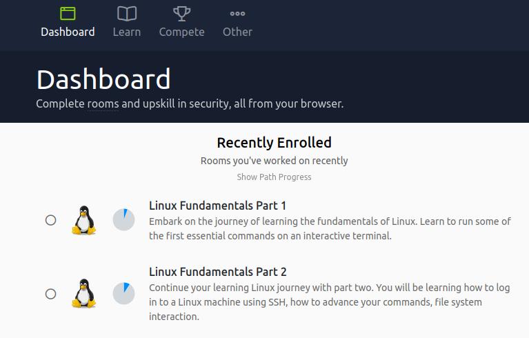
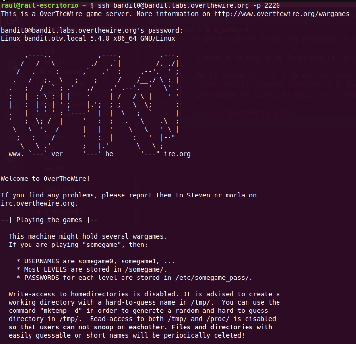
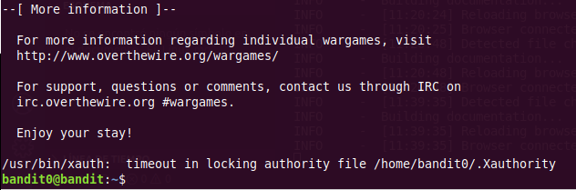
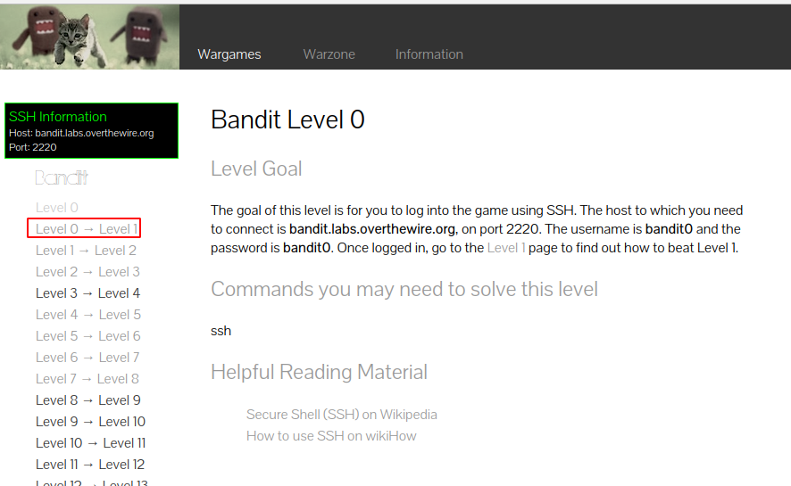
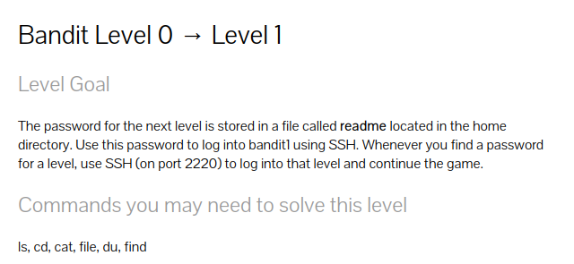
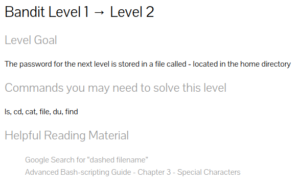

1. En el primer ejercicio propuesto, vamos a hacer uso de la plataforma [Tryhackme](https://tryhackme.com/). TryHackMe es una plataforma web en la que podremos aprender hacking desde 0, a base de resolver retos con una filosofía de CTF y gamificación.

    Deberemos registrarnos para poder acceder a todas las máquinas y salas de la plataforma.

    Una vez dentro podremos acceder a las 3 salas que vamos a usar. Cada sala en Tryhackme es un reto compuesto de diferentes tareas a completar para alcanzar el 100% del reto. Puesto que estas 3 salas van enlazadas (al finalizar una viene el link de la siguiente) os dejo el link de la primera:

    [Linux Fundamentals part 1](https://tryhackme.com/room/linuxfundamentalspart1)

    Estas salas con varias tareas cada una son completamente guiadas. Al principio de las mismas hay un vídeo explicando detalladamente el funcionamiento de las mismas. El vídeo está en inglés pero se pueden poner los subtítulos en inglés (bastante buenos) o con traducción automática (con lo que eso implique...). Debéis visionarlo con calma para después completar las tareas propuestas de la sala.

    
    !!!Task "Tarea"
        El objetivo es completar las 3 salas que están formadas principalmente por ejercicios muy básicos de la línea de comandos de Linux. En vuestro dashboard os aparecerá el progreso de cada una de las salas a medida que vayáis uniendoós a ellas:

        

        **A modo de demostración, debéis adjuntar una captura de pantalla de vuestro dashboard donde se pueda comprobar que las 3 están completadas al 100% (aparecerán en color verde).**

    Algunos vídeos introductorios a Tryhackme:

    

    <iframe width="1280" height="720" src="https://www.youtube.com/embed/ROO2pDPgja4" frameborder="0" allowfullscreen></iframe>    
    

    

    <iframe width="1280" height="720" src="https://www.youtube.com/embed/zGD78RNsp_w" frameborder="0" allowfullscreen></iframe>
    

2. El segundo ejercicio que os propongo es una suerte de [wargame](https://es.wikipedia.org/wiki/Wargame_(hacking)).
    
    Iremos a la página de [overthewire](https://overthewire.org/wargames/bandit/) que disponer de varios retos, aunque nosotros nos centraremos en **Bandit**.

    En la página inicial a la que os lleva el link, explica el mecanismo del reto. Os debéis conectar vía ssh a la máquina *bandit.labs.overthewire.org*, al puerto *2220* con el usuario *bandit0* y el password *bandit0*. En Linux podéis utilizar directamente la línea de comandos, si estáis bajo un sistema Windows deberéis utilizar algún programa del tipo PuTTY, superPuTTY, MobaXterm o [similares](https://www.netadmintools.com/best-putty-alternatives).

    

    

    Una vez hecho eso, que es el level0, debéis ir al apartado del menú de la izquierda que os indicará que hacer para pasar de nivel, es decir, a **Level 0 -> Level 1**

    

    En este menú nos indica el objetivo a conseguir en este nivel:

    

    Es decir, tal y como explica ahí, el password para ir al siguiente nivel está localizado en el archivo **readme** que está en el home del usuario. Con este password y usando el usuario **bandit1**, podremos conectarnos igual que antes por SSH pero esta vez al nivel1.

    Os indica además, a modo de ayuda, algunos de los comandos que podéis llegar a necesitar para resolver el nivel. No tienen por qué ser todos, dependiendo de la forma en que lo solucionéis.

    El juego sigue este mecanismo para ir pasando de nivel. En ocasiones como pistas os pone los comandos a utilizar tal y como hemos visto y en otras os sugiere lecturas para afrontar el reto:

    

    !!!Task "Tarea" 
        El objetivo sería completar todos los niveles o, en su defecto, llegar lo más lejos posible.** Se habrá de aportar la contraseña de cada nivel así como una explicación de cómo se ha obtenido, a modo de prueba.**

3. Como tercer ejercicio, la propuesta es completar los desafíos de [cmdchallenge](https://cmdchallenge.com/) y documentar las soluciones empleadas.

    !!!Info
        Fijáos que arriba a la derecha hay tres secciones para completar

        

4. La cuarta propuesta se trata de un juego en terminal. Debéis clonaros el siguiente repositorio: [https://gitlab.com/slackermedia/bashcrawl](https://gitlab.com/slackermedia/bashcrawl) mediante el comando `git clone` en vuestra máquina.

    Una vez clonado las instrucciones de cada fase están en los distintos archivos "scroll" que vayamos encontrando. Así pues, para comenzar a recibir instrucciones no debemos hacer más que `cat scroll` dentro del directorio `entrance`

