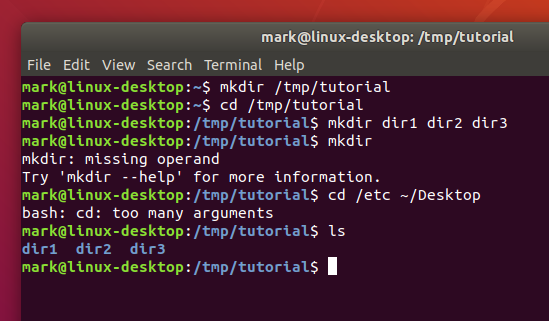

En estos primeros pasos veremos algunos conceptos muy básicos que es necesario dominar previo a adquirir cualquier conocimiento relativo a la seguridad de sistemas.

Estas nociones básicas nos darán las herramientas principales para desenvolvernos dentro de un sistema y entender los principios de ciberseguridad que se presentarán con posterioridad.

## Estructura de ficheros
Un sistema de archivos, llamado comúnmente File System o FS, determina la organización de los datos en un soporte de almacenamiento, y por tanto, cómo gestiona y organiza el sistema operativo los archivos. 

Linux es, como todo Unix, un sistema operativo completamente orientado a archivos. Se representa todo (o casi todo) con un archivo, tanto los datos (archivos de datos de cualquier tipo, como una imagen o un programa) como los periféricos (terminales, ratones, teclado, tarjeta sonido, etc.) o incluso los medios de comunicación (sockets, tuberías nombradas, etc.). Se puede decir que el sistema de archivos es el corazón de cualquier sistema Unix.

Un archivo es una entidad que almacena datos y programas. Se compone de contenido y metadatos (tamaño del archivo, propietario, fecha de creación, permisos). Los archivos están organizados en directorios. Un directorio es un archivo que almacena otros archivos.

Los diferentes tipos de archivos incluyen:

- Archivos regulares que almacenan datos y programas.

- Directorios que contienen otros archivos.

- Archivos especiales que se utilizan para entrada y salida.

**Todo en Linux es un archivo**, por lo que saber cómo manipularlos es muy importante. Así pues, en la sección correspondiente, veremos las operaciones básicas con archivos mediante el terminal.

La estructura de los directorios de Linux, así como su contenido y funciones, viene definida en el denominado Filesystem Hierarchy Standard o FHS por sus siglas en inglés, que en otras palabras viene a ser el estándar de jerarquía para los sistemas de archivos en sistemas Linux y otros derivados de UNIX.

Como podéis ver en la siguiente imagen, todo el árbol de parte de una raíz común denominada root y que se simboliza por una barra inclinada. Aún así, esto no significa que varios de ellos no puedan estar en particiones separadas del resto. De hecho, en muchas distros GNU/Linux es una práctica muy común el hecho ubicar ciertos directorios en particiones separadas del resto.


La FHS distingue entre lo que serían directorios estáticos, que son aquellos que contienen binarios, bibliotecas, documentación, etc., de los dinámicos, que son aquellos que requieren de acciones más a menudo, tales como copias de seguridad, etc.

También podemos diferencias claramente lo que son los directorios compartibles, que significa que contienen ficheros que pueden utilizarse desde otros dispositivos, de los no compartibles, que solo pueden utilizarse desde el dispositivo en el que se encuentran.

### Directorio raíz o *"/"*

Toda la estructura de directorios en los sistemas basados en UNIX parte de un directorio raíz también llamado directorio root y que se simboliza por una barra inclinada o /. De este directorio, es desde donde nacen todo el resto de directorios, independientemente que estén almacenados físicamente en discos o unidades separadas.

Cualquier dirección de archivo o carpeta en Linux empieza por el directorio raíz o /, seguido de todos los directorios y subdirectorios que que lo contienen, separados cada uno de ellos por /.


A continuación conocerás con más en detalle a todos los directorios principales que parten del directorio raíz, junto con sus subdirectorios más importantes y los ficheros que suelen contener.


### Directorio/s *bin, sbin*

El directorio **/bin** es un directorio estático y es donde se almacenan todos los binarios necesarios para garantizar las funciones básicas a nivel de usuario. Solo almacena los ejecutables de usuario, ya que los binarios necesarios para tareas administrativas gestionadas por el usuario root o superusuario del sistema se encuentran en el directorio /sbin.

Incluye también los binarios que permiten la ejecución de varias utilidades estándar de la terminal de Linux, concretamente cat, cd, cp, echo, grep, gzip, kill, ls, mv, rm, ping, su, ps, tar y vi.

El directorio /sbin hace lo mismo pero para los binarios relativos tareas propias del sistema operativo, y que solamente pueden ser gestionadas por el usuario root, tales como el arranque, tareas de restauración, reparación, etc.

### Directorio */boot*

Es un directorio estático y contiene los archivos necesarios para arrancar el sistema. Los archivos del cargador de arranque GRUB y los kernels de Linux se almacenan aquí, por ejemplo. Sin embargo, los archivos de configuración del cargador de arranque no se encuentran aquí, están en ```/etc``` con los otros archivos de configuración.

A la hora de instalar el sistema es importante prever bien el espacio que se le vaya a dar a la partición, ya que a la larga, con la acumulación de diferentes actualizaciones del Kernel, es común que se quede sin espacio. Si esto sucede, se pueden tener problemas a la hora de instalar futuras actualizaciones del núcleo, y será necesario hacer limpieza de versiones antiguas del kernel.

### Directorio */dev*

Este directorio incluye todos los dispositivos de almacenamiento, en forma de archivos especiales, conectados al sistema. Es decir, cualquier disco duro, partición, memoria USB, o CDROM conectado al sistema y que el sistema pueda entender como un volumen lógico de almacenamiento.

Siendo esto así, veréis que la ruta en la que se encuentra cualquier volumen (partición o dispositivo externo) conectado al sistema siempre empieza por /dev.

Este es el directorio que contiene, por decirlo de algún modo, la información de cada uno de los volúmenes, a diferencia del directorio ```/media```, que veremos más adelante, que lo que contiene son solo los puntos de montaje, pero no la información real de estos volúmenes.

Para ver esto en la práctica, si abres una ventana de terminal y ejecutas el comando sudo ```fdisk -l```, verás la estructura de particiones de tu sistema. En una instalación típica de cualquier distro GNU/Linux suele ser la siguiente:

```sh
/dev/sda1 - Partición principal
/dev/sda2 - Partición extendida 
/dev/sda5 - Partición Swap
```

Estos no son archivos reales como los conocemos, pero aparecen como archivos; por ejemplo, ```/dev/sda``` representa la primera unidad SATA del sistema.

Eso en cuanto a particiones. Si se trata de un dispositivo externo, el volumen estará igualmente dentro de /dev, pero en este caso varía el nombre que el sistema le asigna a dicho volumen. Generalmente la estructura suele ser la siguiente (ejecutando nuevamente el comando sudo fdisk -l con un dispositivo externo conectado puede comprobarse).

```sh
/dev/sdb1
/dev/sdb2
/dev/sdb3
...
```

Este directorio también contiene pseudodispositivos, que son dispositivos virtuales que en realidad no se corresponden con el hardware. Por ejemplo, ```/dev/random``` produce números aleatorios. Otro ejemplo sería el de ```/dev/null```, un dispositivo especial que no produce salida y descarta automáticamente todas las entradas; cuando canaliza la salida de un comando a ```/dev/null```, la descarta.

### Directorio */etc*

El directorio ```/etc``` contiene archivos de configuración, que generalmente se pueden editar a mano en un editor de texto. Se debe tener en cuenta que el directorio ```/etc``` contiene archivos de configuración de todo el sistema, además de las aplicaciones y programas instaladas posteriormente; los archivos de configuración específicos del usuario se encuentran en el directorio de inicio de cada usuario.

Es un directorio que debería contener únicamente ficheros de configuración, y no debería contener binarios.

### Directorio *lib*

Incluye las bibliotecas esenciales que son necesarias para que se puedan ejecutar correctamente todos los binarios que se encuentran en los directorios ```/bin``` y ```/sbin```, así como los módulos del propio kernel.

En los sistemas operativos de 64 bits, además de ```/lib``` existe otro directorio denominado ```/lib64```, referida a las bibliotecas para aplicaciones de 64 bits.

### Directorio *media*

Representa el punto de montaje de todos los volúmenes lógicos que se montan temporalmente. Es decir, El directorio ```/media``` contiene subdirectorios donde se montan los dispositivos de medios extraíbles insertados en el ordenador.

En la mayoría de distribuciones GNU/Linux, desde hace ya algún tiempo, cada vez que se monta una unidad externa, partición, etc., esta se monta dentro del directorio /media y a su vez dentro de un directorio especifico dependiendo del usuario del sistema que monta el volumen.

De este modo, si en un sistema hay varios usuarios, pongamos User1 y User2, los puntos de montaje de los volúmenes que montan cada uno de ellos se mostraran en directorios separados tal como así:

```sh
/media/User1
/media/User2
```

### Directorio *opt*

El directorio ```/opt``` contiene subdirectorios para paquetes de software opcionales. Es comúnmente utilizado por software propietario que no obedece a la jerarquía del sistema de archivos estándar; por ejemplo, un programa propietario puede volcar sus archivos en ```/opt/NombreAplicacion``` cuando se instala.

Antiguamente se solía utilizar el directorio ```mnt``` para estas funciones, pero actualmente, la mayoría de distribuciones hacen uso de media.

### Directorio *proc*

Este directorio contiene información de los procesos y aplicaciones que se están ejecutando en un momento determinado en el sistema, pero realmente no guarda nada como tal, ya que lo que almacena son archivos virtuales, por lo que el contenido de este directorio es nulo.


### Directorio */root*

El directorio ```/root``` es el directorio de inicio del usuario root. En lugar de estar ubicado en ```/home/root```, está ubicado en ```/root```. Es distinto de ```/```, que es el directorio raíz del sistema.

### Directorio *tmp*

Las aplicaciones almacenan archivos temporales en el directorio ```/tmp```. Estos archivos generalmente se eliminan cada vez que se reinicia su sistema y pueden ser eliminados en cualquier momento por utilidades como tmpwatch.

Las aplicaciones programadas para almacenar archivos en este directorio deben asumir que solo serán recuperables en la sesión actual. En este sentido, hay otro subdirectorio, ```/var/tmp```, dispuesto igualmente para el almacenamiento de archivos temporales, pero cuyo contenido no se borra de forma automática tras el reinicio del sistema.

### Directorio ```usr```

El directorio ```/usr``` contiene aplicaciones y archivos utilizados por los usuarios, a diferencia de las aplicaciones y archivos utilizados por el sistema,  incluyendo todo el software instalado a través de los gestores de paquetes de cada distribución. Por ejemplo, las aplicaciones no esenciales se encuentran dentro del directorio ```/usr/bin``` en lugar del directorio ```/bin``` y los binarios de administración del sistema no esenciales se encuentran en el directorio ```/usr/sbin``` en lugar del directorio ```/sbin```. Las bibliotecas para cada uno se encuentran dentro del directorio ```/usr/lib```. El directorio ```/usr``` también contiene otros directorios; por ejemplo, los archivos independientes de la arquitectura, como los gráficos, se encuentran en ```/usr/share```:

```sh
/usr/bin
/usr/include
/usr/lib
/usr/local
/usr/sbin
/usr/share
/usr/src
```

El directorio ```/usr/local``` es donde se instalan las aplicaciones compiladas localmente de forma predeterminada; esto evita que arruinen el resto del sistema

### Directorio *var*

Este directorio contiene varios archivos con información del sistema, como archivos de logs, emails de los usuarios del sistema, bases de datos, información almacenada en la caché o información relativa a los paquetes de aplicaciones almacenados en ```/opt```. En cierto modo se podría decir que actúa a modo de registro del sistema.

Podría decirse que el directorio ```/var``` es la contraparte "escriturable" del directorio ```/usr```, que debe ser de solo lectura en el funcionamiento normal. Los archivos de registro y todo lo demás que normalmente se escribiría en ```/usr``` durante el funcionamiento normal se escriben en el directorio ```/var```. 


### Directorio *home*

El directorio ```/home``` contiene una carpeta de inicio para cada usuario. Por ejemplo, si el nombre de usuario es raul, habrá una carpeta de inicio ubicada en ```/home/raul```. Esta carpeta de inicio contiene los archivos de datos del usuario y los archivos de configuración específicos del usuario (configuraciones de programas, por ejemplo). 

Cada usuario solo tiene acceso de escritura únicamente a su propia carpeta de inicio y debe convertirse en root para poder tener privilegios que le permitan modificar otros archivos en el sistema.

Para visualizar los ficheros ocultos dentro del directorio individual de cada usuario, se puede usar la combinación de comandos CTRL + H en modo gráfico. Todos los archivos y carpetas ocultas en Linux empiezan por un punto, seguido del nombre.

En muchas distribuciones es una práctica recomendada el hecho de ubicar el directorio ```/home``` es una partición separada del resto, por tal de facilitar que, en caso de reinstalar el sistema operativo, puedas mantener intacta la partición de la ```/home```, y de este modo mantener todos los archivos personales.


## Usuarios y grupos

Un usuario es cualquiera que use un ordenador. En este caso, estamos describiendo los nombres que representan a esos usuarios. Puede ser Pol o Martí, y pueden usar los nombres superc0der o Pirate en lugar de su nombre real. Lo único que importa es que la computadora tenga un nombre para cada cuenta que cree, y es este nombre por el que una persona obtiene acceso para usar la computadora. Algunos servicios del sistema también se ejecutan utilizando cuentas de usuario restringidas o privilegiadas.

La administración de los usuarios se realiza con fines de seguridad al limitar el acceso de ciertas maneras específicas. El superusuario (root) tiene acceso completo al sistema operativo y su configuración; está destinado solo para uso administrativo. Los usuarios sin privilegios pueden usar los programas su y sudo para la escalada de privilegios controlada.

Cualquier persona puede tener más de una cuenta, siempre que utilicen un nombre diferente para cada una de ellas. Además, hay algunos nombres reservados que no se pueden usar, como «root».

Los usuarios pueden aglutinarse en un «grupo» y, del mismo modo, pueden añadirse a un grupo existente para utilizar el acceso privilegiado que dicho grupo concede. 

Los grupos de usuarios juegan un papel esencial en los sistemas Linux. Gracias a ellos tenemos una manera muy fácil de seleccionar grupos de usuarios a los que se les permite compartir archivos entre ellos. También proporcionan a los administradores de sistemas una manera más efectiva y sencilla de gestionar los privilegios de los usuarios puesto que permiten asignar privilegios a grupos completos en lugar de a usuarios individuales.

## Permisos

Aunque hay multitud de características de seguridad integradas en los sistemas basados ​​en Linux, puede existir una vulnerabilidad potencial muy importante cuando se otorga el acceso al sistema a los usuarios. Pueden aparecer problemas cuando no se han asignado los permisos adecuados a los archivos y directorios.

### Grupos de permisos

Cada archivo y directorio tiene tres grupos de permisos basados ​​en usuarios:

* **Propietario:** los permisos de propietario se aplican solo al propietario del archivo o directorio, no afectarán las acciones de otros usuarios.

* **Grupo:** los permisos de grupo se aplican solo al grupo que se ha asignado al archivo o directorio, no afectarán las acciones de otros usuarios.

* **Todos los usuarios:** los permisos de todos los usuarios se aplican a todos los demás usuarios del sistema; este es el grupo de permisos que más desea ver.

### Tipos de permisos

Cada archivo o directorio tiene tres tipos de permisos básicos:

* **Lectura (read/r):** el permiso de lectura se refiere a la capacidad de un usuario para leer el contenido del archivo. El permiso de lectura en un directorio permite listar su contenido.

* **Escritura (write/w):** los permisos de escritura se refieren a la capacidad de un usuario para escribir o modificar un archivo. En un directorio permite crear, eliminar o modificar el nombre de un archivo. En un hipotético caso donde tuviéramos permiso de escritura en un archivo pero no en el directorio en el que está ubicado, podríamos modificar el contenido del archivo pero no su nombre, ni moverlo de sitio, ni eliminarlo del directorio.

* **Ejecución (execution/x):** el permiso de ejecución afecta la capacidad de un usuario para ejecutar un archivo o ver el contenido de un directorio.

{: style="height:200px;width:300px", align=left }

{: style="height:275px;width:425px"}

!!!Tip 
    Podemos inspeccionar con detalle los permisos de arhivos y directorios con el comando:

    ```sh
    ls -l
    ```

    

#### ¿Cómo se cambian los permisos en Linux?

Para cambiar los permisos de archivos y directorios en GNU/Linux, disponemos de 3 comandos principales:

* ^^*chmod:*^^ cambiar permisos del archivo o directorio:
        ```sh
        chmod [permisos][archivo/directorio][opciones]
        ```
* ^^*chown:*^^ cambiar el propietario del archivo o directorio:
        ```sh
        chown [nuevo usuario propietario][archivo/directorio][opciones]
        ```
* ^^*chgrp:*^^ cambiar el grupo del archivo o directorio:
        ```sh
        chgrp [nuevo grupo][archivo/directorio][opciones]
        ```

Existen dos formas de cambiar los permisos de archivos y directorios en Linux:

* Modo simbólico: con notación basada en caracteres
* Modo absoluto: con notación numérica, según el [sistema octal](https://es.wikipedia.org/wiki/Sistema_octal) o en [base 8](https://blogs.ua.es/matesfacil/secundaria-numeros-operaciones/sistemas-de-numeracion/sistema-de-numeracion-octal/), cuyos valores de forma resumida puedne verse en la imagen a continuación:
  
  

Así pues, una tabla resumen en cuánto a los permisos vistos, sería la siguiente:

| Valor     | Permisos                          | Descripción     |
| :-----------: | :------------------------------------: |--------------|
|    0    | ---  | Sin permisos |
|    1   |  --x |  Ejecución |
|    2    |  -w- |  Lectura |
|    3    |  -wx |  Lectura + ejecución |
|    4    | r--  | Lectura  |
|    5    | r-x  |  Lectura + ejecución |
|    6    |  rw- | Lectura + escritura  |
|    7    | rwx  | Lectura + escritura + ejecución  |

Los permisos utilizando la notación numérica en sistema octal, se asignan en tuplas de 3 (usuario/grupo/otros) y no es posible asignar sólo para uno o dos de los elementos de la tupla.

Algunos ejemplos de permisos en modo absoluto son:

| Notación | Significado |
| -------------------- | -----------|
| rw------- (600)  | Permisos de lectura y escritura sólo para el propietario |
|rw-r--r-- (644)  |Permisos de lectura y escritura sólo para el propietario y sólo de lectura para el grupo y resto de usuarios|
|rwxr-xr-x (755)  |Permisos de lectura, escritura y ejecución para el usuario y de lectura y ejecución para el grupo y resto de usuarios|
|rwxrwxrwx (777)  | Usuario, grupo y resto de usuarios tienen todos los permisos sobre el fichero o directorio (¡Cuidado!)|
|rw-rw-rw- (666)  |Usuario, grupo y resto de usuarios pueden leer y **escribir** sobre el fichero o directorio(¡cuidado!)|

Como ya hemos dicho es el comando *chmod* el utilizado en el terminal para cambiar los permisos de los usuarios. Puede usarse tanto con el modo absoluto como con el simbólico.

Un ejemplo para el formato absoluto sería:

```sh
chmod {==600==} archivo/directorio
```
Y para  el formato con caracteres

```sh
chmod {==ugo+rw==} archivo/directorio
```
Donde, en este último caso, los permisos rwx (lectura/escritura/ejecución) pueden asignarse a: 

u - propietario

g - grupo

o - otros

a - todos los usuarios
000
Si utilizamos el operador + estaremos agregando permisos, si usamos el - los eliminaremos:

```sh
chmod a-rw archivo1
chmod u+rwx archivo2
```


Ejemplos prácticos del uso de *chmod* para cambiar permisos de un archivo. Podemos utilizar tanto la forma absoluta, como la simbólica:

|Modo absoluto|Modo simbólico|Resultado|
|---|---|---|
|chmod 700 archivo.gpg|chmod u+rwx|-rwx------|
|chmod 555|chmod ugo+rx |-r-xr-xr-x|
|chmod 666|-chmod ugo+rw|rw-rw-rw-|

### Permisos avanzados

En GNU/Linux, además de los 3 que hemos visto anteriormente, todavía existen otros tres permisos especiales adicionales que veremos a continuación.

#### Bit setuid

En Linux, de forma predeterminada, cuando un usuario ejecuta un archivo, el archivo se inicia con los privilegios del usuario que lo ejecuta. Sin embargo, este comportamiento se puede cambiar si establecemos permisos especiales en archivos ejecutables.

Setuid significa "establecer ID de usuario". Si configuramos el bit setuid en un archivo ejecutable, el archivo siempre se ejecuta con los privilegios del propietario del archivo, sin importar quién lo inicie. 

El bit setuid solo tiene sentido si está configurado en archivos ejecutables. No hay ningún significado práctico si configuramos el bit setuid en un archivo o directorio no ejecutable.

El comando passwd es un ejemplo con este bit especial aplicado:

```sh
$ ls -l /bin/passwd
-rwsr-xr-x 1 root root 63624 Dec 15 21:06 /bin/passwd
```
Observamos que el permiso de ejecución para el propietario es una "s" minúscula en lugar de la "x" habitual. Esta "s" indica que el archivo tiene el bit setuid establecido. El comando passwd siempre se ejecutará con  privilegios de root sin importar quién lo inicie porque el propietario del archivo es root.

Como ya sabemos, podemos usar el comando chmod para establecer el  bit setuid en un archivo:

``` sh
chmod u+s archivo
```
**Sólo el propietario el archivo o el usuario o el usuario *root* puede establecer el bit *setuid***

Un ejemplo práctico de cómo configurar este bit setuid en un archivo, de forma simbólica:

```sh
$ ls -l archivo
-rwxr-xr-x 1 raul raul 0 Feb 2 12:22 archivo
$ chmod u+s archivo
$ ls -l archivo    
-rwsr-xr-x 1 raul raul 0 Feb  2 12:22 archivo
```
En el modo absoluto, anteponemos un 4 a los permisos para indicar este bit:

```sh
$ chmod 4755 archivo
-rwsr-xr-x 1 raul raul 0 Feb  2 12:22 archivo
```

Y para quitar este bit, en ambos modos:

```sh
$ chmod u-s archivo
$ ls -l archivo
-rwxr-xr-x 1 raul raul 0 Feb  2 12:22 archivo
```
y

```sh
$ chmod 0755 archivo
$ ls -l archivo
-rwxr-xr-x 1 raul raul 0 Feb  2 12:22 archivo
```


!!!Danger "Riesgo de seguridad"
        El bit setuid podría ser bastante útil en varias aplicaciones. Sin embargo, debemos tener cuidado al establecer esos permisos especiales, ya que pueden crear problemas de seguridad.

        Por ejemplo, un usuario normal puede obtener privilegios de superusuario ejecutando un programa que establece el UID  como root y realizar una escalada de privilegios.

#### Bit setgid

##### Bit setgid en un archivo

setgid es la abreviatura de "set group id". Si configuramos el bit setgid en un archivo ejecutable, no importa quién inicie el archivo, se ejecuta con los privilegios del grupo propietario.

El comando de localización es un ejemplo de un archivo con el conjunto de bits setgid :

```sh
$ ls -l /usr/bin/locate
-rwxr-sr-x 1 root locate 43048 Nov 13 18:09 /usr/bin/locate
```
Similar al  bit setuid , notamos una "s" minúscula en la salida de ls , excepto que está en la sección de grupo en lugar de en la sección de propietario.

Para establecer este bit de modo simbólico podemos utilizar:

```sh
$ ls -l archivo2 
-rwxr-xr-x 1 raul raul 0 Feb 2 22:35 archivo2
$ chmod g+s archivo2
$ ls -l archivo2
-rwxr-sr-x 1 raul raul 0 Feb 2 22:35 archivo2
```

Y de modo absoluto, anteponiendo un dos a los permisos:

```sh
chmod 2755 archivo2
```

##### Bit setgid en un directorio

Si configuramos el bit setgid en un directorio, todos los archivos y subdirectorios recién creados en el directorio heredarán el grupo de ese directorio. Sin embargo, los archivos y directorios existentes no aplicarán el cambio de grupo.

Veamos un ejemplo para aclarar este comportamiento.

Primero, preparamos un directorio padre que contiene dos archivos:

```sh
$ ls -ld padre
drwxrwxrwx 2 root raul 4096 Feb  3 00:33 padre/
$ ls -l padre
total 2
-rwxr-xr-x 1 invitado invitado    0 Feb  3 00:30 existing_grp_invitado1
-rwxr-xr-x 1 invitado invitado    0 Feb  3 00:30 existing_grp_invitado2
```
*padre* es propiedad del usuario root y del grupo raul. Contiene dos archivos e *invitado* es dueño de ambos.

A continuación, establezcamos el bit setgid en *padre* usando chmod:

```sh
root# chmod g+s padre
root# ls -ld padre
drwxrwsrwx 2 root raul 4096 Feb  3 00:33 padre/
```

Ahora, vamos a crear un nuevo archivo y un subdirectorio bajo el padre con root:

```sh
root# touch padre/nuevo_root
root# mkdir padre/nuevo_dir_root```
```

Luego, verificaremos los propietarios del grupo de todos los archivos y subdirectorios en padre:

```sh
root# ls -l padre
total 4
-rwxr-xr-x 1 invitado invitado    0 Feb  3 00:30 grp_exist_invitado1
-rwxr-xr-x 1 invitado invitado    0 Feb  3 00:30 grp_exist_invitado2
drwxr-sr-x 2 root  raul  4096 Feb  3 00:54 nuevo_dir_root/
-rw-r--r-- 1 root  raul     0 Feb  3 00:54 nuevo_arch_root
```
En la salida anterior, vemos que los dos archivos existentes no han cambiado después de que establecemos el bit setuid en padre.

Sin embargo, el archivo y el subdirectorio recién creados son propiedad de raul en lugar de  root , aunque root los creó. Esto se debe a que el padre tenía establecido el bit setgid , y los archivos y directorios recién creados bajo él heredaron el grupo del padre.

#### Sticky bit

La misión del sticky bit es proteger los archivos dentro de un directorio. Si configuramos el sticky bit en un directorio, un archivo en este directorio solo se puede eliminar mediante una de las siguientes opciones:

* El dueño del archivo
* El dueño del directorio
* El  usuario root

En otras palabras, este permiso especial evita que un usuario elimine los archivos de otros usuarios en un directorio público.

Un ejemplo típico de sticky bit del mundo real es el directorio /tmp:

```sh
$ ls -ld /tmp
drwxrwxrwt 24 root root 980 Feb  3 21:41 /tmp/
```
Debido a la "w" en la sección de permisos "otros", sabemos que cualquier usuario puede crear y eliminar cualquier archivo en el directorio /tmp .

Pero si leemos la salida de ls anterior con atención, vemos que el bit de permiso de ejecución en la sección "otro" es una "t" minúscula, en lugar de la "x" habitual.

Esta "t" en minúscula indica que el  directorio / tmp tiene el bit fijo establecido. Con el sticky bit, cualquier usuario aún puede crear archivos bajo /tmp. Sin embargo, un usuario solo puede eliminar archivos de su propiedad.

##### El sticky bit en un directorio

Para establecer el sticky bit en un directorio, aún podemos usar el  comando chmod con el modo + t :

```sh
chmod +t DIRECTORIO
```

De otra forma, también podemos anteponer un "1" al modo de un directorio para establecer el sticky bit:

```sh
chmod 1777 DIRECTORIO
```
También podemos eliminar el sticky bit de un directorio usando -t :

```sh
chmod -t DIRECTORIO
```

Como de costumbre, veamos un ejemplo para comprender cómo el sticky bit puede proteger los archivos de un directorio y cómo configurar y eliminar el sticky bit en un directorio.

Comencemos por preparar un directorio público llamado público y permitir que todos los usuarios escriban en él:

```sh
$ ls -ld public              
drwxrwxrwx 2 root root 40 Feb  3 22:22 public/
```

A continuación, crearemos algunos archivos en público por diferentes usuarios:

```sh
$ ls -l
-rw-r--r-- 1 invitado invitado 0 Feb  3 22:28 archivo1_invitado
-rw-r--r-- 1 invitado invitado 0 Feb  3 22:28 archivo2_invitado
-rw-r--r-- 1 raul  raul  0 Feb  3 22:28 archivo_raul
```

Hasta ahora, no hemos colocado el sticky bit en ninguna parte. Veamos si el usuario raul puede eliminar un archivo propiedad de un invitado:

```sh
raul$ rm archivo1_invitado 
rm: remove write-protected regular empty archivo 'archivo1_invitado'? y
raul$ ls -l
-rw-r--r-- 1 invitado invitado 0 Feb  3 22:28 archivo2_invitado
-rw-r--r-- 1 raul  raul  0 Feb  3 22:28 archivo_raul
```
Entonces, sin el sticky bit, podemos eliminar archivos propiedad de otros usuarios.

Ahora, configuremos el sticky bit y veamos si hay algún cambio:

```sh
root# chmod +t public
root# ls -ld public 
drwxrwxrwt 2 root root 80 Feb  3 22:33 public/
root# su raul
raul$ rm archivo2_invitado 
rm: remove write-protected regular empty archivo 'archivo2_invitado'? y
rm: cannot remove 'archivo2_invitado': Operation not permitted
raul$ ls -l 
-rw-r--r-- 1 invitado invitado 0 Feb 3 22:28 archivo2_invitado
-rw-r--r-- 1 raul raul 0 Feb 3 22:28 archivo_raul
```
Después de configurar el sticky bit, los archivos en público solo pueden ser eliminados por los propietarios del archivo.

## Contraseñas en Linux

En este apartado se describe cómo se implementan las contraseñas dentro del sistema operativo Unix tanto para sistemas administrados localmente como basados ​​en red.

### El archivo /etc/passwd

Tradicionalmente, Unix usa el archivo `/etc/passwd` para realizar un seguimiento de cada usuario en el sistema. El archivo `/etc/passwd` contiene el nombre de usuario, el nombre real, la información de identificación y la información básica de la cuenta de cada usuario. Cada línea del archivo contiene un registro de base de datos; los campos de registro están separados por dos puntos (:).

Se puede usar el comando `cat` para mostrar el archivo `/etc/passwd` del sistema. Aquí algunas líneas de muestra de un archivo típico:

```sh
root:x:0:1:System Operator:/:/bin/ksh
daemon:x:1:1::/tmp:
uucp:x:4:4::/var/spool/uucppublic:/usr/lib/uucp/uucico
rocio:x:181:100:Rocio Cordoba:/home/rachel:/bin/ksh
arturo:x.:182:100:Arturo Soria:/home/arlin:/bin/csh
```

Las primeras tres cuentas, root, daemon y uucp, son cuentas del sistema, mientras que rocío y arturo son cuentas para usuarios individuales.

Alguno de los campos más importantes del archivo `/etc/passwd`, son:

|Campo|Contenido|
|:-----:|---------|
|Rocío|Nombre de usuario.|
|x|Lugar de espera para la "contraseña cifrada" del usuario. Tradicionalmente, este campo almacenaba la contraseña cifrada del usuario. Los sistemas Unix modernos almacenan contraseñas cifradas en un archivo separado (el archivo de contraseñas ocultas ) al que solo pueden acceder los usuarios privilegiados.|
|181|Número de identificación de usuario (UID) del usuario.|
|100|Número de identificación de grupo del usuario (GID).|
|Rocio Cordoba|Nombre completo del usuario|
|/home/rocio|Directorio de inicio del usuario.|
|/bin/ksh|Shell del usuario.|

Las contraseñas se almacenaban tradicionalmente en el archivo /etc/passwd en un formato cifrado. Sin embargo, debido a los avances en la velocidad del procesador, las contraseñas cifradas ahora se almacenan casi universalmente en un archivo independiente, llamado /etc/shadow , que se describe más adelante.

### El sistema de contraseñas cifradas en Unix/Linux

Cuando Unix/Linux solicita su contraseña, necesita alguna forma de determinar que la contraseña es correcta. Muchos de los primeros sistemas informáticos almacenaban las contraseñas de todas sus cuentas en texto plano en un archivo. En circunstancias normales, el sistema protegía las contraseñas de modo que solo los usuarios privilegiados y las utilidades del sistema operativo pudieran acceder a ellas. Sin embargo, bien por accidente, bien por un error de programación o por un acto deliberado, un usuario no privilegiado podría acceder al contenido de este archivo. Para muestra un botón:

!!!quote "Cita"
        Una de las situaciones más memorables ocurrió a principios de la década de 1960 cuando un administrador del sistema en el sistema CTSS del MIT estaba editando el archivo de contraseñas y otro administrador del sistema estaba editando el mensaje diario que se imprime en el terminal de todos al iniciar sesión. Debido a un error de diseño del software, los archivos temporales del editor de los dos usuarios se intercambiaron y, por lo tanto, durante un tiempo, el archivo de contraseña se imprimió en cada terminal cuando se iniciaba sesión.

El peligro real que planteaban estos sistemas es que los usuarios pueden hacer copias del archivo de contraseñas y robarlas sin el conocimiento del administrador del sistema.

Unix/Linux evitan este problema al no mantener las contraseñas reales en ninguna parte del sistema. En su lugar, Unix/Linux almacenan un valor que es generado mediante el uso de la contraseña para cifrar un bloque de bits con una función unidireccional llamada crypt(); el resultado del cálculo se almacenaba tradicionalmente en /etc/passwd. Cuando se intenta iniciar sesión, el programa /bin/login no descifra la contraseña almacenada. En su lugar, /bin/login toma la contraseña que ingresó, la usa para transformar otro bloque de ceros y compara el bloque recién transformado con el bloque almacenado en el archivo /etc/passwd. Si los dos resultados cifrados coinciden, el sistema lo deja entrar.

##### La función de cifrado tradicional crypt()

El algoritmo que usa crypt() tradicionalmente se basa en el Estándar de cifrado de datos (DES) del Instituto Nacional de Estándares y Tecnología (NIST). En funcionamiento normal, DES utiliza una clave de 56 bits (8 caracteres ASCII de 7 bits, por ejemplo) para cifrar bloques de texto original o texto sin cifrar, que resultaban tener 64 bits de longitud. Los bloques de 64 bits resultantes de texto cifrado o texto cifrado no se pueden descifrar fácilmente al texto sin formato original sin conocer la clave original de 56 bits.

Actualmente este algoritmo ha sido sustituido por unos mucho más seguros y robustos.

##### Echándole "salt"

A medida que los ordenadores aumentaban de potencia y los algoritmos de cifrado fueron empezando a considerarse inseguros por ello, se inventaron nuevas formas de fortificarlos. Una de ellas fue el elemento conocido como "salt".

En criptografía, la sal (en inglés, salt) comprende bits aleatorios que se usan como una de las entradas en una función derivadora de claves. La otra entrada es habitualmente una contraseña. La salida de la función derivadora de claves se almacena como la versión cifrada de la contraseña. 

En definitiva, el salt es una cadena de caracteres aleatorios que se concatenan con la contraseña antes de cifrarla para dificultad en gran medida su descifrado por un atacante.

Los datos con salt complican los ataques de diccionario que cifran cada una de las entradas del mismo: cada bit de salt duplica la cantidad de almacenamiento y computación requeridas. Para mayor seguridad, el valor de salt se guarda en secreto, separado de la base de datos de contraseñas. Esto aporta una gran ventaja cuando la base de datos es robada, pero la salt no. 

El beneficio aportado por usar una contraseña con salt es que un ataque simple de diccionario contra los valores cifrados es impracticable si la salt es lo suficientemente larga.

Así el formato del contenido del archivo /etc/shadow es:


El campo a la derecha del nombre de usuario indica qué algoritmo se ha utilizado para cifrar la contraseña junto con el salt del tercer campo. Por curiosidad, algunos de estos algorimos son:

|Valor|Algoritmo|
|----|----|
|$1$|MD5|
|$2a$|Blowfish|
|$2y$|Blowfish|
|$5$|SHA-256|
|$6$|SHA-512|

Los signos del dólar delimitan estos dos campos.


## Principales comandos para manejarse en el terminal

### Crear archivos y directorios

A modo de tutorial, puede ser interesante seguir los comandos que aquí se muestran. Para ello, en primer lugar vamos a crear un subdirectorio dentro del directorio /tmp y nos ubicaremos dentro de ese subdirectorio:

```sh
mkdir /tmp/tutorial
cd /tmp/tutorial
```

El comando mkdir es una abreviatura de "make directory" y se utiliza para crear nuevos directorios vacíos. Permite incluso crear varios directorios en un sólo comando utilizando el número de parámetros o argumentos adecuado:

```sh
mkdir dir1 dir2 dir3
```
Si quisiéramos listar los directorios creados, podríamos utilizar el comando para ello:

```sh
ls
```


Podríamos incluso darle una vuleta de tuerca al comando. Ya que los directorios que crea están vacíos, pero si quisiéramos crear una carpeta con subdirectorios en su interior utilizando un único comando, haríamos:

```sh
mkdir -p dir4/dir5/dir6
ls
```
El "-p" es lo que se conoce como un *switch*, que no son más que distintas opciones para modificar el comportamiento de un comando.

Y podríamos movernos por los subdirectorios para comprobar que, efectivamente, se han creado:

```sh
cd dir4
ls
cd dir5
ls
cd ../..
```

Ahora ya sabemos cómo crear varios directorios simplemente pasándolos como argumentos separados al comando mkdir. Pero supongamos que queremos crear un directorio con un espacio en el nombre. Vamos a intentarlo:

```sh
mkdir otro directorio
ls
```
Podéis intentar escribir esto en el terminal o, si sóis un poco suspicaces, os habréis dado cuenta de lo que pasará. Exactamente, se crearan dos directorios distintos.

Si queremos trabajar con espacios en nombres de archivos o directorios, necesitamos **"escaparlos"**. Éste es un termino informático que hace referencia a códigos especiales para decirle a la máquina que determinados caracteres y símbolos los trate de forma diferente a lo normal. Como ejemplo:

```sh
mkdir "carpeta 1"
mkdir 'carpeta 2'
mkdir carpeta\ 3
mkdir "carpeta 4" "carpeta 5"
mkdir -p "carpeta 6"/"carpeta 7"
ls
```
Todos estos comandos crearán carpetas independientes y con espacios en los nombres. Debido a lo engorroso de tener que escapar este tipo de caracteres cada vez que se utilizan en el terminal, la tendencia es usar nombres sin espacios, sustituyendo estos por guiones ("-") o guiones bajos ("_")

#### Creando archivos usando la redirección

Supongamos que quisiéramos capturar la salida del comando "ls" como un archivo de texto que podemos manipular con posterioridad. Todo lo que tenemos que hacer es agregar el carácter mayor que (”>”) al final de nuestra línea de comando, seguido del nombre del archivo en el que escribir:

```sh
ls > salida.txt
```
No se imprimirá nada por pantalla puesto que hemos redirigido la salida del comando al archivo salida.txt. En todo caso, podemos utilizar el comando "cat" para ver el contenido del archivo:

```sh
cat output.txt
```

Otro ejemplo de redirección podríamos llevarlo a cabo utilizando el comando "echo", el cual simplemente imprime por pantalla los argumentos que recibe. Sin embargo, podríamos redirigir la salida a un archivo y crear ficheros nuevos:

```sh
echo "Esto es una prueba" > test_1.txt
echo "Esto es otra prueba" > test_2.txt
echo "Otra prueba más" > test_3.txt
ls
```
Y para ver el contenido de los archivos podemos utilizar nuevamente "cat". Incluso podríamos pasarle el nombre de los 3 archivos simultánemamente como argumentos:

```sh
cat test_1.txt test_2.txt test_3.txt
```
Cuando desee pasar varios nombres de archivo a un solo comando, existen algunos atajos útiles que pueden ahorrarle mucho escribir si los archivos tienen nombres similares. Se puede utilizar un signo de interrogación ("?") Para indicar "cualquier carácter" dentro del nombre del archivo. Se puede utilizar un asterisco (”*”) para indicar “cero o más caracteres”. A veces se los denomina caracteres "comodín". Un par de ejemplos pueden ayudar, los siguientes comandos hacen lo mismo:

```sh
cat test_1.txt test_2.txt test_3.txt
cat test_?.txt
cat test_*
```
!!!Warning "Atención"
        Precisamente por los carácteres comodín en los comandos, tampoco es recomendable usar signos de puntuación en los nombres de los archivos, de otra forma habría que "escapar" estos caracteres a la hora de trabajar en la línea de comandos con los nombres de los archivos

Observando la salida de ```ls```, se puede ver que los únicos archivos o carpetas que comienzan por "t" son los tres archivos de prueba que acabamos de crear, por lo que incluso se podría simplificar ese último comando aún más ```cat t*```, lo que significa "concatenar todos los archivos cuyos nombres comienzan con una t y van seguidos de cero o más caracteres ”. Usemos esta capacidad para unir todos nuestros archivos en un solo archivo nuevo y luego verlo:

```sh
cat t* > combinado.txt
cat combinado.txt
```

Hay que tener cuidado puesto que la shell borra todo el contenido del archivo antes de escribir la salida del comando ```cat``` en él. Debido a esto, debe tener mucha precaución al usar la redirección para asegurarse de no sobrescribir accidentalmente un archivo que necesita. Si lo que queremos es añadir al final del archivo en lugar de reemplazar el contenido del mismo, debemos poner un doble símbolo de "mayor que":

```sh
cat t* >> combinado.txt
echo "¡He añadido una línea!" >> combinado.txt
cat combinado.txt
```

Cuando el contenido del archivo es mayor de lo que se puede mostrar en la terminal, se necesita utilizar lo que se conoce como ***pager*** para que pagine la salida por el terminal. El pager más antiguo era ```more``` porque colocaba una línea de texto que decía "--More--" para indicar que aún había contenido por mostrar. 

Posteriormente surgió el pager ```less``` con el fin de reemplazar a ```more```.

```sh
less archivo_muy_largo.txt
```
Al examinar un archivo utilizando ```less```, se pueden utilizar las teclas de flecha arriba, flecha abajo, Re Pág, Av Pág, Inicio y Fin para desplazarse a través del fichero.


##### A propósito de las mayúsculas y minúsculas

Los sistemas Unix son "case sensitive", es decir, distinguen entre mayúsculas y minúsculas, es decir, consideran que “A.txt” y “a.txt” son dos archivos diferentes. Ejecutando los siguientes comandos se terminaría con tres archivos distintos:

```sh
echo "Con minusculas" > a.txt
echo "Con mayusculas" > A.TXT
echo "Ambas mezcladas" > A.txt
```
Se debe tener precaución con esto puesto que Windows es "case insensitive" y no distinguiría entre esos tres archivos, los trataría como uno solo.

!!!note "Buenas prácticas de nomenclatura"
       Cuando se considera tanto la distinción entre mayúsculas y minúsculas como el escape, una buena regla general es mantener los nombres de los archivos en minúsculas, con solo letras, números, guiones bajos y guiones. 

       Además, aunque en linux los archivos no tienen extensión, se la pondremos con el fin de facilitar el trabajo.


### Moviendo y manipulando archivos

Ahora que ya hemos aprendido a crear archivos, vemos que tareas comunes podemos realizar con ellos.

Por ejemplo, si queremos mover nuestro archivo *combinado.txt* al directorio *dir1*, usando el comando ```mv (move)```:

```sh
mv combinado.txt dir1
```
Para confirmar que el comando se ha ejecutado con éxito podemos utilizar el comando ```ls``` para ver que el fichero ya no está en el directorio de trabajo, luego con  ```cd dir1``` cambiar a ese directorio, hacer  ```ls``` para ver que ahora el fichero está allí, y luego ```cd ..``` para movernos al directorio de trabajo nuevamente. 

**Los dos puntos nos permiten indicarle a un comando el directorio inmediatamente superior al que estamos.
**
O también podemos ahorrarnos la mayor parte de este trabajo de escritura pasando una ruta directamente al comando ```ls``` consultar directamente el contenido de ese directorio:

```sh
ls dir1
```
Si ahora quisiéramos devolver el archivo combinado.txt al directorio padre, tendríamos dos opciones:

* Entrar en ```dir1``` con ```cd``` y usar ```mv combinado.txt ..```. 
  
* **De la misma manera que dos puntos ( ..) representan el directorio padre, por lo que .se puede usar un solo punto ( ) para representar el directorio de trabajo actual** Como sabemos que solo hay un archivo en ```dir1``` , podemos usar “*” para que coincida con cualquier nombre de archivo en ese directorio, ahorrándonos escribir más comandos. Nuestro comando para mover el archivo de nuevo al directorio de trabajo se convierte en esto (se debe tener en cuenta el espacio antes del punto, ya que hay dos parámetros que se pasan a ```mv```):
  
```sh
mv dir1/* .
```

El comando ```mv``` nos permite mover más de un fichero a la vez.  Si se le pasa más de dos argumentos, el último se toma como el directorio de destino y los otros se consideran archivos (o directorios) a mover:

```sh
mv combinado.txt test_* dir3 dir2
ls
ls dir2
```
Si quisiéramos mover una vez más el archivo ```combinado.txt``` a un directorio llamado dir6, que estará dentro del directorio dir5, que a su vez está dentro del directorio dir4 y todos ellos dentro de nuestro directorio de trabajo, haríamos:

```sh
mv dir2/combinado.txt dir4/dir5/dir6
ls dir2
ls dir4/dir5/dir6
```
Es decir, indicando las rutas adecuadas de directorios, podremos ejecutar este tipo de comandos desde cualquier lugar en el sistema de archivos o directorios.

Si ahora lo que quisiéramos fuera hacer una copia del archivo ```combinado.txt``` en nuestro directorio de trabajo, podríamos hacer dicha copia y comprobarla con la siguiente secuencia de comandos:

```sh
cp dir4/dir5/dir6/combinado.txt .
ls dir4/dir5/dir6
ls
```
Si además nos viéramos en la necesidad de cambiarle el nombre a un archivo o carpeta, Unix interpreta este hecho como que se está moviendo un archivo a otro, por ello haremos uso de ```mv```, como por ejemplo:

```sh
mv backup_combinado.txt combinado_backup.txt
ls
```
De la misma forma, ```mv``` nos permite renombrar directorios:

```sh
mv "carpeta 1" carpeta_1
mv "carpeta 2" carpeta_2
mv "carpeta 3" carpeta_3
mv "carpeta 4" carpeta_4
mv "carpeta 5" carpeta_5
mv "carpeta 6" carpeta_6
ls
```
#### Eliminar archivos y carpetas

Ahora que ya sabemos cómo mover, copiar y renombrar archivos y directorios, únicamente nos queda saber cómo eliminarlos. Para ello usamos el comando ```rm``` (remove):

```sh
rm dir4/dir5/dir6/combinado.txt
```
Además de archivos, se podría intentar eliminar directorios que no hagan falta, como por ejemplo:


¡Wow! ¿A qué se debe ese error? Pues que por motivos de seguridad o precaución, a pesar de que ```rm``` permite elminar miles de archivos con un único comando, no permite eliminar un directorio completo. Para ello necesitaremos el comando ```rmdir```:


A pesar que las carpetas de la 1 a la 5 se han eliminado, las 6 nos ha dado un error. Esto es porque el comando ```mkdir```, una vez más por motivos de precacución, exige que la carpeta esté vacía para eliminarla.

No obstante, la tarea más habitual cuando **realmente se está seguro** de que se desea eliminar un directorio y todo lo que contiene, es utilizar el comando ```rm``` de forma recursiva, usando el switch u opción ```-r```:


^^Recordatorio^^: aunque ```rm -r``` es rápido y eficaz, también es peligroso. Es más seguro eliminar archivos explícitamente para borrar un directorio, luego ```cd ..``` al padre antes de usar ```rmdir``` para eliminarlo.

!!!Warning "¡Peligro!"
        A diferencia de las interfaces gráficas, ```rm``` no mueve archivos a ninguna carpeta llamada "papelera" o similar. En cambio, los elimina total e irrevocablemente. Se debe tener mucho cuidado con los parámetros que usa con ```rm``` para asegurarno de que solo están eliminando los archivos deseados. Y se debe tener especial cuidado al usar comodines, ya que es fácil eliminar accidentalmente más archivos de los que se pretendía. Un carácter "espacio" equivocado en el comando puede cambiarlo por completo: ```rm t*``` significa "eliminar todos los archivos que comienzan con t", mientras que ```rm t *``` significa "eliminar el archivo t así como cualquier archivo cuyo nombre conste de cero o más caracteres, que sería todo en el ¡directorio! Si no se está seguro, se puede usar la opción ```-i(interactive opcional)``` del ```rm``` que pedirá que se confirme la eliminación de cada archivo.

### Un poco de fontanería (tuberías)

A pesar de todos los avances técnicos de las últimas décadas, el texto sigue jugando un papel fundamental en la informática. La suerte es que en Linux existen múltiples herramientas excepcionales para el manejo de texto.

Comenzando con algo simple, ¿cómo podríamos contar las líneas del archivo combinado.txt? Simple, con el comando ```wc (word count)```, usando la opción ```-l``` con el fin de indicarle que únicamente queremos contar líneas:

```sh
wc -l combinado.txt
```
De manera similar, si quisiéramos saber cuántos archivos y carpetas hay en nuestro directorio home (~) y contarlos, podríamos hacer lo siguiente:

```sh
ls ~ | wc -l
```
Esto es lo que se conoce como un *pipe* o tubería. La línea de comandos de Unix permite tomar la salida de un comando y con ella alimentar la entrada del siguiente comando. Esto es lo que conoce como *canalizar* los datos de un comando a otro y para ello se utiliza el carácter **"|"**.

Los espacios alrededor del carácter de tubería no tienen importancia, este comando por ejemplo funcionaría perfectamente:

```sh
ls /etc|wc -l
```
¡Uf! Son bastantes archivos. Si quisiéramos enumerarlos todos, claramente llenaría más de una pantalla. Como ya hemos visto anteriormente, cuando un comando produce una gran cantidad de resultados, es mejor usar ```less``` para verlo, y ese consejo aún se aplica cuando se usa una tubería (recordad, presionad **q** para salir):

```sh
ls /etc | less
```
Una vuelta de tuerca más sería saber cuántas líneas sin repetir tiene el archivo ```combinado.txt```, es decir, cuántas líneas son sin contar las repetidas. El comando que nos permite hacer esto en Unix es ```uniq```:


Parece que se están eliminando muy pocas, si es que hay alguna, de nuestras líneas duplicadas. Para entender por qué, necesitamos mirar la documentación del comando.  La mayoría de las herramientas de línea de comandos vienen con un breve (y a veces no tan breve) manual de instrucciones, se accede a través del comando ```man```. La salida se canaliza automáticamente a través del paginador ```less```, por lo que podremos movernos hacia adelante y hacia atrás,presionando finalmente "q" cuando queramos salir:

```sh
man uniq
```


El formato de las páginas de manual es a menudo conciso, se debe pensar en ellas más como una descripción general rápida de un comando que como un tutorial completo. A menudo son muy técnicas, pero generalmente se puede omitir la mayor parte del contenido y simplemente buscar los detalles de la opción o el argumento en el que estamos interesados.

La página de manual de ```uniq``` es un ejemplo típico, ya que comienza con una breve descripción de una línea del comando, pasa a una sinopsis de cómo usarlo y luego tiene una descripción detallada de cada opción o parámetro. Pero aunque las páginas de manual son invaluables, también pueden ser impenetrables. Se han de utilizar mejor cuando se necesita un recordatorio de un interruptor/switch/opción o parámetro en particular, en lugar de como un recurso general para aprender a usar la línea de comandos. Sin embargo, la primera línea de la sección **DESCRIPCIÓN** responde a la pregunta de por qué no se han eliminado las líneas duplicadas: solo funciona en líneas coincidentes adyacentes.

La pregunta, entonces, es cómo reorganizar las líneas en nuestro archivo para que las entradas duplicadas estén en líneas adyacentes. Si tuviéramos que ordenar el contenido del archivo alfabéticamente, eso sería suficiente. Unix ofrece un comando para hacer exactamente eso, ```sort```. Una revisión rápida del man muestra que podemos pasar un nombre de archivo directamente al comando, así que veamos qué le hace a nuestro archivo:

```sh
sort combinado.txt | less
```
Deberíis poder ver que las líneas se han reordenado y ahora se han adecuado para conectarlas directamente con ```uniq```. Finalmente podemos completar nuestra tarea de contar las líneas únicas en el archivo:

```sh
sort combinado.txt | uniq | wc -l
```

Como se puede ver, la capacidad de canalizar datos de un comando a otro, creando largas cadenas para manipular sus datos, es una herramienta poderosa. Por esta razón, veréis que se usan con bastante frecuencia en las línea de comandos. Una cadena larga de comandos puede parecer intimidante al principio, pero recordad que se puede dividir incluso la cadena más larga en comandos individuales (y mirar sus páginas de manual) para comprender mejor lo que está haciendo.

### La línea de comandos y el superusuario

El superusuario es, como su nombre indica, un usuario con superpoderes. En los sistemas más antiguos, era un usuario real, con un nombre de usuario real (casi siempre “root”) que podía iniciar sesión como si tuviera la contraseña. 

En cuanto a esos superpoderes: root puede modificar o eliminar cualquier archivo en cualquier directorio del sistema, independientemente de quién sea el propietario; root puede reescribir las reglas del firewall o iniciar servicios de red que potencialmente podrían abrir la máquina a un ataque; root puede apagar la máquina incluso si otras personas todavía la están usando. En resumen, root puede hacer casi cualquier cosa, saltando fácilmente las salvaguardas que generalmente se implementan para evitar que los usuarios sobrepasen sus límites.

Por supuesto, una persona que haya iniciado sesión como root es tan capaz de cometer errores como cualquier otra persona. Los anales de la historia de la informática están llenos de historias de un comando mal escrito que borró todo un sistema de archivos o que acabó con un servidor esencial. Además existe la posibilidad de un ataque malicioso: si un usuario inicia sesión como root y abandona su escritorio, no es demasiado complicado para un colega descontento saltar a su máquina y causar estragos.

En un esfuerzo por reducir estos problemas, muchas distribuciones de Linux comenzaron a fomentar el uso del comando ```su```. Es la abreviatura de 'superuser' y nos permite cambiar a otro usuario de la máquina sin tener que hacer logout y login de nuevo. Cuando se usa sin argumentos, asume que se desea cambiar al usuario root, pero puede pasarle un nombre de usuario para cambiar a una cuenta de usuario específica. Fomentando el uso de ```su``` el objetivo era persuadir a los administradores para que pasaran la mayor parte de su tiempo usando una cuenta normal, que sólo cambiaran a la cuenta de superusuario cuando lo necesitaran y luego usaran el comando ```logout``` (o el atajo Ctrl-D ) tan pronto como fuera posible para regresar a su usuario normal.

Al minimizar la cantidad de tiempo que se pasa conectado como root , el uso de ```su``` reduce la ventana de oportunidad para cometer un error catastrófico. A pesar de eso, siendo la naturaleza humana lo que es, muchos administradores han sido culpables de dejar abiertos terminales de larga duración en los que solían hacer ```su``` para cambiar a la cuenta de root. En ese sentido, sufue solo un pequeño paso adelante en materia de seguridad.

Cuando se utiliza ```su```  toda la sesión del terminal se cambia al otro usuario. Los comandos que no necesitan acceso de root, algo tan mundano como ```pwd``` o ```ls```, se ejecutarían bajo los auspicios y permisos del superusuario, aumentando el riesgo de que un error en el programa cause problemas importantes. Peor aún, si pierde la pista de qué usuario está actuando en cada momento, se puede eejecutar un comando que fuera bastante benigno cuando se ejecuta como usuario, pero que podría destruir todo el sistema si se ejecuta como root .

Es mejor deshabilitar la cuenta de root por completo y luego, en lugar de permitir sesiones de terminal de larga duración con poderes peligrosos, requerir que el usuario solicite específicamente derechos de superusuario por comando. La clave de este enfoque es un comando llamado ```sudo```( “**s**witch **u**ser and **do** this command”).

```sudo``` se utiliza para preceder a un comando que debe ejecutarse con privilegios de superusuario. Se utiliza un archivo de configuración para definir qué usuarios pueden usar ```sudo``` y qué comandos pueden ejecutar. Cuando se ejecuta un comando como este, se le solicita al usuario su propia contraseña, que luego se almacena en caché durante un período de tiempo (por defecto es de 15 minutos), por lo que si necesita ejecutar varios comandos de nivel de superusuario, no se le siguen pidiendo cada vez.

Un ejemplo de todo lo comentado hasta ahora, sería:


!!!Warning "¡Cuidado con sudo!"
        Si se indica que debe ejecutarse un comando con ```sudo```, aseguráos de comprender lo que hace el comando antes de continuar. Ejecutar con ```sudo``` le da a ese comando los mismos poderes que un superusuario.


### Archivos ocultos

Este tipo de archivos se usan comúnmente en sistemas Linux para almacenar configuraciones y/o datos de configuración y generalmente se ocultan simplemente para que no abarroten la vista de sus propios archivos. No hay nada especial en un archivo o carpeta ocultos, aparte de su nombre: simplemente comenzar un nombre con un punto (”.”) Es suficiente para que desaparezca.


```sh
cd /tmp/tutorial
ls
mv combinado.txt .combinado.txt
ls
```
Aún se puede trabajar con el archivo oculto asegurándose de incluir el punto cuando especifique su nombre de archivo:

```sh
cat .combinado.txt
mkdir .oculto
mv .combinado.txt .oculto
less .oculto/.combined.txt
```
Si se ejecuta ```ls```, se verá que el directorio *.oculto* está, como era de esperar, oculto. Aún se puede enumerar su contenido usando ```ls .hidden```, pero como sólo contiene un solo archivo que está, asímismo, oculto, no se obtendrán muchos resultados. Sin embargo, se puede utilizar la opción/switch -a  del comando ```ls`` para hacer que se muestre todo en un directorio, incluyendo los archivos y carpetas ocultos:

```sh
ls
ls -a
ls .hidden
ls -a .hidden
```

Estos archivos normalmente almacenan la configuración personal, y es así como los sistemas Unix siempre han ofrecido la capacidad de tener configuraciones a nivel de sistema (generalmente en /etc) que pueden ser anuladas por usuarios individuales (cortesía de archivos ocultos en su directorio de inicio).
