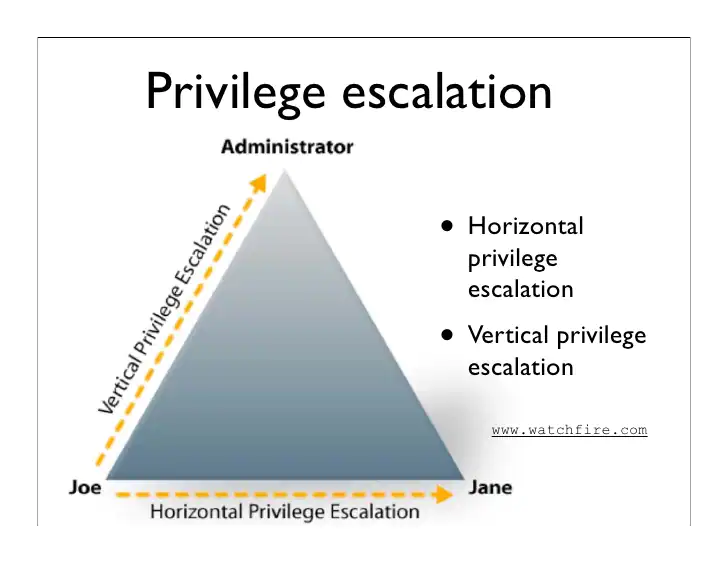

## Qué es una escalada de privilegios?

La escalada de privilegios ocurre cuando un usuario malicioso o malintencionado aprovecha una vulnerabilidad, un defecto de diseño o un error de configuración en una aplicación o sistema operativo para obtener un acceso elevado a los recursos que normalmente no deberían estar disponibles para ellos.

El atacante puede usar los privilegios recién obtenidos para robar datos confidenciales, ejecutar comandos administrativos o implementar malware, y potencialmente causar daños graves a su sistema operativo, aplicaciones de servidor, organización y reputación

Un escenario típico donde se produce una escalada de privilegios es cuando un atacante ya ha conseguido comprometer un sistema y ha obtenido un acceso mediante una cuenta con bajos privilegios. Tras este paso inicial el atacante se encuentra con una situación donde debe obtener mayores privilegios si quiere realmente comprometer todo el sistema u otras partes de la red.

Así pues, digamos que la escalada de privilegios es el paso siguiente tras obtener un punto de entrada inicial al sistema por parte de un atacante.

## Tipos de escaladas de privilegios

Como ya hemos dicho, en general, los atacantes aprovechan las vulnerabilidades de escalamiento de privilegios en la fase de ataque inicial para anular las limitaciones de su cuenta de usuario inicial en un sistema o aplicación. 

Hay dos tipos principales de escalada de privilegios: **escalada de privilegios horizontal** para acceder a la funcionalidad y los datos de un usuario diferente y **escalada de privilegios vertical** para obtener privilegios elevados, generalmente de un administrador del sistema u otro usuario avanzado.

Con la **escalada horizontal de privilegios**, los actores malintencionados permanecen en el mismo nivel general de privilegios, pero pueden acceder a los datos o la funcionalidad de otras cuentas o procesos que no deberían estar disponibles para ellos. 

Por ejemplo, esto puede significar usar un equipo comprometido para obtener acceso a los datos de otros usuarios de la oficina. Para las aplicaciones web, un ejemplo de escalamiento horizontal podría ser el uso de [secuestro de sesión](https://es.wikipedia.org/wiki/Secuestro_de_sesi%C3%B3n) para evitar la autenticación y obtener acceso a la cuenta de otro usuario en una red social, una plataforma de comercio electrónico o un sitio de banca electrónica.

Más peligrosa es la **escalada vertical de privilegios** (también llamada elevación de privilegios ), donde el atacante obtiene los derechos de una cuenta con más privilegios, generalmente el administrador o usuario del sistema en Microsoft Windows o root en sistemas Unix y Linux. Con este elevado nivel de acceso, el atacante puede causar todo tipo de estragos en sus sistemas informáticos y aplicaciones: robar credenciales de acceso y datos confidenciales, descargar y ejecutar ransomware, borrar datos o ejecutar código arbitrario. Los atacantes avanzados utilizarán privilegios elevados para cubrir sus pistas eliminando los registros de acceso y otras pruebas de su actividad, sin que la víctima se dé cuenta de que se ha producido un ataque. De esa forma, los ciberdelincuentes pueden robar información de forma encubierta y colocar puertas traseras u otro malware en los sistemas de la empresa.



Se suelen utilizar 5 métodos principalmente para llevar a cabo la escalada de privilegios:

* Explotación de credenciales
+ Vulnerabilidades y exploits
+ Configuraciones incorrectas
+ Software malicioso
+ Ingeniería social

## ¿Cómo prevenir y mitigar los ataques de escalada de privilegios?

Debido a que los ataques de escalada de privilegios pueden iniciarese y avanzar de muchas formas diferentes, se requieren múltiples estrategias y tácticas de defensa para protegernos.

Sin embargo, la implementación de un enfoque centrado en la identidad y en controles de administración de acceso privilegiado permiten protegerse contra la gama más amplia de ataques, así como reducir la superficie de ataque. Estas son algunas de las mejores prácticas:

* Administrar completamente el ciclo de vida de la autenticación , incluido el aprovisionamiento y desaprovisionamiento de identidades y cuentas para garantizar que no haya cuentas huérfanas que puedan ser secuestradas.

* Utilizar un mecanismo de administración de contraseñas para aplicar políticas sólidas de administración de credenciales tanto para humanos como para máquinas. Esto también implica eliminar la credencial predeterminada y "hardcodeada".

* Aplicar el privilegio mínimo: eliminar los derechos de administrador de los usuarios y reducir los privilegios de la aplicación y la máquina al mínimo requerido. También se debe implementar el acceso "just-in-time" para reducir los privilegios permanentes o permanentes.

* Supervisar y administrar todas las sesiones privilegiadas para detectar y abordar rápidamente cualquier actividad sospechosa que pueda indicar una cuenta secuestrada o un intento ilícito de escalada de privilegios o movimiento lateral.
  
* Fortalecer los sistemas y las aplicaciones: esto complementa el principio de privilegios mínimos y puede implicar cambios de configuración, eliminación de derechos y accesos innecesarios, cierre de puertos y más. Esto mejora la seguridad del sistema y las aplicaciones y ayuda a prevenir y mitigar los errores potenciales que puedan llevar a una vulnerabilidad de inyección de código malicioso, desbordamientos de búfer u otras puertas traseras que podrían permitir la escalada de privilegios.

* Gestión de vulnerabilidades: identifique y aborde de forma continua las vulnerabilidades, mediante parches, corrección de configuraciones incorrectas, eliminación de credenciales predeterminadas y/o integradas, entre otras.

* El acceso remoto seguro siempre debe monitorearse y administrarse para cualquier forma de acceso privilegiado, ya que los ataques pueden ocurrir horizontal y verticalmente para explotar los privilegios.

## Escalada de privilegios en Linux

En Linux nuestro objetivo con la escalada de privilegios va a ser siempre obetner una [shell](https://es.wikipedia.org/wiki/Shell_(inform%C3%A1tica)) corriendo con privilegios del usuario **root**.

En muchos casos la escalada de privilegios no recaerá simplemente en una simple mala configuración, sino que requererirá combinar varios métodos, debilidades y malas configuraciones para conseguirla.

Todas las escaladas de privilegios son ejemplos fehacientes de una violación de los controles de acceso. Puesto ques los controles de acceso y los permisos de usuario están estrechamente ligados, es crucial entender como funcionan los permisos en Linux, tal y como ya hemos visto con anterioridad.

Pasemos ahora a ver algunas de las técnicas que permiten la escalada de privilegios en sistemas Linux..

### Ejercicios

Cada una de las siguientes escaladas de privilegios la vamos a probar en la sala [Linux PrivEsc](https://tryhackme.com/room/linuxprivesc) de Tryhackme a la que debéis uniros.

### Permisos "débiles" o incorrectos en archivos

Es posible aprovecharse de algunos archivos de sistema para la escalada de privilegios si los permisos de estos archivos son incorrectos.

Si un archivo tiene información confidencial que podamos leer, podremos usarlo para conseguir el acceso a la cuenta de root.

Por otra parte, si nos topamos con un archivo de sistema sobre el que tenemos permisos de escritura, podremos modificar el comportamiento del sistema operativo y obtener acceso root de este modo.

Algunos comandos útiles:

Encontrar todos los archivos sobre los que tenemos permiso de escritura en ```/etc```:
```sh
$ find /etc -maxdepth 1 -writable -type f
```
Encontrar todos los archivos sobre los que tenemos permiso de lectura en ```/etc```:
```sh
$ find /etc -maxdepth 1 -readable -type f
```
Encontrar todos los directorios sobre los que tenemos permiso de escritura:
```sh
$ find / -executable -writable -type d 2> /dev/null
```
!!!Question "Task 3, 4 y 5 de THM"
    El archivo ```/etc/shadow``` contiene los hashes de las contraseñas de usuario, y por de forma predeterminada no es legible por ningún usuario excepto root.

    Si podemos leer el contenido del archivo /etc/shadow, podríamos descifrar el hash de la contraseña del usuario root.

    Si pudiéramos modificar el archivo /etc/shadow, podemos reemplazar el hash de la contraseña del usuario raíz con uno que conocemos.


### Secuencias de escape

En la mayoría de ocasiones tenemos restricciones para ejecutar únicamente ciertos programas a través de sudo. No obstante, puede darse el caso de que pueda "escapar" del programa y generar una shell. 

Cuando un programa se ejecuta con privilegios de root, también lo hace la shell que genera, por lo que puedo intentar conseguir una shell a través de la ejecución de ese programa.

Se puede consultar una lista de programas con sus secuencias de escape correspondientes en [GTFObins](https://gtfobins.github.io/)

Procedimiento:

1. Listar los programas que un usuario tiene permitido ejecutar como ^^sudo^^:


    ```sh
    $ sudo -l
    ...
        (root) NOPASSWD: /usr/sbin/iftop
        (root) NOPASSWD: /usr/bin/find
        (root) NOPASSWD: /usr/bin/nano
        (root) NOPASSWD: /usr/bin/vim
        (root) NOPASSWD: /usr/bin/man
        (root) NOPASSWD: /usr/bin/awk
    ...
    ```

2. Para cada programa de la lista, comprobar si existe una secuencia de escape en GTFObins

3. Si existe una secuencia de escapa, ejecutar el programa con **sudo** e intentar utilizar dcha secuencia para desplegar una shell de root.

!!!Question "Task 6 de THM"
    Obtén un terminal de root haciendo uso al menos de 3 secuencias de escape diferentes

### Tareas del [cron](https://es.wikipedia.org/wiki/Cron_(Unix)) y permisos de archivos

Las tareas programadas en el cron son programas o scripts cuyos usuarios pueden programar para que se ejecuten en momentos concretos o a intervalos.

Las tareas del cron se ejecutan con el nivel de seguridad del usuario propietario de las mismas. Por defecto, las tareas del cron usan el terminal ```/bin/bash``` con determinadas limitaciones.

La configuración de estas tareas se realiza en *crontab*. Los crontab de los usuarios suelen esar localizados en ```/var/spool/cron/``` o ```/var/spool/cron/crontabs```

El crontab del sistema está ubicado en ```/etc/crontab```.

!!!Question "Task 8 de THM"
    Consigue una shell de root aprovechándote de la mala configuración del crontab.

    !!!info "Shell inversa"
        [Ayuda para entender los conceptos shell directa y shell inversa](https://behacker.pro/que-es-shell-directa-y-shell-inversa-para-que-sirven/)


### Archivos de historial

Los archivos de historial registran los comandos utilizados por los usuarios mientras están usando ciertos programas.

Si un usuario escribe una contraseña como parte de un comando, esta contraseña puede almacenarse en un archivo de historial. Como atacante, siempre es una buena idea intentar cambiar al usuario root con un contraseña que ha sido revelada mediante este método..

!!!Question "Task 16 de THM"
    Consigue una shell de root aprovechándote del historial de comandos.


### Archivos de configuración

Muchos servicios y programas utilizan archivos de texto (config) para almacenar la configuración.

Si un servicio necesita autenticarse en algo, puede almacenar las credenciales en un archivo de configuración a pesar de ser una muy mala práctica.

Si se puede acceder a estos archivos de configuración y los usuarios privilegiados reutilizan las contraseñas que almacenan, es posible que podamos usarlos para iniciar sesión como ese usuario en otros servicios o sistemas.

!!!Question "Task 17 de THM"
    Consigue una shell de root aprovechándote de la información encontrada en algún archivo de configuración.


### Claves SSH

Se pueden utilizar claves SSH en lugar de contraseñas para autenticar a los usuarios mediante SSH.

Las claves SSH vienen en pares: una clave privada y una clave pública. La clave privada siempre debe mantenerse en secreto.

Si un usuario ha almacenado su clave privada de forma insegura, cualquiera que pueda leer la clave puede iniciar sesión en su cuenta usándola. 

!!!Question "Task 18 de THM"
    Consigue una shell de root aprovechándote de las claves SSH del sistema.


## Escalada de privilegios en Windows

En una escalada de privilegios en Windows nuestro objetivo será obtener una shell corriendo como Administrador o como el usuario SYSTEM.

De igual forma que ocurría en Linux, una escalada de privilegios puede ser sencilla o necesitar un detalladísimo reconocimiento del sistema previamente comprometido. 

Veamos algunos conceptos básicos a modo de recordatorio.

### Conceptos previos

##### [Cuentas de usuario](https://docs.microsoft.com/es-es/windows/security/identity-protection/access-control/local-accounts)

Las cuentas de usuario se utilizan para iniciar sesión en un sistema Windows.

Pensad en una cuenta de usuario como una colección de configuraciones/preferencias ligado a una identidad única.

La cuenta de "Administrador" local se crea de forma predeterminada en instalación. Pueden existir varias otras cuentas de usuario predeterminadas (por ejemplo, Invitado) dependiendo de la versión de Windows. 

##### [Cuentas de servicio](https://docs.microsoft.com/es-es/windows/security/identity-protection/access-control/service-accounts)

Las cuentas de servicio se utilizan, obviamente, para ejecutar servicios en Windows.

Las cuentas de servicio **NO** se pueden utilizar para iniciar sesión en un sistema Windows. La cuenta del SYSTEM es una cuenta de servicio predeterminada que tiene unos mayores privilegios que cualquier cuenta local en Windows.

Otras cuentas de servicio predeterminadas incluyen NETWORK SERVICES y LOCAL SERVICE.

##### Grupos

Las cuentas de usuario pueden pertenecer a varios grupos y los grupos pueden tener varios usuarios. Los grupos permiten un control de acceso más fácil a los recursos.

Los grupos regulares (por ejemplo, administradores, usuarios) tienen una lista establecida de miembros.

Los pseudogrupos (p. Ej., "Usuarios autenticados") tienen una lista dinámica de miembros que cambia en función de determinadas interacciones. 

##### Recursos

En Windows, existen varios tipos de recursos (también conocidos como
objetos):

+ Archivos / Directorios
+ Entradas de registro
+ Servicios
  
Si un usuario y/o grupo tiene permiso para realizar una determinada acción de un recurso dependerla de la lista de control de acceso (ACL) de ese recurso. 

##### ACL y ACE

Los permisos para acceder a un determinado recurso en Windows son controlados por la lista de control de acceso (ACL) para ese recurso.

Cada ACL se compone de cero o más entradas de control de acceso (ACE).

Así pues, una ACL es una lista ordenada de ACE que define las protecciones que se aplican a un objeto y sus propiedades. Cada ACE identifica una [entidad de seguridad](https://docs.microsoft.com/es-es/windows/security/identity-protection/access-control/security-principals) y especifica un conjunto de derechos de acceso que están permitidos, denegados o auditados para esa entidad de seguridad.

Cuando un usuario intenta acceder a un archivo, el sistema de Windows ejecuta un AccessCheck y compara el descriptor de seguridad con el token de acceso de los usuarios y evalúa si el usuario tiene acceso y qué tipo de acceso según el conjunto de ACE. 

Cada ACE define la relación entre un principal (por ejemplo, un usuario, grupo) y un cierto derecho de acceso 

### Ejercicios

Cada una de las siguientes escaladas de privilegios la vamos a probar en la sala [Windows PrivEsc](https://tryhackme.com/room/windows10privesc) de Tryhackme a la que debéis uniros.

### Pemisos inseguros de servicios

Cada servicio tiene una ACL que define ciertos permisos específicos para ese servicio.

+ Algunos permisos son inocuos (por ejemplo, SeRVICE_QUERY_CONFIG, SERVICE_QUERY_STATUS).

+ Algunos pueden resultar útiles (p. Ej., SERVICE_STOP, SERVICE_START).

+ Algunos son peligrosos (p. Ej., SERVICE_CHANGE_CONFIG, SERVICE_ALL_ACCESS) 

Si nuestro usuario tiene permiso para cambiar la configuración de un servicio que se ejecuta con privilegios de SYSTEM, podemos cambiar el ejecutable que utiliza el servicio por uno de nuestra propia cosecha.

Potencial callejón sin salida: si se puede cambiar la configuración de un servicio pero no puede reiniciar el servicio, ¡no será posible escalar privilegios! 

!!!Question "Task 3 de THM"


### Rutas de servicios sin entrecomillado

Los ejecutables en Windows se pueden ejecutar sin usar su extensión (por ejemplo, "whoami.exe" se puede ejecutar con solo escribir "whoami").
Algunos ejecutables aceptan argumentos separados por espacios, p.Ej.: someprog.exe arg1 arg2 arg3 ...

Este comportamiento conduce a la ambigüedad cuando se utilizan rutas absolutas que están sin comillas y contienen espacios.

<<<<<<< HEAD
Considerad la siguiente ruta sin comillas:
=======
Considered la siguiente ruta sin comillas:
>>>>>>> 7aa02229a9d73f210e37a19d0ef2e4a01f1e733a

C:\Program FIles\Algun directorio\SomeProgram.exe

Para nosotros, esto obviamente ejecuta SomeProgram.exe. Para Windows, C:\Program podría ser el ejecutable, con dos argumentos: "Files\Algun" y "directorio\SomeProgram.exe"

Windows resuelve esta ambigüedad comprobando cada una de las posibilidades por turno.

Si podemos escribir en una ubicación que Windows compruebe antes del ejecutable real, podremos engañar al servicio para que lo ejecute.

!!!Question "Task 4 de THM"
    Obtén una shell de Administrador haciendo uso de esta escalada de privilegios.


### Ejecutables de servicios inseguros

Si el ejecutable del servicio original es modificable por nuestro usuario, podemos simplemente reemplazarlo con el ejecutable de nuestra shell inversa.

¡Recordad crear una copia de seguridad del ejecutable original si se trata de en un sistema real! 

!!!Question "Task 6 de THM"
    Obtén una shell de Administrador haciendo uso de esta escalada de privilegios.


### Credenciales almacenadas

Windows tiene el comando "*runas*" o "*Ejecutar como*" que permite a los usuarios ejecutar comandos con los privilegios de otros usuarios. Por lo general, esto requiere el conocimiento de la contraseña de esos usuarios.

Sin embargo, Windows también permite a los usuarios guardar sus credenciales en el sistema y estas credenciales guardadas se pueden utilizar para que se omita este requisito. 

!!!Question "Task 10 de THM"
    Obtén una shell de Administrador haciendo uso de esta escalada de privilegios.


### Security Account Manager (SAM)

Windows almacena hashes de contraseña en el Security Account Manager (SAM).

Los hashes están cifrados con una clave que se puede encontrar en un archivo llamado SYSTEM.

Si se tiene la capacidad de leer los archivos SAM y SYSTEM, se pueden extraer los hashes. Los archivos SAM y SYSTEM se encuentran en el directorio ```C:\Windows\System32\config```.

Estos archivos se bloquean mientras se ejecuta Windows. Sin embargo, podrían existir copias de seguridad de los archivos en los directorios ```C:\Windows\Repair``` o ```C:\Windows\System32\config\RegBack```.

!!!Question "Task 11 de THM"
    Obtén una shell de Administrador haciendo uso de esta escalada de privilegios.


### Tareas programadas

Windows se puede configurar para ejecutar tareas en momentos concretos, periódicamente (por ejemplo, cada 5 minutos) o cuando se activa por algún evento (por ejemplo, un inicio de sesión de usuario).

Las tareas generalmente se ejecutan con los privilegios del usuario que las creó, sin embargo los administradores pueden configurar tareas para que se ejecuten con los privilegios de otros usuarios, incluido SYSTEM.

!!!Question "Task 13 de THM"
    Obtén una shell de Administrador haciendo uso de esta escalada de privilegios.


