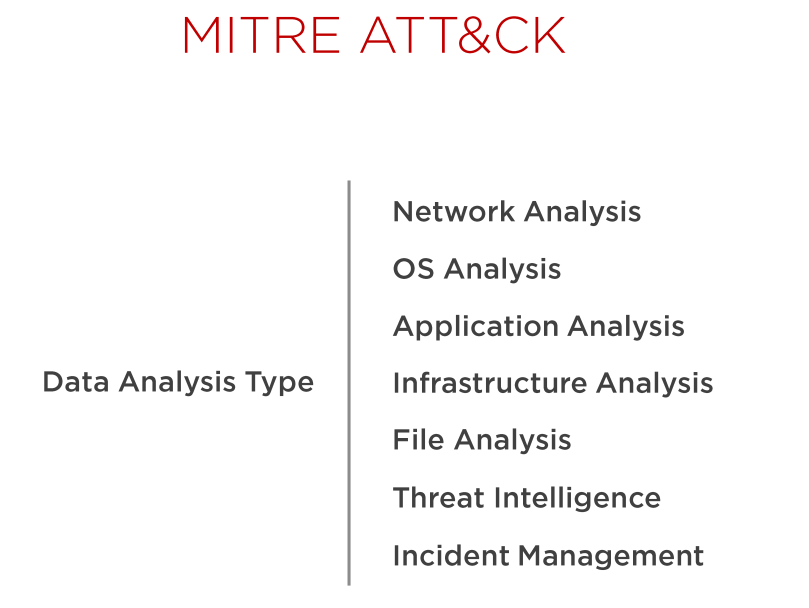

## MITRE ATT&CK
¿Has escuchado de MITRE ATT&CK? ATT&CK por sus siglas en inglés, significa: "tácticas, técnicas del adversario y conocimiento común". En una fuente de información colaborativa entre los profesionales de seguridad. 

Permite identificar mejor la huella de TTP (técnicas, tácticas y procedimientos) más amplia (y más profunda) que un adversario dado deja atrás en el curso de una campaña de penetración. Es una fuente a tener en cuenta para entender cómo operan los atacantes. 

Los defensores utilizan este framework y las herramientas asociadas en función de la fuente de datos que posean. Muchas de estas herramientas pueden tener capacidades que se superpongan pero representan la mejor opción para formar un conjunto amplio que nos permita defendernos de forma efectiva.

Dependiendo del tipo de dato que tengamos, las herramientas se categorizan de forma diferente:

Si por ejemplo tuviéramos una fuente de datos relacionados con la red, podríamos mapear estos datos con MITRE ATT&CK:

Y así sucesivamente.

## Glosario de terminos

### Arkime

!!!quote "Cita de [Arkime](https://arkime.com/)"
    Augment your current security infrastructure to store and index network traffic in standard PCAP format.
    Arkime is not meant to replace Intrusion Detection Systems (IDS) but instead provides more visibility. 

### Command and control (C2)

!!!quote "Cita de [Tarlogic](https://www.tarlogic.com/es/glosario-ciberseguridad/c2-command-and-control/)"
    La mayoría de las amenazas necesitan conectarse a un entorno fuera de la organización, donde poder comunicarse con los operadores de estas amenazas (Threat Actors) para recibir instrucciones, exfiltrar información, etc. Estas comunicaciones de manera general no son contra los entornos finales de estos actores, sino que son hacia servidores que controlan, centralizan la información y realizan las acciones necesarias. Estos servidores se conocen como servidores Command and Control, C&C o C2.

### IOC

!!!quote "Cita de [attacksimulator](https://attacksimulator.es/blog/8-tipos-de-indicadores-de-compromiso-ioc-y-como-reconocerlos/)"
    Los indicadores de compromiso o IoCs son pistas y pruebas de una brecha de datos, que generalmente se ven durante un ataque de ciberseguridad. Estos indicadores pueden revelar que se ha producido un ataque, qué herramientas se han utilizado para el mismo y quién está detrás. Suelen ser recolectados a través del software, incluyendo los sistemas antivirus y antimalware. Para entenderlo mejor, intenta pensar que los indicadores de compromiso son como las migas de pan que deja un atacante tras un ciberataque.

### Emotet

!!!quote "Cita de [malwarebytes](https://es.malwarebytes.com/emotet/)"
    El troyano bancario Emotet fue identificado por primera vez por investigadores de seguridad en 2014. Emotet fue diseñado originalmente como un malware bancario que intentaba colarse en su ordenador y robar información confidencial y privada. En versiones posteriores del software se añadieron los servicios de envío de spam y malware, incluidos otros troyanos bancarios.

### Lokibot

!!!quote "Cita de [WeLiveSecurity](https://www.welivesecurity.com/la-es/2021/09/30/lokibot-principales-caracteristicas-malware-roba-credenciales/)"
    Lokibot, también conocido como Loki PWS o Loki-bot, es un malware perteneciente a la familia de troyanos que está activo desde 2015 y es utilizado desde entonces en campañas a nivel global. Fue diseñado con el objetivo de robar credenciales de navegadores, clientes FTP/ SSH, sistemas de mensajería, y hasta incluso de billeteras de criptomonedas.

### Spear phising

!!!quote "Cita de [Kasperksy](https://latam.kaspersky.com/resource-center/definitions/spear-phishing)"
    El spear phishing es una estafa de correo electrónico o comunicaciones dirigida a personas, organizaciones o empresas específicas. Aunque su objetivo a menudo es robar datos para fines maliciosos, los cibercriminales también pueden tratar de instalar malware en la computadora de la víctima.

## Referencias

[La matriz de MITRE: tácticas y técnicas en entornos industriales](https://www.incibe-cert.es/blog/matriz-mitre-tacticas-y-tecnicas-entornos-industriales)

[How to Use MITRE ATT&CK to Map and Track Adversary TTPs](https://www.eclecticiq.com/take-action-with-cti/how-to-use-mitre-attck-to-map-and-track-adversary-ttps)

