## Introducción
Vamos a aprender a instalar y a configurar un servicio SSH para poder conectarnos de forma remota. Tras ello, veremos varias formas de fortificarlo.
Para el cometido de esta práctica necesitaremos un par de máquinas virtuales:

+ Un servidor Linux (Ubuntu Server por ejemplo). No hace falta que haga uso del entorno gráfico, así haremos la máquina más liviana, sin necesidad de tantos recursos.
  
    Poseerá una interfaz tipo bridge/puente.

+ Un cliente para conectarnos al servidor. En primer lugar utilizaremos una máquina Linux cualquiera. Puede ser desde vuestra Kali/Parrot hasta un ligero Xubuntu que instaléis para la ocasión.
En segunda instancia haremos la configuración con un cliente Windows.

## Instalación y configuración de OpenSSH

### Instalación

Para instalar nuestro servidor SSH, en caso de que no estuviera instalado, no tenemos más que:

```console
sudo apt install openssh-server
```

Para comprobar el estado del servicio:

```console
systemctl status ssh
```

Linux ya viene con un cliente SSH preinstalado, por lo que no sería necesaria mayor configuración en el cliente. Ya deberíais poder conectaros de forma remota al servidor con el siguiente comando:

+ Si queréis conectaros por el nombre de la máquina en lugar de por la IP, podéis añadir el nombre a `/etc/hosts`

    !!!tip

        Cuidado porque si la máquina coge la IP por DHCP, puede que ésta vaya cambiando, por lo que esta forma puede convertirse en más tediosa.

+ Probad que podéis conectaros desde el cliente usando obviamente la IP de su interfaz

+ Para conectaros desde un ordenador con Windows deberéis instalaros un cliente SSH como [Putty](https://www.aemilius.net/ayuda/articulos/acceso-ssh-ssl-secure-shell-telnet- putty.html)

La primera vez que os conectéis, os aparecerá algo como esto

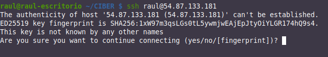

Se nos está informando de que el equipo al que nos estamos conectando por SSH podría no ser el nuestro o el que pensamos que es. Para estar 100% seguros, habría que ir al servidor, comprobar su *huella* (*fingerprint*) que lo identifica y compararla con la que aquí se nos muestra.


Dado que esto es una práctica académica, que nuestro escenario es muy sencillo y podemos estar seguros de que el servidor es nuestra máquina, simplemente le diremos *yes* y continuaremos la conexión.

Esta acción añadirá el servidor al archivo **known_hosts**.

### ¿Qué archivos de configuración tengo?

1. `/etc/ssh/sshd_config`: Archivo principal de configuración del servidor SSH (configura el demonio o servicio).

2. `/etc/ssh/ssh_config`: Archivo principal de configuración de los clientes SSH.

3. `~/.ssh/config`: Archivo personal de cada usuario. Contiene la configuración utilizada por los clientes SSH. Permite al usuario local utilizar una configuración distinta a la definida en el archivo /etc/ssh/ssh_config.
   
4. `~/.ssh/known_hosts`: Archivo personal de cada usuario. Contiene las firmas digitales de los servidores SSH a los que se conectan los clientes. 

    Cuando éstas firmas cambian, se pueden actualizar ejecutando el comando `ssh-keygen -R`, pasando el nombre del anfitrión o la IP del anfitrión como argumento. Este comando elimina la entrada correspondiente en el archivo `~/.ssh/known_hosts` y, permite añadir de nuevo al anfitrión con una nueva firma digital.
  
5. `~/.ssh/authorized_keys`: Archivo personal para cada usuario. Contiene los certificados de los clientes SSH, para permitir autenticación hacia servidores SSH sin requerir contraseña.

### Principales directivas de la configuración

Cuando hablamos de hacer hardening de un servicio, lo podríamos traducir como <u>fortificación</u> o bastionado. Es decir, se configura un servicio de tal manera que se protege lo máximo posible de cualquier fallo o ataque a dicho servicio.

Tras la instalación procederemos a la configuración del servidor, para ello, editaremos el fichero de configuración `/etc/ssh/sshd_config`

Veamos detalladamente las directrices que pueden aparecer en este archivo:

### Directriz Port

De forma predeterminada, el servicio SSH escucha por el puerto 22. La directriz por defecto sería:

`Port 22`

Una forma de elevar la seguridad del servidor SSH, consiste en cambiar el número de puerto predeterminado por otro que sólo el administrador del sistema conozca. A este tipo de técnicas se les conoce como seguridad por oscuridad. Aunque no se considera ni recomendable ni suficiente.

Los atacantes buscarán servidores que estén escuchando por el puerto 22. Cambiar de puerto disminuye considerablemente la posibilidad de una intrusión.

###  Directriz ListenAddress

De forma predeterminada, el servicio SSH escuchará peticiones a través de todas las direcciones IP correspondientes a todas las interfaces de red del sistema. La directriz por defecto sería:

`ListenAddress 0.0.0.0`

Se puede configurar para que sólo escuche por una de las interfaces.

### Directriz Protocol

Permite indicar qué versión del protocolo utilizar. Ya dijimos que la versión segura hoy día es la 2:

`Protocol 2`

### Directriz LoginGraceTime

En esta directriz se establece el tiempo, en segundos, durante el cual la pantalla de login estará disponible para que el usuario introduzca su nombre de usuario y contraseña, si no lo
hace durante ese período de tiempo el login se cerrará, evitando así dejar por tiempo indeterminado pantallas de login sin que nadie las use, o que alguien este intentando mediante un **script** adivinar un usuario y su contraseña.

Si el valor es **0**, no hay límite de tiempo para que un usuario se autentique, lo cual no es recomendable ya que de esta forma un atacante podría utilizar ataques de fuerza bruta o usando métodos de diccionario para adivinar la contraseña, por lo tanto no es recomendable dejar esta directriz a **0**.

### Directriz PermitRootLogin

Probablemente sea la directriz de seguridad más importante que podemos establecer para asegurar nuestro servidor SSH. En los sistemas Unix y Linux se crea por defecto al usuario root, con privilegios de adnimistrador.

Muchos ataques de fuerza bruta se concentran en atacar al usuario root con la esperanza de que tenga una contraseña débil. Sabiendo una parte de la ecuación (root) solo será cuestión de tiempo para que alguien con paciencia y suerte vulnere el sistema. En esta directriz denegamos el acceso al usuario root y por lo tanto, cualquier intento de ataque directo al usuario root será inútil.

Al denegar el acceso al usuario root, cada vez que necesitemos realizar tareas administrativas, accederemos como un usuario normal y una vez dentro, utilizando alguno de los comandos su o sudo podremos realizar dichas tareas administrativas. Por lo tanto, denegando el acceso al usuario root, el atacante tendrá que acertar tanto el nombre de un usuario del sistema como su contraseña, algo que disminuye notablemente la probabilidad de una intrusión.


### Directriz StrictModes

En esta directriz se establece que *sshd* (el servicio ssh) revisara los modos y permisos de los archivos de los usuarios y el directorio `$HOME` de el usuario antes de aceptar la sesión. Esto es normalmente deseable porque a veces algunos usuarios dejan sus directorios, accidentalmente, con permiso de escritura para cualquiera. El valor predeterminado es yes, por lo tanto, lo dejaremos con su valor predeterminado.

`StrictModes yes/no`


### Directriz MaxAuthTries

El valor de esta directriz establece el máximo número de intentos de autenticación permitidos por conexión, es decir, la cantidad de veces que podemos equivocarnos al ingresar el usuario
y/o contraseña. Una vez que los intentos alcanzan la mitad de este valor, las conexiones fallidas siguientes serán registradas.

Después del máximo número de intentos se cerrará la conexión. Es posible volver a intentarlo, pero el límite de intentos por vez evita ataques basados en la persistencia de la conexión.

`MaxAuthTries 5`

### Directriz MaxStartups

El valor de esta directriz establece el máximo número de conexiones simultaneas de login que permitirá el servidor SSH por cada IP que intente conectarse.

Hay ataques muy efectivos que dividen el ataque en una gran cantidad de conexiones de login. Es decir, el atacante divide en una gran cantidad de logins los intentos por ingresar, aumentando sus posibilidades de adivinar antes al usuario y su contraseña.

`MaxStartups 5`

### Directrices para autenticar con password

La directriz ***PasswordAuthentication*** habilita o deshabilita la autenticación con contraseñas. Por defecto está permitida la autenticación con contraseña. Si establecemos el valor no sólo se permitirá el acceso a través de firmas digitales. Es muy importante no cambiar el valor de esta directriz a no hasta haber instalado nuestra firma digital.

`PasswordAuthentication yes/no`

La directriz ***PermitEmptyPasswords*** especifica si se permite el uso de contraseñas vacías, es decir, autenticarse sin contraseña (no recomendable por motivos de seguridad). Esta directriz es válida cuando se usa conjuntamente con PasswordAuthenticacion yes.

`PermitEmptyPasswords yes/no`

### Directrices para permitir el uso de X11

La directriz *X11Forwarding* establece si se permitirá la ejecución remota de aplicaciones gráficas que utilicen el [servidor X11](https://es.wikipedia.org/wiki/Sistema_de_ventanas_X). Es necesario que el valor esté establecido a yes para poder ejecutar aplicaciones gráficas.

```linuxconf
X11Forwarding yes/no
X11DisplayOffset 10 
X11UseLocalhost yes/no
```

### Directriz AllowUsers

Con esta directriz establecemos que usuarios del sistema pueden ingresar vía SSH. Solo los usuarios listados en esta directriz podrán acceder.

`AllowUsers raul profesor administrador otroprofesor`

Los usuarios r*aul, profesor, administrador y otroprofesor* podrán acceder desde cualquier ordenador, no se valida el host desde el que se conectan. 

Si se quiere más seguridad, es posible indicar también el host o hosts (desde los cuales el usuario se puede conectar) mediante el símbolo @. Veamos los siguientes ejemplos:

```linuxconf
AllowUsers raul@192.168.10.2 (Sólo desde la IP indicada)
AllowUsers raul@172.1.1.* (Toda la red indicada)
AllowUsers raul@*.raul.es(Todo el dominio indicado)
AllowUsers raul@clienteciber.raul.es (Solo el equipo del dominio indicado)
```
Combinación de varias:

```linuxconf
AllowUsers raul@192.168.10.2 profesor@172.1.1.* administrador@*.raul.es otroprofesor
```


### Directriz UseDNS

Cuando un cliente SSH realiza una conexión hacia un servidor SSH, el servidor intentará resolver la dirección IP del cliente. Si el servidor DNS predeterminado del sistema carece de una zona de resolución inversa que resuelva un nombre para la dirección IP del cliente, la conexión se demorará algunos segundos más de lo normal.

Podemos deshabilitar esta directriz para agilizar las conexiones SSH en redes donde se carece de servidores DNS que tengan zonas de reenvío para resolver los nombres o zonas de resolución inversa para resolver las direcciones IP de los segmentos de red local.

Puesto que nosotros tenemos nuestro DNS donde todas los registros de la zona de resolución directa deben tener su equivalencia en la zona de resolución inversa, lo podemos dejar activado.

`UseDNS yes/noUseDNS yes/no`


### Directriz HostKey

Estudiemos las siguientes líneas:

```linuxconf
# HostKey for protocol version 1
# HostKey /etc/ssh/ssh_host_key
# HostKeys for protocol version 2
# HostKey /etc/ssh/ssh_host_rsa_key
# HostKey /etc/ssh/ssh_host_dsa_key #HostKey /etc/ssh/ssh_host_ecdsa_ke
```

La directriz HostKey nos indica la ubicación de las llaves públicas para el servidor sshd, tanto para el protocolo SSHv1 y SSHv2 de SSH. Como en nuestro ejemplo solo usaremos el protocolo SSHv2, eliminaremos (o comentaremos) las líneas correspondientes al protocolo SSHv1.

Si quisiéramos usar el algoritmos RSA para nuestras claves, deberíamos dejar algo así:

```linuxconf
# HostKeys for protocol version 2

HostKey /etc/ssh/ssh_host_rsa_key
```

### Directriz PrintMotd

Esta directriz establece si se presentará o no el **mensaje del día (MOTD).**

El **motd** de **Linux** es un archivo que contiene un mensaje del día que se muestra a todos los usuarios que se conectan a la máquina por terminal. Normalmente se usa para informar a los usuarios sobre el estado del servidor o simplemente para dar la bienvenida a la máquina. La ruta al archivo es `/etc/mtod`

Se trata de un archivo de texto plano el cual podemos personalizar. Hay que tener en cuenta que si el motd ya está habilitado para los usuarios del sistema, si lo habilitamos en
`/etc/ssh/sshd_config`, al iniciar sesión en el servidor SSH, este aparecerá duplicado. El motd se muestra después de autenticarnos en el servidor.

`PrintMotd yes/no`

### Directriz Banner

Por medio de esta directriz podemos presentar un **banner de acceso** que nos permitirá mostrar un mensaje antes de la autenticación. Enseñar un cartel de advertencia exponiendo temas legales de un acceso no autorizado.

`Banner /etc/ssh/ssh_pre-login`

El **banner de acceso** no es más que el contenido de un fichero de texto plano ubicado en algún sitio del sistema y que podremos personalizar a nuestro gusto. El banner de acceso se presenta antes de autenticarnos en el servidor.


### Directrices de registro de eventos (logs)

El registro de eventos del servicio es importante así como la ruta donde guardarlos, un atacante  experimentado  intentará  limpiar  los  logs  para  evitar  ser  atrapado. En estas directrices se especifican los parámetros para el registro de eventos:

SyslogFacility especifica el tipo de registros que generará, en este caso es AUTH, es decir, de las autenticaciones que se hacen contra el servidor. El parámetro AUTH es el predeterminado.
LogLevel con el valor ***INFO*** es el valor predeterminado. 

Otros parámetros están especificados en la [página del manual de sshd_config (man sshd_config)](https://man.freebsd.org/cgi/man.cgi?sshd_config(5)), los parámetros ***DEBUG2*** y ***DEBUG3*** cada uno de ellos especifican el nivel más alto de registro. Guardar registros con el nivel DEBUG viola la privacidad de los usuarios y por lo tanto no es recomendable.

En nuestro ejemplo el registro de eventos quedaría configurado de la siguiente manera:

```linuxconf
SyslogFacility AUTH
LogLevel INFO
```

### Directriz RSAAuthentication

Con esta directriz deshabilitamos la autenticación con RSA.

`RSAAuthentication yes/no`

### Directriz PubkeyAuthentication

Esta directriz especifica el uso de autenticación por medio de la llave pública.

`PubkeyAuthentication yes/no`


### Directriz AuthorizedKeysFile

Esta directriz se usa en conjunto cuando se usa autenticación por llave pública, y especifica donde se guardaran las llaves en el host remoto. El valor por defecto es `~/.ssh/authorized_keys` esta ruta es por defecto para el protocolo ***SSHv2*** de SSH.

`AuthorizedKeysFile %h/.ssh/authorized_key`

### Directriz IgnoreUserKnownHosts

Esta directriz especifica si se ignorara o no el uso de el archivo `~/.ssh/known_hosts` en el cual se agregan las llaves de los servidores SSH a los cuales nos conectamos y confiamos. Por lo tanto debe de estar en **no** para no ignorar este archivo.

`IgnoreUserKnownHosts yes/no`

### Directriz AllowTcpForwarding

Especifica si se permite hacer redireccionamiento de protocolos basados en TCP. Permite crear túneles a conexiones de protocolos no seguros, enviando la información en texto plano por un túnel cifrado. Muy usada en conexiones POP3 o IMAP, se recomienda dejarlo por defecto.

`AllowTcpForwarding yes/no`


### Directriz PrintLastLog

Aquí se especifica si se mostrara un mensaje mostrando la dirección IP de donde se conecto el usuario la ultima vez. Muy útil para saber si alguien más se está conectando con un usuario en especifico.

`PrintLastLog yes/no`

### Directriz TCPKeepAlive

Nos indica que el servidor sshd enviará mensajes de keepalive al cliente después de que detecta alguna inactividad. Este método puede ser explotado por técnicas de [spoofing](https://es.wikipedia.org/wiki/Suplantaci%C3%B3n).

`TCPKeepAlive yes/no`

### Directriz UsePrivilegeSeparation

Significa que después de que la sesión SSH se ha establecido se pasaran los privilegios de ese proceso al usuario de quien inicie la conexión, si se deshabilita, el proceso estará a nombre de root. Muy importante para evitar elevación de privilegios.

`UsePrivilegeSeparation yes/no`


### Directriz ClientAliveInterval

Esta directriz especifica el intervalo de tiempo en segundos en el cual después de que no se ha recibido ningún dato de el cliente, sshd enviara un mensaje a través del canal cifrado para requerir una respuesta de el cliente, el valor predeterminado es 0, el cual significa que no se envía tal mensaje. Esta opción sólo se aplica al protocolo SSHv2. Es útil cuando se tiene una conexión intermitente y se requiere que la sesión esté abierta sin que se cierre la sesión.

`ClientAliveInterval 0`


### Directriz ClientAliveCountMax

Nos indica las veces que el servidor sshd enviará mensajes **keepalive** cuando el cliente está inactivo. Si el cliente no envía ninguna respuesta, entonces el servidor terminara la conexión y por lo tanto la sesión. Si tenemos conexiones intermitentes es recomendable subir el numero a este valor. 

Hay que tener en cuenta que esta opción es diferente a la opción *TCPKeepAlive*, estos mensajes son enviados a través de el canal cifrado, por lo tanto no puede ser explotado por técnicas de [spoofing](https://es.wikipedia.org/wiki/Suplantaci%C3%B3n) como el *TCPKeepAlive*.


### Directriz PidFile

Esta opcion establece el nombre y ruta del archivo donde se guarda el [identificador de proceso ***(pid)***](https://es.wikipedia.org/wiki/Identificador_de_proceso) de sshd.


### Directriz Subsystem

Esta opción lo que hace es iniciar el servidor **sftp-server** el cual es un sustituto para un servidor FTP, pero la comunicación es segura, ya que se hace por un canal cifrado.

`Subsystem sftp /usr/libexec/sftp-server`


### Directriz PermitBlacklistedKeys

Si esta directriz se establece a yes permitirá hacer login con claves en lista negra.

`PermitBlacklistedKeys yes/no`


### Directriz IgnoreRhosts y RhostsRSAAuthentication

Con estas directrices denegamos el uso de relaciones de confianza establecidas en los ficheros
`~/.rhosts` y `~/.shosts` de los usuarios:

```linuxconf
IgnoreRhosts yes/no

RhostsRSAAuthentication yes/no
```

### Directriz HostbasedAuthentication

Deshabilitar o habilitar autenticación basada en host.

`HostbasedAuthentication yes/no`


### Directriz UsePAM
Si usamos claves no necesitamos [PAM (Módulos de autenticación Conectables)](https://es.wikipedia.org/wiki/Pluggable_Authentication_Modules) y permitimos a sshd funcionar como un usuario no root.

`UsePAM no`

## Bastionado/hardening/fortificación del servicio SSH

Ya  hemos  visto  en  [un  apartado anterior ](#que-archivos-de-configuracion-tengo) que  el  fichero  que  debemos  modificar  es  el
/etc/ssh/sshd_config, que es el que se corresponde con el del servidor del servicio SSH.

Como siempre que vayamos a modificar una configuración, lo primero será hacer una copia de `sshd_config` a `sshd_config.bak`, por si algo no saliera bien.

+ Para empezar, si os habéis fijado, al hacer login en un Ubuntu Server (p. ej.), se nos muestra una gran cantidad e información, algo así

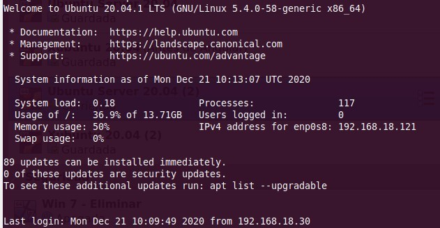

Esto, como hemos visto en las directivas, es lo que conocemos como ***motd o “message of the day”***.

Puede que en algunos casos esto resulte útil pero para el caso que nos ocupa, es demasiada información, se hace innecesaria y proporciona demasiada pistas sobre la máquina.
La única forma de desactivar este motd por defecto es impidiendo que se ejecuten los archivos de configuración asociados:


Podemos crearnos un asciiart para crearnos un motd personalizado, además de un mensaje advirtiendo del acceso restringido a la máquina. Este motd personalizado debemos crearlo en el directorio /etc y dentro de este directorio, en un archivo llamado **motd**.

Podéis crearos un ascciart [aquí](http://www.patorjk.com/software/taag/#p=display&f=Graffiti&t=Type%20Something%20)

!!!task "Tarea"
    **Comprueba** adjuntando una captura de pantalla, que aparece correctamente el motd al hacer login mediante ssh.

!!!task "Tarea"
    Parámetros de seguridad que debéis configurar dentro de sshd_config **mediante las directivas** que hemos visto antes(las que no estén, deberéis añadirlos vosotros)

      + Utilizar sólo la versión 2 del protocolo
      + Utilizar el puerto 8022 en lugar del 22
  
          + Para conectaros deberéis utilizar la opción “-p 8022” para indicar el puerto: `ssh nombre_usuario@nombremaquina -p 8022`

      + No se permite al usuario root hacer login mediante SSH
      + El tiempo que el usuario tendrá para introducir su login antes de que se cierre laconexión con el servidor es de 20 segundos
  
          + **Comprueba**, adjuntando una captura de pantalla, que tras ejecutar el comando `ssh nombre_usuario@nombremaquina -p 8022`, si esperáis más de 20 segundos, cuando intentáis introducir el password, el servidor os desconecta.
      + No se permite el login con passwords vacíos
      + Puesto que vamos a configurar el login por claves únicamente
        + En principio, sí se debe permitir la autenticación con password
        + No se debe permitir la autenticación mediante Kerberos, ni mediante GSSAPI.
      + Ignorar rhosts
      + Deshabilitar TCPKeepAlive
      + Sólo se permite hacer login al usuario “raul” desde la IP de vuestros clientes.
          + Añadid un nuevo usuario1[^1] que sea vuestro primer apellido a la máquina que hace de servidor y comprobad, adjuntando una captura de pantalla, que no podéis hacer login con ese nuevo usuario.
      + Debe estar activada la autenticación PAM
      + El SyslogFacility debe ser AUTH y el nivel de LOG debe ser INFO
      + Debemos saber cuál fue la IP que utilizó el usuario para conectarse o hacer login por SSH la última vez.
      + Debe aparecer un banner antes de autenticarnos con el texto ***ATENCIÓN: Debe estar autorizado para acceder a este servidor***
       
          + **Comprueba**, adjuntando una captura de pantalla, que, efectivamente, aparece el banner antes de introducir ningún password
  
    Además, pega una o varias capturas de pantalla donde se vea claramente la configuración de todos los parámetros indicados.
  
[^1]:
    ```bash
    useradd -m apellido
    passwd apellido
    usermod -a -G sudo apellido
    chsh -s /bin/bash apellido
    ```
       
### Generación de claves, configuración y comprobación

La configuración del login mediante claves nos dará la ventaja de no necesitar utilizar password para autenticarnos en el servidor cuando hagamos uso de SSH.

Para crear un par de claves pública/privada en el cliente, ejecutaremos el comando:


Si dejáis las opciones por defecto, os creará una clave privada (*id_rsa*) y una clave pública (*id_rsa.pub*) en el directorio `/home/vuestro_usuario/.ssh`

Os pedirá un password para proteger vuestra clave privada. La clave privada asociada a la pública debe ser protegida convenientemente para que nadie más que el usuario tenga acceso a ella.

Este paso añade una capa más de seguridad a nuestro servicio, sin embargo también produce la incomodidad de no podernos librar del paso de introducir una contraseña. En ciberseguridad, siempre debe haber un compromiso entre funcionalidad y seguridad por lo que este paso podría ser opcional dependiendo del caso.

  + Le ponemos el password a la clave privada porque la vamos a guardar cifrada en el disco y esta será la contraseña necesaria para descifrarla y poder utilizarla.

    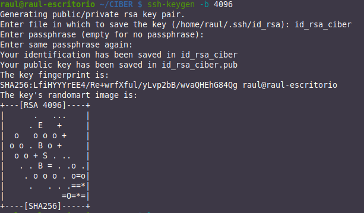


  + Para copiar la clave pública al servidor, podemos hacerlo manualmente o utilizando SSH (más fácil):
  
    + Utilizando SSH:
  
        `ssh-copy-id usuario_servidor@IP_servidor` 

    + Manualmente:
     
        Copiáis el valor de la clave.
     
        `cat ~/.ssh/id_rsa_ciber.pub`

        Hacéis login por SSH al servidor y copiáis ese valor de la clave en el siguiente archivo (creadlo si no existe):

        `/home/vuestro_usuario/.ssh/authorized_keys`


Si tuvieráis algún problema de permisos, podéis poner los permisos adecuados a los directorios con los siguientes comandos:

```bash
chmod 700 ~/.ssh
chmod 600 ~/.ssh/authorized_keys
```
!!!task "Tareas"
     + Comprobad, adjuntando una captura de pantalla, que a la hora de iniciar ahora la sesión SSH contra el servidor os pide un password. Se trata del password de la clave privada.
     + Comprobad, adjuntando una captura de pantalla, que en las sucesivas sesiones SSH (abrís otra pestaña, salís y volvéis a entrar en la sesión, cerráis y abrís el terminal…), no os vuelve a pedir ninguna contraseña y hace login automáticamente.
      
        ✔ Sólo hay que introducir el password una vez, una vez hecho esto la clave queda descifrada en la RAM para poder hacer uso de ella.

Cuando repitamos toda esta operación con Windows, podemos utilizar o WSL2 o bien un cliente nativo de Windows, pudiendo elegir entre toda la miríada de ellos.

En cualquier, para el más típico de ellos, *PuTTY*, podemos seguir el siguiente tutorial para la configuración de las claves, no siendo excluyente la utilización de cualquier otro.

## Protección con sshguard

Los servidores expuestos a Internet suelen sufrir con gran frecuencia **ataques por fuerza bruta**. Un ataque por fuerza bruta sobre SSH consiste en intentar iniciar sesión en el sistema con todas las combinaciones de nombres y contraseñas posibles.

Se deben tomar las precauciones adecuadas para evitar que se produzca un acceso no autorizado al sistema mediante este ataque.

Es muy famoso el uso de *fail2ban* para protegernos frente a esto. Sin embargo en esta práctica utilizaremos [sshguard](https://wiki.archlinux.org/title/Sshguard_(Espa%C3%B1ol)) ya que admite fácilmente la integración con *systemd*, además de con múltiples firewalls diferentes. Además, está escrito en C, por lo que es mucho más ligero.

Con *sshguard*, cuando se realizan un número (establecido en la configuración) de intentos de autenticación fallidos en el sistema, se bloquea la dirección IP desde donde se está llevando a cabo el ataque.

Procedamos pues a instalar y configurar *sshguard*.

!!!danger "¡Atención!"
    Podríamos protegernos contra ataques de fuerza bruta con claves erróneas pero es un escenario que rara vez se producirá. Lo que realmente queremos es protegernos de los ataques de diccionario con diferentes contraseñas.

    Puesto que anteriormente hemos configurado el servicio para que la autenticación se produzca usando claves, vamos a desactivar este tipo de autenticación temporalmente hasta que hayamos configurado y comprobado el funcionamiento de *sshguard*.

    Basta con añadir esta directiva al archivo de configuración de ssh: `PubkeyAuthentication no`

    ***Recuerda reactivar la autenticación con claves al acabar con la parte de sshguard***

### Instalación de *sshguard*

En primer lugar actualizamos los repositorios:

`sudo apt update`

Instalamos el paquete de sshguard.

`sudo apt install sshguard`

Comprobamos que el servicio funciona sin problemas:

`systemctl status sshguard`

### Configuración de *sshguard*

Lo primero que debemos hacer es instalar algún firewall que bloquee las IPs que *sshguard* le indique cuando sea necesario. Procedamos con el clásico y archiconocido ***iptables*** si no lo tuvieráis instalado todavía:

```bash
sudo apt install sshguard
```

Y le decimos al firewall que todo el tráfico que le entre con el puerto destino TCP 22 (SSH), lo redirija a la cadena sshguard que creamos en el primer paso y que es donde se introducirán las reglas de bloqueo pertinente:

```bash
sudo iptables -N sshguard
sudo iptables -A INPUT -m multiport -p tcp --destination-ports 8022 -j sshguard
sudo iptables-save > /home/raul/iptables.rules
```

El archivo de configuración de este servicio se llama *sshguard.conf* y lo encontraréis en el siguiente directorio: `/etc/sshguard`

*Sshguard* se basa en revisar los logs en busca de registros de intentos de login fallidos. Si detecta más de *X* intentos fallidos en *Y* tiempo (ambas cosas configurables), introduce una regla en el firewall para bloquear a la IP origen de esos ataques.

<u>Existe un error conocido de *sshguard*</u> como es que también busca en sus propios logs intentos fallidos de login, haciendo que cada vez que registra un intento erróneo, lo vuelve a detectar y a registrar en un bucle que continúa hasta que se bloquea la IP.[^2]

[^2]: [Parece estar solucionado](https://bugs.launchpad.net/ubuntu/+source/sshguard/+bug/1881459)

¿En qué se traduce esto? Pues que con un único intento fallido de login SSH, que puede ser no intencionado (me he equivocado al poner el password), se bloqueará la IP origen.

+ Para solucionarlo, en el archivo de configuración debemos cambiar el valor del parámetro LOGREADER` para que quede así:

    ```bash
    LOGREADER="LANG=C.UTF8 /bin/journalctl -afb -p info -n1 -o cat -t sshd
    ```

+ Además, aunque sshguard permite utilizar múltiples firewalls como ya hemos dicho, vamos a utilizar **iptables**. Para ello hay que cambiar el valor del parámetro BACKEND para que quede así:
    
    ```bash
    BACKEND="/usr/libexec/sshguard/sshg-fw-iptables"
    ```
En definitiva, el fichero sshguard.conf debe quedar así

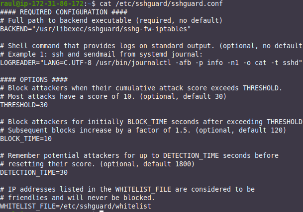


Donde, aparte de lo ya dicho:

+ **THRESHOLD:** cada ataque tiene un valor de peligrosidad (normalmente 10). El threshold es el valor acumulado de esos ataques que se ha de superar para bloquear la IP.
+ **BLOCK_TIME:** es el tiempo (en segundos) durante el que se bloquea una IP.
+ **DETECTIONS_TIME:**el tiempo (en segundos) dentro del cual se van acumulando el valor de los ataques que se producen (si la suma supera al threshold, se bloquea la IP).

Así las cosas, lo que hemos configurado es lo siguiente:

  1. Si en un periodo de 30 segundos (*DETECTION_TIME*) se producen una serie de ataques que, sumando su peligrosidad, superen el valor 30 (*THRESHOLD*), se bloqueará la IP durante 10 segundos (*BLOCK_TIME*).
   
  2. Cabe decir que si la IP insiste, cada nueva vez que se vuelva a bloquear, lo hará durante el doble de tiempo que la anterior ocasión (primero 10s, luego 20s, luego 40s…)
   
!!!task "Comprobación"
    Conéctate por SSH al servidor desde tu terminal Linux: `ssh usuraio@servidor`

    O desde Putty en Windows.

    Ejecuta el siguiente comando para ver los logs de *sshguard* en tiempo real: `journalctl -u sshguard -f`

    Ahora, desde el cliente, intenta conectarte por SSH al servidor pero introduciendo un nombre de usuario incorrecto o una contraseña incorrecta.

     + En los logs aparecerán estos intentos de conexión como ataques y se informará del bloqueo de esa IP. Adjunta captura de pantalla.
     + Además, comprueba desde el cliente que, efectivamente, se te ha bloqueado el acceso y no te deja hacer un SSH al servidor. Adjunta captura de pantalla.

!!!tip "Notas importantes"
    Si en un principio ssguard no bloquea las IP, es posible que haya que informar al firewall con los siguientes comandos:
    ```bash
    iptables -N sshguard
    iptables -A INPUT -m multiport -p tcp --destination-ports 8022 -j sshguard
    ```

    Si sshguard, por lo que sea, os bloquea la IP permanentemente y no la desbloquea al cabo del tiempo que os indica, la podéis desbloquear a mano con el siguiente comando:

    ```bash
    sudo iptables -F sshguard
    ```

### ¿Qué es la autenticación multifactor?

La autentificación multifactor (MFA) es un método en el que se proporciona acceso a un sistema o servicio solo después de que puedas demostrar que efectivamente eres tú quien dices ser. Lo harás presentando dos o más evidencias (o factores).

Estos pueden ser una contraseña que tenga un código de verificación secundario, un certificado digital instalado en el equipo, una pregunta personal, etc. Está claro que cuantas más capas de protección pongas mejor vas a poder proteger tus cuentas.

Normalmente se suelen compaginar los siguientes factores:

+ **Algo que conozco:** una contraseña, respuesta a una pregunta, un PIN, etc.
+ **Algo que obtengo:** una notificación que recibo en el móvil, un código de seguridad, etc.
+ **Algo único que tengo:** en este caso es la biometría, como tu huella digital y/o el reconocimiento facial.

### ¿Cómo vamos a implementar la MFA?

Vamos a partir de la práctica anterior, donde ya podemos conectarnos por SSH a nuestro servidor.

Necesitaremos instalar en nuestro móvil la aplicación **Google Authenticator**.

## Instalación y configuración de MFA para OpenSSH

Ahora que ya hemos configurado SSH para no necesitar introducir el password cada vez que hagamos login, vamos a implementar el 2FA o segundo factor de autenticación para mayor seguridad. 

Esto es lo que se conoce como hacer *hardening* o fortificación de servidores.

!!!warning "Atención"
    Vamos a conectarnos por SSH al servidor y vamos a realizar toda la configuración de esta práctica estando conectados por SSH.
    
    Si necesitáis hacer pruebas de nuevas conexiones, podéis abrir otra pestaña del terminal sin desconectaros.

Los pasos que se deben seguir son los siguientes:

1. Hacer un update del sistema
    ```bash
    sudo apt update
    ```
2. Instalar el módulo de autenticación de Google para Ubuntu
    ```bash
    sudo apt install libpam-google-authenticator
    ```
3. Una vez instalado, se ejecuta
    ```bash
    google-authenticator
    ```
 
    y os irá haciendo una serie de preguntas que debéis responder. La primera os pregunta si el código debe de cambiar aleatoriamente en el tiempo, a lo cual debéis responder sí. Os generará el código QR que debéis escanear con el móvil y los códigos de recuperación.

    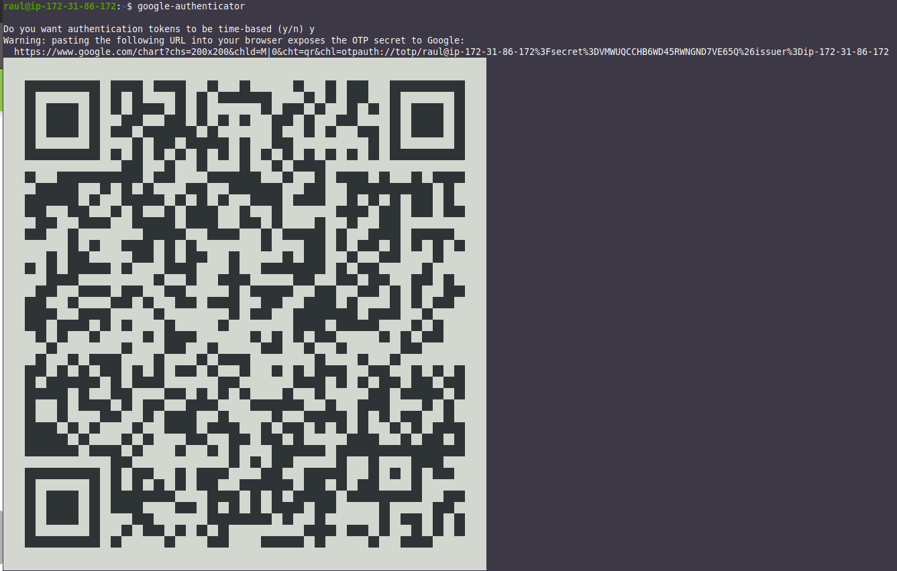{: style="height:570px;width:800px"}

4. En la app Google-authenticator debéis darle al icono ***+*** y luego escanear el código QR que os ha aparecido antes
    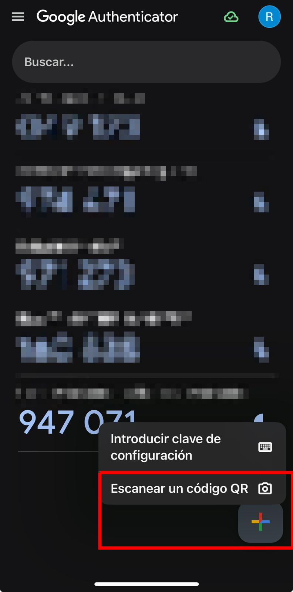{: style="height:370px;width:200px"}
5. La siguiente os pregunta si queréis que actualice automáticamente el achivo google_authenticator, cosa necesaria para que funcione el 2FA, ergo debéis responder sí nuevamente
    
6. En la siguiente pregunta, al responder que sí, le indicáis que el código que uséis caduque en ese mismo instante. Esto quiere decir que sólo se podrá realizar un login cada 30 segundos pero aumentará la protección frente a ataques automatizados
    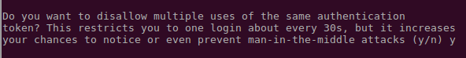
7. Por defecto los códigos se generan cada 30 segundos, dejando un pequeño margen temporal donde el código anterior y el posterior seguirán siendo válidos. Esto es para compensar ciertos desajustes temporales entre la hora del servidor y del cliente.
    Aquí responderemos que no pues este margen es suficiente y podría comprometer la seguridad del aumentarlo
    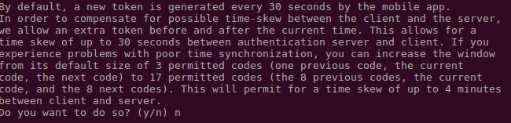
9.  Para proteger nuestro servidor contra ataques de fuerza bruta responderemos que sí a la pregunta de permitir un máximo de 3 intentos de login cada 30 segundos
    

### Configurar OpenSSH
!!!warning "Nota importante"
    Puesto que vamos a realizar cambios para SSH estando conectados por SSH, es muy importante no cerrar nunca la conexión SSH inicial para no correr el riesgo de perder el acceso al servidor.

Para hacer pruebas, estableceremos una nueva conexión SSH y cuando comprobemos que todo funciona, podrán cerrarse todas las sesiones.

Ahora debemos configurar el servicio de autenticación de Linux para que sea consciente de que puede utilizar la autenticación de Google. Editamos `/etc/pam.d/sshd`

Y añadiremos al final del archivo la línea

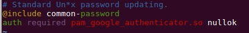

El “nullok” del final sirve para indicarle al mecanismo de autorización centralizado de Linux, PAM (Pluggable Authentication Modules) que este método de autenticación es opcional. De esta forma permitiremos que los usuarios que no utilicen el 2FA, puedan seguir haciendo login todavía usando sus claves.

A continuación debemos configurar el archivo de configuración del servicio SSH para que soporte este tipo de autenticación, editando el archivo `/etc/ssh/ssdh_config` para añadir:

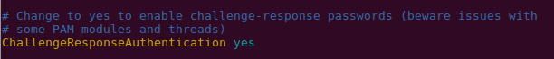

Guardamos el archivo y reiniciamos el servicio: `systemctl restart sshd`

### Haciendo que SSH sea consciente de la autenticación multifactor

Reabrimos el archivo de configuración del servicio ssh `/etc/ssh/sshd_config`

Y añadimos esta línea al final del archivo, para indicarle al SSH que métodos de autenticación se requieren. Esto le indica a SSH que necesitamos o una clave SSH, o un password o un código de verificación (o las tres cosas)

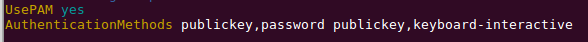

Cerramos y guardamos este archivo. Ahora volvemos a abrir el archivo de configuración de PAM `/etc/pam.d/sshd`

Debemos buscar y comentar la línea indicada para decirle a PAM que no muestre la opción de introducir password

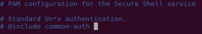

Guardamos y cerramos el archivo. Acto seguido reiniciamos el servicio `systemctl restart sshd`

Ahora debéis intentar hacer login de nuevo en el server. En esta ocasión debería pediros el código de verificación.

Este código de verificación es el que aparece en Google-authenticator cada 30 segundos, así que deberéis consultarlo en el móvil, introducirlo y si todo va bien, estaréis logueados.

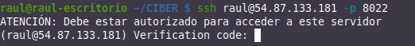

A pesar de que no se explicita, se han usado tanto las claves SSH como el código de verificación, es decir, dos factores. Para verificarlo, haced el ssh con la opción -v (de verbose) para poder comprobarlo

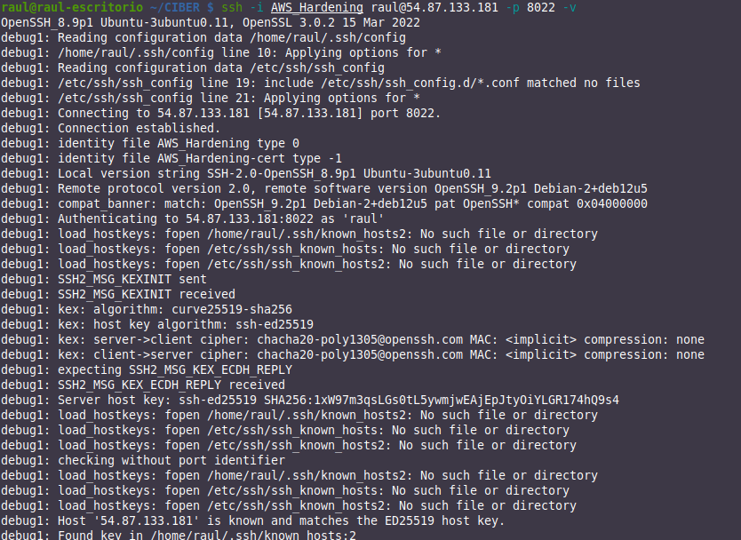
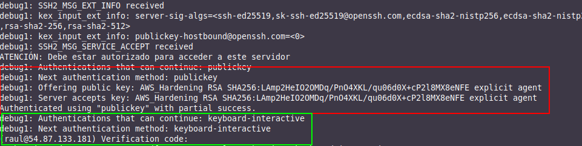

En el **recuadro rojo** podéis ver que se produce la **autenticación mediante claves**, resultando en una autenticación parcial.

Quedaría la segunda parte, que se corresponde con la parte configurada como interactiva con el teclado (keyboard-interactive), que no es mas que introducir el **código temporal de Google-authenticator**, como os dice en el fragmento **recuadrado en verde**.

!!!task "Tarea"
    Comprueba que te funciona este doble factor de autenticación.

    Adjunta unas capturas de pantallas, utilizando la opción “-v” e indica, recuadrándolo, dónde se puede ver que ha utilizado ambos factores de autenticación.

### Añadiendo un tercer factor de autenticación

En la fase 3 hemos listado varios tipos de autenticación permitidas, en el archivo de configuración sshd_config:
+ Claves públicas (publickey)
+ Password (password publickey)
+ Código de verificación (keyboard-interactive)

Pero a pesar de ello, sólo hemos permitido el login mediante clave pública + código de verificación.

Si quisiéramos tener los tres factores, se podría realizar con un cambio rápido. Simpleente habría que descomentar la línea que hemos comentado antes en el archivo `/etc/pam.d/sshd`

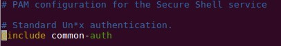

Y reiniciar el servicio.

Después de esto, al intentar hacer el ssh, nos pedirá el password además del código de verificación.

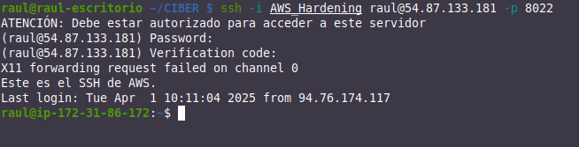

!!!task "Tarea"
    Comprueba  que te funciona  correctamente el login con  los tres factores de autenticación.
    
    Adjunta una captura con la opción “-v” donde indiques, con un recuadro, dónde se están utilizando cada uno de los tres factores.

## Referencias

[SSHGUARD](https://wiki.archlinux.org/title/Sshguard#)