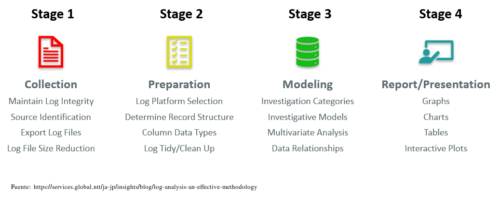

# Introducción

El análisis de logs es el proceso de revisar logs de eventos generados por un computador para, de este forma, identificar de forma proactiva bugs, amenazas de seguridad u otros riesgos. El análisis de logs puede usarse en un espectro más amplio, como por ejemplo el cumplimiento de determinadas normativas o revisar comportamientos de los usuarios.

Un log es un archivo que captura toda actividad dentro del sistema operativo, aplicación software o dispositivo. Estos archivos documentan atuomáticamente cualquier información designada por los administradores de sistemas, incluyendo:

* Mensajes
* Reportes de error
* Peticiones de archivo
* Transferencia de archivos
* Peticiones login/logout

De igual manera la actividad viene marcada con fecha y hora, lo que ayuda a los profesionales a mantener una traza del evento en cuestión.

## ¿Por qué es importante el análisis de los logs?

En muchos casos, por una cuestión legal. Las organizaciones se deben adherir a una regulación específica que dicta como se almacena y analizan los datos.

Mas allá de los requerimientos legales, el análisis de los, cuando se hace de forma eficaz, puede proporcionar difernetes beneficios para el negocio. A continuación vemos algunos.

### Un mejor troubleshooting 

Las organizaciones que revisan y analizan regularmente los logs suelen ser capaces de identificar errores con mayor rapidez. Con una herramienta avanzada de análisis de logs, la empresa puede incluso ser capaz de localizar los problemas antes de que se produzcan, lo que reduce en gran medida el tiempo y el coste de remediación.

El log también ayuda al analizador de logs a revisar los eventos que llevan al error, lo que puede hacer que el problema sea más fácil de solucionar (troubleshooting), así como de prevenir en el futuro.

### Mejora de la seguridad

Un análisis eficaz de los logs refuerza considerablemente las capacidades de ciberseguridad de la organización. La revisión y el análisis periódicos de los logs ayudan a las organizaciones a detectar con mayor rapidez las anomalías, contener las amenazas y priorizar las respuestas.

### Experiencia de usuario mejorada

El análisis de logs ayuda a las empresas a garantizar que todas las aplicaciones y herramientas orientadas al cliente estén plenamente operativas y seguras. La revisión coherente y proactiva de los eventos de logs ayuda a la organización a identificar rápidamente las interrupciones o incluso a prevenir dichos problemas, mejorando la satisfacción y reduciendo la rotación de personal.

## ¿Cómo se realiza el análisis de logs?

El análisis de logs suele realizarse en un sistema de gestión de logs, una solución de software que recopila, clasifica y almacena datos de log y logs de eventos de diversas fuentes.


La plataforma de gestión de logs permite al equipo informático y a los profesionales de la seguridad establecer un único punto desde el que acceder a todos los datos relevantes de puntos finales, redes y aplicaciones. Normalmente, este archivo de log está totalmente indexado y permite realizar búsquedas, lo que significa que el analizador de logs puede acceder fácilmente a los datos que necesita para tomar decisiones sobre la salud de la red, la asignación de recursos o la seguridad.

La actividad suele incluir:

**Ingestión:** Instalación de un recolector de logs para recopilar datos de diversas fuentes, como el sistema operativo, las aplicaciones, los servidores, los hosts y cada punto final, en toda la infraestructura de red.

**Centralización:** Agregación de todos los datos de log en una única ubicación, así como en un formato estandarizado independientemente de la fuente de log. Esto ayuda a simplificar el proceso de análisis y a aumentar la velocidad a la que se pueden aplicar los datos en toda la empresa.

**Búsqueda y análisis:** Aprovechamiento de una combinación de análisis de logs habilitados por IA/ML y recursos humanos para revisar y analizar errores conocidos, actividades sospechosas u otras anomalías dentro del sistema. Dada la gran cantidad de datos disponibles en el log, es importante automatizar tanto como sea posible el proceso de análisis del archivo de log. También se recomienda crear una representación gráfica de los datos, mediante gráficos de conocimiento u otra técnica, para ayudar al equipo de TI a visualizar cada entrada del log, su cronología e interrelaciones.

**Supervisión y alertas:** El sistema de gestión de logs debe aprovechar el análisis avanzado de logs para supervisar continuamente el log de cualquier evento de log que requiera atención o intervención humana. El sistema puede programarse para que emita alertas automáticamente cuando se produzcan determinados eventos o no se cumplan determinadas condiciones.

**Informes:** Por último, el LMS debe proporcionar un informe racionalizado de todos los eventos, así como una interfaz intuitiva que el analizador de logs pueda aprovechar para obtener información adicional del log.
Las limitaciones de la indexación



Muchas soluciones de software de gestión de logs se basan en la indexación para organizar el log. Aunque en el pasado se consideraba una solución eficaz, la indexación puede ser una actividad muy costosa desde el punto de vista informático, lo que provoca latencia entre los datos que entran en un sistema y los que se incluyen en los resultados de búsqueda y las visualizaciones. A medida que aumenta la velocidad a la que se producen y consumen los datos, ésta es una limitación que podría tener consecuencias devastadoras para las organizaciones que necesitan una visión en tiempo real del rendimiento y los eventos del sistema.

Además, con las soluciones basadas en índices, los patrones de búsqueda también se definen en función de lo que se ha indexado. Esta es otra limitación crítica, sobre todo cuando se necesita una investigación y no se pueden buscar los datos disponibles porque no se han indexado correctamente.

Las soluciones líderes ofrecen búsqueda de texto libre, que permite al equipo de TI buscar en cualquier campo de cualquier log. Esta capacidad ayuda a mejorar la velocidad a la que el equipo puede trabajar sin comprometer el rendimiento.

## Métodos de análisis de logs

Dada la enorme cantidad de datos que se crean en el mundo digital actual, a los profesionales de TI les resulta imposible gestionar y analizar manualmente los logs de un entorno tecnológico en expansión. Por ello, necesitan un sistema avanzado de gestión de logs y técnicas que automaticen los aspectos clave de los procesos de recopilación, formateo y análisis de datos.

Estas técnicas incluyen:

**Normalización**

La normalización es una técnica de gestión de datos que garantiza que todos los datos y atributos del log de transacciones, como direcciones IP y marcas de tiempo, tengan un formato coherente.

**Reconocimiento de patrones**

El reconocimiento de patrones se refiere al filtrado de eventos basado en un libro de patrones con el fin de separar los eventos rutinarios de las anomalías.
 
**Clasificación y etiquetado**

La clasificación y el etiquetado es el proceso de etiquetar los eventos con palabras clave y clasificarlos por grupos para poder revisar juntos los eventos similares o relacionados.

**Análisis de correlación**

El análisis de correlación es una técnica que recopila datos de log de varias fuentes diferentes y revisa la información en su conjunto mediante el análisis de logs.

**Ignorancia artificial**

La ignorancia artificial se refiere a la desatención activa de entradas que no son materiales para la salud o el rendimiento del sistema.

## ELK Stack

La pila ELK (ELK stack) es una colección de tres productos de código abierto: Elasticsearch, Logstash y Kibana. La pila ELK proporciona logs centralizados para identificar problemas con servidores o aplicaciones. Permite buscar todos los logs en un único lugar. También ayuda a encontrar problemas en varios servidores mediante la conexión de logs durante un período de tiempo específico.

* E de ElasticSearch: se utiliza para almacenar logs, permitiendo su ingesta así como búsquedas e indexación.
* L significa LogStash: se utiliza tanto para el envío como para el procesamiento y almacenamiento de logs. Ofrece unificación de datos de diferentes fuentes.
* K significa Kibana: es una herramienta de visualización (una interfaz web) que se aloja a través de Nginx o Apache. Está especializado en grandes volúmenes de datos, así como datos en tiempo real.
  
Posteriormente un cuarto producto se ha añadido, [**Beats**](https://www.elastic.co/es/beats/), que gestiona los agentes que recopila y envía sus logs a ELK desde cada máquina.

ElasticSearch, LogStash y Kibana son desarrollados, gestionados y mantenidos por la empresa Elastic.

ELK Stack está diseñado para permitir a los usuarios tomar datos de cualquier fuente, en cualquier formato, y buscar, analizar y visualizar esos datos en tiempo real.

### Arquitectura de ELK

Una arquitectura típica de ELK:


## ¿Qué es Elasticsearch?

Elasticsearch es una base de datos NoSQL. Está basada en el motor de búsqueda Lucene, y está construida con RESTful APIS. Ofrece un despliegue sencillo, máxima fiabilidad y fácil gestión. También ofrece consultas avanzadas para realizar análisis detallados y almacena todos los datos de forma centralizada. Es útil para ejecutar una búsqueda rápida de los documentos.

Elasticsearch también permite almacenar, buscar y analizar grandes volúmenes de datos. Se utiliza sobre todo como motor subyacente para potenciar aplicaciones que completan los requisitos de búsqueda. Se ha adoptado en plataformas de motores de búsqueda para aplicaciones web y móviles modernas. Además de una búsqueda rápida, la herramienta también ofrece análisis complejos y muchas funciones avanzadas.

                                                                         

### Términos utilizados en Elastic Search

| Término   | Uso                                                                                                                                                                                                                                                                                    |
|-----------|----------------------------------------------------------------------------------------------------------------------------------------------------------------------------------------------------------------------------------------------------------------------------------------|
| Cluster   | Un cluster es una colección de nodos que juntos almacenan datos y proveen capacidades de indexación y búsqueda.                                                                                                                                                                        |
| Nodo      | Un nodo es una instancia de elasticsearch. Se crea cuando se inicia una instancia de elasticsearch.                                                                                                                                                                                    |
| Índice    | Un índice es una colección de documentos que tienen características similares, por ejemplo, datos de clientes, catálogo de productos. Es muy útil cuando se realizan operaciones de indexación, búsqueda, actualización y borrado. Permite definir tantos índices en un mismo cluster. |
| Documento | Es la unidad básica de información que se puede indexar. Se expresa en un par JSON (clave: valor). '{"usuario": "nullcon"}'. Cada Documento está asociado a un tipo y a un id único.                                                                                                   |
| Shard     | Cada índice puede dividirse en varios shards para poder distribuir los datos. El shard es la parte atómica de un índice, que se puede distribuir por el cluster si se quieren añadir más nodos.                                                                                        |

## ¿Qué es Logstash?

Logstash es la herramienta de canalización de recopilación de datos. Recoge entradas de datos y las alimenta hacia Elasticsearch. Reúne todo tipo de datos de diferentes fuentes y los pone a disposición para su uso posterior.

Logstash puede unificar datos de fuentes dispares y normalizar los datos en los destinos deseados. Permite limpiar y democratizar todos los datos para la analítica y la visualización de casos de uso.

Consta de tres componentes:

+ **Entrada:** pasar los logs para procesarlos a un formato comprensible para la máquina.
+ **Filtros:** Es un conjunto de condiciones para realizar una determinada acción o evento
+ **Salida:** Toma de decisiones para el evento o registro procesado

## ¿Qué es Kibana?

Kibana, como comentábamos, es un visualizador de datos que completa la pila ELK. El panel de control de Kibana ofrece varios diagramas interactivos, datos geoespaciales y gráficos para visualizar consultas complejas.

Se puede utilizar para buscar, ver e interactuar con los datos almacenados en los directorios de Elasticsearch. Kibana le ayuda a realizar análisis de datos avanzados y visualizar sus datos en una variedad de tablas, gráficos y mapas.


### ¿Para qué es adecuado ELK?

#### Cuando existe una falta de consistencia

Tenemos muchos dispositivos con logs, y dentro de nuestros servidores, por ejemplo, tenemos distintos servicios funcionando y cada servicio tiene un tipo de log distinto. Los administradores de sistemas y DevOps genéricamente, o administradores web o desarrolladores, necesitan acceder a dichos logs para comprobarlos, para lo que hay una gran dificultad, ya que los formatos varían y son difíciles de entender.

#### Existen diferentes formatos de tiempo

Cada log puede venir con un formato de tiempo distinto.

En algunos logs se incluye la fecha, otros vienen con timestamp, otros con la hora al finalizar, etc.

Ejemplo:

```log
Oct 04 12:15:21, 020289 07:23:24, 150260505
```

#### Descentralizado

Los logs se encuentran repartidos en todos los servidores que tengamos, cada servidor puede tener un tipo de log y dentro de un servidor puede haber diferentes rutas donde encontrarlos. Un administrador de sistemas, si tiene pocos servidores que administrar, puede acceder a ellos por “ssh + grep”, pero si tiene muchos más, esta opción no es escalable.

#### Falta de conocimientos

Falta de conocimientos o que no se implementan bien las políticas. Pueden deberse a varios motivos, por ejemplo: Las personas que tienen que acceder a un log no tienen permiso para acceder al mismo, por políticas de empresa.

Estas personas no tienen experiencia para entender una línea de log. Algunos logs que tienen mucha información incluida en campos y cuando la información es tanta, a veces es complicado saber a qué representa cada número o cadena de texto.

Desconocen dónde se encuentran los logs, cómo se actualizan, cómo se van repartiendo, si se van borrando cada día…

## Referencias

[Elastic Stack (ELK Stack) ](https://www.techtarget.com/searchitoperations/definition/Elastic-Stack)

[ELK Stack Tutorial: What is Kibana, Logstash & Elasticsearch?](https://www.guru99.com/elk-stack-tutorial.html)

[¿Qué es la pila ELK?](https://aws.amazon.com/es/what-is/elk-stack/)

[¿QUÉ ES ELK? ElasticSearch, Logstash y Kibana](https://openwebinars.net/blog/que-es-elk-elasticsearch-logstash-y-kibana/)