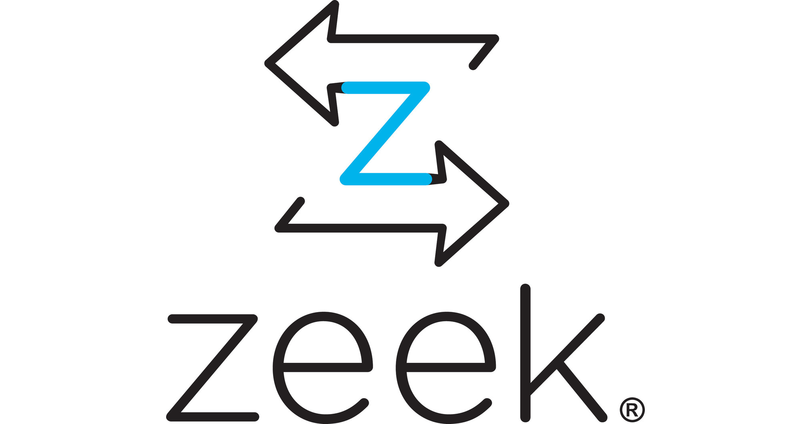

## Introducción

Como parte de nuestra estrategia Blue Team ya hemos visto técnica tales como el análisis de logs de forma *clásica*, con herramientas como Elastic Stack, además de utilidades como los IDS/IPS.

En este caso vamos a ver una herramienta que aglutine a varias de las anteriores. Estamos hablando de **Security Onion**, una distribución de Linux que nos permitiría fácilmente poder montar un SOC.

{: style="height:175px;width:150px"}

Tal y como podemos leer en su [documentación](https://docs.securityonion.net/en/2.3/about.html):

!!!quote
    Security Onion is a free and open platform for threat hunting, enterprise security monitoring, and log management. It includes our own tools for Alerts, Dashboards, Hunt, PCAP, and Cases as well as other tools such as Playbook, FleetDM, osquery, CyberChef, Elasticsearch, Logstash, Kibana, Suricata, Zeek, and Wazuh. 

Como vemos, Security Onion agrupa herramientas bien conocidas de terceros, como otras propias. De las conocidas ya hemos hablado de Suricata o ELK pero echemos un vistazo rápido a otras:

### Zeek

Hasta 2018 Zeek fue conocido con el nombre de **Bro**. 

{: style="height:175px;width:400px"}

Zeek es un una herramienta de código abierta que realiza un análisis de red pasivo. Utiliza y visualiza grandes cantidades de metadatos de la red para tener una visión de alto nivel. Para cada flujo de tŕafico, los metadatos tipicos constan de una tupla de 5 parámetros: IPs, protocolo, puertos. Pero también se hacen servir atributos específicos del tráfico que permita a los analistas entrar más en detalla como información DNS, detalles del cifrado TLS o información de capa 7.

#### Suricata/Snort vs Zeek

Suricata/Snort pueden o bien inspeccinar el tráfico de forma pasiva o bloquearlo de forma. Todo ello en función de unas alertas basadas en reglas.

Zeek es un analizador de tráfico que puede extraer información para su posterior disección con el fin de investigar una sucesión de acontecimientos. Genera varios tios de logs (conn, http, ssl...) y provee, como ya hemos dicho, todos los detalles de las conexiones realizadas.

### Wazuh

Wazuh es una plataforma gratuita y de código abierto que se usa para prevención de amenazas, detección y respuesta. Es capaz de ofrecer protección en enteorno on-premise, virtualizados, contenerizados o en cloud.

{: style="height:175px;width:300px"}

Wazuh consta de un agente de seguridad para un endpoint, desplegado para monitorizar los sitemas y un server de gestión o administración, que recolecta y analiza los datos que recopila de todos los agentes. Además, Wazuh tiene integración completa con Elastic Stack, proporcionando un mecanismo de búsqueda y visualización que permite a los usuarios navegar a través de sus alerta de seguridad.-

Para ver en detalle las capacidades de Wazuh, podéis consultar su [GitHub](https://github.com/wazuh/wazuh#wazuh-capabilities).

### CyberChef

{: style="height:175px;width:300px"}

Aunque ya lo hemos usado anteriormente, la mejor forma de definir Cyberchef es acudir directamente a sus creadores:

!!!quote
    A simple, intuitive web app for analysing and decoding data without having to deal with complex tools or programming languages. CyberChef encourages both technical and non-technical people to explore data formats, encryption and compression.

### Resto de herramientas de Security Onion

La mejor forma de descubrir las herramientas que integra Security Onion es acudir directamente a su [documentación](https://docs.securityonion.net/en/2.3/introduction.html)

## Demostración práctica

Investigación de un caso de exfiltración de datos haciendo uso de Security Onion.