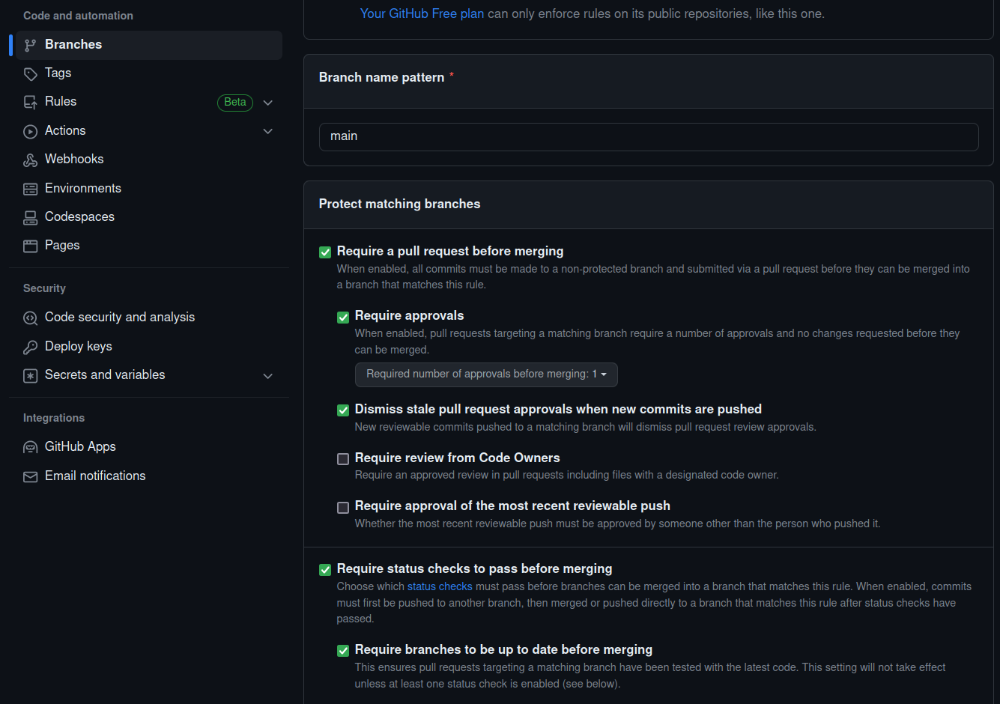
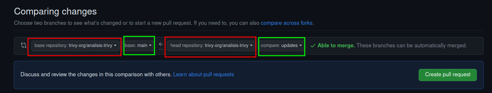
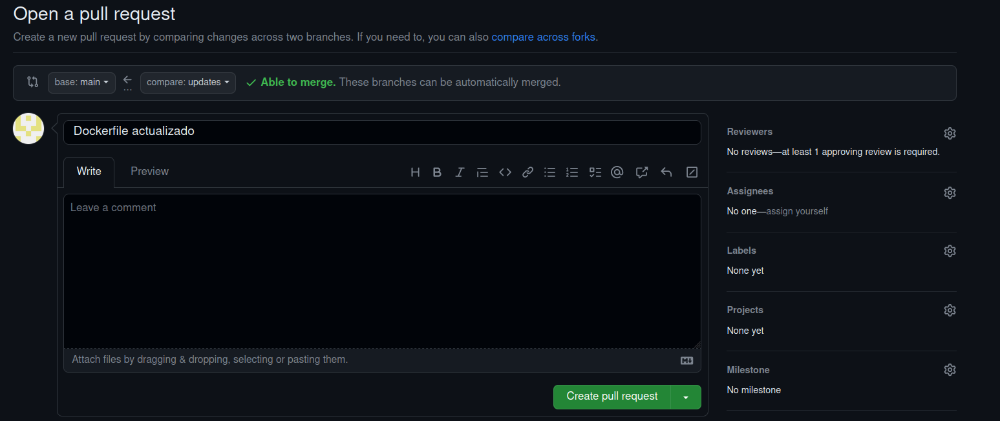
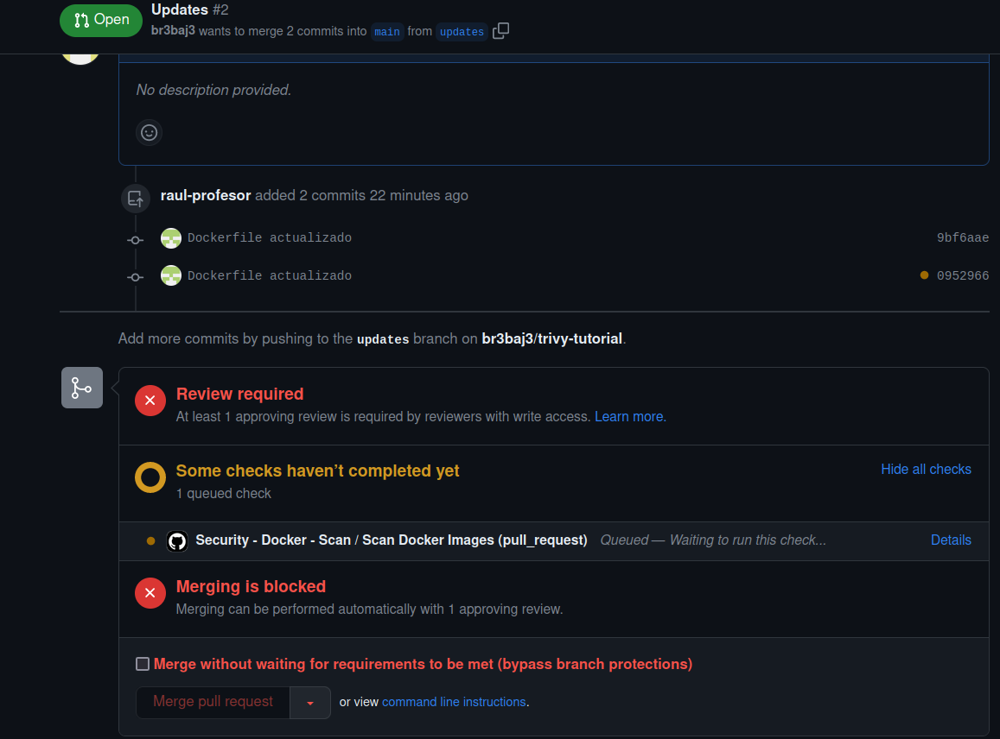
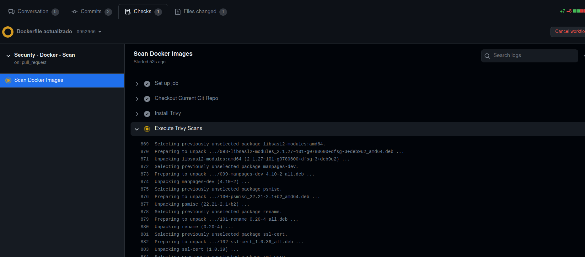
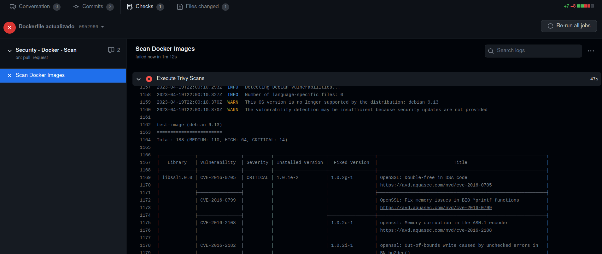

## Introducción

A medida que las aplicaciones cada vez más van cambiando su infraestructura a una basada en contenedores, más se va haciendo evidente que hay que auditar estos contenedores en búsqueda de vulnerabilidades.

En esta sección usaremos Trivy para auditar imágenes de contenedores y, además, veremos como integrar Trivy con Github Actions para que se produzca un escaneo automático de la imagen cada vez que esta se construya. Además, gracias a ello, veremos cómo prevenir que imágenes vulnerables pasen a producción.

### ¿Qué es Trivy?

Trivi es un sencillo, rápido y completo escáner de vulnerabilidades para contenedores, muy adecuado para la integración continua y DevSecOps. Esta herramienta detecta vulnerabilidades en los paquetes de los sistemas operativos, sea éste Alpine, RHEL, Debian, Ubuntu, Amazon Linux o lo que proceda, además de en ependencias de aplicaciones (Node, Ruby, Python, Java...).

Debido a la rapidez de Trivy, podemos integrarlo fácilmente de forma directa en nuestros workflows de desarrollo. Dicho de otro modo, en cuánto un desarrollador actualice el código, éste puede ser escaneado en tiempo real en búsqueda de vulnerabilidades.


### NIST CSF y Trivy

Este framework consta de tres componentes principales, el Core, los niveles de implementación (Tiers) y los Perfiles. El core, que es lo que se muestra en la siguiente imagen, contiene las mejores prácticas a alto nivel para ciberseguridad y manejo del riesgo, en general.

{: style="height:355px;width:475px"}

Trivy se centra en las funciones de identificación y protección, principalmente. Además, este framework define categorías para cada función y Trivy de nuevo se centra en dos de ellas, manejo del riesgo y procesos y proedimientos para la protección de la información.

Así las cosas, Trivy nos ayudará a identificar y documentar las vulnerabilidades de nuestros activos (contenedores) y, mediante su integración con Github Actions, podremos controlar los controles de cambios:

{: style="height:425px;width:825px"}

## Demostración 1

!!!info 
    Esta demostración ha sido realizada con Debian 11 Bullseye y se ha comprobado que funciona correctamente.

Para esta demostración el primer paso es, como cabía esperar, instalar Trivy. Para ello:

1. Debéis clonaros en vuestra máquina virtual el repositorio: `https://github.com/trivy-org/analisis-trivy`

2. Si echamos un ojo al script `install.sh` vemos que:
      1. Obtiene el nombre de la distribución
      2. Instala Trivy y las dependencias necearias
      3. También instala `container-diff` para inspeccionar y detectar imágenes que hayan sido manipuladas 
      4. Se instala Docker en caso de que sea necesario porque no esté instalado ya
3. Ejecutamos el script de instalación y comprobamos que Trivy se ha instalado correctamente

Comencemos pues con la demo propiamente dicha. Podemos ver que Trivy tiene multitud de opciones, como escaneo de imágenes, de sistema de archivos local, repositorio remoto...:

```console
$ trivy --help
```
No obstante, en nuestro caso nos centraremos únicamente en el escaneo de imágenes Docker. Escaneemos una imagen de Docker Hub a modo de ejemplo:

```console
$ trivy image zachroofsec/trivy-tutorial1
```

+ En primer lugar vemos que Tivy se queja de que estamos usando el tag `latest`. Para nuestros propósitos no hay problema alguno puesto que no estamos cambiando nada de las capas subyacentes de la imagen, más adelante ya nos preocuparemos de esto.

+ Vemos que Trivy nos informa de más de mil vulnerabilidades en el momento en que se escriben estos apuntes. De locos. Inabarcable.

    

!!!task "Tarea"
    Explorar en la ayuda de Trivy los flags que se pueden usar en la línea de comandos para escanear imágenes:

    ```console
    $ trivy image --help
    ```
    Y realizar un escaneo más sensato y priorizando vulnerabilidades. Esto incluye que se reporten únicamente las vulnerabilidades CRITICAL y HIGH, así como que se ignoren aquellas que no tengan una solución conocida. Comprueba cómo se reduce drásticamente el número de vulnerabilidades mostradas.


!!!info
    La severidad que muestra Trivy para las vulnerabilidades puede venir de distintos sitios. Se puede obetner de la NVD (National Vulnerability Database) o directamente del vendor o fabricate. 
    Por ejemplo, para un paquete de Ubuntu, Trivy aprovehcará el reporte de vulnerabilidades que haya publicado la propia Canonical y favorecerá esta severidad respecto a la de la NVD.

Vemos que la mayoría de los **CRITICAL** y **HIGH** se los llevan algunas librerías de OpenSSL, incluyendo el famoso Heartbleed que permite que un usuario malicioso no autenticado pueda, en ciertos casos, leer la memoria de la máquina.

En definitiva y para terminar, podemos decir que hemos utilizado Trivy para llevar a cabo una estrategia reactiva puesto que mediante ella detectamos las vulnerabilidades a posteriori, teniendo que solucionarlas una vez están ya en producción. Veremos en la próxima demostroación como podemos adoptar una estrategia más preventiva con el fin de evitar que estos problemas lleguen ni siquiera a publicarse.

## Demostración 2

### ¿Qué es Github actions?

GitHub Actions es una plataforma de integración y despliegue continuos (CI/CD) que te permite automatizar tu mapa de compilación, pruebas y despliegue. Puedes crear flujos de trabajo (*workflows*) y crear y probar cada solicitud de cambios en tu repositorio o desplegar solicitudes de cambios fusionadas a producción.

GitHub Actions va más allá de solo DevOps y te permite ejecutar flujos de trabajo cuando otros eventos suceden en tu repositorio. Por ejemplo, puedes ejecutar un flujo de trabajo para que agregue automáticamente las etiquetas adecuadas cada que alguien cree una propuesta nueva en tu repositorio.

GitHub proporciona máquinas virtuales Linux, Windows y macOS para que ejecutes tus flujos de trabajo o puedes hospedar tus propios ejecutores auto-hospedados en tu propio centro de datos o infraestructura en la nube.

Un **workflow** ejecutará uno o más jobs y se definen mediante un archivo YAML. Estos archivos se ubican en el directorio `.github/workflows` de un repositorio y puede haber varios archivos de workflow para diferentes cometidos.

Un **evento** es una actividad que dispara un flujo de trabajo o workflow. Estos eventos pueden ser un *push*, un *pull request* o un *merge*.

Por último, los **jobs** son acciones o pasos que se ejecutan dentro de un workflow.

Una *acción* es una aplicación personalizada para la plataforma de GitHub Actions que realiza una tarea compleja pero que se repite frecuentemente

Para entender detalladamente todos los componentes, podéis consultar [aquí](https://docs.github.com/es/actions/learn-github-actions/understanding-github-actions).

### Manos a la obra

En esta ocasión vamos a utilizar un enfoque proactivo para la integración de Trivy en el proceso de revisión de código mediante el uso de GitHub Actions.

Básicamente, lo que vamos a hacer con GitHub Actions es crear un Ubuntu Server que estará hospedado en la infraestructura de GitHub y podremos usarlo para auditar los cambios antes de subir la imagen al Docker Registry. Es más, podemos examinar el resultado del escaneo de Trivy e incluirlo en un Pull Request, permitiendo que se produzca una discusión antes de incorporar los cambios.

{: style="height:425px;width:825px"}

En primer lugar, debéis hacer un *fork* en vuestra cuenta del repositorio

`https://`

Y tras ello, en el terminal, os debéis clonar el repositorio que utilizaremos como referencia:

```console
$ git clone 
```

Y como medida de seguridad, protegeremos la única rama que tenemos ahora mismo (*main*). Para ello bien hacéis click en el propio aviso que os aparece en el repositorio al entrar vía web:


O bien váis directamente a `Settings`:



Y marcáis lo que aparece en la imagen, que básicamente viene a decir que antes de hacer un *merge*, se requiere un *pull request* y además, aprobación del mismo. También se requiere que pase los status check (nuestras acciones de Github Actions) antes de poder hacer un *merge*

Supongamos ahora que somos un desarrollador con el propósito de realizar o proponer cambios en nuestro Dockerfile. En primer lugar, nos crearemos la rama *updates* para realizar los cambios con los que luego haremos el *merge* a la rama principal:

```console
$ git checkout -b updates
```

Ahora, dentro de nuestro Dockerfile, realizaremos algunos cambios. En primer lugar, añadiremos algunos `apt-get installs`, como por ejemplo *Apache*, *wget* y *build-essential*. También instalaremos una versión de *libSSL*. Así pues, editamos el archivo:

```console 
$ nano docker-builder/registry-repos/trivy-tutorial/Dockerfile
```

Y descomentamos las líneas resaltadas:

```Dockerfile hl_lines="12-14 19-23"
FROM debian

ENV DEBIAN_FRONTEND noninteractive

# +--------------------+
# SYSTEM-LEVEL PACKAGE MANAGER INSTALLATIONS
# (and misc dependencies) 
# +--------------------+

RUN apt-get update -y &&\
    apt-get dist-upgrade -y &&\
#    apt-get install -y apache2 \
#        wget \
#        build-essential &&\
    apt-get autoremove &&\
    apt-get clean &&\
    rm -rf /var/lib/apt/lists/* /tmp/* /var/tmp/*

#RUN wget http://snapshot.debian.org/archive/debian/20130319T033933Z/pool/main/o/openssl/libssl1.0.0_1.0.1e-2_amd64.deb -O /tmp/libssl1.0.0_1.0.1e-2_amd64.deb && \
#    dpkg -i /tmp/libssl1.0.0_1.0.1e-2_amd64.deb
#
#RUN wget http://snapshot.debian.org/archive/debian/20130319T033933Z/pool/main/o/openssl/openssl_1.0.1e-2_amd64.deb -O /tmp/openssl_1.0.1e-2_amd64.deb &&\
#    dpkg -i /tmp/openssl_1.0.1e-2_amd64.deb


# +--------------------+
# MAKE INSTALLATION (shellshock)
# (system-level installation WITHOUT package manager)
# +--------------------+

#RUN wget https://ftp.gnu.org/gnu/bash/bash-4.3.tar.gz && \
#    tar zxvf bash-4.3.tar.gz && \
#    cd bash-4.3 && \
#    ./configure && \
#    make && \
#    make install

# +--------------------+
# APPLICATION-LEVEL PACKAGE MANAGER INSTALLATION (regex DoS)
# +--------------------+

#COPY lang_dependencies/Pipfile.lock /app/Pipfile.lock
```
Y una vez hecho esto, haremos el *commit* y el *push*  correspondientes en nuestra nueva rama:

```console
git commit -am "Dockerfile actualizado" && git push origin updates
```

Tras ello, en el sitio web, crearemos un nuevo *Pull Request*:


!!!warning "¡Ojo cuidao!"
    Aseguráos de que el *pull request* lo haceís desde la rama `updates` de **vuestro repositorio** a la rama `main`de **vuestro repositorio**, como véis en lla imagen de abajo.-



Comparará los cambios realizados e informará de que todo está bien y se puede hacer *merge* automáticamente de ambas ramas. 



Acto seguido veremos cómo está pasando el check requerido, que no es más que la acción definidia en GitHub Actions para que escanee la imagen Docker creada.

También nos informa de que el *merge* está bloqueado puesto que requiere de aprobación explícita. Esto es debido a las protecciones de rama que hemos configurado anteriormente.




En la pestaña `Checks` podemos ver que se van ejecutando, una tras otra, todas las acciones definidias y comprobamos que, tras instalar Trivy en la máquina virtual de la infraestructura de GitHub, está ejecutando el escaneo de vulnerabilidades pertinente:



Y tras unos segundos, se produce un fallo debido a que se han encontrado vulnerabilidades (las mismas que en el escaneo local que vimos al principio):




Tal y como vimos anteriormente, ahora podríamos ver el resultado de Trivy en la salida de nuestro check y comprobar que el problema que desencadena las vulnerabilidades es la inclusión de la librería `libSSL` vulnerable. Podemos ver también que la versión que da problemas coincide justo con la que nosotros instalamos en nuesro Dockerfile.

Gracias a este `status check` que conforma el escaneo de Trivy, podemos prevenir que publiquemos en nuestro entorno imágenes de Docker vulnerables. Aunque un revisor aprobase el merge, éste no se produciría por haber fallado el `status check`.

Hemos visto en una imagen más arriba que, puesto que soy administrador del repositorio, me permite sobreescribir esta regla y forzar el merge (*bypass branch protection*) pero es obvio que no todos los usuarios del repositorio tendrán esos privilegios.

!!!task "Tarea"
    Vamos a recomentar las líneas que teníamos comentadas en nuestro Dockerfile para solucinar nuestro fallo de haber incluido unas librería vulnerable (no hay que preocuparse, esta imagen por defecto lleva incluída la versión de `libSSL` correcta). Tras ello repetiremos nuestro `commit` y nuestro `push`, y comprobaremos que ahora sí, consigue pasar el `status check` con un estupendo tick verde.

Llegados a este punto sólo necesitaríamos la aprobación de un revisor para hacer nuestro *merge*. Alquien podría preguntarse que si Trivy ha dado su beneplácito con un escaneo sin vulnerabilidades, para qué ibamos a necesitar una interacción humana en vez de dejarlo todo completamente automatizado. La repuesta es que aunque Trivy tiene muchísimas posibilidades y el funcinamiento es más que aceptable, es incapaz de detectar **todas** las vulnerabilidades que podrían ser introducidas dentro de una imagen Docker. Es por ello que siempre se necesita de un ojo experto y humano que revise el *pull request.*

### Explicación del código

Veamos el contenido de los archivos más importantes implicados en nuestro workflow de GitHub Actions.

Encontramos el archivo que define el workflow propiamente dicho en `.github/workflows/scan.yml`. El nombre del workflow es indiferente:

```yaml title="scan.yml"
# +--------------------+
# WORKFLOW SUMMARY
# +--------------------+

# This is a Github Actions workflow file

## Before modifying the code within a Github Repository, a peer review must occur
## This peer review occurs within a "Pull Request"
## When a Pull Request occurs, this workflow will use Trivy to scan for vulnerabilities

## Github Actions Overview
## https://docs.github.com/en/actions/learn-github-actions/introduction-to-github-actions#overview

# +--------------------+
# ASSUMPTIONS
# +--------------------+

## Github Branch Protection Rules enforce...:
## 1. All changes must go through a Pull Request
## 2. If the Trivy scan FAILS, a Pull Request CAN NOT be merged (i.e., accepted)


# +--------------------+
# MAIN LOGIC
# +--------------------+

name: Security - Docker - Scan

## Run workflow when new changes are proposed
on: [pull_request] #(1)

jobs:
  scan:
    name: Scan Docker Images
    ## Workflow runs within an isolated execution environment 
    ## (e.g., fresh Ubuntu 20.04 server)
    runs-on: ubuntu-20.04 #(2)
    steps:
      ## Allow access to trivy-tutorial Git repo
      - name: Checkout Current Git Repo #(3)
        uses: actions/checkout@v2

      - name: Install Trivy
        run: |
          ## Run install script at trivy-tutorial/install.sh
          bash install.sh

      - name: Execute Trivy Scans
        run: |
          bash docker-scan.sh #(5)
```

1. El workflow se disparará cuando se proponga un nuevo cambio via *pull request*
2. Este workflow se ejecuta en un entorno aislado, en este caso un Ubuntu 20.04
3. Permitimos el acceso a nuestro repositorio
4. Instalamos Trivy en el entorno usando el script de instalación
5. Finalmente ejecutamos el script que define el escaneo y que veremos a continuación


El script que define cómo realiza el escaneo Trivy: 

```zsh title="docker-scan.sh"
#!/bin/bash

# +--------------------+
# SUMMARY
# +--------------------+

## Checks if an Docker Image has vulnerabilities (via Trivy)

# +--------------------+
# ASSUMPTIONS
# +--------------------+

## 1. Script expects the following convention: #(1)
##     trivy-tutorial/docker-builder/registry-repos/REPO_NAME/Dockerfile
##     (e.g., trivy-tutorial/docker-builder/registry-repos/trivy-tutorial/Dockerfile)

##     Convention is shared with the docker-registry-orchestrator.sh
##     (uploads Docker Images to the Docker Image Registry)

## 2. Script should be triggered on Pull Requests #(3)

## 3. Docker Image changes (in git) must be approved by a trusted entity #(4)
##    (Trivy can't find ALL docker vulnerabilities)

# +--------------------+
# MAIN LOGIC
# +--------------------+

## Iterate through Docker configurations (See Assumption 1 for path convention)
for docker_build_context_relative_path in docker-builder/registry-repos/*; do #(5)
    ## Only iterate through directories
    [[ ! -d "$docker_build_context_relative_path" ]] && continue #(6)

    ## Get the absolute path for the Docker configurations (i.e., build context)
    docker_build_context_absolute_path=$(realpath "$docker_build_context_relative_path") #(7)

    local_image_name=test-image

    ## Local Docker image build
    docker build --no-cache --tag "${local_image_name}" "${docker_build_context_absolute_path}" #(8)

    ## Ensure that Trivy does NOT scan a cached image
    trivy image --reset #(9)
    
    ## Trivy scan
    ## (Into the future, we will make our blocking behavior more granular)
    ## If a vulnerability is found, Trivy will emit an exit code of 2
    trivy image --no-progress --security-checks vuln --severity CRITICAL,HIGH,MEDIUM --exit-code 2 --ignore-unfixed "${local_image_name}" #(10)
    vuln_result_code="$?"

    if [[ "$vuln_result_code" -eq 0 ]]; then #(11)
        echo "Docker image is in compliance with the security policy!"
        echo "Woo hoo!"
        echo "Starting scan of next Docker Image (if defined)"
        continue
    elif [[ "$vuln_result_code" -eq 2 ]]; then
        echo "This Docker image contains a vulnerability!"
        echo "Please fix!"
        echo "PATH: $docker_build_context_absolute_path"
        exit 1 #(13)
    else #(14)
        echo "There was an unexpected error!"
        echo "Please reach out to the Security Team"
        exit 1
    fi
done
```

1. El script espera esta convenciónd de nombres, donde `REPO_NAME` es el nombre de nuestro repositorio en el Docker Registry (Docker Hub). 
2. Esta convención es para ser compatible con el otro script, docker-registry-orchestrator.sh, que se encarga de subir las imágenes al registro de Docker.
3. El script se ejecuta cuando se produce un PR
4. Los cambios deben, adicionalmente, ser aprobados por un revisor ya que Trivy funciona muy bien pero no detecta el 100% de las vulnerabilidades.
5. Iteramos sobre los archivos de configuración de Docker 
6. Nos aseguramos de que sólo iteramos sobre directorios
7. Obtenemos la ruta absoluta del archivo de configuración en cuestión 
8. Construimos la imagen Docker en local
9. **MUY IMPORTANTE** porque queremos escanear la imagen recién construida y no obtener resultados de escaneos anteriores de otras imágenes, por lo que borramos la caché de Trivy
10. Ejecución del escaneo con Trivy:
    + Si se encuentra una vulnerabilidad, Trivy emitirá el código de salida `2`
11. En este bloque, si Trivy emite un código de salida `0` signfica que el escaneo ha resultado exitoso y no se ha producio ningún error inesperado y continua con el escaneo de los siguientes archivos de configuración
12. Si se produce un código de salida `2`, sabemos que esa imagen de Docker contiene una vulnerabilidad.
13. Si salimos con un `1`, le estamos diciendo a GitHub Actions que el status check es fallido y por tanto bloqueamos el *pull request* para hacer *merge*
14. Para el caso de que se produzca un error inesperado no contemplado anteriormente


