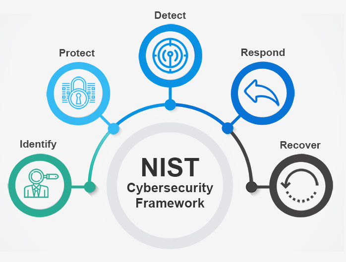
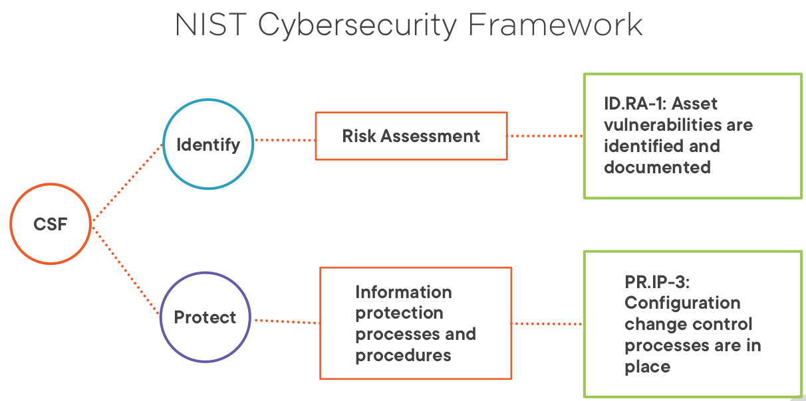
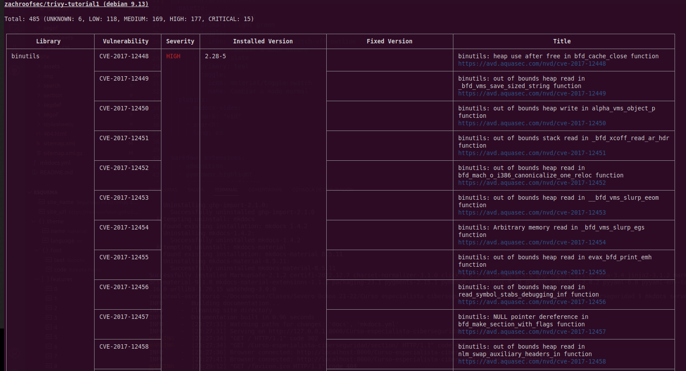
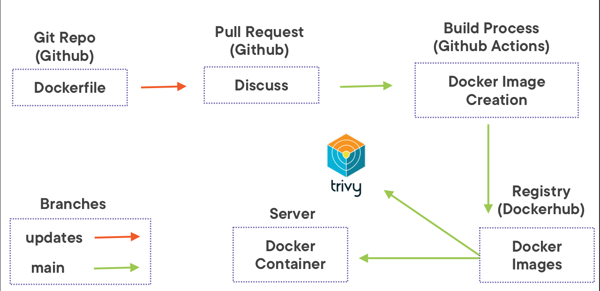

## Introducción

A medida que las aplicaciones cada vez más van cambiando su infraestructura a una basada en contenedores, más se va haciendo evidente que hay que auditar estos contenedores en búsqueda de vulnerabilidades.

En esta sección usaremos Trivy para auditar imágenes de contenedores y, además, veremos como integrar Trivy con Github Actions para que se produzca un escaneo automático de la imagen cada vez que esta se construya. Además, gracias a ello, veremos cómo prevenir que imágenes vulnerables pasen a producción.

### ¿Qué es Trivy?

Trivi es un sencillo, rápido y completo escáner de vulnerabilidades para contenedores, muy adecuado para la integración continua y DevSecOps. Esta herramienta detecta vulnerabilidades en los paquetes de los sistemas operativos, sea éste Alpine, RHEL, Debian, Ubuntu, Amazon Linux o lo que proceda, además de en ependencias de aplicaciones (Node, Ruby, Python, Java...).

Debido a la rapidez de Trivy, podemos integrarlo fácilmente de forma directa en nuestros workflows de desarrollo. Dicho de otro modo, en cuánto un desarrollador actualice el código, éste puede ser escaneado en tiempo real en búsqueda de vulnerabilidades.


### NIST CSF y Trivy

Este framework consta de tres componentes principales, el Core, los niveles de implementación (Tiers) y los Perfiles. El core, que es lo que se muestra en la siguiente imagen, contiene las mejores prácticas a alto nivel para ciberseguridad y manejo del riesgo, en general.

{: style="height:355px;width:475px"}

Trivy se centra en las funciones de identificación y protección, principalmente. Además, este framework define categorías para cada función y Trivy de nuevo se centra en dos de ellas, manejo del riesgo y procesos y proedimientos para la protección de la información.

Así las cosas, Trivy nos ayudará a identificar y documentar las vulnerabilidades de nuestros activos (contenedores) y, mediante su integración con Github Actions, podremos controlar los controles de cambios:

{: style="height:425px;width:825px"}

## Demostración 1

!!!info 
    Esta demostración ha sido realizada con Debian 11 Bullseye y se ha comprobado que funciona correctamente.

Para esta demostración el primer paso es, como cabía esperar, instalar Trivy. Para ello:

1. Debéis clonaros en vuestra máquina virtual el repositorio: `https://github.com/trivy-org/analisis-trivy`

2. Si echamos un ojo al script `install.sh` vemos que:
      1. Obtiene el nombre de la distribución
      2. Instala Trivy y las dependencias necearias
      3. También instala `container-diff` para inspeccionar y detectar imágenes que hayan sido manipuladas 
      4. Se instala Docker en caso de que sea necesario porque no esté instalado ya
3. Ejecutamos el script de instalación y comprobamos que Trivy se ha instalado correctamente

Comencemos pues con la demo propiamente dicha. Podemos ver que Trivy tiene multitud de opciones, como escaneo de imágenes, de sistema de archivos local, repositorio remoto...:

```console
$ trivy --help
```
No obstante, en nuestro caso nos centraremos únicamente en el escaneo de imágenes Docker. Escaneemos una imagen de Docker Hub a modo de ejemplo:

```console
$ trivy image zachroofsec/trivy-tutorial1
```
+ En primer lugar vemos que Tivy se queja de que estamos usando el tag `latest`. Para nuestros propósitos no hay problema alguno puesto que no estamos cambiando nada de las capas subyacentes de la imagen, más adelante ya nos preocuparemos de esto.

+ Vemos que Trivy nos informa de más de mil vulnerabilidades en el momento en que se escriben estos apuntes. De locos. Inabarcable.

    

!!!task "Tarea"
    Explorar en la ayuda de Trivy los flags que se pueden usar en la línea de comandos para escanear imágenes:

    ```console
    $ trivy image --help
    ```
    Y realizar un escaneo más sensato y priorizando vulnerabilidades. Esto incluye que se reporten únicamente las vulnerabilidades CRITICAL y HIGH, así como que se ignoren aquellas que no tengan una solución conocida. Comprueba cómo se reduce drásticamente el número de vulnerabilidades mostradas.


!!!info
    La severidad que muestra Trivy para las vulnerabilidades puede venir de distintos sitios. Se puede obetner de la NVD (National Vulnerability Database) o directamente del vendor o fabricate. 
    Por ejemplo, para un paquete de Ubuntu, Trivy aprovehcará el reporte de vulnerabilidades que haya publicado la propia Canonical y favorecerá esta severidad respecto a la de la NVD.

Vemos que la mayoría de los **CRITICAL** y **HIGH** se los llevan algunas librerías de OpenSSL, incluyendo el famoso Heartbleed que permite que un usuario malicioso no autenticado pueda, en ciertos casos, leer la memoria de la máquina.

En definitiva y para terminar, podemos decir que hemos utilizado Trivy para llevar a cabo una estrategia reactiva puesto que mediante ella detectamos las vulnerabilidades a posteriori, teniendo que solucionarlas una vez están ya en producción. Veremos en la próxima demostroación como podemos adoptar una estrategia más preventiva con el fin de evitar que estos problemas lleguen ni siquiera a publicarse.

## Demostración 2

### ¿Qué es Github actions?

GitHub Actions es una plataforma de integración y despliegue continuos (CI/CD) que te permite automatizar tu mapa de compilación, pruebas y despliegue. Puedes crear flujos de trabajo (*workflows*) y crear y probar cada solicitud de cambios en tu repositorio o desplegar solicitudes de cambios fusionadas a producción.

GitHub Actions va más allá de solo DevOps y te permite ejecutar flujos de trabajo cuando otros eventos suceden en tu repositorio. Por ejemplo, puedes ejecutar un flujo de trabajo para que agregue automáticamente las etiquetas adecuadas cada que alguien cree una propuesta nueva en tu repositorio.

GitHub proporciona máquinas virtuales Linux, Windows y macOS para que ejecutes tus flujos de trabajo o puedes hospedar tus propios ejecutores auto-hospedados en tu propio centro de datos o infraestructura en la nube.

Un **workflow** ejecutará uno o más jobs y se definen mediante un archivo YAML. Estos archivos se ubican en el directorio `.github/workflows` de un repositorio y puede haber varios archivos de workflow para diferentes cometidos.

Un **evento** es una actividad que dispara un flujo de trabajo o workflow. Estos eventos pueden ser un *push*, un *pull request* o un *merge*.

Por último, los **jobs** son acciones o pasos que se ejecutan dentro de un workflow.

Una *acción* es una aplicación personalizada para la plataforma de GitHub Actions que realiza una tarea compleja pero que se repite frecuentemente

Para entender detalladamente todos los componentes, podéis consultar [aquí](https://docs.github.com/es/actions/learn-github-actions/understanding-github-actions).

### Manos a la obra

En esta ocasión vamos a utilizar un enfoque proactivo para la integración de Trivy en el proceso de revisión de código mediante el uso de GitHub Actions.

Básicamente, lo que vamos a hacer con GitHub Actions es crear un Ubuntu Server que estará hospedado en la infraestructura de GitHub y podremos usarlo para auditar los cambios antes de subir la imagen al Docker Registry. Es más, podemos examinar el resultado del escaneo de Trivy e incluirlo en un Pull Request, permitiendo que se produzca una discusión antes de incorporar los cambios.

{: style="height:425px;width:825px"}


1. **Clonar repositorio**
2. **Protecciones de ramas**

Supongamos ahora que somos un desarrollador con el propósito de realizar o proponer cambios en nuestro Dockerfile. En primer lugar, nos crearemos la rama *updates* para realizar los cambios con los que luego haremos el *merge* a la rama principal:

```console
$ git checkout -b updates
```

Ahora, dentro de nuestro Dockerfile, realizaremos algunos cambios. En primer lugar, añadiremos algunos `apt-get installs`, como por ejemplo *Apache*, *wget* y *build-essential*. También instalaremos una versión de *libSSL*. Así pues, editamos el archivo:

```console 
$ nano docker-builder/registry-repos/trivy-tutorial/Dockerfile
```

Y descomentamos las líneas resaltadas:

```Dockerfile hl_lines="12-14 19-23"
FROM debian:stretch-20210208-slim

ENV DEBIAN_FRONTEND noninteractive

# +--------------------+
# SYSTEM-LEVEL PACKAGE MANAGER INSTALLATIONS
# (and misc dependencies) 
# +--------------------+

RUN apt-get update -y &&\
    apt-get dist-upgrade -y &&\
#    apt-get install -y apache2 \
#        wget \
#        build-essential &&\
    apt-get autoremove &&\
    apt-get clean &&\
    rm -rf /var/lib/apt/lists/* /tmp/* /var/tmp/*

#RUN wget http://snapshot.debian.org/archive/debian/20130319T033933Z/pool/main/o/openssl/libssl1.0.0_1.0.1e-2_amd64.deb -O /tmp/libssl1.0.0_1.0.1e-2_amd64.deb && \
#    dpkg -i /tmp/libssl1.0.0_1.0.1e-2_amd64.deb
#
#RUN wget http://snapshot.debian.org/archive/debian/20130319T033933Z/pool/main/o/openssl/openssl_1.0.1e-2_amd64.deb -O /tmp/openssl_1.0.1e-2_amd64.deb &&\
#    dpkg -i /tmp/openssl_1.0.1e-2_amd64.deb


# +--------------------+
# MAKE INSTALLATION (shellshock)
# (system-level installation WITHOUT package manager)
# +--------------------+

#RUN wget https://ftp.gnu.org/gnu/bash/bash-4.3.tar.gz && \
#    tar zxvf bash-4.3.tar.gz && \
#    cd bash-4.3 && \
#    ./configure && \
#    make && \
#    make install

# +--------------------+
# APPLICATION-LEVEL PACKAGE MANAGER INSTALLATION (regex DoS)
# +--------------------+

#COPY lang_dependencies/Pipfile.lock /app/Pipfile.lock
```
Y una vez hecho esto, haremos el *commit* y el *push*  correspondientes en nuestra nueva rama:

```console
git commit -am "Dockerfile actualizado" && git push origin updates
```

Crearemos un nuevo Pull Request:

