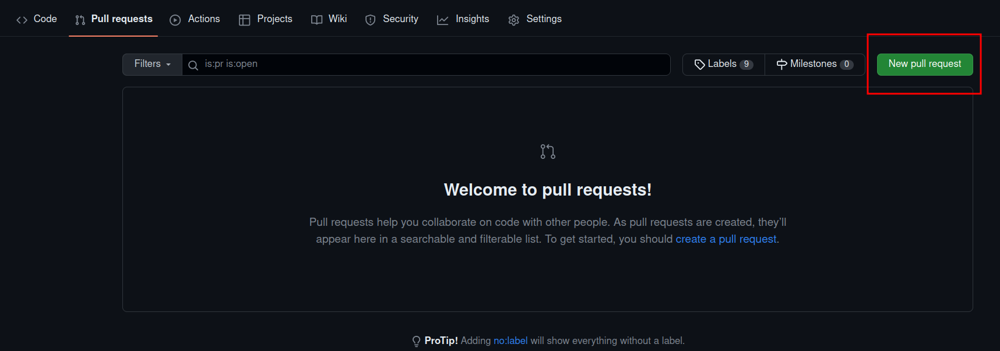

## Introducción

A medida que las aplicaciones cada vez más van cambiando su infraestructura a una basada en contenedores, más se va haciendo evidente que hay que auditar estos contenedores en búsqueda de vulnerabilidades.

En esta sección usaremos Trivy para auditar imágenes de contenedores y, además, veremos como integrar Trivy con Github Actions para que se produzca un escaneo automático de la imagen cada vez que esta se construya. Además, gracias a ello, veremos cómo prevenir que imágenes vulnerables pasen a producción.

### ¿Qué es Trivy?

Trivi es un sencillo, rápido y completo escáner de vulnerabilidades para contenedores, muy adecuado para la integración continua y DevSecOps. Esta herramienta detecta vulnerabilidades en los paquetes de los sistemas operativos, sea éste Alpine, RHEL, Debian, Ubuntu, Amazon Linux o lo que proceda, además de en dependencias de aplicaciones (Node, Ruby, Python, Java...).

Debido a la rapidez de Trivy, podemos integrarlo fácilmente de forma directa en nuestros workflows de desarrollo. Dicho de otro modo, en cuánto un desarrollador actualice el código, éste puede ser escaneado en tiempo real en búsqueda de vulnerabilidades.


### NIST CSF y Trivy

Este framework consta de tres componentes principales, el Core, los niveles de implementación (Tiers) y los Perfiles. El core, que es lo que se muestra en la siguiente imagen, contiene las mejores prácticas a alto nivel para ciberseguridad y manejo del riesgo, en general.

{: style="height:355px;width:475px"}

Trivy se centra en las funciones de identificación y protección, principalmente. Además, este framework define categorías para cada función y Trivy de nuevo se centra en dos de ellas, manejo del riesgo y procesos y proedimientos para la protección de la información.

Así las cosas, Trivy nos ayudará a identificar y documentar las vulnerabilidades de nuestros activos (contenedores) y, mediante su integración con Github Actions, podremos controlar los controles de cambios:

{: style="height:425px;width:825px"}

## Demostración 1

!!!info 
    Esta demostración ha sido realizada con Debian 11 Bullseye y se ha comprobado que funciona correctamente.

    Prerrequisitos necesarios:

    + Cuenta en GitHub
    + Personal Access Token creado en GitHub
    + Cuenta en DockerHub
    + Personal Access Token creado en DockerHub

Para esta demostración el primer paso es, como cabía esperar, instalar Trivy. Para ello:

1. Debéis hacer un fork del repositorio: `https://github.com/raul-profesor/practica-de-trivy` y luego clonarlo en vuestra máquina virtual

2. Si echamos un ojo al script `install.sh` vemos que:
      1. Obtiene el nombre de la distribución
      2. Instala Trivy y las dependencias necesarias
      3. También instala `container-diff` para inspeccionar y detectar imágenes que hayan sido manipuladas 
      4. Se instala Docker en caso de que sea necesario porque no esté instalado ya
3. Ejecutamos el script de instalación y comprobamos que Trivy se ha instalado correctamente

Comencemos pues con la demo propiamente dicha. Podemos ver que Trivy tiene multitud de opciones, como escaneo de imágenes, de sistema de archivos local, repositorio remoto...:

```console
$ trivy --help
```
No obstante, en nuestro caso nos centraremos únicamente en el escaneo de imágenes Docker. Escaneemos una imagen de Docker Hub a modo de ejemplo:

```console
$ trivy image zachroofsec/trivy-tutorial1
```

+ En primer lugar vemos que Tivy se queja de que estamos usando el tag `latest`. Para nuestros propósitos no hay problema alguno puesto que no estamos cambiando nada de las capas subyacentes de la imagen, más adelante ya nos preocuparemos de esto.

+ Vemos que Trivy nos informa de más de 400 vulnerabilidades en el momento en que se escriben estos apuntes. De locos. Inabarcable.

    

!!!task "Tarea"
    Explorar en la ayuda de Trivy los flags que se pueden usar en la línea de comandos para escanear imágenes:

    ```console
    $ trivy image --help
    ```
    Y realizar un escaneo más sensato y priorizando vulnerabilidades. Esto incluye que se reporten únicamente las vulnerabilidades CRITICAL y HIGH, así como que se ignoren aquellas que no tengan una solución conocida. Comprueba cómo se reduce drásticamente el número de vulnerabilidades mostradas.


!!!info
    La severidad que muestra Trivy para las vulnerabilidades puede venir de distintos sitios. Se puede obtener de la NVD (National Vulnerability Database) o directamente del vendor o fabricante. 
    Por ejemplo, para un paquete de Ubuntu, Trivy aprovehcará el reporte de vulnerabilidades que haya publicado la propia Canonical y favorecerá esta severidad respecto a la de la NVD.

Vemos que la mayoría de los **CRITICAL** y **HIGH** se los llevan algunas librerías de OpenSSL, incluyendo el famoso Heartbleed que permite que un usuario malicioso no autenticado pueda, en ciertos casos, leer la memoria de la máquina.

En definitiva y para terminar, podemos decir que hemos utilizado Trivy para llevar a cabo una estrategia reactiva puesto que mediante ella detectamos las vulnerabilidades a posteriori, teniendo que solucionarlas una vez están ya en producción. Veremos en la próxima demostroación como podemos adoptar una estrategia más preventiva con el fin de evitar que estos problemas lleguen ni siquiera a publicarse.

## Demostración 2

### ¿Qué es Github actions?

GitHub Actions es una plataforma de integración y despliegue continuos (CI/CD) que te permite automatizar tu mapa de compilación, pruebas y despliegue. Puedes crear flujos de trabajo (*workflows*) y crear y probar cada solicitud de cambios en tu repositorio o desplegar solicitudes de cambios fusionadas a producción.

GitHub Actions va más allá de solo DevOps y te permite ejecutar flujos de trabajo cuando otros eventos suceden en tu repositorio. Por ejemplo, puedes ejecutar un flujo de trabajo para que agregue automáticamente las etiquetas adecuadas cada que alguien cree una propuesta nueva en tu repositorio.

GitHub proporciona máquinas virtuales Linux, Windows y macOS para que ejecutes tus flujos de trabajo o puedes hospedar tus propios ejecutores auto-hospedados en tu propio centro de datos o infraestructura en la nube.

Un **workflow** ejecutará uno o más jobs y se definen mediante un archivo YAML. Estos archivos se ubican en el directorio `.github/workflows` de un repositorio y puede haber varios archivos de workflow para diferentes cometidos.

Un **evento** es una actividad que dispara un flujo de trabajo o workflow. Estos eventos pueden ser un *push*, un *pull request* o un *merge*.

Por último, los **jobs** son acciones o pasos que se ejecutan dentro de un workflow.

Una *acción* es una aplicación personalizada para la plataforma de GitHub Actions que realiza una tarea compleja pero que se repite frecuentemente

Para entender detalladamente todos los componentes, podéis consultar [aquí](https://docs.github.com/es/actions/learn-github-actions/understanding-github-actions).

### Manos a la obra

En esta ocasión vamos a utilizar un enfoque proactivo para la integración de Trivy en el proceso de revisión de código mediante el uso de GitHub Actions.

Básicamente, lo que vamos a hacer con GitHub Actions es crear un Ubuntu Server que estará hospedado en la infraestructura de GitHub y podremos usarlo para auditar los cambios antes de subir la imagen al Docker Registry. Es más, podemos examinar el resultado del escaneo de Trivy e incluirlo en un Pull Request, permitiendo que se produzca una discusión antes de incorporar los cambios.

{: style="height:425px;width:825px"} 

En primer lugar, debéis hacer un *fork* en vuestra cuenta del repositorio

`https://https://github.com/raul-profesor/practica-de-trivy`

Y tras ello, en el terminal, os debéis clonar el repositorio que utilizaremos como referencia:

```console
$ git clone https://github.com/nombre-usuario/practica-de-trivy
```

Y como medida de seguridad, protegeremos la única rama que tenemos ahora mismo (*main*). Para ello bien hacéis click en el propio aviso que os aparece en el repositorio al entrar vía web:


O bien váis directamente a `Settings`:


Y marcáis lo que aparece en la imagen, que básicamente viene a decir que antes de hacer un *merge*, se requiere un *pull request* y además, aprobación del mismo. También se requiere que pase los status check (nuestras acciones de Github Actions) antes de poder hacer un *merge*

Supongamos ahora que somos un desarrollador con el propósito de realizar o proponer cambios en nuestro Dockerfile. En primer lugar, nos crearemos la rama *updates* para realizar los cambios con los que luego haremos el *merge* a la rama principal:

```console
$ git checkout -b updates
```

Ahora, dentro de nuestro Dockerfile, realizaremos algunos cambios. En primer lugar, añadiremos algunos `apt-get installs`, como por ejemplo *Apache*, *wget* y *build-essential*. También instalaremos una versión de *libSSL*. Así pues, editamos el archivo:

```console 
$ nano docker-builder/registry-repos/trivy-tutorial/Dockerfile
```

Y descomentamos las líneas resaltadas:

```Dockerfile hl_lines="11-13 18-22"
FROM debian

ENV DEBIAN_FRONTEND noninteractive

# +---------------------------------------------------------+
# INSTALACIÓN A NIVEL DE SISTEMA MEDIANTE GESTOR DE PAQUETES
# +---------------------------------------------------------+

RUN apt-get update -y &&\
    apt-get dist-upgrade -y &&\
#    apt-get install -y apache2 \
#        wget \
#        build-essential &&\
    apt-get autoremove &&\
    apt-get clean &&\
    rm -rf /var/lib/apt/lists/* /tmp/* /var/tmp/*

#RUN wget http://snapshot.debian.org/archive/debian/20130319T033933Z/pool/main/o/openssl/libssl1.0.0_1.0.1e-2_amd64.deb -O /tmp/libssl1.0.0_1.0.1e-2_amd64.deb && \
#    dpkg -i /tmp/libssl1.0.0_1.0.1e-2_amd64.deb
#
#RUN wget http://snapshot.debian.org/archive/debian/20130319T033933Z/pool/main/o/openssl/openssl_1.0.1e-2_amd64.deb -O /tmp/openssl_1.0.1e-2_amd64.deb &&\
#    dpkg -i /tmp/openssl_1.0.1e-2_amd64.deb


# +--------------------+
# INSTLACIÓN CON MAKE (Shellshock)
# (instalacióin a nivel de sistema SIN gestor de paquetes)
# +--------------------+

#RUN wget https://ftp.gnu.org/gnu/bash/bash-4.3.tar.gz && \
#    tar zxvf bash-4.3.tar.gz && \
#    cd bash-4.3 && \
#    ./configure && \
#    make && \
#    make install

# +------------------------------------------------------------------------+
# INSTALACIÓN A NIVEL DE APLICACIÓN MEDIANTE GESTOR DE PAQUETES (regex DoS)
# +------------------------------------------------------------------------+

#COPY lang_dependencies/Pipfile.lock /app/Pipfile.lock
```
Y una vez hecho esto, haremos el *commit* y el *push*  correspondientes en nuestra nueva rama:

```console
git commit -am "Dockerfile actualizado" && git push origin updates
```

Tras ello, en el sitio web, crearemos un nuevo *Pull Request*:



!!!warning "¡Ojo cuidao!"
    Aseguráos de que el *pull request* lo haceís desde la rama `updates` de **vuestro repositorio** a la rama `main`de **vuestro repositorio**, como véis en la imagen de abajo.-


Comparará los cambios realizados e informará de que todo está bien y se puede hacer *merge* automáticamente de ambas ramas. 


Acto seguido veremos cómo está pasando el check requerido, que no es más que la acción definidia en GitHub Actions para que escanee la imagen Docker creada.

También nos informa de que el *merge* está bloqueado puesto que requiere de aprobación explícita. Esto es debido a las protecciones de rama que hemos configurado anteriormente.


En la pestaña `Checks` podemos ver que se van ejecutando, una tras otra, todas las acciones definidias y comprobamos que, tras instalar Trivy en la máquina virtual de la infraestructura de GitHub, está ejecutando el escaneo de vulnerabilidades pertinente:


Y tras unos segundos, se produce un fallo debido a que se han encontrado vulnerabilidades (las mismas que en el escaneo local que vimos al principio):


Tal y como vimos anteriormente, ahora podríamos ver el resultado de Trivy en la salida de nuestro check y comprobar que el problema que desencadena las vulnerabilidades es la inclusión de la librería `libSSL` vulnerable. Podemos ver también que la versión que da problemas coincide justo con la que nosotros instalamos en nuesro Dockerfile.

Gracias a este `status check` que conforma el escaneo de Trivy, podemos prevenir que publiquemos en nuestro entorno imágenes de Docker vulnerables. Aunque un revisor aprobase el merge, éste no se produciría por haber fallado el `status check`.

Hemos visto en una imagen más arriba que, puesto que soy administrador del repositorio, me permite sobreescribir esta regla y forzar el merge (*bypass branch protection*) pero es obvio que no todos los usuarios del repositorio tendrán esos privilegios.

!!!task "Tarea"
    Vamos a recomentar las líneas que teníamos comentadas en nuestro Dockerfile para solucionar nuestro fallo de haber incluido unas librería vulnerable (no hay que preocuparse, esta imagen por defecto lleva incluída la versión de `libSSL` correcta). Tras ello repetiremos nuestro `commit` y nuestro `push`, y comprobaremos que ahora sí, consigue pasar el `status check` con un estupendo tick verde.

Llegados a este punto sólo necesitaríamos la aprobación de un revisor para hacer nuestro *merge*. Alquien podría preguntarse que si Trivy ha dado su beneplácito con un escaneo sin vulnerabilidades, para qué ibamos a necesitar una interacción humana en vez de dejarlo todo completamente automatizado. La repuesta es que aunque Trivy tiene muchísimas posibilidades y el funcinamiento es más que aceptable, es incapaz de detectar **todas** las vulnerabilidades que podrían ser introducidas dentro de una imagen Docker. Es por ello que siempre se necesita de un ojo experto y humano que revise el *pull request.*

### Explicación del código

Veamos el contenido de los archivos más importantes implicados en nuestro workflow de GitHub Actions.

Encontramos el archivo que define el workflow propiamente dicho en `.github/workflows/scan.yml`. El nombre del workflow es indiferente:

```yaml title="scan.yml"
## Descripción general de Github Actions
## https://docs.github.com/en/actions/learn-github-actions/introduction-to-github-actions#overview

# +--------------------+
# LÓGICA PRINCIPAL
# +--------------------+

name: Security - Docker - Scan

on: [pull_request] #(1)
jobs:
  scan:
    name: Escanear Docker Imágenes
    runs-on: ubuntu-20.04 #(2)
    steps:
      - name: Permitir acceso repositorio #(3)
        uses: actions/checkout@v2

      - name: Instalar Trivy
        run: |
          bash install.sh

      - name: Ejecutar escáner de Trivy
        run: |
          bash docker-scan.sh #(5)
```

1. El workflow se disparará cuando se proponga un nuevo cambio via *pull request*
2. Este workflow se ejecuta en un entorno aislado, en este caso un Ubuntu 20.04
3. Permitimos el acceso a nuestro repositorio
4. Instalamos Trivy en el entorno usando el script de instalación
5. Finalmente ejecutamos el script que define el escaneo y que veremos a continuación


El script que define cómo realiza el escaneo Trivy: 

```zsh title="docker-scan.sh"
#!/bin/bash

# +--------------------+
# LÓGICA PRINCIPAL
# +--------------------+

for docker_build_context_relative_path in docker-builder/registry-repos/*; do #(5)
    [[ ! -d "$docker_build_context_relative_path" ]] && continue #(6)

    docker_build_context_absolute_path=$(realpath "$docker_build_context_relative_path") #(7)

    local_image_name=test-image

    docker build --no-cache --tag "${local_image_name}" "${docker_build_context_absolute_path}" #(8)

    trivy image --reset #(9)

    trivy image --no-progress --security-checks vuln --severity CRITICAL,HIGH,MEDIUM --exit-code 2 --ignore-unfixed "${local_image_name}" #(10)
    vuln_result_code="$?"

    if [[ "$vuln_result_code" -eq 0 ]]; then #(11)
        echo "La imagen Docker cumple con la política de seguridad!"
        echo "Woo hoo!"
        echo "Empezado el escaneo de la nueva imagen Docker"
        continue
    elif [[ "$vuln_result_code" -eq 2 ]]; then
        echo "¡Esta imagen Docker contiene una vulnerabilidad!"
        echo "¡Soluciónala por favor!"
        echo "PATH: $docker_build_context_absolute_path"
        exit 1 #(13)
    else #(14)
        echo "¡Ha habido un error inesperado!"
        echo "Por favor, contacte con el equipo de seguridad"
        exit 1
    fi
done
```

1. El script espera esta convenciónd de nombres, donde `REPO_NAME` es el nombre de nuestro repositorio en el Docker Registry (Docker Hub). 
2. Esta convención es para ser compatible con el otro script, docker-registry-orchestrator.sh, que se encarga de subir las imágenes al registro de Docker.
3. El script se ejecuta cuando se produce un PR
4. Los cambios deben, adicionalmente, ser aprobados por un revisor ya que Trivy funciona muy bien pero no detecta el 100% de las vulnerabilidades.
5. Iteramos sobre los archivos de configuración de Docker 
6. Nos aseguramos de que sólo iteramos sobre directorios
7. Obtenemos la ruta absoluta del archivo de configuración en cuestión 
8. Construimos la imagen Docker en local
9. **MUY IMPORTANTE** porque queremos escanear la imagen recién construida y no obtener resultados de escaneos anteriores de otras imágenes, por lo que borramos la caché de Trivy
10. Ejecución del escaneo con Trivy:
    + Si se encuentra una vulnerabilidad, Trivy emitirá el código de salida `2`
11. En este bloque, si Trivy emite un código de salida `0` signfica que el escaneo ha resultado exitoso y no se ha producio ningún error inesperado y continua con el escaneo de los siguientes archivos de configuración
12. Si se produce un código de salida `2`, sabemos que esa imagen de Docker contiene una vulnerabilidad.
13. Si salimos con un `1`, le estamos diciendo a GitHub Actions que el status check es fallido y por tanto bloqueamos el *pull request* para hacer *merge*
14. Para el caso de que se produzca un error inesperado no contemplado anteriormente


## Demostración 3

En esta demostración práctica veremos:

+ Cómo usar GitHub actions para subir nuestra imágenes al registro de Docker
+ Construir/reconstruir imágenes Docker periódicamente para reducir vulnerabilidades (enfoque proactivo)
+ Cómo burlar los escaneos de Trivy
  + Manipulación del registro de Docker
  + Vulnerabilidades que no escaneables


En la sección [Manos a la obra](#manos-a-la-obra) se mostraba una imagen donde se veían dos puntos de aparición de GitHub Actions; los escaneos de Trivy y el proceso de *Build* o creación de la imagen Docker. Como ya hemos visto en profundidad el primero, nos centraremos ahora en el segundo.

Surgen un par de preguntas:

1. ¿Cómo se suben las imágenes a Docker Hub tras escanearlas con Trivy?
2. ¿Qué pasa si un atacante compromete nuestro Docker Hub y sube una imagen maliciosa? ¿Cómo podríamos saberlo?

### Explicación del workflow

Comencemos con un resumen del workflow:

```yaml title="builder.yml"
# +--------------------+
# LÓGICA PRINCIPAL
# +--------------------+

name: Security - Docker - Registry Orchestrator
on:
#  schedule: # (3)
#    - cron: '0 0 * * *'
  push: # (4)
    branches:
      - main
    paths-ignore: #(5)
      - docker-builder/registry-repos/trivy-tutorial/image_sha.txt

jobs:
  docker-registry-orchestrator:
    name: Docker Registry Orchestrator
    runs-on: ubuntu-20.04
    steps:
      - name: Checkout current git repo # (6)
        uses: actions/checkout@v2
        with:
          token: ${{ secrets.GIT_AUTOMATION_USER_TOKEN }} # (7)
          
      - name: Instalar Trivy # (8)
        run: |
          bash install.sh
          
      - name: Log in en Dockerhub # (9)
        uses: docker/login-action@v1
        with:
          username: ${{ secrets.DOCKERHUB_USERNAME }}
          password: ${{ secrets.DOCKERHUB_PASSWORD }}
         
      - name: Interacciones con Docker Registry  # (10) 
        run: |
          bash docker-registry-orchestrator.sh latest ${{ secrets.DOCKERHUB_USERNAME }}

```

1. Como hemos dicho, este *workflow* invoca a un script que construye la imagen Docker y la sube al registro de Docker.
2. También invoca a otro script que realiza la validación de la firma para asegurarse de que las imágenes del registro no han sido modificadas.   
3. Cuando se reconstruyen las imágenes, tambén se producen actualizaciones de paquetes. 
   
    Ejecutando este workflow periódicamente (**schedule**) minimizamos las vulnerabilidades que pueden aparecer en el escaneo de Trivy.

    La razón por la que se produce esta actualización es porque, si recordamos, en nuestro *Dockerfile* había una orden de actualización de paquetes del sistema operativo (`apt-get upgrade`).

    Aparece aquí como prueba de concepto, comentado con el fin de ahorrar recursos.

4. El evento *push* es cuando se acepta un *pull request* y se hace *merge* de este código con la rama *main*. 

    En este punto el workflow se iniciará y las imágenes de Docker se subirán al registro.

5. Cuando se construye una imagen la firma de la misma se incluye en `image_sha.txt` y se envía a la rama `main` del repositorio.

    Si permitiéramos que este path activara el workflow, habría un bucle infinito, así que debemos tener en cuenta esa casuística y por eso le decimos que se ignore el *push* en este path.

6. Damos permiso para acceder al repositorio

7. Utilizamos un usuario con permisos de administración para poder bypassear la protección de rama y poder hacer un *push* de la firma a la rama *main* directamente.

8. Cada vez que se ejecuta el workflow se crea una máquina virtual nueva, así que tenemos que instalar Trivy siempre.

9. Esto nos permite hacer login en el registro de Docker para subir luego la imagen.

10. Invocamos al script docker-registry-orchestator

Sigamos con el shell script:

```sh title="docker-registry-orchestrator.sh"
#!/bin/bash

# +--------------------+
# INPUTS
# +--------------------+

TAG="$1" # (1)

DOCKERHUB_USER="$2"

# +--------------------+
# FUNCIONES
# +--------------------+

generate_signature_and_upload_image() {
    local local_image_name="$1"
    local remote_image_name="$2"
    local sig_abs_path="$3"

    container-diff analyze --no-cache --format='{{(index .Analysis 0).Digest}}' daemon://"$local_image_name" > "$sig_abs_path"
    
    docker tag "$local_image_name" "$remote_image_name"
    docker push "$remote_image_name"
}

commit_and_push_signature() {
    local signature_absolute_path="$1"

    git add "$signature_absolute_path"
    git commit -m "Updating Docker Image signature"
    git push origin main
}


# +--------------------+
# LÓGICA PRINCIPAL
# +--------------------+

git config user.name "Security Bot" # (2)
git config user.email "<>"
git pull origin main

for docker_build_context_relative_path in docker-builder/registry-repos/*; do # (3)
    [[ ! -d "$docker_build_context_relative_path" ]] && continue

    docker_build_context_absolute_path=$(realpath "$docker_build_context_relative_path")
    
    repo_name=$(basename "$docker_build_context_absolute_path")

    local_image_name="$repo_name:$TAG" # (4)

    remote_image_name="$DOCKERHUB_USER/$local_image_name" # (5)

    docker build --no-cache --tag "${local_image_name}" "${docker_build_context_absolute_path}" # (6)

    # +--------------------------------------------------------------+
    # LÓGICA PARA COMPROBAR LAS MODIFICACIONES MALICIOSAS (TAMPERING)
    # +--------------------------------------------------------------+
    
    signature_absolute_path="$docker_build_context_absolute_path/image_sha.txt"
    first_run=false
    if [[ ! -f "$signature_absolute_path" ]]; then # (7)
        first_run=true
    fi

    if [[ "$first_run" == "true" ]]; then # (8)

        generate_signature_and_upload_image "$local_image_name" "$remote_image_name" "$signature_absolute_path"
        
        commit_and_push_signature "$signature_absolute_path"
        
        echo "Primera vez que se construye esta imagen..."
        echo "Saltándonos las comprobaciones de integridad..."    
        continue
    fi

    docker pull "${remote_image_name}"

    remote_signature=$(container-diff analyze --no-cache --format='{{(index .Analysis 0).Digest}}' daemon://"$remote_image_name") # (9)
    previous_build_signature=$(cat "$signature_absolute_path") # (10)

    if [[ "${remote_signature}" != "${previous_build_signature}" ]]; then # (11)
        echo "La firma remote NO coincidie con la de la última imagen que se construyó"
        echo "¡Puede que se haya producido una modificación maliciosa en Docker Hub!"
                
        echo "Firma remota: $remote_signature"
        echo "Firma del último build: $previous_build_signature"
        echo "Docker Registry Repo: $repo_name"

        echo "Corriendo el escáner de Trivy sobre la imagen Docker remota" # (12)
        
        trivy image --reset
           
        trivy image --no-progress --severity CRITICAL,HIGH,MEDIUM --ignore-unfixed "${remote_image_name}"

        echo "Buscando diferencias entre las imágenes de Docker" # (13)
        container-diff diff \
            --no-cache \
            --order \
            --type apt \
            --type file \
            --type history \
            --type layer \
            --type metadata \
            --type pip \
            --type size \
            --type sizelayer \
            daemon://$local_image_name\
            daemon://$remote_image_name

        echo "¡No subimos la imagen!" # (14)
        echo "Debe llevarse a cabo una investigación"
                       
        exit 1
    else # (15)     
        echo "¡No se ha producido tampering de la imagen Docker!"
        generate_signature_and_upload_image "$local_image_name" "$remote_image_name" "$signature_absolute_path"
        commit_and_push_signature "$signature_absolute_path"
    fi
done
```

1. Los tags son una forma de versionar imágenes en Docker. En esta demo utilizaremos el tag `latest`.

2. Configuraciones básicas de Git

3. Iteramos sobre los archivos de configuración

4. Empezamos a generar el nombre de la imagen
  
5. Nos bajamos la iamgen del repositorio remoto

6. Construimos la imagen

7. Si es la primera vez que se construye la imagen, no se comprobará la firma puesto que no hay ninguna generada con anterioridad.

8. Asumiento que es la primera vez que generamos la imagen, utilizamos una herramienta de Google llamada *container-diff* para generar su primera firma. 
   
      En las ejecuciones subsiguientes comprobaremos que la firma de la imagen coincide con la del repositorio.

9. Obtenemos la firma de la imagen remota

10. Obtenemos la firma de la última imagen que se construyó

11. Si la firma actual y la anterior no coinciden es posible que se haya producido una modificación malintencionada en nuestro repositorio Docker. 

12. Hacemos un análisis que pueda ayudar en una investigación posterior.

13. Hacemos uso de `container-diff` para ver las diferencias entre imágenes. 

14. Tras todo esto, no vamos a subir la imagen al registro de Docker sino que se necesita comenzar una investigación forense y/o enviar una alerta a un SIEM..

15. Si se ejecuta esta parte del código es que no se ha detectado ninguna modificación y se subirá la iamgen, así como la firma de la misma.

### Simulando una manipulación maliciosa de la imagen en Docker Hub

!!!task "Tarea"
    Si volvéis al site de GitHub que nos permitía forzar el *merge* del *pull request* que teníamos pendiente gracias a nuestros permisos de administrador, hacedlo.

    Os aparecerá este segundo workflow que hemos visto ejecutándose (con el punto amarillo).

Tras hacer el merge y completarse el workflow, debéis ver en la pestaña *Code* un anuncio de que **Security Bot** actualizado la firma.


Y si hacéis clic, podréis ver el nuevo valor de la firma.

Visto que todo funciona correctamente, hagamos nuestra simulación introduciendo una imagen vulnerable de Docker en nuestro repositorio. Para ello vamos a descomentar las líneas resaltadas de nuestro Dockerfile:

```Dockerfile title="Dockerfile" hl_lines="29-34 39"
FROM debian

ENV DEBIAN_FRONTEND noninteractive

# +---------------------------------------------------------+
# INSTALACIÓN A NIVEL DE SISTEMA MEDIANTE GESTOR DE PAQUETES
# +---------------------------------------------------------+

RUN apt-get update -y &&\
    apt-get dist-upgrade -y &&\
    apt-get install -y apache2 \
        wget \
        build-essential &&\
    apt-get autoremove &&\
    apt-get clean &&\
    rm -rf /var/lib/apt/lists/* /tmp/* /var/tmp/*

#RUN wget http://snapshot.debian.org/archive/debian/20130319T033933Z/pool/main/o/openssl/libssl1.0.0_1.0.1e-2_amd64.deb -O /tmp/libssl1.0.0_1.0.1e-2_amd64.deb && \
#    dpkg -i /tmp/libssl1.0.0_1.0.1e-2_amd64.deb

#RUN wget http://snapshot.debian.org/archive/debian/20130319T033933Z/pool/main/o/openssl/openssl_1.0.1e-2_amd64.deb -O /tmp/openssl_1.0.1e-2_amd64.deb &&\
#    dpkg -i /tmp/openssl_1.0.1e-2_amd64.deb

# +--------------------+
# MAKE INSTALLATION (shellshock)
# (system-level installation WITHOUT package manager)
# +--------------------+

#RUN wget https://ftp.gnu.org/gnu/bash/bash-4.3.tar.gz && \ # (1)
#    tar zxvf bash-4.3.tar.gz && \
#    cd bash-4.3 && \
#    ./configure && \
#    make && \
#    make install

# +------------------------------------------------------------------------+
# INSTALACIÓN A NIVEL DE APLICACIÓN MEDIANTE GESTOR DE PAQUETES (regex DoS)
# +------------------------------------------------------------------------+
#COPY lang_dependencies/Pipfile.lock /app/Pipfile.lock # (2)
```

1. Esta versión de Bash es vulnerable a Shellshock. Ésta es una vulnerabilidad crítica de Bash que permitiría la ejecución arbitraria de comandos y que ya hemos visto con anterioridad.
2. Con esto introducimos una vulnerabilidad DoS mediante una expresión regular (ReDoS) en un paquete de Python (httplib2)

Por poner en contexto: puede parecer que estas vulnerabilidades tampoco son para tanto pero imaginemos que lo que se introduce es un minado de criptos. Las cientos o miles de personas que utilizasen esa imagen Docker serían potenciales víctimas de un lucrativo negocio.

Pasamos a construir la imagen nosotros mismos:

```console
$ docker build -t ***usuario-docker***/trivy-tutorial docker-builder/registry-repos/trivy-tutorial
```

Así evitamos pasar por Git y ser detectados por los workflows anteriores.

En este caso estamos suponiendo que un atacante ha conseguido nuestras credenciales del Docker Hub por cualquiera de las múltiples maneras posibles. Teniendo en cuenta esto, nos logueamos en Docker Hub:

```console
$ docker login --username nombre-usuario-docker
```

Y subimos la nueva imagen:

```console
$ docker push ***nombre-usuario-docker***/trivy-tutorial
```

Pues ya tendríamos simulado un ataque con una imagen modificada. Teniendo en cuenta que con anterioridad habíamos comentado el bloque del workflow que nos permitía ejecutarlo periódicamente (*schedule*) y para cumplir los propósitos de esta demo, vamos a ejecutar de nuevo los jobs manualmente, para ver si se detecta la problemática.

En la pestaña *Actions*, en el workflow `Docker Registry Orchestator` que es el que nos interesa, le damos a re-ejecutar los jobs:


Si todo ha ido correctamente, el workflow fallará. Y si miráis los detalles, debéis ver que Trivy ha detectado una vulnerabilidad en `Pipfile.lock` pero no ha detectado **Shellshock**.


!!!question "Pregunta"
    Shellshock no se ha detectado por una razón concreta y es una de las causas del tipo de vulnerabilidades que no detecta Trivy y se necesita la aprobación humana que comentábamos antes. ¿Sabrías decir cuál es esta razón?

## Conclusión

Ninguna herramienta de ciberseguridad puede monitorizar TODOS los ataques. Sin embargo, una combinación de herramientas adecuadas pueden ofrecer pintas sobre qué ha cambiado

!!!question "Pregunta"
    ¿Serías capaz de en la salida que nos ofrece la pestaña *Actions* identificar la salida de `container-diff` y donde se ven todos los archivos relativos a bash que se han añadido a la imagen?