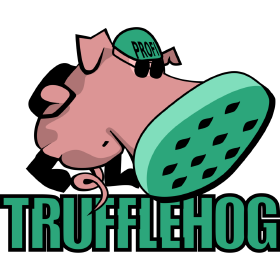
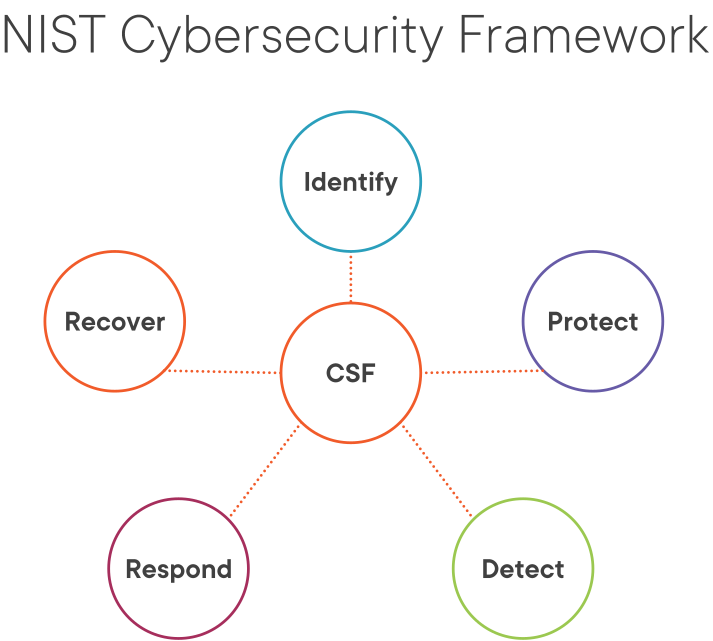
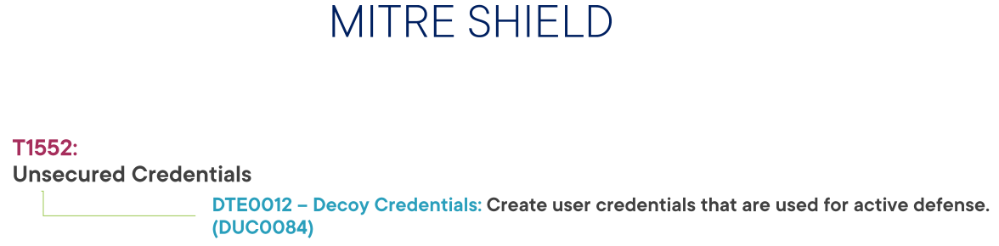

## Introducción 

TruffleHog es una herramienta de código abierto dedicada al análisis de archivos desarrollada y mantenida por [Truffle Security](https://trufflesecurity.com/).

Para dominar la seguridad de nuestra empresa es importante poseer un control completo de nuestras credenciales y secretos. Puesto que un entorno completamente seguro es una utopía, uno de nuestros objetivos será reducir el tiempo entre un robo o filtración de credenciales y la detección por nuestra parte para ponerle remedio.

En esta sección veremos como usar TruffleHog para identificar y detectar estas credenciales o secretos que, por error, despiste o cualquier otra razón están almacenados en nuestros repositorios de código fuente. Para este cometido nos centraremos específicamente en Github, probablemente el más usado. 

## TruffleHog

TruffleHog sirve como complemento al trabajo de un Blue Team. Utiliza la línea de comandos para operar y es relativamente simple de configurar, usar y aprender.



Puede usarse para auditar uno o varios repositorios simultánemamente, así como configurarlo para para cumplir objetivos de seguridad genéricos o específicos.

Hay dos puntos clave a la hora de utilizar TruffleHog:

1. Realizar un análisis o auditoría de un repositorio de código fuente como Github (repo de ahora en adelante).
   
    Se puede realizar una búsqueda utilizando la configuración por defecto o con cambios mínimos. Lo bueno de este punto es que permite hacerse una idea ninicial de la capacidad de Trufflehog para realizar un análisis rápido.

2. Realizar un análisis customizado o personalizado. Puesto que TruffleHog puede devolver una cantidad de información tal que resulte abrumadora para el Blue Team correspondiente, se pueden realizar búsquedas muy específicas.
   
   Personalizar y configurar TruffleHog para casos muy específicos es una funcionalidad muy interesante.

   Merece la pena comentar que se pueden utilizar distintas instancias de TruffleHog  en distintos entornos (test, preprod, prod...) con distintas configuraciones.


TruffleHog trabaja tanto con expresiones regulares como con un concepto conocido como entropía:

!!!quote "Cita"
     [TruffleHog] will go through the entire commit history of each branch, and check each diff from each commit, and check for secrets. This is both by regex and by entropy. For entropy checks, truffleHog will evaluate the shannon entropy for both the base64 charset and hexadecimal char set for every blob of text greater than 20 characters comprised of those character sets in each diff. If at any point a high entropy string >20 characters is detected, it will print to the screen.”

Es decir, calcula la entropía de las diferencias entre cada commit, tanto en base64 como hexadecimal y para cada texto mayor de 20 carácteres.

!!!nota "Aclaración"
    El concepto de entropía o entropía de Shannon proviende de la teoría de la comunicación y mide la incertidumbre de una fuente de información. No obstante, esta definición es imprecisa. La definición real de entropía es el grado de información/desinformación que tenemos de un sistema. Es decir, cuanta más información tengamos menos entropía. 

     Citando a la [Wikipedia](https://es.wikipedia.org/wiki/Entrop%C3%ADa_(informaci%C3%B3n)):

     "Los símbolos con menor probabilidad son los que aportan mayor información; por ejemplo, si se considera como sistema de símbolos a las palabras en un texto, palabras frecuentes como «que», «el», «a» aportan poca información, mientras que palabras menos frecuentes como «corren», «niño», «perro» aportan más información. Si de un texto dado borramos un «que», seguramente no afectará a la comprensión y se sobreentenderá, no siendo así si borramos la palabra «niño» del mismo texto original. Cuando todos los símbolos son igualmente probables (distribución de probabilidad plana), todos aportan información relevante y la entropía es máxima. "

{: style="height:300px;width:400px"}

Antes de continuar, deben nombrarse los frameworks o marcos de ciberseguridad. Hay muchos marcos disponbiles y la decisión de elegir uno en concreto depende de la ideneidad para la empresa en cuestión.

El NIST es una de las organizaciones que elabora estos marcos y que abarcan un conjunto de normas, directrices y mejores prácticas para alcanzar un nivel de madurez adecuado en cuanto a ciberseguridad. Como véis en la imagen, las categorías están divididas en: identificar, proteger, detectar, responder y recuperar.



Cada categoría contiene otras subcategorías que están vinculadas a actividades específicas que una organización necesita llevar a cabo para mejorar su nivel de madurez en ciberseguridad.


TruffleHog es una herramienta que ayuda a una organización en la categoría de anomalías y eventos. En general, esto ayuda a una organización a tener mejor información para preparar futuras estrategias de seguridad, mejorarla y poder mitigar aún más el riesgo.

TruffleHog forma parte del proceso de correlación y datos de eventos. El resultado de la herramienta puede determinar qué impacto pueden tener los eventos maliciosos así como ayudar a determinar los umbrales adecuados para las alertas de seguridad.

También tenemos nuestra ya conocido marco MITRE ATT&CK, que proporciona diferentes técnicas que un actor de amenaza (threat actor) puede utilizar contra nuestra organización. En esta sección trataremos las credenciales no seguras.


Queremos identificar qué repos desplegados en nuestro entorno contienen fugas de datos sensibles como secretos y/o credenciales.

Vamos a ver cómo identificar credenciales no seguras en repos y como de fácil es para los potenciales atacantes poder realizar el reconocimiento del entorno, probable precursor de un ataque.


Por último, MITRE Shield es un marco que cubre las técnicas de ataque, así como la forma en que podemos defender nuestros entornos.

Utilizando esto podemos vincular las técnicas de ataque con los métodos de defensa:



Es decir, hacer un commit con credenciales intencionadamente inseguras para identificar a los atacantes.

Dependiendo de los procesos, madurez y prioridades de una empresa, TuffleHog puede ser desde ejecutado manualmente por los desarrolladores hasta formar parte de un [proceso automatizado de DevSecOps, donde se ejecute mediante GitHub actions](https://container-devsecops.awssecworkshops.com/), por ejemplo.

### Auditando repositorios para detectar filtrado de credenciales

Unas credenciales filtradas o expuestas suponen, como es obvio, un gran riesgo para cualquier negocio. Si la empresa tiene suerte, estas credenciales expuestas pueden llevar a un uso razonable en tiempo y recursos para tratar un incidente de seguridad con poco impacto. En el peor escenario puede desembocar en una gran pérdida, tanto económica como reputacional.

Algunos de los riesgos de unas credenciales filradas son:

+ Exfiltración de datos
+ Movimientos laterales: es mucho más difícil detectar a los actores maliciosos utilizando usuarios autenticados accediendo a los sistemas y realizando movimientos laterales, es necesario preventirlo con antelación.
+ Escalada de privilegios

Aunque vayamos a centrarnos en Github, es importante saber que el código puede estar almacenado en muchos y muy diferentes lugares: gestores de paquetes de software como `pip` si se usa Python, el código de los sitios web con contraseñas "hardcodeadas", Sharepoint u otros sistemas de compartición de archivos como Teams, Slack o Discord. Y por último, en el historial de commits, que es donde haremos hincapié.

Las credenciales pueden aparecer en los repositorios por diferentes motivos, como desarrolladores que suben código con credenciales por puro despist, código legacy, tras una revisión de código...

##### ¿Qué hacer si aparecen credenciales filtradas?

No hay una repuesta clara a esta pregunta, depende de cada caso.

La respuesta más obvia sería eliminarlas del código y santas pascuas. Esto puede resultar sencillo en un código más o menos simple pero en un código más maduro y complejo podría resultar una tarea bastante titánica y habría que estudiarlo.

Otra solución sería simplemente desactivar las cuentas cuyas credenciales han sido expuestas, convirtiéndolas en inútiles. Esta solución permite conservar el historial de commits y mitigar el riesgo.

Por último, si un repositorio no tiene una razón de peso para ser público, podríamos convertirlo en privado.

### Uso de contraseñas señuelo

En primer lugar debemos instalar TruffleHog en nuestro sistema. A partir de la versión 3 TruffleHog ha sido reescrito en Go y ha cambiado su funcionamiento ya que no utiliza la entropía para nada debido a su dificultad de escalamiento para grandes volúmenes de datos. 

Por motivos de facilidad y para prueba de concepto, utilizaremos versiones anteriores, para ello lo podemos intalar con pip3 (o pipenv si estamos en un entorno virtual):

```console
$ pip3 install 'truffleHog>=2.1.0,<3.0'
```

Para esta práctica vamos a utilizar la configuración por defecto de TruffleHog. Deshabilitaremos el uso de la entropía y le indicaremos que haga uso de la funcionalidad `regex`, que trataremos con mayor profundidad más adelante pero básicamente busca tipos concretos de credenciales haciendo uso de expresiones regulares.

Básicamente, buscaremos cadenas aleatorias que puedan ser una potencial credencial.

Vamos a simular un repositorio privado donde vamos a colocar un archivo con unas credenciales señuelo falsas como método de protección activa, tal y como recomendaba el NIST. Lo ideal sería tener una pantalla de login donde puedan utilizarse estas credenciales de tal forma que, sabiendo que no funcionan, pudiésemos monitorizar el comportamiento, mediante su descubrimiento y eso, de los actores de amenazas.

Así pues, analicemos el repositorio: 

```console
$ trufflehog --regex --entropy=False  https://github.com/raul-profesor/repositorio-interno
```

Parece que TruffleHog no ha enconrado nada. Cuando esto ocurre, la aplicación simplemente no devuelve nada.

!!!Task "Tarea"
    Probad ahora activando la entropía y comprobad qué se obtiene.


### Uso de análisis personalizados

En esta tarea lo que haremos será intentar que TruffleHog busque específicamente claves de Azure Storage.

Personalizar o customizar los criterios de búsqeuda resulta tremendamente útil puesto que con ello reducimos la cantidad de resultados a un nivel realista que podemos manejar, así como los falsos positivos que nos harían perder mucho tiempo.

Para este ejemplo vamos a suponer que asumimos el rol de un miembro del equipo de seguridad que ha observado que en la organización se emplean contenedores Azure Storage. Es por ello que, en previsión, queremos hacer una búsqueda en el repositori por si se pudiera filtrar una de las claves asociadas por error.

Para personalizar la búsqueda utilizaremos nuestra propia expresión regular. Las claves de Azure Storage son alfanuméricas, es decir, están formadas por letras y número y además al final de la clave nos encontramos con un símbolo de suma y dos símbolos "igual". Además, la longitud de la clave es de 88 carácteres.

!!!task "Tarea"
    Haciendo uso de sitios como [](https://regex101.com/) o [](https://regexr.com/), crea una expresión regular que haga match con una cadena formadas por números del 0 al 9, y letras (mayúsculas y minúsculas) de la a a la z. 
    Si no recuerdas las expresiones regulares, puedes hacer uso de consultas en Internet como [esta](https://www.adictosaltrabajo.com/2015/01/29/regexsam/) u otras que encuentres.

Para hacer que TruffleHog haga uso de esta expresión regular, debemos localizar y modificar el archivo `regexes.json`que es el que utiliza para este cometido. Este archivo puede variar su ubicación en función del sistema que estéis utilizando. En mi caso está aquí:

```console
/home/raul/.local/lib/python3.9/site-packages/truffleHogRegexes/regexes.json
```
Aunque si no lo tuvieráis ahí, podéis hacer uso de la herramienta `locate` (deberéis instalarla) para buscarlo:

```console
$ sudo updatedb
$ locate regexes.json
```
El primer comando actualiza la base de datos de *locate* y el segundo hace la búsqueda.

+ Es recomendable que hagáis una copia de seguridad el archivo antes de modificarlo para ahorrarnos posibles problemas.

En este archivo y con el mismo formato que el resto de reglas que ya contiene, debéis introducir una nueva con la clave "Claves de acceso para Azure Storage"  y como valor, la expresión regular formada anterioremente.

Y tras esto, ya no queda más que probar que la expresión regular es correcta y que TruffleHog hace uso de ella, detectando en la salida una clave de la tipología que le hemos dicho. Para ello le diremos, igual que antes, que utilice las expresiones regulares (utilizará por defecto el archivo **regexes.json** que hemos modificado) pero no la entropía, ya que no nos hace falta al querer afinar la búsqueda con las regex.

El repositorio que queremos analizar es el siguiente: **`https://github.com/raul-profesor/clave-azure`**

!!!task "Tarea"
    Documenta el comando y la salida que obtienes, haciendo notar que se obtienen únicamente valores a partir de las expresiones regulares que contiene el archivo regexes.json, así como señalando en concreto los resultados de nuestra propia expresión regular.

    Utiliza todas las capturas de pantallas y explicaciones que consideres necesarias para este caso y el anterior.


