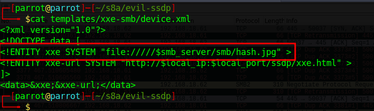
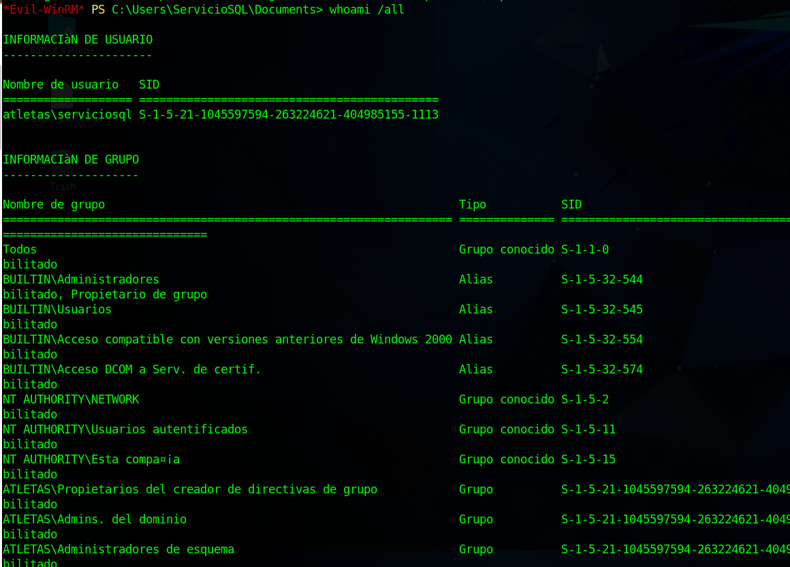

## Setup del laboratorio

### Windows Server 

+ Administrador de dominio
+ Usuario raso 1 de dominio 
+ Copiar usuario raso 2 con otro nombre 
+ Copiar usuario administrador con otro nombre
+ Copiar el usuario copiado de administrador como cuenta de servicio SQL
 
    Para esta cuenta, con el fin de utilizarla más adelante para demostrar el ataque `Kerberoasting`, debemos establecerle un SPN. Así pues, en un cmd que abriremos como administrador, debemos introducir lo siguiente:

    


Crear una compartición de archivos: `Server Manager > File and Storage Service > Shares > Task > New Share > SMB Quick`
### Clientes Windows 10 

+ En ambos, crear una carpeta compartida.
+ Unir las máquinas al dominio
+ Hacer al usuario raso 1 administrador local del primer cliente
+ Hacer al usuario raso 1 y 2 administradores local del segundo cliente también


## Responder 

Si os fijáis en [este](https://adam-toscher.medium.com/top-five-ways-i-got-domain-admin-on-your-internal-network-before-lunch-2018-edition-82259ab73aaa) artículo, aunque un poco antiguo, da una idea de las formas más básicas de ataques contra Active Directory para capturar hashes.

En la primera se habla de envenenamiento LLMNR. Este protocolo, bastante antiguo, permite identificar hosts cuando el DNS falla en esta tarea.

Se conoce como envenenamiento LLMNR aquel ataque en el cual el cliente intenta acceder a un servicio de red inexistente y que por lo tanto no tiene una resolución DNS exitosa. En este caso, se lanza un mensaje broadcast LLMNR para resolver la dirección, cosa que el atacante aprovecha para hacerse pasar por ese servicio y solicitar la pertinenete autorización al cliente/víctima.


De esta forma, es posible capturar hashes NLTMv2 y descifrarlos offline mediante diccionarios.

Para llevar a cabo un ataque de este tipo quizás la herramienta más conocida sea **Responder**, la más famosa herramienta para envenenamiento LLMNR/LLMNR, NBT-NS Y MDNS (protocolos de función similar). Responder tiene además incorporado servidores HTTP/SMB/MSSQL/FTP/LDAP falsos que sportan NTLMv1/NTLMv2/LMv2, Extended Security NTLMSSP y Basic HTTP authentication.

### Procedimiento

Responder sólo está disponible para Linux y viene preinstalado en Kali, Parrot y otras. Al ejecutarlo, podemos ver que se inician los *envenenadores* y los servidores falsos (podemos indicarlo mediante opciones por línea de comandos que se inicien o no según qué elementos):


Obviamente el atacante ha de estar en la misma red que la víctima. Esta última, de alguna manera (¿os acordáis de la práctica anterior de phising?), ha de ser convencida de intentar acceder a un servicio inexistente.

Por ejemplo, intentando acceder a un recurso compartido con un nombre inexistente, ocurre lo siguiente:


Es decir, **Responder** está simulando ser un servidor SMB que requiere autorización para su acceso. Si la víctima no se da cuenta del engaño e introduce sus credenciales:


**Responder** las captura al instante en forma de Usuario, dominio y hash:


Con esto, ya tendríamos la parte ardúa del trabajo hecha, quedaría descifrar este hash. La herramienta que nos puede ayudar en este menester es **hashcat**, por ejemplo. No obstante, lo comprobaremos.

¿Puede hashcat hacer algo con los hashes NTLMv2? Veamos que nos dice el manual:


Todo parece indicar que hay una forma de indicarle a hashcat que se trata de un hash de este tipo y que actúe en consecuencia.

!!!task "Tarea"
    Reproduce el escenario con un password en el cliente lo suficiente débil como para que no nos lleve mucho tiempo el proceso de descifrado con hashcat (`password.123` por ej.)

    Averigua como utilizar hashcat con la opción para hashes NTLMv2 y con el diccionario rockyou.txt (presente en cualquier distribución dedicada a la seguridad).

## Aplicación en el mundo real

Aunque algo antigua, resulta útil revisitar la vulnerabilidad [CVE-2018-13417](https://www.incibe.es/incibe-cert/alerta-temprana/vulnerabilidades/cve-2018-13417). 
 
Se trata de una vulnerabilidad  XXE (XML External Entity Processing) en el cliente de Bittorrent *Vuze*. Como podemos leer [aquí](https://www.cronup.com/que-son-y-como-prevenir-los-ataques-xxe/), "una vulnerabilidad de entidad externa XML se produce cuando el servicio que analiza (o en palabras más sencillas, lee y procesa) los mensajes XML enviados por el cliente, acepta una definición externa del propio mensaje XML."

Vamos a intentar cómo explotar esta vulnerabilidad con los conceptos previos.

### La víctima

Se tratará de un Windows 10 con una instalación nueva de Vuze (<u>**ha de ser la versión 5.7.6.0**</u>):


### Atacante

Yo he utilizado Parrot pero podréis utilizar Kali o la que más os guste. En este caso vamos a llevar a cabo un remember y haremos uso de la herramienta [Evil-ssdp](https://gitlab.com/initstring/evil-ssdp) para hacer spoofing de respuestas SSDP, creando dispositivos falsos UPnP y detectar vulnerabilidadews XXE en aplicaciones UPnP.


### Explicación 

Cuando Vuze intenta descubrir otros dispositivos en la red local, SSDP envía un mensaje UDP multicast a la dirección 239.255.255.250 y puerto **1900**. Esto permite a Vuze localizar dispositivos UPnP. Es por esto precisamente que el atacante será capza de responder a estos paquetes con una herramienta como evil-ssdp, diciéndole al cliente que es un dispositovo compartido llamado *Device Descriptor*.

Tras esto, Vuze parsea el contenido del XML de *Device Descriptor* sobre HTTP, pudiendo así obtener archivos, hashes o inclusos shells del atacante. En nuestro caso particular, vamos a ejecutar un ataque XXE que producirá una conexión SMB, permitiéndonos capturar el hash del desafío/respuesta.

Por defecto, evil-ssdp levanta un servidor web y *Device Descriptor* está alojado en:

`http://<IP_Atacante>:8888/ssdp/device-desc.xml`

La ruta de **device-desc.xml** obtiene los datos del archivo *device.xml*, ubicado en la carpeta `/templates/xxe-smb`. Por suerte, evil-ssdp  ya nos ha preconfigurado una línea para el ataque XXE que invocará la conexión SMB por nosotros:




Con todo ya dispuesto, iniciamos **responder**, iniciamos **evil-ssdp** y tras ello arrancamos Vuze en nuestra máquina víctima Windows 10:


Y la magia se produce casi al instante.

### ¿Qué está ocurriendo entre bambalinas?

Si analizamos el escenario como mandan los canones con Wireshark, veremos cosas interesantes.

1. El primer paquete es un multicasting UDP vía SSSDP. También vemos su posterior respuesta informando al cliente de la localización del dispositivo *Device Descriptor*

    

2. Después se roduce un *3-way handshake* y se lleva a cabo la petición HTTP GET por parte del cliente a *Device Descriptor*

    

3. Se inicia entonces la conexión SMB por parte del cliente, tras una negociación a propósito de la versión SMB a utilizar. Finalmente el cliente envia su hash NTLMv2 para autenticarse en el servicio y es entonces cuando Responder lo captura:

    

    El valor del hash mostrado en la imagen de la captura de Wireshark debe coincidir con el captura por Responder.

## SMB Relay

!!!info 
    Microsoft está empezando a hacer más enfásis en algunos aspectos históricos de su seguridad. Uno de ellos era que por defecto los mensajes SMB no estaban firmados,[ cosa que parece que empieza a cambiar](https://techcommunity.microsoft.com/t5/storage-at-microsoft/smb-signing-required-by-default-in-windows-insider/ba-p/3831704) y a requerirse que sí lo haga por defecto.

    [<u>¿Qué significa que los mensajes SMB estén firmados?</u>](https://learn.microsoft.com/es-es/troubleshoot/windows-server/networking/overview-server-message-block-**signing**)

    *La firma SMB (también conocida como firmas de seguridad) es un mecanismo de seguridad en el protocolo SMB. La firma SMB significa que cada mensaje SMB contiene una firma que se genera mediante la clave de sesión. El cliente coloca un hash de todo el mensaje en el campo de firma del encabezado SMB.*

    Para realizar un ataque de tipo **SMB Relay** es imprescindible que estos mensajes no vayan firmados, así que tenemos esta opción activada por defecto en los clientes (no en el DC), debemos desactivarla. ¿Cómo? [Así](https://techcommunity.microsoft.com/t5/storage-at-microsoft/smb-signing-and-guest-authentication/ba-p/3846679).

    En un principio esto no nos aleja de un entorno real puesto que muchos equipos tendrán aún versiones antiguas de Windows o incluso habrán desactivado las firmas.

En esta ocasión sí vamos a desactivar nuestros Windows Defender en ambos clientes Windows puesto que lo que intentamos es presentar los fundamentos de este ataque, no este ataque junto con la evasión de antivirus.

### ¿Qué es SMB Relay?
En lugar de intentar descifrar o crackear los hashes que hemos recopilado con el *responder*, podemos hacer relay de esos hashes a máquinas potencialmente vulnerables con el fin de obtener acceso a ellas.

Para conseguir nuestro fin necesitamos dos requisitos fundamentales:

+ SMB Signing tiene que estar deshabilitado en el objetivo o víctima
+ Las credenciales de las que se hace relay, que son reenviadas, deben tener privilegios de admin en la máquina (para el caso que aquí se muestra)


Los pasos a seguir son:

1. Editamos la configuración del responder para desactivar los servidores fake SMB y HTTP. Esto quiere decir que estaremos escuchando, pero no respondiendo. Por lo tanto, capturaremos la petición de acceso con responder y haremos relay de ella con otra herramienta.

    

    

2. Hacemos relay de la petición de autorización con `ntlmrelayx`, que utilizará un archivo de texto donde vendrán definida/s la víctima/s.

    

3. Y si hemos accedido con un usuario con privilegios de administrador, veremos que se produce un dumping de la SAM:

    
    


### ¿Cómo puedo saber las máquinas de la red que tiene SMB sin firmar?

Una vez más podemos ayudarnos de nmap:

```sh
nmap --script=smb2-security-mode -p445 192.168.18.0/24
```

!!!task "Tarea"
    Busca la forma de conectarte remotamente a la máquina con las credenciales comprometidas, usando esas credenciales y la herramietna `psexec`.


### Mitigación del ataque SMB Relay

+ Activar el firmado de mensajes SMB (SMB signing) en todos los dispositivos
    + <u>Contrapartida</u>: puede provocar lentintud a la hora de copiar archivos
+ Deshabilitar autenticación NTLM
    + <u>Contrapartida</u>: Si Kerberos, por lo que sea, deja de estar disponible en la red, Windows volverá a NTLM
+ Jerarquización de cuentas (limitar los administradores de dominio a tareas específicas)
+ Restricción de administradores locales
    + <u>Contrapartida</u>: Con toda probabilidad aumentará las llamadas a soporte informático en la empresa


## Ataques IPv6

Hace muchos años ya que venimos escuchando que la implantación de IPv6 es inminente, que no quedan direcciones IPv4 disponibles y que ese es el destino inmediato e inexorable.

No obstante, la realidad es un tanto distinta. Mientras que sí es cierto que IPv6, aunque muy lentamente, se abre paso en Internet, en las redes internas de las empreass es bastante raro verlo. Sin embargo, muchas de estas empresas desconocen que a pesar de su desuso, Windows desde su versión Vista, así como sus versiones de servidor, **tienen IPv6 activado por defecto y éste tiene preferencia sobre IPv4**.

### DNS Spoofing

Si tenemos una red montada en IPv4, como es el caso de nuestro laboratorio, es probable que tengamos IPv6 también activo. En ese caso, cuando un host se loguea en una red, intentará pedir la configuración por DHCPv6 y es aquí cuando nos aprovecharemos de ello, ya que como atacantes nos autodesignaremos como DNS primario para IPv6.

### WPAD

Web Proxy Autodiscovery Protocol (WPAD) es un método mediante el cual los clientes pueden descubrir la URL en la que se haya ubicado el archivo de configuración que deben utilizar en la red en la que se encuentran ubicados.

Como podemos ver en el siguiente esquema sacado de [esta wiki](https://wiki.articatech.com/proxy-service/proxy-pac/auto-discovery):


Los clientes a la hora de utilizar la red, preguntan si existe algún proxy a utilizar y dónde pueden encontrar la configuración del mismo para hacer uso de él.

Antiguamente la dirección IP del servidor que proporcionaba el archivo wpad.dat se resolvía usando el DNS y, si éste no devolvía ninguna dirección, se podía resolver de forma insegura con protocolos de broadcast como LLMNR. Un atacante podía contestar a este broadcast, fingir ser el servidor que alojaba el archivo wpad y pedir autenticación al cliente para servírselo. Esta autenticación era proporcionada por Windows sin interacción del usuario. De esta forma el atacante obtenía unas credenciales NTLM de las que podía hacer relay.

Así las cosas, en 2016 Microsoft publicó un [boletín de seguridad](https://support.microsoft.com/en-us/topic/ms16-077-security-update-for-wpad-june-14-2016-2490f086-dc17-4a6e-2799-a974d1af385e) que intentaba mitigar estos ataques con dos nuevas medidas:

+ La localización del archivo WPAD sólo podía proporcionarse mediante DNS únicamente, excluyendo protocolos de broadcast
+ La autenticación ya no se realiza automáticamente sin interacción del usuario

### Nuevos mecanismos para explotar WPAD

De las medidas mencionadas anteriormente, la primera puede ser fácilmente bypasseada haciendo uso de la aplicación [mitm6](https://github.com/dirkjanm/mitm6). 

En cuánto el atacante se postule como el servidor DNS IPv6 de la red, los clientes empezarán a preguntarle por la dirección del archivo WPAD. Es tan sencillo como que este servidor diga que dicho archivo se encuentra alojado en su misma IP. Este método funciona incluso si la organización realmente tiene un archivo WPAD propio (aunque cortará todo acceso a Internet).

En cuanto a la segunda protección, requiere un poco más de trabajo. Cuando el cliente solicite el archivo WPAD, no se le requerirá en ese instante ninguna autorización sino que se le proveerá un archivo WPAD válido en el que se establece la máquina atacante como proxy. Así, cuando la máquina víctima lleve a cabo alguna acción que requiera con una conexión a Internet, utilizará al atacante como proxy y éste le devolverá un *HTTP 407 Proxy Authentication required*.

El error HTTP 407 es similar al error 401, que se produce por un acceso no autorizado. La única diferencia es que en el error 407 falla la autenticación con un proxy y no con una conexión directa al servidor. 

De esta forma y casi sin enterarnos, Windows enviará con gusto el desafío/respuesta NTLM al atacante para que pueda hacer relay a cualquier otro servicio.

En [este enlace](https://redfoxsec.com/blog/ipv6-dns-takeover/) encontramos la siguiente imagen que lo describe muy bien:

{: style="height:500px;width:700px", align=center }

!!!task "Tarea"
    Vuestra tarea será buscar información sobre cómo llevar a cabo este ataque y ponerlo en práctica para, posteriormente, entregar un informe detallando el proceso que habéis seguido. Algunas pistas que os servirán:

      +  Debéis partir del escenario que ya tenéis configurado
      +  **Debéis instalar los servicios de certificado en el DC (controlador de dominio)**. Buscad información o utilizad el link en la sección de Referencias.
      +  Necesitaréis dos herramientas, *mitm6* y *ntlmrelayx*
      +  Realizad primero el ataque con un usuario normal y echad un vistazo a toda la información que se obtiene. Buscad algún "descuido" que dé información demasiado sensible de alguna cuenta.
      +  Tras utilizar un usuario sin privilegios, proceded ahora a realizar el ataque con un usuario administrador de dominio y explicad qué ha sucedido. Comprobadlo en el DC.

Si todo sale bien, iréis viendo pantallas similares a esta:


### Defensas o mitigaciones ante este ataque

1. La primera, como es de esperar, sería deshabilitar IPv6 si no está siendo utilizado en nuestra red empresarial.
2. La segunda sería deshabilitar la autodetección de configuración de proxy (WPAD) mediante GPO. Muchas veces las redes empresariales realmente sí utilizan un archivo PAC con la configuració del proxy, así que es recomendable configurar directamente la URL de este archivo en lugar de confiar en la detección automática.
3. Por último, la única solución adecuada para evitar los NTLM relay es deshabilitar NTLM y utilizar íntegramente Kerberos. Aunque ya hemos visto que muchas veces esto no es posible. En estos casos ya hemos dicho que es muy recomendable tener configuada la firma de mensajes SMB y/o LDAP.


## Kerberoasting

### Kerberos
Lo primero que debemos abordar es cómo funciona el servicio de autenticación Kerberos. Para ello, más que reinventar la rueda, os remito a algunos links que lo explican bastante bien:

+ En [este](https://www.tarlogic.com/es/blog/tickets-de-kerberos-explotacion/) artículo de **Tarlogic**, se explica el funcionamiento, con la explicación de los mensajes intercambiados y algunos ataques. De esa misma página, un resumen gráfico sería:
    
    

    1. El cliente envía una petición de autenticación al controlador de dominio
    2. Si es exitosa, la respuesta contiene un *Ticket Granting Ticket (TGT)*. Este ticket únicamente sirve para demostrar que la autenticación ha sido exitosa y que el cliente tiene permiso para solicitar un *TGS (Ticket Granting Service)*, que no es más que un ticket para un servicio concreto de la red.
    3. Se solicita el *TGS* deseado. Antes de emitir el *TGS*, se valida el *TGT*. Si la validación es correcta, se envía el *TGS* con una clave secreta conocida como clave de sesión. Esta clave se utilizará para cifrar el tráfico entre el cliente y el servicio solicitado.
    4. Se solicita acceso al servicio concreto presentando el *TGS*.

+ Otra fuente de información interesante es la siguiente charla (en español):

<p align="center"><iframe width="560" height="315" src="https://www.youtube.com/embed/5uhk2PKkDdw?si=BATcRUBvUaeq1Qv7" title="YouTube video player" frameborder="0" allow="accelerometer; autoplay; clipboard-write; encrypted-media; gyroscope; picture-in-picture; web-share" allowfullscreen></iframe></p>

### ¿Cómo funciona kerberoasting?

Kerberoasting, explota el protocolo de autenticación Kerberos y los nombres principales de servicio (SPN). Cualquier usuario del dominio puede solicitar un *TGS* para acceder a un servicio. A partir de este *TGS*, se recuperará el hash de la cuenta de servicio que cifra el *TGS* y se llevará a cabo un ataque de fuerza bruta offline al hash de la contraseña del servicio para poder, finalmente, obtener ésta misma.

Para este ataque es imprescindible que la cuenta de servicio tenga establecido un SPN.

#### ¿Qué son los nombres de entidad principal de servicio (SPN)?

Un SPN es un identificador único para una instancia de servicio, que asocia ese servicio con una cuenta de servicio específica en Active Directory. Las cuentas de servicio en Active Directory son vitales, ya que a menudo ejecutan aplicaciones y servicios críticos.

Cuando un usuario o un servicio desea acceder a otro servicio, hace referencia al SPN pertinente para solicitar el ticket de servicio necesario, que el servicio de destino valida a continuación. Los SPN incluyen (pero no se limitan a):

+ Servicios web: Un servidor web como IIS puede utilizar un SPN como HTTP/servidor web.dominio.com para autenticarse con AD.
+ Servicios SQL: Las instancias de Microsoft SQL Server registran un SPN como MSSQLSvc/servername.domain.com:1433 para habilitar la autenticación Kerberos.
+ Servicios de archivos: Un servidor de archivos puede tener un SPN como HOST/servidorarchivos.dominio.com.
+ Aplicaciones personalizadas: Las empresas suelen desarrollar aplicaciones internas que utilizan AD para la autenticación. Estas aplicaciones también pueden registrar sus SPN.

### Hands-on

!!!task "Tarea"
    Buscad información en los cientos de recursos disponibles en la red sobre cómo llevar a cabo este ataque de forma exitosa y documentadlo en un informe a entregar.

+ Obtenemos el *TGS* del servicio


+ Lo almacenamos en un fichero de texto para proceder al descifrado *offline*. Con la ayuda de hashcat, averiguamos que código debemos utilizar para el descifrado de este tipo de hashes:


+ Utilizando hashcat adecuadamente, obtenemos el password de la cuenta de servicio:


#### Password spraying

Una forma de comprobar el alcance que tiene esta contraseña en los equipos del dominio es realizar un *password spraying* sobre ellos. Históricamente se ha utilizado la aplicación **crackmapexec (cme)** para este cometido y, de hecho, en la mayoría de la literatura sobre este tema es el más nombrado.

Sin embargo, el desarrollo de **cme** se ha paralizado recientemente. En su lugar, tenemos a un sucesor natural como es **NetExec (nxc)**, con prácticamente su misma forma de uso y sintaxis.

Haciendo uso de esta herramienta y de la técnica mencionada, vemos como hemos comprometido prácticamente todo el dominio (cuando la autenticación es exitosa, lo indica con `Pwn3d!`):


!!!task "Tarea"
    Investiga cómo llevar a cabo este *password spraying* con **nxc** y documéntalo.

También podemos hacer uso de algún programa para acceso remoto, como por ejemplo **evil-winrm**, para aprovecharnos de la interfaz de administración remota y acceder al DC:




!!!task "Tarea"
    Averigua cómo hacer uso de **evil-winrm** u otro programa para obtener una shell en el DC comprometido.


## Referencias

[Portswigger - XML external entity (XXE) injection](https://portswigger.net/web-security/xxehttps://portswigger.net/web-security/xx`)

[mitm6 – compromising IPv4 networks via IPv6](https://blog.fox-it.com/2018/01/11/mitm6-compromising-ipv4-networks-via-ipv6/)

[MITM6 Strikes Again: The Dark Side of IPv6  ](https://www.blackhillsinfosec.com/mitm6-strikes-again-the-dark-side-of-ipv6/)

[Kerberos Fundamentals](https://www.qomplx.com/blog/about-kerberos/)

[Cómo proteger Active Directory contra Kerberoasting: Seguridad AD 101](https://www.semperis.com/es/blog/protecting-active-directory-from-kerberoasting/)

[How to install Certificate Authority (CA) server and create certificates](https://support.n4l.co.nz/s/article/How-to-install-Certificate-Authority-CA-server-and-create-certificates)