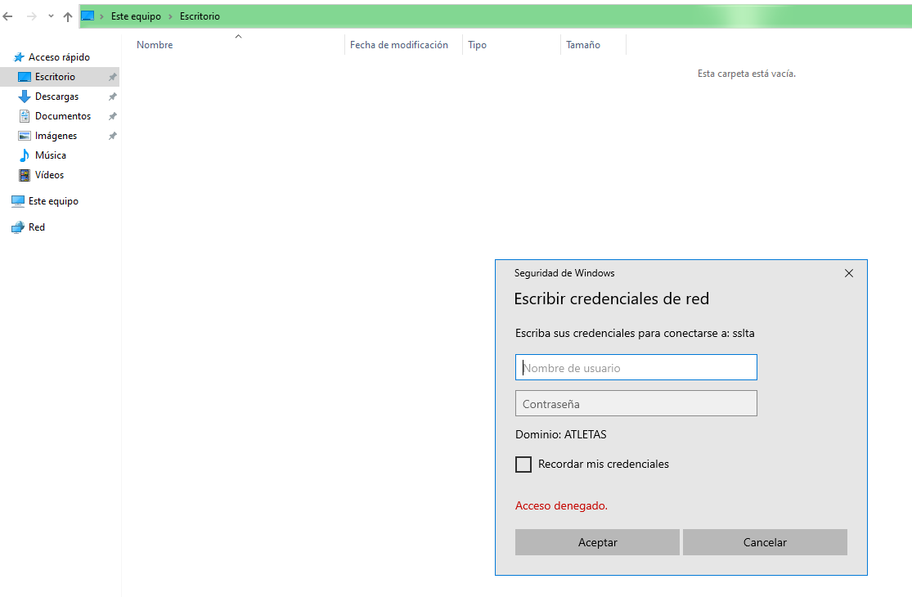
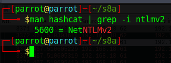

## Setup del laboratorio

### Windows Server 2022
### Windows 10 

## Responder 

Si os fijáis en [este](https://adam-toscher.medium.com/top-five-ways-i-got-domain-admin-on-your-internal-network-before-lunch-2018-edition-82259ab73aaa) artículo, aunque un poco antiguo, da una idea de las formas más básicas de ataques contra Active Directory para capturar hashes.

En la primera se habla de envenenamiento LLMNR. Este protocolo, bastante antiguo, permite identificar hosts cuando el DNS falla en esta tarea.

Se conoce como envenenamiento LLMNR aquel ataque en el cual el cliente intenta acceder a un servicio de red inexistente y que por lo tanto no tiene una resolución DNS exitosa. En este caso, se lanza un mensaje broadcast LLMNR para resolver la dirección, cosa que el atacante aprovecha para hacerse pasar por ese servicio y solicitar la pertinenete autorización al cliente/víctima.

De esta forma, es posible capturar hashes NLTMv2 y descifrarlos offline mediante diccionarios.

Para llevar a cabo un ataque de este tipo quizás la herramienta más conocida sea **Responder**, la más famosa herramienta para envenenamiento LLMNR/LLMNR, NBT-NS Y MDNS (protocolos de función similar). Responder tiene además incorporado servidores HTTP/SMB/MSSQL/FTP/LDAP falsos que sportan NTLMv1/NTLMv2/LMv2, Extended Security NTLMSSP y Basic HTTP authentication.

### Procedimiento

Responder sólo está disponible para Linux y viene preinstalado en Kali, Parrot y otras. Al ejecutarlo, podemos ver que se inician los *envenenadores* y los servidores falsos (podemos indicarlo mediante opciones por línea de comandos que se inicien o no según qué elementos):

Obviamente el atacante ha de estar en la misma red que la víctima. Esta última, de alguna manera (¿os acordáis de la práctica anterior de phising?), ha de ser convencida de intentar acceder a un servicio inexistente.

Por ejemplo, intentando acceder a un recurso compartido con un nombre inexistente, ocurre lo siguiente:

Es decir, **Responder** está simulando ser un servidor SMB que requiere autorización para su acceso. Si la víctima no se da cuenta del engaño e introduce sus credenciales:

**Responder** las captura al instante en forma de Usuario, dominio y hash:

Con esto, ya tendríamos la parte ardúa del trabajo hecha, quedaría descifrar este hash. La herramienta que nos puede ayudar en este menester es **hashcat**, por ejemplo. No obstante, lo comprobaremos.

¿Puede hashcat hacer algo con los hashes NTLMv2? Veamos que nos dice el manual:

Todo parece indicar que hay una forma de indicarle a hashcat que se trata de un hash de este tipo y que actúe en consecuencia.

!!!task "Tarea"
    Reproduce el escenario con un password en el cliente lo suficiente débil como para que no nos lleve mucho tiempo el proceso de descifrado con hashcat (`password.123` por ej.)

    Averigua como utilizar hashcat con la opción para hashes NTLMv2 y con el diccionario rockyou.txt (presente en cualquier distribución dedicada a la seguridad).

## Aplicación en el mundo real

Aunque algo antigua, resulta útil revisitar la vulnerabilidad [CVE-2018-13417](https://www.incibe.es/incibe-cert/alerta-temprana/vulnerabilidades/cve-2018-13417). 
 
Se trata de una vulnerabilidad  XXE (XML External Entity Processing) en el cliente de Bittorrent *Vuze*. Como podemos leer [aquí](https://www.cronup.com/que-son-y-como-prevenir-los-ataques-xxe/), "una vulnerabilidad de entidad externa XML se produce cuando el servicio que analiza (o en palabras más sencillas, lee y procesa) los mensajes XML enviados por el cliente, acepta una definición externa del propio mensaje XML."

Vamos a intentar cómo explotar esta vulnerabilidad con los conceptos previos.

### La víctima

Se tratará de un Windows 10 con una instalación nueva de Vuze (<u>**ha de ser la versión 5.7.6.0**</u>):

### Atacante

Yo he utilizado Parrot pero podréis utilizar Kali o la que más os guste. En este caso vamos a llevar a cabo un remember y haremos uso de la herramienta [Evil-ssdp](https://gitlab.com/initstring/evil-ssdp) para hacer spoofing de respuestas SSDP, creando dispositivos falsos UPnP y detectar vulnerabilidadews XXE en aplicaciones UPnP.

### Explicación 

Cuando Vuze intenta descubrir otros dispositivos en la red local, SSDP envía un mensaje UDP multicast a la dirección 239.255.255.250 y puerto **1900**. Esto permite a Vuze localizar dispositivos UPnP. Es por esto precisamente que el atacante será capza de responder a estos paquetes con una herramienta como evil-ssdp, diciéndole al cliente que es un dispositovo compartido llamado *Device Descriptor*.

Tras esto, Vuze parsea el contenido del XML de *Device Descriptor* sobre HTTP, pudiendo así obtener archivos, hashes o inclusos shells del atacante. En nuestro caso particular, vamos a ejecutar un ataque XXE que producirá una conexión SMB, permitiéndonos capturar el hash del desafío/respuesta.

Por defecto, evil-ssdp levanta un servidor web y *Device Descriptor* está alojado en:

`http://<IP_Atacante>:8888/ssdp/device-desc.xml`

La ruta de **device-desc.xml** obtiene los datos del archivo *device.xml*, ubicado en la carpeta `/templates/xxe-smb`. Por suerte, evil-ssdp  ya nos ha preconfigurado una línea para el ataque XXE que invocará la conexión SMB por nosotros:

Con todo ya dispuesto, iniciamos **responder**, iniciamos **evil-ssdp** y tras ello arrancamos Vuze en nuestra máquina víctima Windows 10:

Y la magia se produce casi al instante.

### ¿Qué está ocurriendo entre bambalinas?

Si analizamos el escenario como mandan los canones con Wireshark, veremos cosas interesantes.

1. El primer paquete es un multicasting UDP vía SSSDP. También vemos su posterior respuesta informando al cliente de la localización del dispositivo *Device Descriptor*

    

2. Después se roduce un *3-way handshake* y se lleva a cabo la petición HTTP GET por parte del cliente a *Device Descriptor*

    

3. Se inicia entonces la conexión SMB por parte del cliente, tras una negociación a propósito de la versión SMB a utilizar. Finalmente el cliente envia su hash NTLMv2 para autenticarse en el servicio y es entonces cuando Responder lo captura:

    

    El valor del hash mostrado en la imagen de la captura de Wireshark debe coincidir con el captura por Responder.

## Referencias

[Portswigger - XML external entity (XXE) injection](https://portswigger.net/web-security/xxehttps://portswigger.net/web-security/xx`)