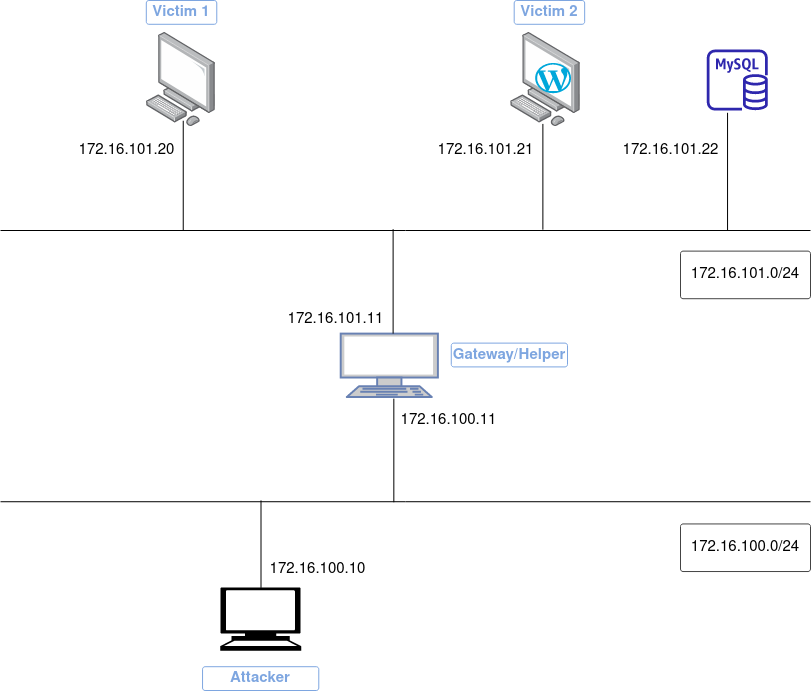

# Pivoting

El pivoting hace referencia a una técnica donde tras comprometer un equipo, nos damos cuenta de que éste nos da acceso a otros equipos o redes a los que de una forma directa no podríamos acceder. Así pues, nuestra máquina comprometida o máquina de salto nos sirve para seguir obteniendo nuevos accesos.

De forma esquemática

+ "X" tiene acceso a "Y"
+ "Y" tiene acceso a "Z"
+ "X" no tiene acceso a "Z"
+ "X" consigue acceso a "Z" utilizando "Y" cómo máquina de *pivoting*

# Descripción de la práctica

Para la realización de esta práctica se montará una infraestructura completa en Docker tal y como muestra la siguiente imagen:



Tenemos dos contenedores llamados *víctima 1* y *víctima 2* ambos en la red **172.16.101.0/24**. El atacante por otra parte en una subred diferente, la **172.16.100.0/24**.

La máquina *helper* o *gateway* tiene dos interfaces, una en cada una de las dos subredes de este escenario.

## Explicación de los archivos de docker compose

En primer lugar, tenemos un archivo `docker-compose-subnet.yml` cuyo fin único es la creación de las subredes que vamos a necesitar y que hemos nombrado anteriormente.

```yaml hl_lines="4 9 10 12 17 18"
version: "3.8"

networks:
  attacker:
    driver: bridge
    ipam:
      driver: default
      config:
        - subnet: 172.16.100.0/24
          gateway: 172.16.100.2

  victim:
    driver: bridge
    ipam:
      driver: default
      config:
        - subnet: 172.16.101.0/24
          gateway: 172.16.101.3
```

La sección `ipam` es un acrónimo de **IP Address Management** y es dónde indicamos las direcciones de red así como las puertas de enlace. Para este escenario el driver por defecto (bridge) es suficiente. 

!!!info
    Si tenéis interés en saber los drivers de red que pueden existir y cuándo se usan, podéis leer [aquí](https://www.docker.com/blog/understanding-docker-networking-drivers-use-cases/) o un pequeño resumen [aquí](https://docs.docker.com/network/drivers/#network-driver-summary)

Luego tenemos un `docker-compose.yml` para construir los contenedores que vamos a utilizar:

```yaml hl_lines="18-31"
version: "3.8"

services:
  attacker:
    build:
      context: ./dockerfiles
      dockerfile: attacker.Dockerfile
    container_name: attacker
    hostname: attacker
    extra_hosts:
        - "helper:172.16.100.11"
    links:
      - helper
    networks:
      attacker:
        ipv4_address: 172.16.100.10

  helper:
    build:
      context: ./dockerfiles
      dockerfile: helper.Dockerfile
    container_name: helper
    hostname: helper
    extra_hosts:
      - "victim1:172.16.101.20"
      - "victim2:172.16.101.21"
    networks:
      attacker:
        ipv4_address: 172.16.100.11
      victim:
        ipv4_address: 172.16.101.11

  victim1:
    build:
      context: ./dockerfiles
      dockerfile: victim1.Dockerfile
    hostname: victim1
    container_name: victim1
    extra_hosts:
        - "helper:172.16.101.11"
        - "victim2:172.16.101.21"
    networks:
      victim:
        ipv4_address: 172.16.101.20

  victim2:
     image: vulhub/wordpress:4.6
     container_name: victim2
     hostname: victim2
     depends_on:
       - mysql
     environment:
        - WORDPRESS_DB_HOST=172.16.101.22:3306
        - WORDPRESS_DB_USER=root
        - WORDPRESS_DB_PASSWORD=root
        - WORDPRESS_DB_NAME=wordpress
     ports:
        - "8080:80"
     extra_hosts:
        - "helper:172.16.101.11"
        - "victim1:172.16.101.20"
     networks:
        victim:
          ipv4_address: 172.16.101.21
     volumes:
      - wp_vol:/var/www/html

  mysql:
     image: mysql:5
     container_name: victim2_mysql
     hostname: victim2sql
     environment:
      - MYSQL_ROOT_PASSWORD=root
     networks:
        victim:
          ipv4_address: 172.16.101.22

  wp-cli:
    image: forumone/wordpress-cli:7.1-cli2.3.0
    depends_on:
      - mysql
      - victim2
    volumes:
      - wp_vol:/var/www/html
    networks:
        victim:
    command: >
      /bin/sh -c '
      sleep 10;
      wp core install --path="/var/www/html" --url="http://172.16.101.21" --title="Pivot Your Way" --admin_user=admin --admin_password=adminpass --admin_email=admin@admin.com --allow-root
      '

volumes:
  wp_vol:
```
Dáos cuenta de como las imágenes se construyen localmente, cada una haciendo uso de su Dockerfile, con el fin de poder personalizarla a nuestra conveniencia.

Para el caso del `helper` utilizamos como base una imagen de *phusion* que a su vez está basada en Ubuntu pero convenientemente modificada para que trabaje mejor con Docker. Más detalles [aquí](https://hub.docker.com/r/phusion/baseimage) 

Para este contenedor se ha habilitado el login de root mediante SSH, algo poco recomendable en términos de seguridad pero que para nuestro escenario ficticio y como prueba de concepto, nos es de utilidad.

La sentencia `extra_hosts`añade una entrada en el archivo `/etc/hosts` del contenedor para que de esta forma podamos utilizar su nombre, en lugar de la IP, para comunicarnos:

```Dockerfile
ROM phusion/baseimage:jammy-1.0.1

RUN apt update -y \
    && apt install -y \
    ssh \
    iputils-ping \
    net-tools \
    && echo 'root:123456789' | chpasswd \
    && sed -i "s/#PasswordAuthentication no/PasswordAuthentication yes/g" /etc/ssh/sshd_config \
    && sed -i "s/#PermitRootLogin yes/PermitRootLogin yes/g" /etc/ssh/sshd_config \
    && echo 'GatewayPorts yes' >> /etc/ssh/sshd_config

CMD ["/usr/sbin/sshd", "-D"]
```

Para la imagen del contenedor `attacker` se utiliza la misma imagen de `phusion` como base o punto de partida. Además, también se instalan en él algunas utilidades que necesitaremos (ping, nmap, hydra...) como vemos en su Dockerfile:

```Dockerfile
FROM phusion/baseimage:jammy-1.0.1

LABEL maintainer="sauman"

LABEL name="attacker"

RUN apt update -y \
   && apt install -y \
   nmap \
   iputils-ping \
   net-tools \
   iproute2 \
   proxychains4 \
   hydra \
   ncat \
   && curl https://raw.githubusercontent.com/danielmiessler/SecLists/master/Passwords/Leaked-Databases/rockyou-05.txt -o /home/rock.txt
```

A continuación, el Dockerfile para `victim1`tampoco tiene mucho misterio. Con el comando `wget` descarga la herramienta *sar2html*. Se trata de na aplicación usada para graficar estadísticas de uso del sistema. Esta herramienta posee una vulnerabilidad que aprovecharemos más adelante para nuestro escenario:

```Dockerfile
FROM phusion/baseimage:jammy-1.0.1

RUN apt update -y \
    && apt install -y python3-pip

WORKDIR /opt

RUN apt install wget -y \
    && wget "https://master.dl.sourceforge.net/project/sar2html/sar2html-4.0.0.tar.gz?viasf=1" \
    && tar -xvf *

WORKDIR /opt/sar2html-4.0.0/

RUN pip3 install -r requirements.txt

CMD bash -c "./startWeb"
```

Por último, para `victim2` no hace falta modificar ninguna imagen ya que en el registro de Docker ya existe una imagen de WordPress vulnerable. Simplemente construiremos el contenedor a partir de ella, configurando los parámetros adecuados, incluyendo además una base de datos MySQL.

Como añadido, utilizaremos **wp-cli** para la cnfiguración automática de Wordpress:

# Construyendo y corriendo los contenedores:

En primer lugar construimos nuestro escenario:

```bash
docker-compose -f docker-compose-subnet.yml -f docker-compose.yml build
```
Para posteriormente arrancarlo

```bash
docker-compose -f docker-compose-subnet.yml -f docker-compose.yml up
```

Si listamos los contenedores arrancados, deberíamos tener 5.

!!!task "Tarea"
    Comprueba que puedes hacer los siguientes pings utilizando los nombres adecuados para ello:

     + De *victim2* a *victim1*
     + De *victim1* a *victim2*
     + De helper a *victim1* y a *victim2*
     + Comprueba que el ping de *attacker* a *victim1* y a *victim2* no es exitoso, no por nombre ni por IP

# Ataque y pivoting


# Referencias 