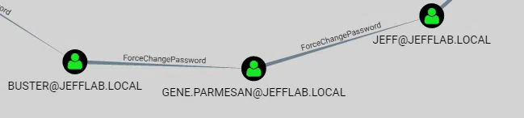
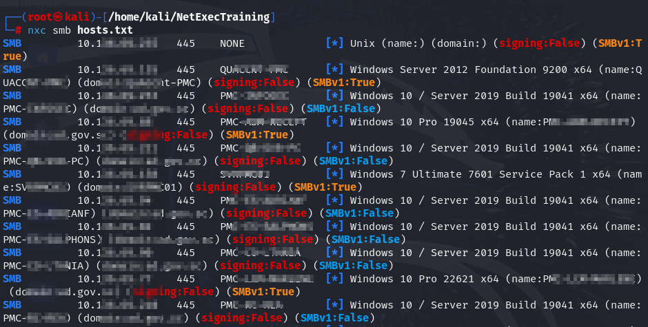

## Introducción a la Fase de Enumeración en un Pentesting de Active Directory (AD)

La enumeración es una de las fases más críticas en un pentesting en entornos Active Directory, ya que permite al atacante (o auditor de seguridad) recopilar información clave sobre el dominio y sus componentes. 

Este conocimiento se utiliza para identificar vulnerabilidades, planificar movimientos laterales y, en última instancia, comprometer el dominio.

## ¿Qué es la enumeración en Active Directory?

La enumeración en AD consiste en recopilar datos estructurados sobre los recursos de la red, como:

+ Usuarios y grupos. 
+ Diferentes máquinas y servidores. 
+ Relaciones de confianza entre dominios. 
+ Permisos y configuraciones. 
+ Políticas de seguridad. 
+ Estos datos se obtienen utilizando protocolos y servicios estándar de Windows (como LDAP, SMB y Kerberos), lo que hace que muchas actividades de enumeración sean difíciles de detectar sin herramientas avanzadas de monitorización.

## Objetivos de la enumeración

  1. <u>Mapear la estructura del dominio:</u>
      + Identificar controladores de dominio (Domain Controllers, DCs) y su configuración. 
      + Enumerar relaciones entre dominios (dominios padres e hijos, relaciones de confianza, etc.). 
  2. <u>Identificar cuentas críticas:</u>
      + Administradores del dominio. 
      + Cuentas de servicio y sus privilegios. 
      + Cuentas con contraseñas débiles o configuraciones inseguras. 
  3. <u>Obtener información sobre configuraciones de seguridad:</u>
      + Políticas de contraseñas y bloqueos. 
      + Grupos privilegiados y sus miembros. 
  4. <u>Descubrir puntos débiles:</u>
      + Permisos mal configurados en objetos del directorio. 
      + Contraseñas almacenadas en texto plano o en archivos compartidos. 

## Herramientas y métodos de enumeración
 1. <u>Comandos Nativos de Windows:</u>
     + **nltest**: Descubre el nombre del dominio, servidores activos y relaciones de confianza. 
     + **net user /domain**: Enumera usuarios en el dominio. 
     + **net group /domain**: Lista grupos y sus miembros. 
     + **gpresult**: Consulta las políticas de grupo aplicadas. 
 2. <u>Uso de Protocolos:</u>
     + **LDAP (Lightweight Directory Access Protocol)**: 
  
         ▪ Protocolo utilizado por Active Directory para acceder a los datos. 

         ▪ Utilizado para consultar la base de datos del dominio, como cuentas de usuario y grupos. 

     + **SMB (Server Message Block)**: 

         ▪ Enumeración de recursos compartidos y políticas de acceso. 

     + **Kerberos**: 
  
         ▪ Permite identificar servicios y cuentas relacionadas con SPNs (Service Principal Names). 

        !!!note "Nota"         
            Los SPNs (Service Principal Names) son identificadores únicos que se utilizan en entornos de Active Directory para asociar servicios a cuentas específicas. Son esenciales para que el protocolo Kerberos funcione correctamente, ya que permiten que un cliente encuentre y autentique servicios en una red de manera segura.

            Por ejemplo:

            ```console
            HTTP/server01.example.com
            MSSQLSvc/sqlserver01.example.com:1433
            ```
            Cuando un cliente necesita acceder a un servicio, utiliza el SPN para solicitar un ticket de servicio (Service Ticket) al KDC (Key Distribution Center). Esto permite la autenticación mutua entre el cliente y el servicio.

 3. <u>Herramientas Especializadas:</u>
     + **BloodHound**: 
         
         ▪ Herramienta gráfica que analiza relaciones de confianza, privilegios y rutas de ataque en AD. 

         


     + **PowerView (parte de PowerSploit)**: 
         
         ▪ Framework de enumeración avanzada escrito en PowerShell. 
         
         ▪ Ejemplo: *Get-NetUser* para listar usuarios, *Get-NetGroupMember* para miembros de grupos. 

         

     + **Impacket**: 
         
         ▪ Biblioteca de Python con herramientas como **GetADUsers.py** para enumerar usuarios en AD. 

         

     + **CrackMapExec**: 
         
         ▪ Herramienta de enumeración y explotación para redes Windows. 

         ▪ Ejemplo: `cme smb <ip> -u usuario -p contraseña --shares para listar recursos compartidos.`

        !!!nota "Nota"
            Ya no se encuentra activamente mantenida en su repositorio original. El proyecto fue archivado en diciembre de 2023 debido a conflictos relacionados con un "fork hostil". 
            
            Sin embargo, su desarrollo continúa bajo un nuevo nombre: **NetExec**, que busca mantener y ampliar las capacidades de CME con actualizaciones regulares y una mayor participación de la comunidad.

            NetExec, liderado por contribuidores como NeffIsBack y Marshall-Hallenbeck, se posiciona como un sucesor gratuito y de código abierto. Este proyecto hereda las funcionalidades principales de CME, corrige problemas previos y está diseñado para satisfacer las necesidades actuales de los pentesters con un enfoque más colaborativo

            


 1. <u>Enumeración Anónima:</u>
     + En configuraciones incorrectas, es posible obtener información sin autenticación. 
     + Herramientas como **rpcclient** o **enum4linux** pueden explotar configuraciones débiles de SMB. 

## Información Crítica a Recopilar

 1. Usuarios y Cuentas

    + Usuarios del dominio: Nombres de usuarios y detalles como cuentas deshabilitadas, bloqueadas o con contraseñas nunca expiradas.
    + Cuentas privilegiadas: Identificación de miembros del grupo Domain Admins o Enterprise Admins.
    + Cuentas de servicio: Cuentas asociadas a servicios, a menudo configuradas con permisos elevados y contraseñas débiles o reutilizadas.

2. Grupos y Relaciones

    + Grupos del dominio: Identificación de grupos administrativos y sus miembros.
    + Relaciones de confianza: Enumeración de relaciones entre dominios o bosques, que pueden usarse para ataques de trust exploitation.
    + Políticas de grupos (GPOs): Configuraciones que podrían revelar credenciales, rutas de inicio de sesión o configuraciones inseguras.

3. Equipos y Servidores

    + Controladores de dominio (DCs): Identificar servidores críticos que gestionan el directorio.
    + Servidores y estaciones de trabajo: Inventario de máquinas del dominio y sus roles.
    + Servicios expuestos: Enumerar servicios como SMB, LDAP, y RPC para posibles puntos de entrada.

4. SPNs (Service Principal Names)

    + Cuentas con SPNs registrados: Esto es fundamental para identificar posibles objetivos de ataques de Kerberoasting, donde se extraen tickets Kerberos para descifrar contraseñas.

5. Políticas y Configuraciones

    + Política de contraseñas: Reglas sobre longitud, complejidad y caducidad.
    + Delegación de cuentas: Detectar cuentas configuradas para delegación, que pueden ser explotadas para ataques como Kerberos delegation abuse.
    + Restricciones de inicio de sesión: Determinar si hay restricciones basadas en horarios o estaciones.

6. Credenciales y Secretos

    + Contraseñas expuestas: Buscar contraseñas almacenadas en descripciones de cuentas, GPOs o scripts.
    + Hash de contraseñas: Obtener hashes para ataques de pass-the-hash o password cracking.
    + Vaults o secretos en AD: Información almacenada en atributos de cuentas como description o comment.

7. ACLs y Permisos

    + Permisos personalizados: Evaluar permisos en objetos críticos del dominio (usuarios, grupos, políticas) para detectar posibles vulnerabilidades.
    + Permisos delegados: Identificar delegaciones inseguras que permitan la elevación de privilegios.

8. Relaciones de Red

    + Sesiones activas: Identificar conexiones entre usuarios y máquinas que podrían usarse para ataques de lateral movement.
    + Mapeo de subredes: Conocer las segmentaciones internas del dominio para planificar movimientos.

## Riesgos Comunes Durante la Enumeración

 1. Detección por parte de sistemas SIEM o EDR:
     + Consultas excesivas o escaneos podrían activar alarmas. 
     + Herramientas como BloodHound pueden generar tráfico sospechoso. 
 2. Interacción con configuraciones sensibles:
     + Algunos comandos podrían impactar en los servicios o generar logs innecesarios. 
 3. Falta de contexto en la interpretación de resultados:
     + No todas las configuraciones identificadas como débiles son explotables sin contexto adicional. 

## Conclusión

La fase de enumeración en un pentesting de Active Directory es fundamental para mapear el entorno y descubrir posibles rutas de ataque. Un enfoque metódico, combinado con herramientas potentes como BloodHound y PowerView, permite maximizar la recolección de datos mientras se minimiza el riesgo de detección.
