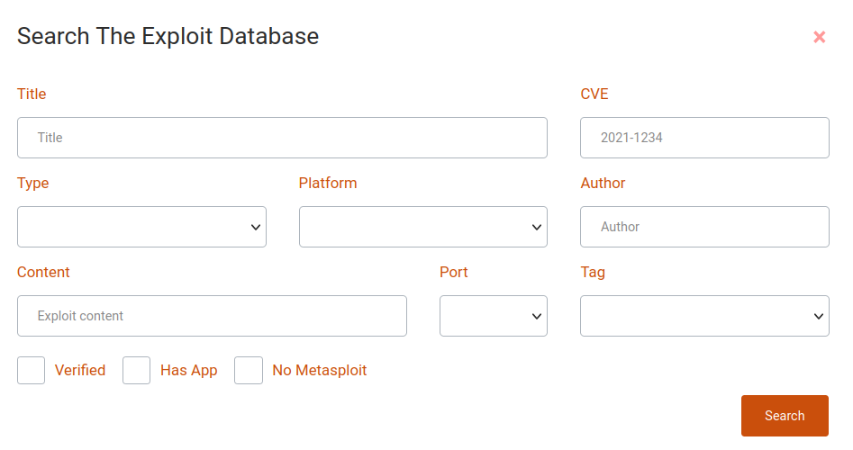
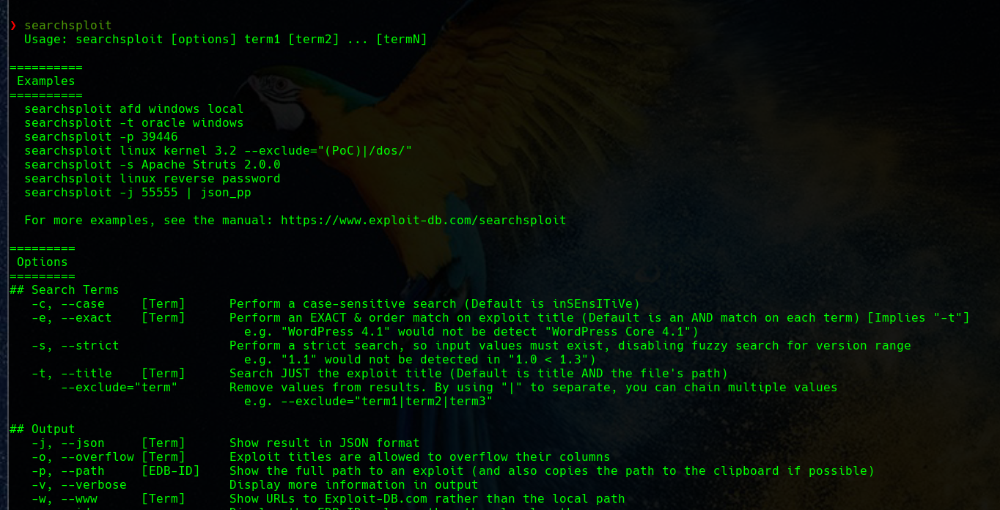
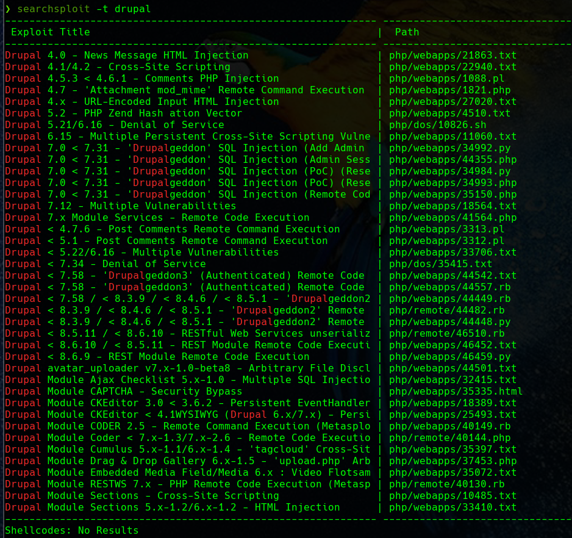
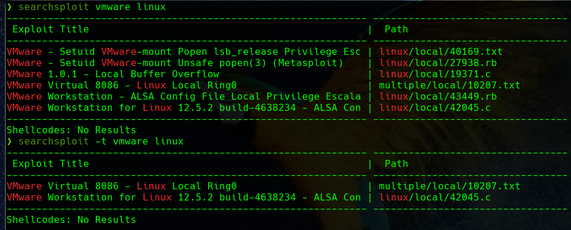
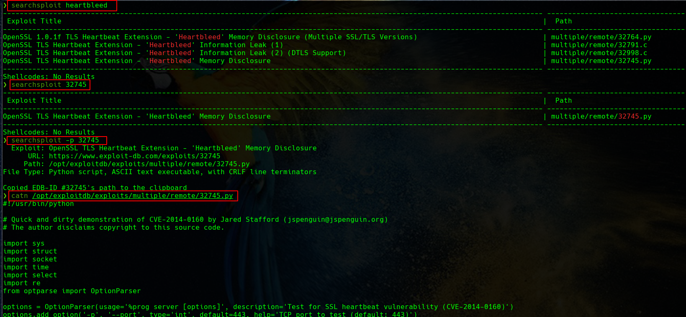
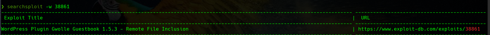
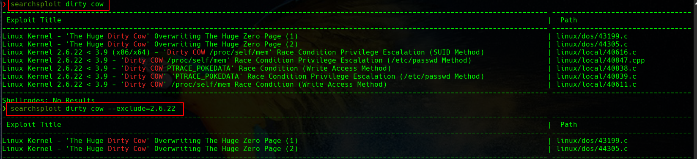

## ¿Qué es un exploit?

Un exploit es un programa o fragmento de código diseñado para encontrar y aprovechar un fallo o vulnerabilidad de seguridad en una aplicación o sistema informático, generalmente con fines maliciosos, como instalar malware. 

Un exploit no es un malware en sí mismo, sino que es un método utilizado por los ciberdelincuentes para distribuir malware.

## Tipos de exploits

### Exploits conocidos 

Una vez que un exploit se da a conocer a los autores del software afectado, la vulnerabilidad a menudo se soluciona mediante un parche para inutilizar el exploit. 

Esta información también se pone a disposición de los proveedores de seguridad. Para las vulnerabilidades de ciberseguridad conocidas públicamente hay organizaciones que enumeran cada vulnerabilidad y proporcionan un número de identificación, una descripción y al menos una referencia pública.

### Exploits desconocidos 

Los exploits desconocidos para todos, excepto para las personas que los desarrollaron, se denominan exploits de día cero. Estos son, con mucho, los exploits más peligrosos, ya que ocurren cuando un software o una arquitectura de sistema contiene una vulnerabilidad de seguridad crítica que el proveedor desconoce.

La vulnerabilidad se da a conocer cuando se detecta que un cibercriminal explota la vulnerabilidad, de ahí el término explotación de día cero.

Una vez que se produce una explotación de este tipo, los sistemas que ejecutan el exploit son vulnerables a un ciberataque. O bien el proveedor finalmente lanzará un parche para corregir la vulnerabilidad o el software de seguridad detecta y bloquea el exploit y el malware resultante.

## Principales bases de datos de exploits

### [Exploit DB](https://www.exploit-db.com/)

Esta es una de las bases de datos de exploits gratuitos más populares, conocida como “Exploit DB“. Este proyecto de Offensive Security tiene como objetivo ser una colección de exploits públicos y software vulnerable disponible para la investigación de vulnerabilidades y pruebas de intrusión.


Día a día, la lista de exploits se crea recopilando exploits de fuentes públicas y privadas, y se presenta en una interfaz fácil de usar que le permite buscar rápidamente en la base de datos. Desde esta área podrás buscar exclusivamente exploits, o tanto exploits como aplicaciones vulnerables, e incluso crear filtros para personalizar tu búsqueda por autor, tipo de plataforma, tags y mucho más.



### [Rapid7](https://www.rapid7.com/db/)

Las personas detrás de Metasploit son conocidas por la alta calidad en sus productos de infosec, y lo mismo ocurre con las vulnerabilidades y la base de datos de exploits de su sitio web.

Rapid7 ofrece una forma rápida y práctica de buscar vulnerabilidades y exploits (módulos), lo que le permite explorar los resultados de cualquier consulta determinada.

Una vez que obtenga los resultados, podrás descubrir más información sobre la vulnerabilidad, con instrucciones exactas para ejecutar este exploit desde la consola de metasploit.


### [CXSecurity](https://cxsecurity.com/exploit/)

Esta base de datos ofrece acceso directo a los exploits más recientes desde una interfaz web, donde se podrá filtrar y encontrar exploits para vulnerabilidades locales o remotas, obtener el nivel de riesgo y otros detalles, como el autor y la fecha de publicación.


### [Vulnerability Lab](https://www.vulnerability-lab.com/)

Vulnerability Lab ofrece acceso a una gran base de datos de vulnerabilidades con exploits y PoC (Proof of Concept) con fines de investigación.

Incluye detalles completos sobre la vulnerabilidad, como fecha, puntaje de riesgo, versión afectada, tipo de vulnerabilidad (remota o local), autor, clase de vulnerabilidad y más.

### [0day](https://en.0day.today/)

También conocido como Inj3ct0r, 0day afirma ser la BD de explotación más grande del mundo, una forma de servicio completo para descubrir, comprar y vender exploits de forma anónima a cualquier persona mediante el uso de monedas digitales como Bitcoin, Litecoin y Ethereum.

El tipo de exploits que se pueden encontrar en esta base de datos incluye local, remoto DoS, PoC, shellcode y otros.

Al navegar por su base de datos, se pueden ver detalles de exploits, como la fecha de publicación, la descripción, la plataforma afectada, los hits, la puntuación de riesgo, el costo del exploit y el autor. El sitio web está traducido a más de una docena de idiomas y afirma que se publicó únicamente con fines educativos.

### [SecurityFocus](https://www.securityfocus.com/vulnerabilities)

SecurityFocus es una comunidad basada en Symantec creada para compartir CVE e información de exploits con desarrolladores e investigadores de seguridad en una ubicación centralizada.

Ofrece acceso directo a CVE y exploits desde una interfaz web fácil de navegar donde puede encontrar vulnerabilidades y filtrar los resultados por proveedor, título y versión de software.

Si bien SecurityFocus es un servicio útil, no se ha actualizado desde julio de 2019. No se encontrarán las últimas vulnerabilidades en él.

### [Packet Storm Security](https://packetstormsecurity.com/files/tags/exploit/)

Packet Storm Security es una comunidad de exploits dedicada a compartir vulnerabilidades y avisos, así como información sobre PoC, demostraciones y exploits en funcionamiento para vulnerabilidades locales y remotas.

Una de las mejores cosas de este sitio es que siempre está actualizado para incluir las últimas vulnerabilidades para una amplia gama de aplicaciones.

### [Google Hacking Database](https://www.exploit-db.com/google-hacking-database)

Si bien estos no son “exploits” oficiales sino más bien Google Dorks, funcionan de la misma manera que un exploit tradicional, pero en lugar de usar código en sus propias aplicaciones o servicios, confía en el lenguaje de sintaxis del motor de búsqueda de Google para ejecutar comandos. y obtener la información que necesita.

Google Hacking Database es un proyecto del dominio Exploit-DB.com, una forma alternativa de encontrar aplicaciones vulnerables y extraer información o de obtener privilegios.

## Exploit-db y searchsploit

Esta base de datos de exploits es mantenida por Offensive Security, una empresa de formación en ciberseguridad que ofrece diversas certificaciones de seguridad de la información (siendo OSCP la más famosa), así como servicios de pruebas de intrusión de alto nivel. Exploit Database es un proyecto sin ánimo de lucro que Offensive Security proporciona como servicio público.

La base de datos de exploits, que cumple con CVE, es un archivo público de exploits, así como el software vulnerable correspondiente, desarrollado para su uso por pentesters e investigadores de vulnerabilidades. Su objetivo es ofrecer la colección más completa de exploits recopilados a través de envíos directos, listas de correo y otras fuentes públicas, y presentarlos en una base de datos de fácil navegación y de libre acceso. La base de datos de exploits es un repositorio de exploits y pruebas de conceptos en lugar de avisos, lo que la convierte en un recurso valioso para quienes necesitan datos procesables de inmediato.

### Searchsploit

SearchSploit es una herramienta de búsqueda de línea de comandos para Exploit-DB que permite tener una copia de la base de datos de exploits. Searchsploit está incluido en el repositorio de Exploit Database en GitHub.

También viene instalado por defecto en algunas de las distribuciones de seguridad más conocidas como Kali o Parrot.

#### Uso de searchsploit

Si escribimos en el terminal:

```sh 
$ searchsploit
```

Se nos ofrece información completa sobre el uso de *searchsploit*:




##### Búsqueda por título 

El uso de la opción ```-t``` habilita el parámetro “título” para buscar un exploit con un título específico. 

Porque por defecto, searchsploit intentará tanto el título del exploit como la ruta. La búsqueda de un exploit con un título específico da resultados rápidos y ordenados.



El comando anterior buscará un exploit relacionado con el CMS *gym* y mostrará todos los exploits disponibles en la base de datos exploit-db.


##### Búsqueda avanzada de títulos

Incluso se puede usar la opción ```-t```, para obtener un resultado más preciso al encontrar la vulnerabilidad de cualquier plataforma en particular. 

Por ejemplo, si queremos buscar vulnerabilidades para Vmware pero únicamente para Linux, haremos



##### Copiar al portapapeles

Al usar la opción ```-p``` se muestra la ruta completa de un exploit.

Esta opción proporciona más información relacionada con el exploit, así como también copia la ruta completa del exploit al portapapeles, todo lo que se necesitas es presionar las teclas Ctrl + V para pegar.



##### Copiar al directorio

La opción -m copia un exploit en el directorio de trabajo actual. Esta opción proporciona la misma información que la anterior relacionada con el exploit, pero también copia el exploit en tu directorio actual de trabajo.


##### Examinar un exploit

Con la opción --examine, se puede leer la funcionalidad de ese exploit con la ayuda del paginador pertinente.

```sh
searchsploit 39166 --examine
searchsploit -x 39166
```


##### Mostrar URL de Exploit-DB

Con la opción ```-w```, se muestra la URL de Exploit-DB.com en lugar de la ruta local. En dicho sitio web obtendrás información más detallada, como CVE-ID, archivos de configuración, etiquetas y asignaciones de vulnerabilidad que no se incluyen en searchsploit.



##### Excluir resultados no deseados

Al usar la opción ```--exclude```, se habilita el parámetro de exclusión para eliminar los resultados no deseados dentro de la lista de exploits. También puedes eliminar varios términos separando los términos con un “|” (pipe). 



##### Distinguir mayúsculas y minúsculas

Al usar la opción ```-c```, se puede realizar una búsqueda que distingue entre mayúsculas y minúsculas. E21sto permite descubrir la vulnerabilidad relacionada con la mención de caracteres específicos en el comando, de manera predeterminada hace una búsqueda insensitive.


# Ejercicios exploit

De la misma forma que se ha mostrado aquí, realizad un escaneo de puertos sobre la máquina [Ignite de TryHackMe](https://tryhackme.com/room/ignite)

Fijáos bien en la información obtenida y buscad algún exploit que pueda usarse contra ella. Para obtener una reverse shell, podéis hacer uso de [este recurso](https://github.com/swisskyrepo/PayloadsAllTheThings/blob/master/Methodology%20and%20Resources/Reverse%20Shell%20Cheatsheet.md#netcat-openbsd). 

El objetivo final es conseguir la flag de usuario (user.txt).