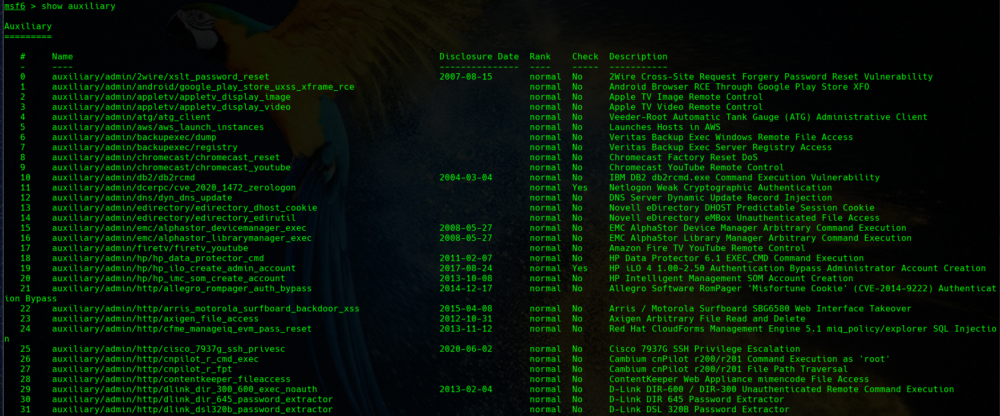

## ¿Qué es Metasploit?

Metasploit es un proyecto de código abierto para la seguridad informática, que proporciona información acerca de vulnerabilidades de seguridad y ayuda en tests de penetración "Pentesting" y el desarrollo de firmas para sistemas de detección de intrusos.

Su subproyecto más conocido es el Metasploit Framework, una herramienta para desarrollar y ejecutar exploits contra una máquina remota.

### Metasploit framework (MSF)

Metasploit framework es una herramienta desarrollada en Perl y Ruby en su mayor parte, que está enfocada a auditores de seguridad y equipos Red Team y Blue Team.

Red Team es el equipo ofensivo o encargado del hacking ético, que hace pruebas de intrusión, mientras que el Blue Team es el equipo que lleva a cabo la securización y toda la parte defensiva.

Es una herramienta muy completa que tiene muchísimos exploits, que son vulnerabilidades conocidas, en las cuales tienen también unos módulos, llamados payloads, que son los códigos que explotan estas vulnerabilidades.

También dispone de otros tipo de módulos, por ejemplo, los encoders, que son una especie de códigos de cifrado para evasión de antivirus o sistemas de seguridad perimetral.

Otra de las ventajas de este framework es que nos permite interactuar también con herramientas externas, como Nmap o Nessus.

Además ofrece la posibilidad de exportar nuestro malware a cualquier formato, ya sea en sistemas Unix o Windows.

Destacar también que es multiplataforma y gratuita, aunque tiene una versión de pago, en la que se nos ofrecen exploits ya desarrollados, pero cuyo coste es bastante elevado. La versión gratuita es muy interesante porque contiene todas las vulnerabilidades públicas.

### Arquitectura de MSF

Metasploit está formado por varios componentes como bibliotecas, módulos, complementos y herramientas importantes. Una pequeño esquema de la estructura de Metasploit podría ser el siguiente:

{: style="height:300px;width:500px" }

El diseño modular facilita la expansión y adaptación del framework de acuerdo a sus respectivos requerimientos, esto es debido a que las funcionalidades ya existentes pueden ser fácilmente reutilizadas.

A continuación una brevísima reseña de los componentes individuales.

#### Ruby Extension Library (REX)

La biblioteca de extensión de Ruby (Ruby Extension Library) es el componente básico del framework. Contiene una variedad de clases que pueden ser utilizadas por las capas subyacentes o directamente por otras herramientas. Las funciones proporcionadas por la biblioteca incluyen, por ejemplo, programas de servidor y cliente de diversos protocolos de red.

#### MSF-Core

El núcleo del framework proporciona funciones para el manejo de eventos y gestión de sesiones, proporcionando funciones importantes para el manejo del framework.
MSF-Base, es decir, proporciona una API básica.

El framework permite acceder más fácilmente al núcleo y forma la interfaz con el exterior. Las interfaces de usuario acceden directamente a esta biblioteca. Vale la pena mencionar la función del plug-in de Metasploit, que permite una extensión flexible del framework agregando nuevos comandos a los componentes existentes.
Módulos

La estructura en módulo de las funciones del framework permite un manejo claro del programa, ya que los nombres de los módulos también son reflejados en la estructura en carpetas del programa.

#### Exploits

Este modulo contiene programas y scripts diseñados para explotar vulnerabilidades.

#### Payloads

Los payloads se proporcionan aquí, estos pueden ser usados tras una exitosa intrusión (explotación) en el sistema objetivo.

Un exploit es una vulnerabilidad, y el payload es la carga que se ejecuta en esa vulnerabilidad, es decir, la carga que activamos a la hora de aprovechar dicha vulnerabilidad.

#### Codificadores y NOPs

Con el fin de hacer más difícil la detección del payload por de los sistemas IDS / IPS1 o programas antivirus, estos módulos ofrecen funciones para ofuscar el payload en redes.

#### Auxiliar

El módulo auxiliar proporciona varios programas de escaneo para la recuperación de información. Estos incluyen escáner de inicio de sesión, escáner de punto débil, sniffers de redes y escáner de puertos. 

### Trabajando con *msfcli*

Metasploit viene instalado por defecto en las principales distribuciones Linux enfocadas a la seguridad.

Para iniciar Metasploit, en primera instancia iniciaremos el servicio `postgresql` e iniciaremos la autoconfiguración de la base de datos de este tipo que utilizará Metasploit para persistir algunos de sus datos. Tras ello, basta con iniciarl `msfcli`. Estas acciones las debemos llevar a cabo como *root* o, si el usuario está habilitado, utilizando *sudo*.

Traducido a la línea de comandos sería así.

Iniciamos el servicio `postgresql`:

Inicializamos la base de datos para Metasploit:

Comprobación de que ambas cosas están funcionando correctamente:

Finalmente, inciciamos **msfcli**.:

Una vez en el terminal de Metasploit, podemos escribir el comando `help` para investigar los comandos que tenemos a nuestra disposición:

Con el comando `show` podremos examinar todos los tipos de módulos:

También podremos realizar búsquedas entre todos los tipos de módulo con un motivo concreto (una vulnerabilidad, una funcionalidad como sería un escáner...). E incluso podríamos restringir la búsqueda a que dicho motivo aparezca en el nombre y se realice únicamente entre un tipo de módulo.

Por ejemplo, en la imagen de abajo se realiza una búsqueda de la vulnerabilidad MS17-010 y, a continuación, se restringe la búsqueda a que esa expresión aparezca en el nombre del módulo y que además éste sea del tipo exploit. Es decir, estamos buscando un exploit para EternalBlue:

Recuadrado en rojo ya nos informa sobre cómo utilizar el módulo que escojamos.

Además, se nos ofrece una información acerca de los módulos, como por ejemplo la fecha de aparición del módulo (disclosure date), si permite comprobar si la víctima u objetivo es vulenrable a ese exploit (check) o qué ranking tiene, entendiendo como ranking el nivel de fiabilidad del exploit o módulo del que se trate. 

Como curiosidad el ranking que se utiliza, de acuerdo con la documentación oficial, es este:

Dado que Metasploit abarca un gran abanico de posibilidades y conocimientos, escapa por completo al propósito de este curso el impartir una formación detallada del framework. Es por ello que símplemente veremos unas ínfimas pinceladas de sus posibilidades, relacionadas con el uso de exploits.

!!!Note "Nota del autor"
    Si bien es cierto que Metasploit es una herramienta de gran utilidad y que permite automatizar un gran número de tareas, ahorrando de esta manera en ocasiones un tiempo valioso, se recomienda no ceñirse ni abusar de ella.

    Podríamos llegar a explotar vulnerabilidades graves y complejas de una forma relativamente sencilla mediante el uso de Metasploit. Sin embargo, el fin último de un estudiante de seguridad informática será entender las bases, los principios y funcionamientos internos con el mayor detalle posible. Sólo de esta manera podremos desarrollar adecuadamente nuestro perfil en ciberseguridad, así como evitar futuros desastres.

    En resumen, siempre que se pueda, se recomienda la explotación manual de las vulnerabilidades para su perfecta comprensión.

## Uso de exploits en Metasploit

Como ya se ha comentado, se presentará la forma más básica de uso de un exploit en Metasploit sin apenas entrar en detalle. Se deja a elección del alumno profundizar tanto cuanto quiera en el tema con los múltiples recursos gratuitos o de pago que existen hoy día en la red.

Dicho esto, ilustraremos esta sección con un ejemplo.

Supongamos que en una auditoría perfectamente legal hemos llevado a cabo un escaneo de puertos y hemos descubierto que la aplicación de streaming **Icecast** está corriendo en su puerto por defecto, el 8000.

Si tenemos iniciado Metasploit, buscaremos un exploit para esta aplicación:

Podemos elegir el exploit a utilizar mediante el comando `use` seguido bien del número del índice que nos muestra, como pasa en la imagen de arriba, o bien indicándole la ruta completa, como vemos abajo:

Una vez seleccionado el exploit a utilizar, debemos investigar que parámetros y opciones tiene para poder configurarlas adecuadamente. Esto lo haremos con `show options`:

Hay unas opciones comunes que aparecen en la práctica totalidad de exploits puesto que casi siempre irán dirigidos a conseguir una shell inversa. Si lo consigue, nos devolverá un terminal de Meterpreter. Estas opciones son:

+ **RHOSTS:** Hace referencia a la IP del host remoto, víctima u objetivo
+ **RPORT:** Hace referencia al puerto que atacaremos del objetivo
+ **LHOST:** IP de la máquina local a la que se conectará la reverse shell (es decir, nuestra propia IP)
+ **LPORT:** El puerto de nuestra máquina local que utilizará la reverse shell para conectarse desde la víctima

Para establecer los valores de estas opciones o parámetros, utilizaremos el comando `set`, seguido del parámetro que queramos establecer y a continuación el valor que le queremos dar, tal y como se muestra abajo:

Así pues, ya hemos establecido los valores necesarios para las opciones del exploit y hemos comprobado que todo está correcto. 

Ya estamos en condiciones de correr nuestro exploit y ver si tenemos éxito. Para llevar a cabo este cometido, podemos emplear el comando `run` o `exploit` indiferentemente:

Vemos como el exploit realiza una serie de acciones en background hasta que consigue devolvernos la shell inversa en formato Meterpreter. En esta shell comprobamos que efectivamente estamos dentro de la máquina víctima, que es un Windows 7 y que lo hemos hecho con el usuario Dark.

