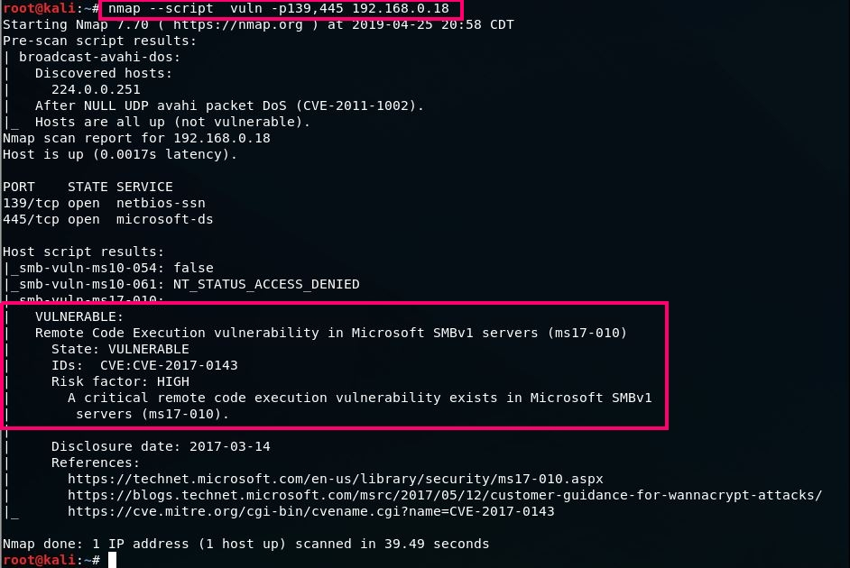

## ¿Qué son los puertos?

Ya hemos comentado que Nmap es el estándar de facto a la hora de realizar un escáner de puertos pero... ¿qué entendemos por puertos?

En los sistemas operativos modernos, los puertos son direcciones numeradas para el tráfico de red. Los diferentes tipos de servicios utilizan diferentes puertos de forma predeterminada.

Por ejemplo, el tráfico web normal usa el puerto 80, mientras que el correo electrónico POP3 usa el puerto 110. Una de las formas en que funciona un firewall es permitiendo o restringiendo el tráfico a través de un puerto en particular.

Dado que la configuración del puerto puede suponer un riesgo para la seguridad, es fundamental saber qué puertos están abiertos y cuáles están bloqueados.

## ¿Qué es un escáner de puertos? 

Esta es una herramienta que se utiliza para descubrir y auditar redes, escanear y verificar vulnerabilidades en direcciones y puertos de Protocolo de Internet (IP) para una red determinada.

Es usado por el administrador de red, gerente de TI o simplemente un profesional de seguridad de la empresa. Uno de los desafíos críticos que enfrentarán estos perfiles es batallar para saber qué se está ejecutando en su red y el tipo de problemas/desafíos de seguridad que plantean.

Hay varias herramientas (incluido Nmap) disponibles para que los administradores de red las usen para monitorear su red y obtener actividades en tiempo real en su red:

Con Nmap:

+ Los administradores de red pueden identificar todos los dispositivos que se ejecutan o acceden a sus sistemas.
+ Un administrador puede identificar todos los hosts, equipos conectados a su red, así como los servicios que ofrecen.
+ Un administrador puede escanear todos los puertos abiertos, dando prioridad a la seguridad, es decir, las detecciones de amenazas a la seguridad.
+ Un administrador puede escanear/monitorear un solo host o miles de dispositivos conectados.

Como se ha indicado al principio, Nmap es, con mucho, la herramienta de escaneo de red más utilizada. Es una herramienta de escaneo de puertos, lo que significa que recopila información de estos puertos. 

Nmap es un detector de puertos. Puede escuchar las respuestas en el proceso. Puede determinar si un puerto está abierto o cerrado o filtrado de una forma u otra por el firewall (un sistema diseñado para denegar el acceso de usuarios no autorizados hacia o desde una red privada).

Es una herramienta flexible y versátil, lo que significa que puede adaptarse a diferentes actividades y funciones.

!!!Note "Nota"
    El escaneo de puertos también se puede denominar enumeración o descubrimiento de puertos. Usaremos estos términos indistintamente, mientras que significan lo mismo.

Tal y como podemos leer en el propio site de [Nmap](https://nmap.org/book/intro.html):

Nmap utiliza paquetes IP sin procesar de formas novedosas para determinar qué hosts están disponibles en la red, qué servicios (nombre y versión de la aplicación) ofrecen esos hosts, qué sistemas operativos (y versiones de SO) están ejecutando, qué tipo de filtros de paquetes/firewalls están en uso y decenas de otras características.

Fue diseñado para escanear rápidamente redes grandes, pero funciona bien contra hosts únicos. Nmap se ejecuta en todos los principales sistemas operativos de computadoras, y están disponibles versiones gráficas y de consola.

## Windows o Linux

Nmap se desarrolló inicialmente para ejecutarse solo en sistemas basados en Unix. La versión de Windows se lanzó en 2000, pero con algunas limitaciones que incluyen:

+ Microsoft eliminó el soporte para el socket TCP/IP sin procesar, ha demostrado ser difícil escanear varios clientes VPN ya que Nmap solo admite interfaces Ethernet.

+ Se sabe que las API de red de Windows tienen varias deficiencias, por lo que no son lo suficientemente eficientes.

+ Escanear la propia máquina desde sí misma se ha demostrado ser difícil de ejecutar y, por lo tanto, imposible.

!!!Info "Info"
    Por lo tanto, se recomienda el uso de Nmap en Linux por una mayor rapidez, eficiencia y experiencia de uso.

    Es posible instalar la interfaz gráfica "Zenmap" como frontend de Nmap aunque en este curso únicamente veremos su manejo en línea de comandos en Linux.

    Este curso no cubre el proceso de instalación de ninguna de las dos herramientas en ninguno de los dos SSOO ya que se da por sabido este proceso.

## Uso de Nmap

Podemos ver la infinidad de opciones que nos ofrece Nmap simplemente escribiendo ```$ nmap``` en el terminal:

{: style="height:600px;width:500px"}

Existen un [sinfín de técnicas y algoritmos de escaneo en Nmap](https://nmap.org/book/scan-methods.html), así como otras tantas opciones a aplicar a estos escaneos. Es imposible cubrirlo todo en este curso por lo que sólo nombraremos los aspectos más importantes y queda a discrección del alumno profundizar más.

Output completo:

```sh
Nmap 5.61TEST5 ( https://nmap.org )
Usage: nmap [Scan Type(s)] [Options] {target specification}
TARGET SPECIFICATION:
  Can pass hostnames, IP addresses, networks, etc.
  Ex: scanme.nmap.org, microsoft.com/24, 192.168.0.1; 10.0.0-255.1-254
  -iL : Input from list of hosts/networks
  -iR : Choose random targets
  --exclude : Exclude hosts/networks
  --excludefile : Exclude list from file
HOST DISCOVERY:
  -sL: List Scan - simply list targets to scan
  -sn: Ping Scan - disable port scan
  -Pn: Treat all hosts as online -- skip host discovery
  -PS/PA/PU/PY[portlist]: TCP SYN/ACK, UDP or SCTP discovery to given ports
  -PE/PP/PM: ICMP echo, timestamp, and netmask request discovery probes
  -PO[protocol list]: IP Protocol Ping
  -n/-R: Never do DNS resolution/Always resolve [default: sometimes]
  --dns-servers : Specify custom DNS servers
  --system-dns: Use OS's DNS resolver
  --traceroute: Trace hop path to each host
SCAN TECHNIQUES:
  -sS/sT/sA/sW/sM: TCP SYN/Connect()/ACK/Window/Maimon scans
  -sU: UDP Scan
  -sN/sF/sX: TCP Null, FIN, and Xmas scans
  --scanflags : Customize TCP scan flags
  -sI : Idle scan
  -sY/sZ: SCTP INIT/COOKIE-ECHO scans
  -sO: IP protocol scan
  -b : FTP bounce scan
PORT SPECIFICATION AND SCAN ORDER:
  -p : Only scan specified ports
    Ex: -p22; -p1-65535; -p U:53,111,137,T:21-25,80,139,8080,S:9
  -F: Fast mode - Scan fewer ports than the default scan
  -r: Scan ports consecutively - don't randomize
  --top-ports : Scan  most common ports
  --port-ratio : Scan ports more common than 
SERVICE/VERSION DETECTION:
  -sV: Probe open ports to determine service/version info
  --version-intensity : Set from 0 (light) to 9 (try all probes)
  --version-light: Limit to most likely probes (intensity 2)
  --version-all: Try every single probe (intensity 9)
  --version-trace: Show detailed version scan activity (for debugging)
SCRIPT SCAN:
  -sC: equivalent to --script=default
  --script=:  is a comma separated list of
           directories, script-files or script-categories
  --script-args=: provide arguments to scripts
  --script-args-file=filename: provide NSE script args in a file
  --script-trace: Show all data sent and received
  --script-updatedb: Update the script database.
  --script-help=: Show help about scripts.
            is a comma separted list of script-files or
           script-categories.
OS DETECTION:
  -O: Enable OS detection
  --osscan-limit: Limit OS detection to promising targets
  --osscan-guess: Guess OS more aggressively
TIMING AND PERFORMANCE:
  Options which take  are in seconds, or append 'ms' (milliseconds),
  's' (seconds), 'm' (minutes), or 'h' (hours) to the value (e.g. 30m).
  -T<0-5>: Set timing template (higher is faster)
  --min-hostgroup/max-hostgroup : Parallel host scan group sizes
  --min-parallelism/max-parallelism : Probe parallelization
  --min-rtt-timeout/max-rtt-timeout/initial-rtt-timeout : Specifies
      probe round trip time.
  --max-retries : Caps number of port scan probe retransmissions.
  --host-timeout : Give up on target after this long
  --scan-delay/--max-scan-delay : Adjust delay between probes
  --min-rate : Send packets no slower than  per second
  --max-rate : Send packets no faster than  per second
FIREWALL/IDS EVASION AND SPOOFING:
  -f; --mtu : fragment packets (optionally w/given MTU)
  -D : Cloak a scan with decoys
  -S : Spoof source address
  -e : Use specified interface
  -g/--source-port : Use given port number
  --data-length : Append random data to sent packets
  --ip-options : Send packets with specified ip options
  --ttl : Set IP time-to-live field
  --spoof-mac : Spoof your MAC address
  --badsum: Send packets with a bogus TCP/UDP/SCTP checksum
OUTPUT:
  -oN/-oX/-oS/-oG : Output scan in normal, XML, s|: Output in the three major formats at once
  -v: Increase verbosity level (use -vv or more for greater effect)
  -d: Increase debugging level (use -dd or more for greater effect)
  --reason: Display the reason a port is in a particular state
  --open: Only show open (or possibly open) ports
  --packet-trace: Show all packets sent and received
  --iflist: Print host interfaces and routes (for debugging)
  --log-errors: Log errors/warnings to the normal-format output file
  --append-output: Append to rather than clobber specified output files
  --resume : Resume an aborted scan
  --stylesheet : XSL stylesheet to transform XML output to HTML
  --webxml: Reference stylesheet from Nmap.Org for more portable XML
  --no-stylesheet: Prevent associating of XSL stylesheet w/XML output
MISC:
  -6: Enable IPv6 scanning
  -A: Enable OS detection, version detection, script scanning, and traceroute
  --datadir : Specify custom Nmap data file location
  --send-eth/--send-ip: Send using raw ethernet frames or IP packets
  --privileged: Assume that the user is fully privileged
  --unprivileged: Assume the user lacks raw socket privileges
  -V: Print version number
  -h: Print this help summary page.
EXAMPLES:
  nmap -v -A scanme.nmap.org
  nmap -v -sn 192.168.0.0/16 10.0.0.0/8
  nmap -v -iR 10000 -Pn -p 80
SEE THE MAN PAGE (https://nmap.org/book/man.html) FOR MORE OPTIONS AND EXAMPLES
```

### Tipos de escaneos

#### Antes de nada: recordatorio del 3-way-handshake

Primero, un poco de antecedentes. Durante la comunicación con un servicio TCP, se establece una única conexión con el protocolo de enlace de 3 vías de TCP. Esto implica un ```SYN``` enviado a un puerto abierto TCP que tiene un servicio vinculado a él, ejemplos típicos son HTTP (puerto 80), SMTP (puerto 25), POP3 (puerto 110) o SSH (puerto 22).

En el lado del servidor ser verá un ```SYN``` y se responderá con ```SYN ACK```, y el cliente responderá ```SYN ACK``` con un ```ACK```. Esto completa la configuración y ahora se puede realizar el intercambio de datos.


En este ejemplo, el firewall pasa el tráfico al servidor web (HTTP -> 80) y el servidor web responde con el acuse de recibo.

En todos estos ejemplos, un firewall podría ser un dispositivo de hardware independiente o podría ser un firewall de software local en la computadora host.

 
#### Escaneo TCP SYN (-sS)

El análisis SYN es la opción de análisis predeterminada y más popular, por buenas razones. Se puede realizar rápidamente, escaneando miles de puertos por segundo en una red rápida no obstaculizada por firewalls restrictivos.

También es relativamente discreto y sigiloso, ya que nunca completa las conexiones TCP.

Características:

+ Rápido
+ Relativamente sigiloso
+ Requiere privilegios 

```sh
$nmap -sS objetivo
```
#### Escaneo TCP connect (-sT)

El escaneo de conexión TCP es el tipo de escaneo TCP predeterminado cuando el escaneo SYN no es una opción.Este es el caso cuando un usuario no tiene privilegios de paquetes sin procesar.

En lugar de escribir paquetes sin procesar como hacen la mayoría de los otros tipos de escaneo, Nmap le pide al sistema operativo subyacente que establezca una conexión con la máquina y el puerto de destino emitiendo la llamada al sistema de conexión.

```sh
$nmap -sT objetivo
```
Características: 

+ Confía en el sistema operativo
+ Más lento que TCP-SYN-Scan

#### Escaneos UDP (-sU)

Si bien los servicios más populares en Internet se ejecutan sobre el protocolo TCP, los servicios UDP se implementan ampliamente. DNS, SNMP y DHCP (puertos registrados 53, 161/162 y 67/68) son tres de los más comunes. 

Debido a que el escaneo UDP es generalmente más lento y más difícil que TCP, algunos auditores de seguridad ignoran estos puertos. Esto es un error, ya que los servicios UDP explotables son bastante comunes y los atacantes ciertamente no ignoran todo el protocolo.

```sh
$nmap -sU objetivo
```
Características:

+ Lento
+ Poco fiable

#### TCP Null scan (-sN)

En los TCP Null Scans, los paquetes TCP enviados no tienen ninguna de las flags TCP establecidas.

Según el RFC, ante tal circunstancia, el objetivo debe responder con un RST si el puerto está cerrado

```sh
$nmap -sN objetivo
```

#### TCP FIN scan (-sF)

Esto es muy similar al anterior, excepto por el hecho de que en lugar de enviar un paquete TCP completamente vacío, envía un paquete con el flag FIN establecido que se usa para cerrar una conexión ordenadamente.

En consecuencia, el objetivo debe responder con un RST para puertos cerrados según RFC.

```sh
$nmap -sF objetivo
```

#### TCP Xmas scan (-sX)

TCP Xmas Scans también es muy similar a las dos últimas técnicas de escaneo, excepto por el hecho de que utilizan paquetes TCP con los flags PSH, URG y FIN configurados.

Como los dos últimos tipos de escaneo, esto también espera paquetes RST para puertos cerrados bajo RFC.

```sh
$nmap -sX objetivo
```

### Estados de los puertos escaneados

Tras realizar el escaneo de puertos, se nos pueden reportar cuatro posibles estados de los mismos:

+ **open**: El puerto responde activamente a las conexiones entrantes

+ **open | filtered**: cuando no se recibe respuesta, el puerto se clasifica así porque "ninguna respuesta" puede significar sólo dos cosas:
    
    + El puerto esta abierto (en algunos tipos de escaneos no se recibe respuesta al SYN)
    + El puerto está protegido detrás de un firewall, por lo que se filtra

+ **filtered**: cuando el puerto está protegido detrás de un firewall que envía un ping ICMP de vuelta 

+ **closed**: cuando se recibe un paquete RST

#### Puertos filtrados o bloqueados

El trabajo de un firewall es proteger un sistema de paquetes no deseados que podrían dañarlo. En este ejemplo simple, el escaneo de puertos se realiza en el puerto 81, ya que no hay ningún servicio ejecutándose en este puerto, por lo que la mejor práctica es usar un firewall para bloquear el acceso.

Un ```filtered``` port como resultado de Nmap indica que el puerto no ha respondido en absoluto. El SYN simplemente ha sido descartado por el firewall. 


#### Puertos cerrados o cuando falla el Firewall

En este caso, el resultado ```closed``` más común indica que no hay ningún servicio ejecutándose en el puerto, pero el firewall ha permitido que la conexión pase al servidor. También puede significar que no hay ningún firewall presente.

Se debe tener en cuenta que aunque se presentan los escenarios más comunes, es posible configurar un firewall para rechazar paquetes en lugar de descartarlos. Esto significaría que los paquetes que lleguen al firewall se verán cerrados (el firewall responde con RST ACK).

A continuación se muestra un caso en el que una regla de firewall permite el paso del paquete en el puerto 81 aunque no haya ningún servicio escuchando en el puerto. Lo más probable es que esto se deba a que el firewall está mal configurado.


#### Puertos abiertos

Cuando de algún puerto se indica el resultado ```Open``` en principio se trata de algún servicio expuesto al público que está accesible.

Un detalle interesante a notar es el ```RST```  enviado después de aceptar el ```SYN ACK``` desde el servidor web. El ```RST``` es enviado por Nmap ya que el estado del puerto (abierto) ha sido determinado por el ```SYN ACK```. Si estuviéramos buscando más información como la versión del servicio HTTP o para obtener la página, el RST no se enviaría. Se establecería una conexión completa.


#### Opciones para los escaneos (switches de Nmap)

Es imposible comentar todas las opciones que se pueden usar con Nmap, pero algunas de las más notorias serían:


* ```-T(0-5)```:  Esta es una opción para establecer la velocidad del escaneo. Los números van de 0 a 5, donde 5 es el más rápido y 0 es el más lento.


+ ```-A```: Esta opción hace que Nmap se esfuerce en identificar el sistema operativo, los servicios y las versiones de destino. También hace traceroute y **aplica scripts NSE para detectar información adicional**. Este es un escaneo bastante ruidoso ya que aplica muchos escaneos diferentes. Los scripts NSE aplicados son los de la configuración por defecto.

* ```-v```: Mayor verbosidad. Esto nos dará información adicional en los datos generados por Nmap.

* ```-sV```: Se utiliza para sondear activamente los puertos abiertos para intentar determinar qué servicio y versión están ejecutando. 


* ```-p```: Lista separada por comas de los puertos que se desean analizar. Una forma sencilla de definir solo unos pocos puertos para escanear o aumentar el alcance del escaneo a, por ejemplo, todos los puertos TCP disponibles.


* ```-O```: Hacer que Nmap intente decidir qué tipo de sistema operativo es. El proceso de detección del sistema operativo puede ser bastante complejo, pero también bastante simple. Un factor simple para intentar decidir si se trata de un sistema operativo Windows o Unix es mirar el campo TTL (Tiempo de vida) en los paquetes que se envían desde el sistema operativo. Por lo general, Windows tiene un valor predeterminado de 128, mientras que Unix tiene un valor predeterminado de 64.

* ```-Pn```: Fuerza la suposición de que el host está activo, omitiendo así la fase de descubrimiento del host.

* ```-oA```: Guarda el resultado de salida de Nmap en formatos "normal", XML y grepable. No obstante, se puede concretar de forma específica el formato del archivo de salida:

     + ```-oN```: redirige la salida normal a un nombre de archivo determinado
  
     + ```-oX```: Produce resultados en un formato XML limpio y guárdalos en un archivo determinado.
    
     + ```-oG```: Produce una salida "grepable" y la almacena en un archivo. Formato obsoleto ya que los usuarios ahora se están moviendo hacia salidas XML.


### Scripts en Nmap

Nmap incorpora un potente sistema de scripts conocido como NSE (Nmap Scripting Engine) que permite a los usuarios extender las capacidades de Nmap usando los diversos scripts que incorpora (actualmente hay más de 500 disponibles) que permiten desde la detección avanzada de versiones a la explotación de vulnerabilidades, o creando nuevos scripts que podemos compartir con el resto de usuarios (para los script se utiliza el [lenguaje de programación LUA](https://www.lua.org/)).

Para habilitar el uso de script en Nmap usamos la opción ```-sC (nmap -sC <objetivo>)```. Con esta opción se seleccionarán todos los scripts NSE que pertenecen a la categoría predeterminada (*default*) y se ejecutarán contra los objetivos que indiquemos en el comando, por ejemplo:

```sh
$ nmap -sC scanme.nmap.org
```
En este caso le estamos indicando que habilite el uso de scripts de la categoría predeterminada y Nmap selecciona los script a usar teniendo en cuenta los puertos que encuentra. En este caso se ejecutan los scripts ```ssh-hostkey``` y ```http-title``` como podemos ver en los resultados reportados:

```sh
Starting Nmap 7.80 ( https://nmap.org ) at 2021-02-22 13:01 CET
Nmap scan report for scanme.nmap.org (45.33.32.156)
Host is up (0.26s latency).
Other addresses for scanme.nmap.org (not scanned): 2600:3c01::f03c:91ff:fe18:bb2f
Not shown: 996 closed ports
PORT      STATE SERVICE
22/tcp    open  ssh
| ssh-hostkey: 
|   1024 ac:00:a0:1a:82:ff:cc:55:99:dc:67:2b:34:97:6b:75 (DSA)
|   2048 20:3d:2d:44:62:2a:b0:5a:9d:b5:b3:05:14:c2:a6:b2 (RSA)
|   256 96:02:bb:5e:57:54:1c:4e:45:2f:56:4c:4a:24:b2:57 (ECDSA)
|_  256 33:fa:91:0f:e0:e1:7b:1f:6d:05:a2:b0:f1:54:41:56 (ED25519)
80/tcp    open  http
|_http-title: Go ahead and ScanMe!
9929/tcp  open  nping-echo
31337/tcp open  Elite

Nmap done: 1 IP address (1 host up) scanned in 11.64 seconds
```
 
Los scripts en NSE se dividen en las siguientes categorías:

+ ```auth```: Este tipo de Scripts permiten determinar credenciales de autenticación en el sistema objetivo, frecuentemente realizando ataques de fuerza bruta sencillos, algunos ejemplos de este tipo de scripts son ftp-anon, snmp-brute, http-auth, etc.

+ ```broadcast```: Este tipo de Scripts permiten determinar credenciales de autenticación en el sistema objetivo, frecuentemente realizando ataques de fuerza bruta sencillos, algunos ejemplos de este tipo de scripts son ftp-anon, snmp-brute, http-auth, etc.

+ ```brute```: esta categoría es para scripts que utilizan el sistema de fuerza bruta para averiguar las credenciales de usuario en un determinado servicio
  
+ ```default```: estos son los scripts que se ejecutan cuando se ejecuta la opción -sC. Se trata de un conjunto de scripts que ejecutan operaciones concretas tratando de capturar la mayor cantidad de información contra un objetivo, se trata de una categoría que debe ser evitada, ya que puede hacer mucho ruido contra un sistema remoto que tenga un IDS/IPS instalado, utilizando esta categoría, probablemente el escaneo no sea tan discreto como se espera.

+ ```discovery```: Estos scripts tratan de descubrir de forma activa servicios en el segmento de red tales como registros públicos, dispositivos SNMP, servicios de directorio, etc.

+ ```dos```: Intentan causar denegación de servicio sobre un servicio determinado.

+ ```exploit```: Tratan de detectar y explotar algún tipo de vulnerabilidad sobre el objetivo.

+ ```external```: Registran la información de un escaneo determinado en un recurso externo como por ejemplo un servicio de almacenamiento en internet, sin embargo es necesario ser cauteloso con este tipo de scripts ya que pueden enviar a una fuente externa la dirección IP del objetivo y del atacante.

+ ```fuzzer```: Estos Scripts envían información al servidor que es inesperada, incompleta o aleatoria, con el fin de detectar una posible vulnerabilidad en el servicio, sin embargo es costoso en términos de rendimiento del escaneo.

+ ```intrusive```: Son Scripts con un alto grado de ser perjudiciales para el sistema objetivo, ya que intenta utilizar recursos del sistema objetivo tales como proxys HTTP o dispositivos con SNMP habilitado.

+ ```malware```: Intentan determinar si el objetivo se encuentra infectado con malware o backdoors, algunos ejemplos de esta categoría de Scripts son: ```smtp-strangeport``` y ```auth-spoof```

+ ```safe```: Están diseñados para no afectar ni dañar el objetivo, simplemente tratan de capturar información que pueda ser sensible sin afectar el rendimiento u otros factores de la ejecución del servicio, ejemplos de este tipo de scripts pueden ser: ssh-hostkey o html-title 

+ ```version```: Se trata de scripts que extienden el proceso de detección de versiones de servicios, están diseñados para ejecutarse solamente si el escaneo tiene la opción (Scan Version -sV)

+ ```vuln```: Chequean vulnerabilidades especificas de software y generan resultados solamente si dichas vulnerabilidades son encontradas, ejemplos de este tipo de scripts son: ```realvnc-auth-bypass``` y ```afp-path-vuln```

Si la instalación de Nmap se ha realizado desde apt-get o dpkg, probablemente la ubicación de todos los scripts se encuentre en ```/usr/share/nmap/scripts```

#### Selección de scripts

Podemos seleccionar el script que queremos ejecutar directamente indicando el fichero o podemos seleccionar todos los de una categoría o categorías.

##### Seleccionar categorías

```sh
nmap -sV --script <categoria> <objetivo>
```

Por ejemplo:

```sh
nmap -sV --script version scanme.nmap.org
```

Ejecutamos los script de la categoría version contra el objetivo scanme.nmap.org:

```sh
nmap -sV --script="version,discovery" scanme.nmap.org
```

Además de los script de la categoría version también se usarán los de la categoría discovery.

```sh
nmap -sV --script "not intrusive" scanme.nmap.org
```

En este caso se ejecutarían todos los script excepto los de la categoría intrusive.

```sh 
nmap -sV --script "(http-*) and not http-brute" scanme.nmap.org
```

En este caso se ejecutarían todos los script http excepto http-brute.

##### Selección de script específico

```sh
nmap --script <nombre de fichero> <objetivo>
```

Por ejemplo:

```sh 
nmap --script http-title scanme.nmap.org
```

Se ejecucuta el script http-title contra el objetivo scanme.nmap.org (es posible indicar varios scripts separandolos por comas).


#### Actualizar la base de datos de scripts

```sh
sudo nmap --script-updatedb
```

Se actualizarán los script contra la base de datos de Nmap y los script nuevos se guardaran en la ruta por defecto de nuestra instalación.

#### Demostración de algunos scripts

1. Comprobar las versiones de los servicios en los puertos abiertos

    

2. A continuación se utiliza el script ```ftp-anon``` de la categoría ```auth```. Este script nos permitirá saber si el acceso anónimo al servidor ftp está permitido.

    

3. Con el script ```http-defaults-accounts``` se intenta determinar si el acceso con credenciales por defecto está habilitado en algunas aplicaciones web.


    

4. El script ```ftp-vsftpd-backdoor``` corresponde a las categorías: exploit, intrusive, malware, vuln; este script busca la existencia de la puerta trasera (backdoor) reportada en [CVE-2011-2523](https://www.incibe-cert.es/alerta-temprana/vulnerabilidades/cve-2011-2523) (una vulnerabilidad antigua pero con fines ilustrativos)

    

5. Utilizando los scripts de la categoría ```vuln``` para descubrir la vlnerabilidad [MS17-010 (Eternalblue)](https://www.csirt-epn.edu.ec/servicios/vulnerabilidades/58-ms17-010), la que utilizó *Wannacry* en su día.

    

    Para haber buscado vulnerabilidad específicas de SMB, podíamos haber utilizado también:

    ```sh
    nmap -sV --script smb* <Objetivo>
    ```
## Ejercicios de Nmap

Completar la sala dedicada a Nmap en TryHackMe: [Furthernmap](https://tryhackme.com/room/furthernmap)