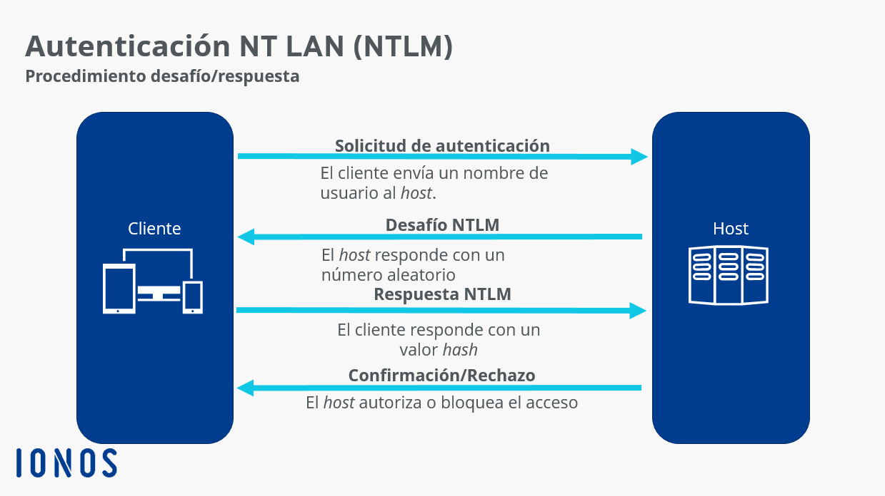

## Credenciales en Windows

El sistema operativo Windows tiene muchos lugares diferentes donde almacena o *cachea* sus credenciales. A continuación se nombran algunos de los tipos de credenciales de Windows que almacena y las ubicaciones donde se pueden encontrar estas credenciales:

+ **Base de datos del administrador de cuentas de seguridad (SAM).**
  
    La base de datos SAM es un archivo que está presente en ^^todos^^ los sistemas Windows.
    
    Este archivo contiene todas las cuentas creadas, así como todas las cuentas integradas que se encuentran en un sistema operativo Windows (XP, Vista, Win7, 8.1 y 10). Las contraseñas se almacenan aquí como hashes. (hash de contraseña NT)

+ **Otros archivos**

    Las contraseñas también se pueden encontrar en una gran variedad de archivos, incluidos los archivos de configuración y los archivos creados por el usuario (generalmente en texto plano).
    
    Ciertos archivos de registro pueden contener información de credenciales, como los registros del instalador, y en ocasiones también se pueden encontrar en los informes de vulnerabilidades.

+ **Credenciales en caché**
  
    ^^Las credenciales de dominio se almacenan en caché en el registro para permitir que los usuarios inicien sesión en su sistema cuando no está conectado al dominio.^^
    
    El sistema de Windows almacena en caché los últimos 10 hashes de inicio de sesión y algunos almacenan hasta 25 de forma predeterminada. Este número es configurable en el registro.

    Como ya se ha dicho, esto permite que si se pierda la conectividad con el Domain Controller de Active Directory, por la razón que sea, podamos al menos acceder a nuestro sistema.

+ **Secreto de la autoridad de seguridad local (LSA)**
  
    Los secretos de LSA se almacenan en el registro y permiten que los servicios se ejecuten con privilegios de usuario. Esto incluye VPN, tareas programadas, inicios de sesión automáticos, cuentas de servicio de copia de seguridad, sitios web de IIS, etc. Se incluyen en el registro de Seguridad/Política/Secretos en forma cifrada.

+ **Proceso de servicio del subsistema de la autoridad de seguridad local (LSASS)**
  
    Al iniciar sesión en una máquina con Windows, ya sea localmente o en un dominio, las credenciales se almacenan en el proceso LSASS en la memoria.
    
    ^^Esto se usa principalmente para permitir que el usuario acceda a otros recursos en la red a los que está autorizado a acceder sin tener que volver a autenticarse.^^ 
    
    Los formatos almacenados pueden ser texto sin formato (cifrado reversible), hash NT y LM y tickets Kerberos.

+ **Credential Manager**
  
    El administrador viene preinstalado ya en Windows 7 y superiores
    
    Básicamente es un almacén digital que permite a los usuarios almacenar las credenciales de usuario de forma *"segura"*. Todas las credenciales se almacenan en una carpeta específica en el sistema de Windows. 

    Se almacenan passwords de inicio de sesión en Windows, así como credenciales web (credenciales del navegador, Skype, Office...)
+ **Base de datos de dominio de Active Directory (NTDS.DIT)**
  
    Esta base de datos almacena todas las credenciales de los usuarios y equipos ubicados en cada servidor de controlador de dominio de Active Directory, en un entorno de dominio de Active Directory. 
    
    Este archivo está ubicado en el directorio: `%SystemRoot%\NTDS)`

## Tipos de hashes de credenciales en Windows

### Hash LM

El hash **LAN Manager** fue uno de los primeros algoritmos de hash de contraseñas que usaron los sistemas operativos Windows y la única versión compatible, hasta la llegada de NTLM, que se usaba en Windows 2000, XP, Vista y 7. Los sistemas operativos más nuevos aún admiten el uso de hash LM con fines de compatibilidad con versiones anteriores. Sin embargo, está deshabilitado de forma predeterminada para Windows Vista y Windows 7.

Como ya se ha indicado, LM se desactivó de manera predeterminada a partir de Windows Vista/Server 2008, pero aún podría permanecer en una red si todavía se usan 

Si realizaramos un volcado de la base de datos SAM/NTDS, se muestran junto con NTHash, antes de los dos puntos.

^^Ejemplo^^

+ Si los hashes LM están habilitados en el sistema (Win XP y versiones anteriores), un volcado de hash se verá así:

    `Administrador:500:01FC5A6BE7BC6929AAD3B435B51404EE:0CB6948805F797BF2A82807973B89537:::`

+ Si los hashes LM están deshabilitados en el sistema (Win Vista, 7, 8+), un volcado de hash se verá así:

    `Administrador:500:SIN ​​CONTRASEÑA*********************:0CB6948805F797BF2A82807973B89537:::`

#### Desglose de un hash LM

+ Primer campo: el nombre de usuario
  
+ Segundo campo: el SID (Security IDentifier) ​​para ese nombre de usuario
  
+ Tercer campo: el hash LM
  
+ Cuarto campo: el hash NTLM

#### Mecánica hash LM

+ Cuando un usuario crea una nueva contraseña, esta contraseña se convierte a mayúsculas

+ Luego se rellena a 14 caracteres, utilizando 0s 

+ Más tarde, la contraseña se divide en dos fragmentos de 7 bytes.

+ Los dos fragmentos se utilizarán como clave en un cifrado de Estándar de cifrado de datos (DES) para cifrar un valor fijo

+ Los valores de las dos operaciones DES se concatenan y el resultado se almacena como el hash LM

#### Debilidades de hash de LM

+ La longitud de la contraseña está limitada a 14 caracteres, dividida en dos partes independientes de 7 bytes

+ La contraseña no distingue entre mayúsculas y minúsculas, lo que reduce el espacio de claves disponible para que los usuarios elijan sus contraseñas

### NTHash (a.k.a NTLM)

Esta es la forma en que se almacenan las contraseñas en los sistemas Windows modernos ya que fue creado para ser el sucesor de LM y estos hashes se pueden obtener volcando la base de datos SAM o usando la famosa herramienta [Mimikatz](https://github.com/gentilkiwi/mimikatz). También se almacenan en controladores de dominio en el archivo NTDS.

Este tipo de hashes se pueden emplear para llevar a cabo la técnica conocida como [Pass-the-Hash](https://en.wikipedia.org/wiki/Pass_the_hash)

Por lo general, se suele denominar a esto el hash NTLM (o simplemente NTLM), lo cual es engañoso, ya que Microsoft se refiere a esto como NTHash (al menos en algunas fuentes). 

#### Mecánica NTLM

+ Toma la contraseña, la codifica usando el algoritmo MD4
  
+ No rompe la contraseña en trozos

+ La contraseña distingue entre mayúsculas y minúsculas

+ Puede admitir contraseñas muy largas (127 caracteres)

### NTLMv1 (a.k.a Net-NTLMv1)

La v1 del protocolo utiliza el hash NT y LM, según la configuración y lo que esté disponible. 

NTLM utiliza un procedimiento de desafío/respuesta para autenticar a los participantes de la red. El cliente y el host siguen los siguientes pasos:

1. El cliente envía un nombre de usuario al host.

2. El host responde con un número aleatorio, el desafío.

3. El cliente crea un valor a partir de ese número y el hash de la contraseña del usuario y lo devuelve como respuesta.

4. Del mismo modo, el host, que también conoce el hash de la contraseña (está en la SAM), crea el valor y, a continuación, lo compara con la respuesta del cliente.

5. Si ambos valores coinciden, se confirma la autenticidad del cliente y se permite el acceso. Si no hay coincidencia, se bloquea al cliente.

### NTLMv2 (a.k.a Net-NTLMv2)

Esta es la versión nueva y mejorada del protocolo NTLM, lo que lo hace un poco más difícil de descifrar. El concepto es el mismo que NTLMv1, sólo cambia el algoritmo utilizado para cifrar y las respuestas enviadas al servidor. 

NTLMv2 necesita además que la posible diferencia horaria entre clientes y servidores no supere los 30 minutos.

^^Ejemplo^^

`admin::n46isnekpt:08CA45B7D7EA58EE:88DCBE4446168966A153A0064958DAC6: 5C7830315C78303100100000000000b45c67103d07d7b95acd12fa11230E0000000052920b85f78d013c31cdb3b92f5d765c783030`

## Dumping de credenciales

El dumping de credenciales es un tipo de ciberataque en el que se vulnera un ordenador y el atacante obtiene los nombres de usuario y las contraseñas. Esto puede ser perjudicial si le ocurre a su ordenador personal, pero puede ser absolutamente devastador si un atacante es capaz de realizar el vertido de credenciales en un ordenador que forma parte de una red mayor.

Esta técnica de hacking se implementa después de que un ordenador haya sido comprometido por el atacante. Los nombres de usuario y las contraseñas son extremadamente valiosos para los ciberdelincuentes y pueden utilizarse para adquirir información sensible, así como para obtener acceso a las credenciales de administrador y otras cuentas privilegiadas o a otros ordenadores de una red.

Después de obtener acceso a un ordenador, un atacante llevará a cabo el dumping o volcado de credenciales accediendo a la caché de contraseñas que se almacenan en la memoria de su ordenador.

Para la comodidad del usuario, los sistemas operativos y los navegadores tienen la capacidad de guardar los nombres de usuario y las contraseñas y luego rellenar automáticamente su información de acceso a los sitios y programas que frecuenta. Desgraciadamente, esta comodidad tiene un coste y puede dejar la información más vulnerable al robo de credenciales y al dumping.

### ¿De dónde se puede realizar un dumping de credenciales?

Un atacante puede obtener credenciales de diferentes áreas de un sistema. Con acceso a una computadora terminal regular, un atacante puede buscar credenciales en las siguientes ubicaciones.

* **WDigest**

Este es un protocolo heredado utilizado para autenticar usuarios en Windows. Cuando está habilitado, LSASS mantiene una copia de texto sin formato de la contraseña del usuario registrado en la memoria. Si bien el servicio está deshabilitado de forma predeterminada hoy en día, todavía existe en las últimas versiones de Windows y los atacantes a menudo lo habilitan para robar credenciales.

* **Administrador de cuentas de seguridad (SAM)**

Este es un archivo de base de datos que existe en Windows desde los días de XP. SAM se usa para autenticar a los usuarios, tanto locales como remotos, lo que permite el acceso cuando las credenciales proporcionadas coinciden con lo que SAM tiene en el archivo. Si los atacantes roban este archivo, potencialmente se puede descifrar y se pueden extraer los nombres de usuario y las contraseñas almacenados en él.

* **LSA secrets**

La Autoridad de Seguridad Local (LSA) administra la autenticación y el inicio de sesión de los usuarios en un sistema Windows, así como la política de seguridad local para una computadora. Los datos confidenciales utilizados por este subsistema se almacenan en un área de almacenamiento protegida llamada "secretos LSA".

* **Kerberos**

El protocolo Kerberos fue diseñado específicamente para una autenticación sólida y segura. Lo hace a través de un sistema de ticketing, otorgando diversos permisos a usuarios y servicios. Los ataques contra Kerberos generalmente implican falsificar o inyectar tickets de Kerberos robados para obtener acceso.

Si un atacante logra ingresar a un controlador de dominio, el servidor de red responsable de administrar la autenticación en el dominio, existen áreas adicionales donde se almacenan las credenciales.

* **NTDS**

Aquí es donde Active Directory almacena información sobre los miembros de un dominio para verificar usuarios y credenciales.

* **Archivos de preferencias de directivas de grupo**

Esta herramienta de Windows permite a los administradores implementar directivas de dominio para incluir credenciales incrustadas, lo que facilita la administración. Estas políticas generalmente se almacenan en un recurso compartido llamado SYSVOL, que cualquier usuario del dominio puede ver y potencialmente descifrar.

* **DCSync**

En lugar de una ubicación, DCSync es una técnica en la que un atacante aprovecha la forma en que los controladores de dominio manejan las llamadas API disponibles. En resumen, el atacante imita el comportamiento de otro controlador de dominio a través de llamadas a la API y consigue que el controlador envíe hashes de credenciales que se pueden usar en otros ataques.

### Mimikatz

Una de las herramientas más utilizadas para realizar el dumping de credenciales es Mimikatz. Esta herramienta fue creada por Benjamin Delphy en 2007 para demostrar un fallo de seguridad en Windows. Su código tuvo éxito y convenció a Microsoft para que acabara corrigiendo el fallo, y Mimikatz siguió utilizándose para realizar pruebas de penetración y seguridad.

 Desafortunadamente, también se ha convertido en una herramienta popular para los actores malintencionados.

### Cómo evitar el dumping de credenciales

+ Limitar y controlar el uso de contraseñas de administrador.

+ Limitar la reutilización de credenciales.

+ Implantar la autenticación multifactor.

+ Utilizar un gestor de contraseñas con una contraseña fuerte y no almacenada.

+ Implementar un hash y un encriptados fuertes.

+ Supervisar el acceso a servicios como LSASS y bases de datos como SAM con regularidad.

+ Deshabilitar o restringir NT LAN Manager (NTLM)

+ Supervisar los registros de actividades no programadas en el DC

+ No mezclar las cuentas de administrador de dominio con las de grupos de administradores locales

