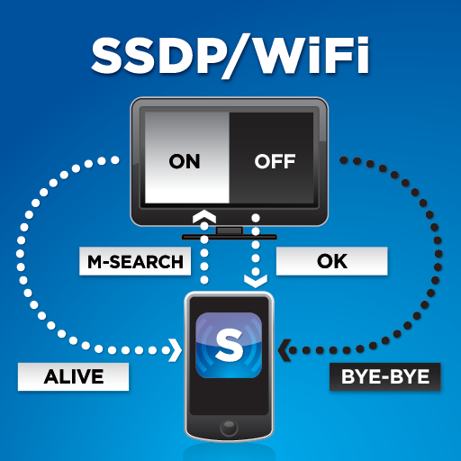

## SSDP (Simple Service Discovery Protocol)

SSDP es un protocolo de red basado en IP y UDP para anunciar y buscar/encontrar dispositivos en una red. Consigue este cometido sin la necesidad de mecanismos de configuración basados en un servidor (como pueda ser DHCP o DNS) y sin una configuración estática del host. Para su objetivo, SSDP se apoya en el protocolo [UPnP (Universal Plub and Play)](https://en.wikipedia.org/wiki/Universal_Plug_and_Play).

UPnP es un set de protocolos de red que permite que dispositivos de red tales como ordenadores personales, impresoras, access-points, Chromecast, NAS, consolas, Smart TVs... descubran entre sí su presencia en la red y establezcan servicios de comunicación de red o compartición de datos. Un dispositivos compatible con UPnP no necesita ninguna configuración de red, puede integrarse en una red, obtener una IP, publicar su nombre y anunciar sus servicios bajo petición, todo de forma automática. De la misma forma, puede detectar la presencia y servicios de otros dispositivos.

En principio fue concebido para uso residencial o pequeños entornos de oficina.

## Phising

Los ataques de phishing son correos electrónicos, mensajes de texto, llamadas telefónicas o **sitios web** fraudulentos diseñados para engañar a los usuarios para que descarguen programas maliciosos, compartan información confidencial o datos personales (por ejemplo, números de la Seguridad Social y de tarjetas de crédito, números de cuentas bancarias, **credenciales de inicio de sesión**), o realicen otras acciones que les expongan a ellos mismos o a sus organizaciones a la ciberdelincuencia.

El phishing es el tipo más común de ingeniería social, la práctica de engañar, presionar o manipular a las personas para que envíen información a las personas equivocadas. Los ataques de ingeniería social se basan en el error humano y en tácticas de presión para tener éxito. El atacante suele hacerse pasar por una persona u organización en la que la víctima confía -por ejemplo, un compañero de trabajo, un jefe, una empresa con la que la víctima o su empleador hacen negocios- y crea una sensación de urgencia que lleva a la víctima a actuar precipitadamente. Los hackers y estafadores utilizan estas tácticas porque es más fácil y menos costoso engañar a la gente que piratear un ordenador o una red.

Según el FBI, los correos electrónicos de phishing son el método de ataque o vector más utilizado por los hackers para enviar ransomware a particulares y organizaciones. Según el informe Cost of a Data Breach 2022 de IBM, el phishing es la segunda causa más común de violación de datos.
## Tarea
Vamos intentar simular un posible caso real en un ejercicio de red teaming.

Nuestra tarea será realizar una prueba de concepto donde hagamos uso de dos técnicas muy asentadas. En primera instancia haremos *spoofing* de dispositivos en una supuesta red empresarial y tras ello, valiéndonos del *phishing*, obtendremos las credenciales de los usuarios.

Necesitaréis dos máquinas:

+ Windows/Linux como atacante
+ Windows como víctima

Podéis hacerlo con dos máquinas virtuales, con la vuestra física y otra virtual o como queráis, <u>lo importante es que se trate de dos máquinas diferente.</u>

Debéis buscar información de forma autónoma sobre cómo llevar a cabo este ataque con las dos herramienta que os propongo. Os doy un par de referencias:

- Evil-SSDP
- On-the-fly

En uno de los dos casos, dependiendo del SO que utilicéis, puede que no tengáis las **net-tools** instaladas, únicamente **iproute2** por lo que habrá que hacer una pequeña modificación en el código Python para que funcione correctamente.

Recordad que debe haber una parte de *spoofing* y otra de *phising*.

!!!warning "Atención"
    Debéis realizar la modificación del código en Python, no instalar las net-tools. Recordemos que estamos simulando un escenario real y debemos pasar lo más desapercibidos posibles.

## Referencias

[IBM](https://www.ibm.com/topics/phishing)

[Imperva](https://www.imperva.com/learn/application-security/phishing-attack-scam/)