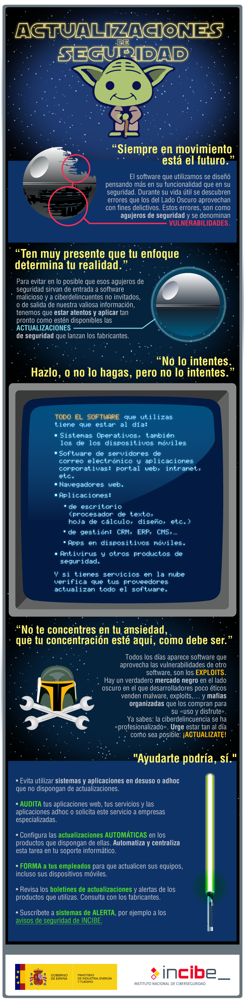
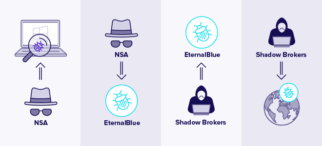
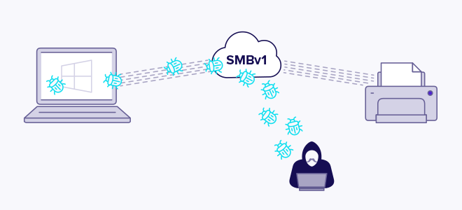
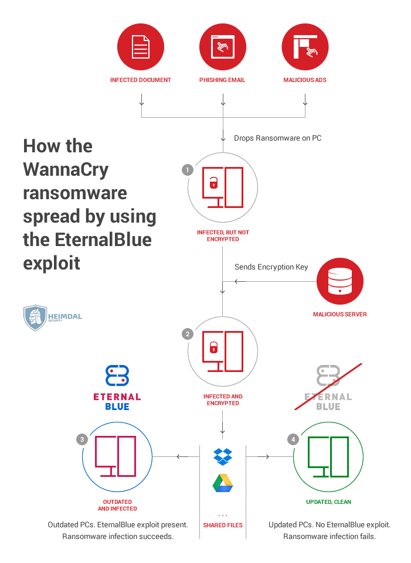

A día de hoy, 2022, se podría decir que el incidente de seguridad más sufrido por las empresas es sin duda la infección de ransomware, normalmente mediante algún ataque previo exitoso de phising.

Sin embargo, otro vector de ataque muy importante viene dado por los sistemas desactualizados. 

Algunas cosas se han fabricado para durar para siempre. El software no es una de ellas.

De hecho, el software se parece más a la comida: caduca. Puede que esté bien un poco después de su fecha de caducidad, pero luego se pudre, se enmohece. Y cuanto más lo dejas, peor se pone. Pero no es un desgradable caso de intoxicación alimentaria a lo que nos arriesgaremos, precisamente. El software obsoleto corre el riesgo de envenenar los sistemas del negocio y causar estragos en la seguridad.

De hecho, el software obsoleto posee una serie de vulnerabilidades de seguridad. Si está presente en alguno de los sistemas, se está poniendo en riesgo los datos y su negocio.

Ya vimos con anterioridad como podían existir exploits 0-day que, en un principio, al ser desconocida la vulnerabilidad que aprovechan, nos hacen imposible tener el sistema actualizado o parcheado. No obstante, en cuánto surgen parches de seguridad dirigidos a solucionar estos problemas, deben ser aplicados, con mayor celeridad si cabe si hablamos de vulnerabilidades graves.

Un buen ejemplo actual de la importancia de mantenerse al día con los parches de seguridad es la reciente vulnerabilidad crítica en log4j, con varios parches consecutivos en tiempo récord a medida que se iban descubriendo nuevas vulnerabilidades: [log4j](https://www.csoonline.com/article/3645431/the-apache-log4j-vulnerabilities-a-timeline.html)

## El riesgo de seguridad de los sistemas y servicios desactualizados

### ¿Por qué representa el software desactualizado un riesgo?

La tecnología se desarrolla a un ritmo rápido, en constante evolución y está impulsada por la innovación. Como resultado, el software tiene un ciclo de vida corto, uno sostenido por [*updates* y *upgrades*](https://www.parkersoftware.com/blog/whats-the-difference-between-a-software-upgrade-and-a-software-update/) continuos .

Cuando el software ya no tiene actualizaciones para mantenerlo, se vuelve obsoleto. Este software obsoleto no se mantiene, no puede integrarse con nuevas aplicaciones, ni puede funcionar sin problemas en nuevos dispositivos.

Luego existen otros riesgos a considerar. El software obsoleto no tiene parches si se le encuentran vulnerabilidades y puede ser víctima de ciberataques mucho más avanzados. Esto plantea una conjunción de riesgos de seguridad, tanto debido a la malicia humana como a las posibilidades de fallo del sistema.

#### Malicia humana

Así como la tecnología y el software cambian y avanzan en poco tiempo, también lo hacen las ciberamenazas. Los virus, el malware y los ataques se vuelven cada vez más sofisticados. Además, los ciberdelincuentes conocen y [pueden aprovechar](https://www.parkersoftware.com/blog/legacy-code-dangers-code-inventory/) las debilidades del software obsoleto.

Como resultado, es posible que el software obsoleto no pueda resistir un ciberataque *moderno*.

Por lo tanto, si ese software obsoleto incluye el uso, almacenamiento o aplicación de datos, esos datos se ponen en claro riesgo. Los sistemas serán más vulnerables a los ataques de ransomware, malware y filtraciones. El software desactualizado puede por tanto darle a los atacantes una puerta de entrada al resto de sistemas.

Los fallos de seguridad plantean problemas de *compliance* (cumplimiento normativo) posteriores. En términos de GDPR, no tener un software actualizado podría verse como una forma de negligencia. Esto significa que si se tiene un software desactualizado y se sufre una brecha de seguridad relacionada, no solo se pierde la confianza de los clientes, sino que además podríamos enfrentarnos a una fuerte multa.

#### Fallo del sistema

El software obsoleto no solo causa que la seguridad sea susceptible de ser afectada por la maldad humana, sino también por fallos del sistema.

Un software obsoleto es aquel que ya no tiene soporte por parte del proveedor. Esto significa que los nuevos fallos encontrados en él no se solucionarán. Además, es cada vez menos probable que el software desactualizado funcione en hardware nuevo y siga siendo compatible con los sistemas operativos más nuevos. De hecho, no es raro encontrar en empresas software antediluviano que, debido a su nula actualización, obliga a mantener sistemas operativos e incluso hardware de las mismas características, representando un grave riesgo para la empresa.

En el mejor de los casos, esto puede dar lugar a interrupciones en el servicio. 

En el peor de los casos, se puede sufrir una falla total del sistema. Esto puede suceder, por ejemplo, si el software obsoleto es fundamental para el funcionamiento 

### Manteniendo el software "saludable"

Por tanto, es importante que los sistemas no funcionen con software obsoleto. Pero, ¿cómo puede mantenerse saludable y los datos seguros? La respuesta está en ***updates*** y ***upgrades*** periódicos.

Las actualizaciones (updates) a menudo ocurren automáticamente en segundo plano, pero no siempre. Por lo tanto, una buena práctica es buscar actualizaciones con regularidad y asegurarse de que nuestro software las tenga. Las actualizaciones de software son para el mantenimiento general de su software. Incluyen parchear vulnerabilidades y protegerse contra amenazas cibernéticas nuevas.

De vez en cuando, necesitará un *upgrade* para mantener su software en buen estado. Este es un cambio mayor que necesitará algo de atención. Los *upgrades* no siempre son necesarios de inmediato. Sin embargo, los proveedores a menudo dejan de brindar soporte (léase: proporcionar actualizaciones) a sus programas más antiguos. Cuando esto suceda, se deberá actualizar para evitar el uso de software obsoleto.

Cuando sea el momento de un *upgrade*, debemos asegurarnos de hacer una copia de seguridad de los datos previamente. También se debe verificar la compatibilidad para la integración del sistema y discutir cualquier inquietud con el proveedor. Esto reduce los riesgos de pérdida de datos, interrupción del negocio y una experiencia de actualización no adecuada. 

### Software o sistemas desactualizados: un eslabón débil

Cuando se tiene un software obsoleto, no sólo se está perdiendo algunas funciones nuevas o un programa un poco ligero o con mayor *performance*. También está exponiendo su empresa a vulnerabilidades y riesgos de seguridad.

Se debe concebir de esta manera: no dejaríamos fruta pasada en el frutero, porque corre el riesgo de que la fruta fresca también se eche a perder. Con el software ocurre algo parecido. Por lo tanto, no se debe dejar que el software *caduque*, se ha de mantener actualizado, seguro y saludable.

### En resumen

¿Actualización de sistemas? ¿Parches de seguridad? ¿Boletines de actualización? ¿Es realmente útil y necesario perder tiempo y esfuerzo en estas tareas?

La respuesta es un rotundo SÍ, y nunca se debe dejar de insistir sobre la importancia de mantener todos nuestros sistemas actualizados como método de prevención de muchos incidentes de seguridad, como las infecciones por malware. Tanto nuestros sistemas operativos, como los contenidos y páginas web, como los programas que utilizamos para el trabajo, deben estar debidamente actualizados a sus últimas versiones y con todos los parches de seguridad instalados.

Cualquier software desactualizado como un sistema operativo obsoleto, sin soporte por parte del fabricante, así como el resto de aplicaciones informáticas que utilizamos, desde herramientas ofimáticas, pasando por tu CRM, hasta el software de la web o las apps de los móviles, son susceptibles de tener fallos de seguridad o vulnerabilidades.  Los ciberdelincuentes aprovechan estos agujeros para intentar introducirse en nuestros sistemas y así:

+ Obtener información sensible y confidencial de nuestra empresa, como cuentas de acceso a otros servicios o bases de datos de clientes o de facturación
  
+ Cifrar la información del servidor y solicitar un «rescate» por ella, el tan mencionado ransomware

+ Desconfigurar los sistemas de seguridad de la compañía para espiarnos, robar información o atacarnos más adelante
  
+ Usar nuestros sistemas como plataforma de ataque hacia otros sistemas

El INCIBE posee una infografía muy buena a modo de concienciación sobre las actualizaciones de seguridad que se pasa a reproducir:

Así las cosas, se hace esencial y vital hacer uso de una adecuada política de actualizaciones y/o parcheo, como veremos en la siguiente sección.

## Políticas de actualizaciones

Ya hemos nombrado los problemas que podríamos sufrir debido a la presencia de software/sistemas/servicios desactualizados en nuestra red. Es por ello que se debe establecer una adecuada y ajustada política de actualizaciones con la que suplir estos inconvenientes.

### El proceso de gestión de parches

No es una buena estrategia instalar nuevos parches en el mismo momento en que estén disponibles y para todos los activos en el inventario de la organización sin considerar el impacto. En cambio, debería adoptarse un enfoque más estratégico. La gestión de parches debe implementarse mediante un proceso organizativo detallado que sea rentable y centrado en la seguridad.  

Los pasos clave para esta proceso de gestión de parches o actualizaciones incluyen:

1. ^^Desarrollar un inventario actualizado de todos los sistemas de producción:^^ ya sea trimestral o mensualmente, esta es la única forma de monitorizar verdaderamente los activos que existen en su ecosistema. A través de una gestión de activos exhaustiva, se tendrá una visión exacta de los sistemas operativos, los tipos de versión y las direcciones IP que existen, junto con sus ubicaciones geográficas y sus "propietarios" en la organización. Como regla general, cuanto mayor sea la frecuencia con la que se actualiza el inventario de activos, más informado se estará.

2. ^^Diseñar un plan para estandarizar sistemas y sistemas operativos para el mismo tipo de versión:^^ aunque es difícil de ejecutar, la estandarización del inventario de activos hace que la aplicación de parches sea más rápida y eficiente. Es deseable estandarizar los activos hasta obtener un número manejable para que se pueda acelerar el proceso de remediación a medida que se lanzan nuevos parches. Esto ayudará a los equipos técnicos a ahorrar tiempo dedicado a la reparación.

3. ^^Hacer una lista de todos los controles de seguridad que existen dentro de la organización:^^ realizar un seguimiento de los firewalls, antivirus y herramientas de administración de vulnerabilidades. Se debe saber dónde se encuentran, qué protegen y qué activos están asociados con ellos. 

4. ^^Comparar las vulnerabilidades reportadas con el inventario:^^ el uso de una herramienta de administración de vulnerabilidades para evaluar qué vulnerabilidades existen para qué activos en nuestro ecosistema nos ayudará a comprender el riesgo de seguridad en nuestra organización.  

5. ^^Clasificar el riesgo:^^ a través de las herramientas de administración de vulnerabilidades, se puede administrar fácilmente qué activos se consideran críticos para la empresa y, por tanto, priorizar en consecuencia lo que necesita ser remediado con más prisa.

6. ^^¡REALIZAR PRUEBAS!^^ Se deben aplicar los parches a una muestra representativa de activos en un entorno de test. Se han de realizar igualmente pruebas de estrés en las máquinas para asegurarse de que los parches no causen problemas en el entorno de producción.

7. ^^Aplicar los parches:^^ una vez se haya priorizado lo que debe solucionarse primero, se comienzan a aplicar parches para reducir realmente el riesgo en nuestro entorno. Las herramientas de administración de vulnerabilidades más avanzadas también ofrecen la capacidad de automatizar las partes del proceso de parcheo que requieren mucho tiempo.
    Se puede considerar implementar los parches en lotes de activos; aunque ya se habrán probado en el entorno de test, es posible que todavía haya resultados inesperados en producción. 

8.  ^^Realizar un seguimiento de su progreso:^^ vigilar los activos para asegurarse de que el parcheo se haya realizado correctamente. 

### Buenas prácticas para la gestión de parches

Mitre establece una serie de técnicas de mitigación para las actualizaciones de software: [MITRE ATT&CK](https://attack.mitre.org/mitigations/M1051/)

Una serie de pautas muy básicas que podríamos dar en cuanto a la gestión de parches o actualizaciones de seguridad:

1. **Mantenerse actualizado**

    Los proveedores de software lanzan actualizaciones de software con regularidad, y muchas de ellas se enfocan a problemas de seguridad importantes. Debe haber un responsable para que se encargue de estar al tanto de las actualizaciones de software y de consultar los sitios web de esos proveedores con regularidad. Esa persona también debe estar atento a las amenazas emergentes, como nuevos tipos de ransomware u otro tipo de malware.

2. **Conocer el programa de actualizaciones de Microsoft**

    En la mayoría de las pequeñas e incluso grandes empresas con toda probabilidad se estará usando alguno de los productos de Microsoft. Microsoft lanza actualizaciones de software importantes el segundo martes de cada mes. Es importante asegurarse de no esperar demasiado para instalar las actualizaciones necesarias después de su publicación. 

3. **Mantenerse al día con las tareas de mantenimiento regulares**

    Debe existir un responsable a cargo de mantener las licencias de software actualizadas y mantener el software actualizado.

4. **Desarrollar relaciones con proveedores clave**
    
    Si se depende en gran medida de uno o más proveedores de software, se ha de intentar realizar una llamada mensual o semanal o, al menos, mantenerse en contacto por correo electrónico con el comercial o gerente de la cuenta. Siempre es una buena idea tener relaciones estrechas con los principales proveedores de software, redes y sistemas operativos.

5. **Crear un inventario**
    
    Tal y como se ha comentado con anterioridad, es conveniente realizar una lista de todos sus sistemas de producción. Si es necesario, utilizar escáneres de red comerciales y productos de descubrimiento automatizado que puedan ayudar con este proceso. Luego comparar la lista con las nuevas vulnerabilidades de seguridad que se notifiquen y actualizar según sea necesario.

6. **Automatizar todo lo que se pueda**
    
    Automatizar todo lo que sea susceptible de ello contribuirá en gran medida a reducir la carga de trabajo. Por ejemplo, muchos paquetes de software vienen con la opción de actualizaciones automáticas.

7. **Hacer una copia de seguridad de todo lo que se pueda**
    
    Nos debemos asegurar de que nuestros datos críticos estén respaldados en todo momento. Si algo sale mal durante la actualización o el parche, nos alegraremos de haberlo hecho. 

No obstante, dependiendo de la fuente que se consulte, aparecerán unas u otras de estas mejores prácticas , a pesar de haber algunas líneas generales. Como ejemplo, esta infografía bastante actualizada de la empresa de seguridad [Secpod](https://www.secpod.com/blog/patch-management-best-practices-for-2020/):

Un ejemplo real de una política de atualizaciones la podemos consultar para la [universidad de Berkeley](https://security.berkeley.edu/MSSND/patching-and-updates-guidelines)

## Un caso real: Eternalblue (MS17-010), SMBv1 y Wannacry

### ¿Qué es EternalBlue?

**EternalBlue** es tanto el nombre de una serie de vulnerabilidades de software de Microsoft como el exploit creado por la NSA a modo de herramienta de ciberataque. Aunque el exploit EternalBlue, oficialmente nombrado **MS17-010** por Microsoft, afecta solo a los sistemas operativos Windows, cualquier cosa que use el protocolo de intercambio de archivos SMBv1 (Server Message Block versión 1), está técnicamente en riesgo de ser blanco de ransomware y otros ciberataques debido a una vulnerabilidad de tipo RCE (Ejecución Remota de Código).

EternalBlue fue creado por la Agencia de Seguridad Nacional de los Estados Unidos (NSA) como parte de una iniciativa más que cuestionable de almacenar y convertir en armas para uso propio las vulnerabilidades del software en lugar de reportarlas al proveedor pertinente, según se condena los comentarios hechos por Microsoft.

La NSA supuestamente pasó casi un año buscando un error en el software de Microsoft y una vez que lo encontraron, desarrolló EternalBlue para explotar la vulnerabilidad. La NSA estuvo usando EternalBlue durante cinco años antes de alertar a Microsoft de su existencia.

Desde entonces, Microsoft ha pedido a la NSA y a otros organismos gubernamentales que apoyen una Convención Digital de Ginebra que exige el fin de la acumulación de vulnerabilidades de software por los estados-nación.

### Leak (filtración) inicial

Aquí es donde las cosas se ponen interesantes: la NSA es pirateada y, sin saberlo, esparce la peligrosa amenaza de EternalBlue por el mundo. Poco se sabe oficialmente sobre cómo se pirateó la NSA.

Shadow Brokers, el ahora conocido grupo de hacking, obtuvo acceso a EternalBlue y filtró (junto con muchas otras herramientas para otras vulnerabilidades) el exploit de la NSA el 14 de abril de 2017 a través de un enlace en su cuenta de Twitter. 

Algunas de estas vulnerabilidades (CVE-2017-0143, CVE-2017-0144, CVE-2017-0145, CVE-2017-0146, CVE-2017-0147 y CVE-2017-0148), permiten la ejecución de código arbitrario de manera remota (Eternalblue + Doublepulsar), en caso de que un atacante (sin necesidad de autenticarse) envíe paquetes específicamente creados a un servidor Microsoft Server Message Block 1.0 (SMBv1).

El 14 de marzo de 2017, casi ***dos meses antes de la filtración de Shadow Brokers***, Microsoft publicó el Boletín de seguridad MS17-010 . La línea de tiempo sugiere que Microsoft recibió un aviso sobre la violación de la NSA y se apresuró a hacer todo lo posible para proteger los millones de sistemas Windows vulnerables.

El parche MS17-010 fue diseñado para corregir las fallas del software SMBv1 para todos los sistemas operativos Windows compatibles, incluidos Windows Vista, Windows 7, Windows 8.1, Windows 10, Windows Server 2008, Windows Server 2012 y Windows Server 2016 . Microsoft también deshabilitó automáticamente SMBv1 en las últimas versiones de Windows 10 y Windows Server 2012 y 2016 de forma predeterminada.

Además, en un movimiento sin precedentes para demostrar la gravedad del exploit EternalBlue, Microsoft lanzó un segundo parche de emergencia para sistemas operativos no compatibles una vez que la filtración se hizo pública. Esta segunda versión es compatible con Windows XP, Windows 8 y Windows Server 2003.

**Esto pone de manifiesto la pobre gestión de las políticas de actualizaciones por parte de las empresas**, puesto que a pesar de poseer un lapso de *dos meses para aplicar el parche de Microsoft*, las consecuencias de esta vulnerabilidad fueron funestas, como se verá a continuación.

### ¿Cómo funciona EternalBlue?

El exploit EternalBlue funciona aprovechando las vulnerabilidades SMBv1 presentes en versiones anteriores de los sistemas operativos de Microsoft. SMBv1 se desarrolló por primera vez a principios de 1983 como un protocolo de comunicación de red para permitir el acceso compartido a archivos, impresoras y puertos. Básicamente, era una forma de que las máquinas con Windows se comunicaran entre sí y con otros dispositivos para servicios remotos.

EternalBlue aprovecha las vulnerabilidades de SMBv1 para insertar paquetes de datos maliciosos y propagar malware por la red.

El exploit hace uso de la forma en que Microsoft Windows maneja, o más bien "malmaneja", paquetes especialmente diseñados por atacantes malintencionados. Todo lo que el atacante debe hacer es enviar un paquete creado con fines malintencionados al servidor de destino y boom, el malware se propaga y se produce un ciberataque.

El parche de Microsoft cierra la vulnerabilidad de seguridad por completo, evitando así los intentos de implementar ransomware, malware, cryptojacking o cualquier otro intento similar a un gusano de infiltración digital utilizando el exploit EternalBlue. Pero persiste un problema clave: para muchas versiones de Windows, **la actualización de software debe instalarse para poder brindar protección**.

Es este problema clave el que le da a EternalBlue una vida útil tan larga: muchas personas e incluso empresas no actualizan su software con regularidad, dejando sus sistemas operativos sin parches y, por lo tanto, vulnerables a EternalBlue y otros ataques. Hasta el día de hoy, la cantidad de sistemas Windows vulnerables sin parchear sigue siendo de millones.

Todo lo expuesto hasta ahora pone de relieve varios de los asuntos clave que nos ocupan en la presente píldora formativa:

1. Es muy importante estar al día de las nuevas vulnerabilidades y avisos
   
2. Es importante tener una correcta gestión de los parches de seguridad y aplicarlos con la mayor celeridad, máxime si son casos tan graves como estos

3. Es muy importante no utilizar software desactualizado. El servicio SMBv1 tiene casi 30 años de vida, fue diseñado para un contexto distinto, con apenas amenazas, ya que 30 años en informática pueden representan un mundo. Se deberían haber realizado los mayores esfuerzos posibles para dejar de usarse en el entorno empresarial.

4. Entroncando con el punto anterior, Windows XP recibió el correspondiente parche de seguridad debido a la gravedad del asunto, a pesar de ser un Sistema Operativo fuera de soporte. Esto no es más que la excepción que confirma la regla y lo más probable en cualquier otro caso hubiera sido no recibir parche alguno.
    Así las cosas, resulta esencial el uso de software con el soporte apropiado.

### ¿Cómo se usa EternalBlue en ciberataques?

EternalBlue se ha utilizado para difundir el ransomware WannaCry y Petya. Pero el exploit se puede utilizar para implementar cualquier tipo de ciberataque, incluido el cryptojacking y el malware similar a un gusano. El hack de la NSA abrió la puerta para que cualquier atacante envíe un paquete malicioso a un servidor vulnerable que no ha aplicado el parche para reparar CVE-2017-0144.

En 2017, el ransomware *WannaCry* se convirtió en uno de los ciberataques más devastadores jamás vistos. Se extendió por todo el mundo, bloqueando sistemas críticos en todo el mundo e infectando más de 230,000 ordenadores en más de 150 países en solo un día.

El Servicio Nacional de Salud (NHS) del Reino Unido, FedEx, Telefónica o Renault-Nissan son solo algunos nombres que se convirtieron en víctimas de alto perfil de los paralizantes ataques del ransomware WannaCry.

El ciberataque de WannaCry comenzó el 12 de mayo de 2017 e inmediatamente tuvo un impacto global. El ransomware se propagó a una velocidad de 10,000 dispositivos por hora, infectando a más de 230,000 PC con Windows en 150 países en un solo día.

Petya es otro ciberataque de ransomware que utilizó el exploit EternalBlue para causar estragos

Petya se lanzó técnicamente a principios de 2016, antes de WannaCry, pero con poca fanfarria y daños. La primera versión de Petya se propagó a través de un archivo adjunto de correo electrónico malicioso y era una forma bastante sencilla de ransomware: su computadora se infecta y sus archivos se cifran (o se retienen como rescate) hasta que paga $ 300 en Bitcoin para comprar una clave de descifrado

*Petya* es otra variedad de ransomware que utilizó el exploit EternalBlue para cifrar los archivos y exigir un rescate en Bitcoin para liberarlos.

Gracias a EternalBlue y al desafortunado éxito de WannaCry, el ransomware Petya tuvo una segunda oportunidad de destrucción. En junio de 2017, NotPetya se implementó utilizando el exploit EternalBlue.

La diferencia clave entre la primera y la segunda versión de Petya fue que NotPetya (Petya V2) tenía como objetivo desactivar completamente un sistema. Rescate pagado o no, no había cura. El ciberataque cifró permanentemente la tabla de archivos maestra de una computadora (MFT) y el registro de inicio maestro (MBR).

